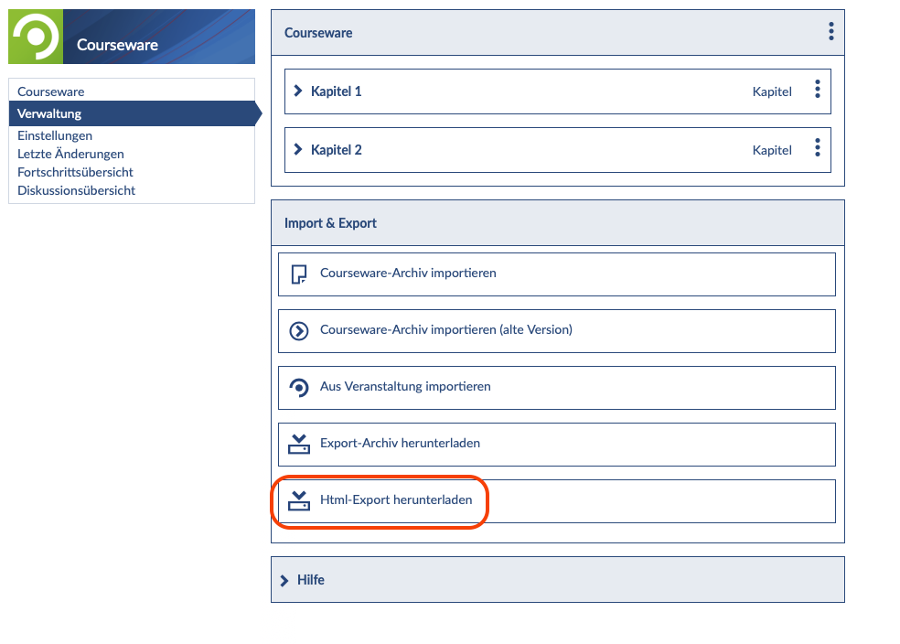
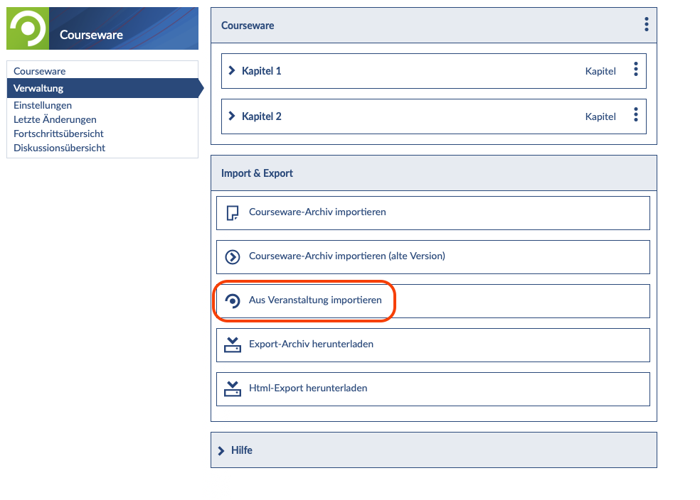
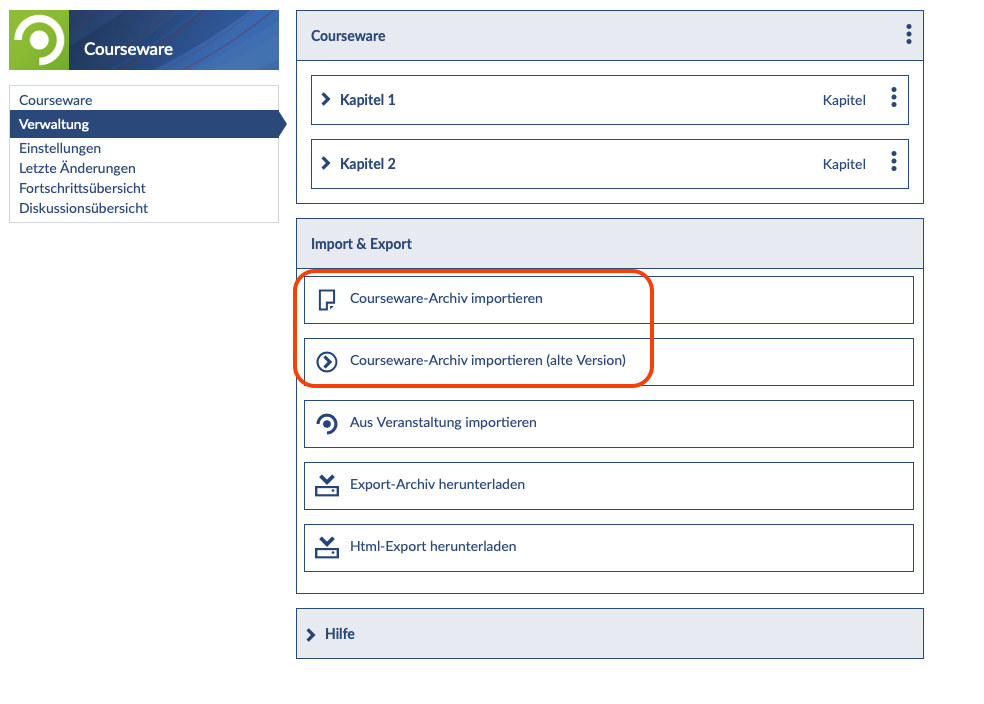

<h1>Stud.IP Courseware</h1>
<link rel="stylesheet" href="https://cdnjs.cloudflare.com/ajax/libs/font-awesome/4.7.0/css/font-awesome.min.css">

<h2>Öffentliche Zugänglichkeit schaffen</h2>
Um interessierten Personen die Möglichkeit zu geben, Ihre mit Courseware in Stud.IP angelegten Inhalte (ohne vorherige Anmeldung) einzusehen oder bspw. ein Selbstlernmodul zu durchlaufen, bestünde theoretisch die Möglichkeit, die Veranstaltung, in der die Courseware eingebunden ist, weltweit <b>öffentlich</b> zu schalten. Bevor das getan wird, sollte allerdings Rücksprache gehalten werden: Einen öffentlichen Bereich, auf dem Kurse von allen durchlaufen werden können, bietet nicht jede Hochschule an. Bitte setzen Sie sich daher mit den Stud.IP-Verantwortlichen Ihrer Hochschule in Verbindung und erfragen Sie etwaige Optionen. 

Die öffentliche Zugänglichkeit Ihres Kurses erleichtert die Nachnutzung enorm: Dritte können sich Ihre Strukturen und Inhalte ansehen und entscheiden, ob sie auch für ihr eigenes Lehr-Lernsetting geeignet wären. Auch besteht die Möglichkeit z.B. in einem Lernmodul abgelegte Arbeitsblätter oder Medienelemente herunterzuladen und direkt weiter zu verwenden. 

---
<h2>Exportieren von Courseware-Inhalten</h2>
Es gibt verschiedene Wege Inhalte und ganze Kurse aus Courseware zu exportieren, um Sie anschließend auf anderen Plattformen bereitzustellen oder in die lokale Stud.IP-Installation eines anderen Standortes einzubinden. Ab der Stud.IP-Version 4.6 ist auch ein HTML-Export möglich, so dass die Lerninhalte im Browser angesehen und ausgeführt werden können. Für den Export Ihrer Inhalte wählen Sie im entsprechenden Kurs zunächst den Reiter Verwaltung.

<figure style="align:middle;">
  
  <figcaption style="text-align:center;font-size:14px;">Abbildung: Screenshot Courseware Verwaltung</figcaption>
</figure>

---
<h2>Export-Archiv herunterladen</h2>
Um ein Export-Archiv herunter zu laden, wählen Sie die entsprechende Option und speichern die Datei lokal auf Ihrem Gerät.

<figure style="align:middle;">
  
  <figcaption style="text-align:center;font-size:14px;">Abbildung: Screenshot Courseware Export-Archiv herunterladen</figcaption>
</figure>

<h2>HTML-Export herunterladen</h2>
Für den HTML-Export wählen Sie die entsprechende Option und speichern die Datei zunächst lokal auf Ihrem Gerät. Der HTML-Export kann ganz einfach gestartet werden, indem aus dem Verzeichnis die index.html Datei in Ihrem bevorzugten Browser geöffnet wird. 

<figure style="align:middle;">
  
  <figcaption style="text-align:center;font-size:14px;">Abbildung: Screenshot Courseware HTML-Export herunterladen</figcaption>
</figure>

---
<h2>Inhalte bereitstellen</h2>
Sie können <i>in einer Stud.IP-Veranstaltung Courseware-Inhalte aus früheren Veranstaltungen importieren</i>. Dazu wählen Sie die Option "Aus Veranstaltung importieren" und wählen anschließend die Veranstaltung aus, aus welcher Sie den Inhalt einbinden möchten.

<figure style="align:middle;">
  
  <figcaption style="text-align:center;font-size:14px;">Abbildung: Screenshot Courseware-Inhalt importieren</figcaption>
</figure>

Courseware-Inhalte, die Ihnen zur Verfügung gestellt worden sind, können <i>über den Archiv-Import nachgenutzt</i> werden. Sobald Sie das entsprechende Verzeichnis importiert haben, können Sie den Kurs auch beliebig bearbeiten und Inhalte ergänzen, austauschen oder entfernen. Dabei ist es auch möglich, Inhalte aus früheren Versionen von Courseware in Stud.IP 4.6 zu importieren. Die entsprechenden Optionen stehen Ihnen im Menü zur Verfügung:

<figure style="align:middle;">
  
  <figcaption style="text-align:center;font-size:14px;">Abbildung: Screenshot Courseware-Archiv importieren</figcaption>
</figure>

Um anderen die Möglichkeit zu geben, <i>Ihre Inhalte nachnutzen</i> zu können, empfiehlt es sich, Ihre Exporte auf einer externen Plattform (wie bspw. twillo) bereitzustellen. Hier können die Kurse dann auch mit entsprechenden Metadaten versehen werden, was in der aktuellen Version von Courseware nicht vorgesehen ist.
