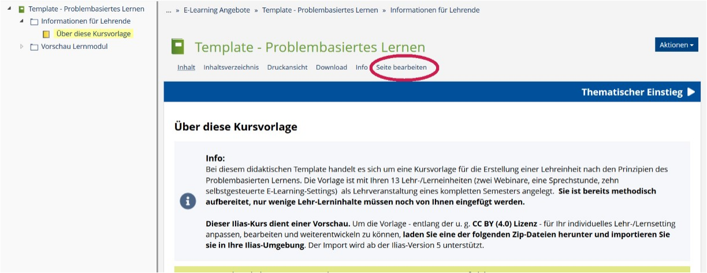
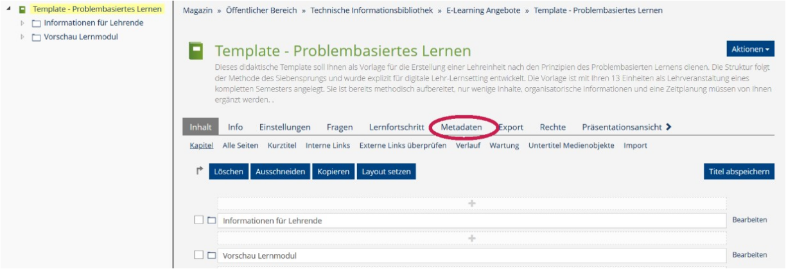
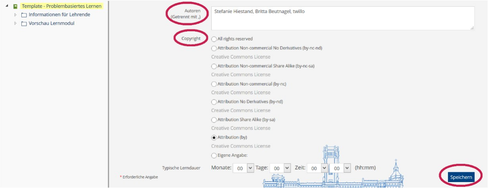
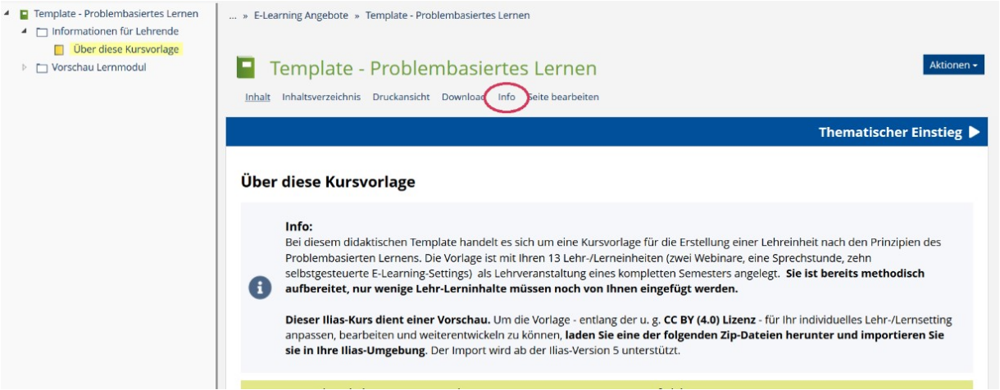
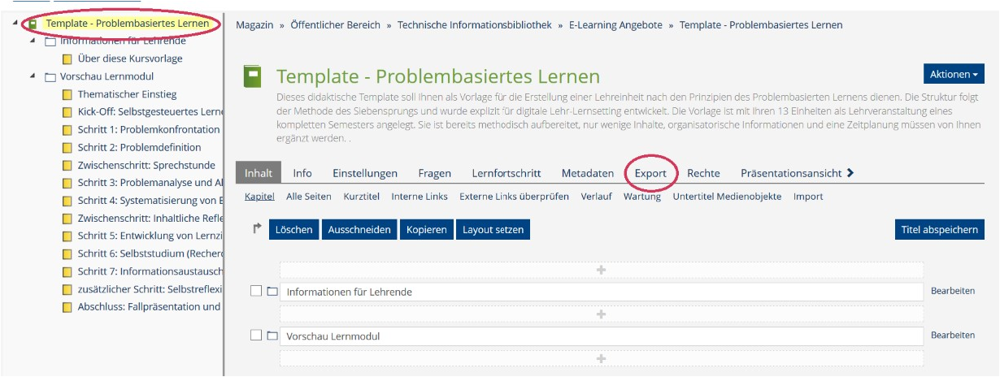
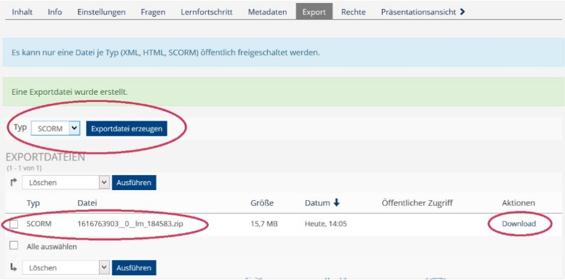
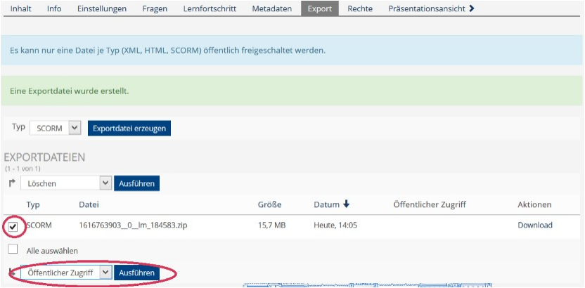
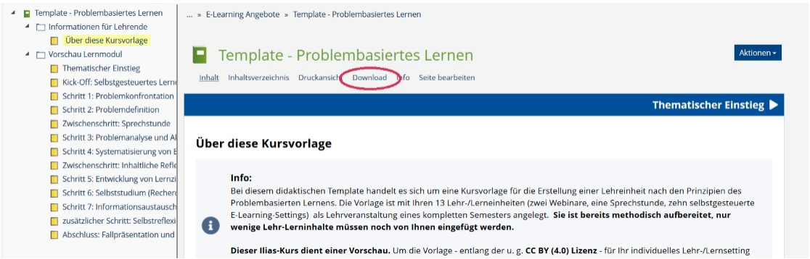
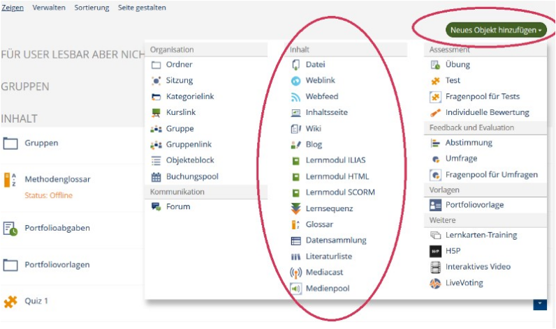

<h1>Ilias</h1>
<link rel="stylesheet" href="https://cdnjs.cloudflare.com/ajax/libs/font-awesome/4.7.0/css/font-awesome.min.css">

<h2>Metadaten und Lizenzhinweis an Ihren Ilias-Inhalten anbringen</h2>

Ilias arbeitet hierfür mit dem Creative Commons Lizenzsystem und vereinfacht Ihnen die Anbringung eines Lizenzhinweises. Öffnen Sie das Ilias-Element, das Sie freigeben möchten (in unserem Beispiel handelt es sich um ein Lernmodul) und wählen Sie den Reiter <b>Seite bearbeiten</b> aus.
<figure style="align:middle;">
  
  <figcaption style="text-align:center;font-size:14px;">Abbildung: Screenshot LUH-Ilias</figcaption>
</figure>

Wählen Sie im Kopfmenü den Reiter Metadaten.
<figure style="align:middle;">
  
  <figcaption style="text-align:center;font-size:14px;">Abbildung: Screenshot LUH-Ilias</figcaption>
</figure>

Die folgende Eingabemaske gibt Ihnen die Möglichkeit, Ihre <b>Inhalte zu beschreiben</b> und zu <b>verschlagworten</b>. Weiter unten haben Sie die Möglichkeit, eine <b>CC-Lizenz</b> auszuwählen. Sofern Sie sich für eine Lizenz mit dem Modul <b>BY</b> entscheiden, vergessen Sie auf keinen Fall, in dem Feld Autoren eine Angabe zu den <b>Urheber\*innen/Rechteinhaber\*innen</b> zu machen, die bei einer Nachnutzung genannt werden sollen. Speichern Sie Ihre Eingabe.
<figure style="align:middle;">
  
  <figcaption style="text-align:center;font-size:14px;">Abbildung: Screenshot LUH-Ilias</figcaption>
</figure>

Im Präsentationsmodus sind die Metadaten und der Lizenzvermerk nun unter dem Reiter <b>Info</b> für alle Personen, die auf den den Inhalt zugreifen können, einsehbar.
<figure style="align:middle;">
  
  <figcaption style="text-align:center;font-size:14px;">Abbildung: Screenshot LUH-Ilias</figcaption>
</figure>

  

    <i class="fa fa-exclamation-triangle" style="color:black"></i> <b>Wichtig</b>: Auch wenn Sie einen Lizenzhinweis für Ihre Ilias-Inhalte gesetzt haben, sollten Sie nicht darauf verzichten, an den ggf. dort eingebundenen Einzelmaterialien (z.B. Dokumenten oder Videos) ebenfalls einen Lizenzhinweis anzubringen. Denken Sie zudem unbedingt daran, Fremdmaterialien als solche kenntlich zu machen (s. Schritt 2, <a aria-describedby="Link zu Korrekte Verwendung von OER" href="./#/step2.md#korrekteVerwendung">Kapitel Korrekte Verwendung von OER</a>).
  

---
<h3>Öffentliche Zugänglichkeit schaffen</h3>

Um interessierten Personen die Möglichkeit zu geben, Ihre in Ilias angelegten Inhalte (ohne vorherige Anmeldung) einzusehen oder bspw. ein Selbstlernmodul zu durchlaufen, besteht grundsätzlich die Möglichkeit sie <b>öffentlich</b> zu schalten. Hierfür ist jedoch in der Regel der <b>Administrator:innenstatus</b> notwendig, ein einfacher Dozierendenaccount bietet Ihnen den Zugriff auf die nötigen Funktionen i.d.R. nicht. Einen öffentlichen Bereich, auf dem Kurse von jedermann durchlaufen werden können, bietet auch nicht jede Hochschule an. Bitte setzen Sie sich mit den Ilias-Verantwortlichen Ihrer Hochschule in Verbindung und erfragen Sie Ihre Optionen. Für die öffentliche Zugänglichkeit bietet sich vor allem <b>Ilias-Lernmoduls</b> an. Hier ist die Veröffentlichung am einfachsten möglich.

Die öffentliche Zugänglichkeit Ihres Kurses erleichtert die Nachnutzung enorm: Dritte können sich Ihre Strukturen und Inhalte ansehen und entscheiden, ob sie auch für ihr eigenes Lehr-Lernsetting geeignet wären. Auch besteht die Möglichkeit z.B. in einem Lernmodul abgelegte Arbeitsblätter oder Medienelemente herunterzuladen und direkt weiter zu verwenden. 

---
<h3>Exportdatei bereitstellen</h3>

Um Dritten nicht nur die Ansicht Ihrer Ilias-Inhalte, sondern auch deren <b>Nachnutzung</b> zu ermöglichen, können Sie Ihre Ilias-Elemente <b>exportieren</b>. Die entstehenden Exportdatei (i.d.R. ein Zip-Archiv) können Sie lokal auf Ihrem Computer speichern, per e-Mail versenden oder auch im OER-Portal twillo bereitstellen.  Andere Lehrende können Ihre Exportdatei in die eigene Ilias-Umgebung importieren und ganz oder anteilig eigenen Kurse nutzen und bearbeiten. Je nachdem, was für ein Ilias Element Sie exportieren (z.B. Lernmodul, Glossar oder Quiz) stehen Ihnen die Formate <b>XML, HTML</b> und/oder <b>SCORM</b> zur Verfügung. Woimmer möglich, empfehlen wir Ihnen das Format SCORM, da es grundsätzlich darauf zielt, E-Learning-Kurse in verschiedenen LMS, Plattformen und Programmen verwenbar zu machen.

Um ein Ilias Element zu exportieren, öffnen Sie es und wählen Sie den Reiter <b>Seite bearbeiten</b> im Kopfmenü (Wenn Sie ein komplettes <b>Ilias-Lernmodul</b> exportieren möchten, wählen Sie anschließend die oberste Einheit des Lernmoduls aus). Klicken Sie auf den Reiter <b>Export</b>.
  <figure style="align:middle;">
    
    <figcaption style="text-align:center;font-size:14px;">Abbildung: Screenshot LUH-Ilias</figcaption>
  </figure>

  
Wählen Sie in dem Dropdown Menü das gewünsche Dateiformat aus und klicken Sie auf <b>Exportdatei erzeugen</b>. Nach einer kurzen Wartezeit steht Ihnen eine Zip-Datei zur Verfügung, die Sie über den Reiter <b>Download</b> abspeichern können.

  <figure style="align:middle;">
    
    <figcaption style="text-align:center;font-size:14px;">Abbildung: Screenshot LUH-Ilias</figcaption>
  </figure>

Um den direkten Download Ihrer Ilias-Inhalte für all diejenigen zu ermöglichen, die auf Ihre Ilias-Inhalte zugreifen können, setzen Sie ein <b>Häkchen</b> bei Ihrer Exportdatei und wählen Sie anschließend im Dropdownmenü die Option <b>Öffentlicher Zugriff</b>. Bestätigen Sie Ihre Auswahl mit dem Button <b>Ausführen</b>.

  <figure style="align:middle;">
    
    <figcaption style="text-align:center;font-size:14px;">Abbildung: Screenshot LUH-Ilias</figcaption>
  </figure>

 
In der Präsentationsansicht kann das Ilias-Element nun im Bereich <b>Download</b> des Kopfmenüs heruntergeaden werden.
  <figure style="align:middle;">
    
    <figcaption style="text-align:center;font-size:14px;">Abbildung: Screenshot LUH-Ilias</figcaption>
  </figure>

  

    <i class="fa fa-exclamation-triangle" style="color:black"></i> <b>Wichtig</b>: Leider kommt es derzeit oftmals zu Kompabilitätsproblemen bei der Integration von Exportdateien eines bestimmten LMS in eine andere Umgebung. Dies ist teilweise sogar zwischen verschiedenen Versionen des gleichen LMS der Fall. Aus diesem Grund empfehlen wir Ihnen neben der Bereitstellung einer Exportdatei auch die einzelnen Inhalte (z.B. Quizfragen, Skripte, Videos, Aufgabenstellungen) Ihres Ilias-Kurses über das twillo-Portal bereit zu stellen (s. Schritt 5).
  

  

    <i class="fa fa-lightbulb-o fa-lg"></i> <b>Hinweis</b>: Sollte es Ihnen nicht möglich sein, Ihre Ilias-Inhalte zur Ansicht öffentlich zu machen (s. Punkt Öffentliche Zugänglichkeit schaffen), stellt eine Exportdatei quasi "die Katze im Sack" dar. Versuchen Sie in diesem Fall unbedingt eine Möglichkeit zu finden, potentielle Nutzer:innen Ihrer Materialien darüber zu informieren, was sie in der Zip-Datei erwartet. Stellen Sie z.B. eine kurzes Video als Vorschau bereit, umschreiben Sie den Kurs detailliert und/oder arbeiten Sie mit Screenshots.
  

---
<h4>Importieren von Ilias-Elementen in die eigene Ilias Umgebung</h4>

Die Integration von Ilias-Exportdateien in die eigene Ilias-Umgebung ist sehr einfach. Öffnen Sie Ihren Kurs, öffnen Sie den Reiter <b>Neues Objekt hinzufügen</b> und wählen Sie den Inhalt aus, den Sie importieren möchten. Im folgenden Fenster ermöglicht Ihnen die <b>Option 2</b> den Import.
<figure style="align:middle;">
  
  <figcaption style="text-align:center;font-size:14px;">Abbildung: Screenshot LUH-Ilias</figcaption>
</figure>

