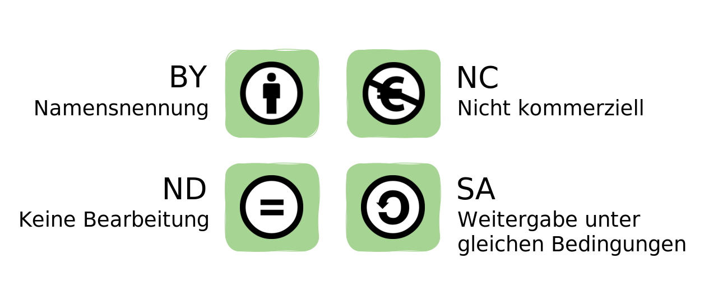
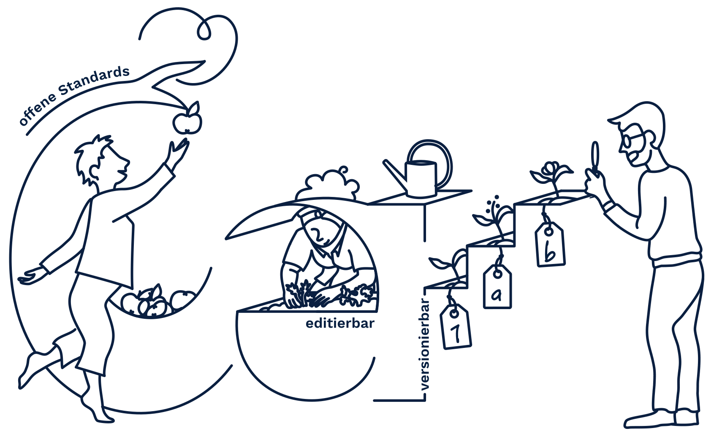
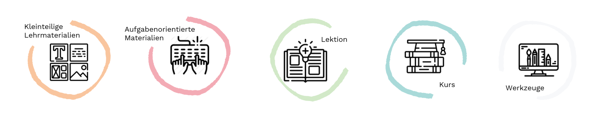

# Kapitel 1: Lessons Learned

Wir fassen die wichtigsten Informationen zum Thema OER hier in Kürze noch einmal für Sie zusammen:

## Definition

"Open Educational Resources (OER) are teaching, learning and research materials in any medium – digital or otherwise – that reside in the public domain or have been released under an open license that permits no-cost access, use, adaptation and redistribution by others with no or limited restrictions. OER form part of ‘Open Solutions’, alongside Free and Open Source software (FOSS), Open Access (OA), Open Data (OD) and crowdsourcing platforms" (<a aria-describedby="Quellenlink Unesco 2019" href="https://en.unesco.org/themes/building-knowledge-societies/oer">UNESCO 2019</a>).

Open Educational Resources sind demnach Materialien in jedweder Form (z.B. Skripte, Aufgaben, Videos) und jedwedem Medium (digital oder analog), die

   1. mit einer freien Lizenz bereitgestellt werden und ohne weitreichende Restriktionen, kostenfrei verwendet, verändert und weiterverbreitet werden können und
   2. einen expliziten Bildungsbezug aufweisen (vgl. Muuß-Merholz 2015).

## Chancen von OER in der Hochschullehre

Die Erstellung aktivierender Materialien für digitale Lehr-Lernsettings stellt einen hohen Aufwand dar. OER können hier als Unterstützung dienen, da sie flexibel an spezifische Lehr-/Lernkontexte sowie individuelle Bedarfe von Lerngruppen angepasst werden können. Der Aufbau einer Lehr-/Lerneinheit auf bereits vorhandenen erprobten Strukturen bedeutet eine deutliche Zeitersparnis bei deren Konzeption.

Durch das Erstellen und Teilen von OER können Lehrende ihre Lehrexpertise öffentlich sichtbar machen, was sich positiv auf ihre Reputation in der wissenschaftlichen Community auswirken kann. Auf diese Weise leisten OER einen Beitrag zum Abbau der bestehenden Reputationsasymmetrie zwischen Forschungs- und Lehrtätigkeiten.

Durch die Möglichkeit einer (kollaborativen) Weiterentwicklung von OER, wird die Vernetzung von Lehrenden gefördert. Ein langfristiger Austausch über OER bestimmter Disziplinen und Fachbereiche begünstigt die Entwicklung von Netzwerkstrukturen zwischen Lehrenden und Lernenden unterschiedlicher Institutionen. Die stete, gemeinschaftliche Begutachtung, Korrektur und Anpassung von Bildungsmaterialien hält sie stets aktuell und sichert ihre Qualität.

OER stellen einen freien Zugang zu Bildung und Wissen dar. Da ihre Nutzung allen Lehrenden und Lernenden (auch außerhalb der Hochschule) offen steht, leisten sie einen. besonderen Beitrag zum lebenslanges Lernen. Zudem begünstigen sie die Entstehung neuer Bildungsmodelle und Lernkulturen nach dem Prinzip der Offenheit und des Teilens (vgl. u. a. DUK 2015, Grimm/Rödel 2018).

Den Chancen von OER stehen auch einige Herausforderungen gegenüber. So bestehen bspw. oftmals Unsicherheiten bzgl. rechtlicher Aspekte bei der Erstellung, Verbreitung und Nutzung von OER. Besonders bei Lehrenden ist die Sorge, unbeabsichtigt eine Urheberrechtsverletzung zu begehen meist groß. Fähigkeiten und Fertigkeiten im Umgang mit OER und freier Software sowie Wissensbestände zu Lizenzierungen scheinennoch immer als Fachkompetenzen zu gelten (vgl. Grimm/Rödel 2018).

Vor dem Hintergrund der o.g. Aspekte ist die Information über OER und ihre Etablierung im hochschulischen Kontext ein erklärtes bildungspolitisches Ziel. In zahlreichen Förderinitiativen auf interationaler und nationaler Ebene werden Strukturen entwickelt, um die Erstellung und Bereitstellung von OER zu fördern und diesbezügliche Hemmnisse abzubauen (vgl. u. a. DIPF o. J.)

## twillo - Lehre teilen

Um die Etablierung von OER in der Hochschullehre zu stärken, wurde im Rahmen des Verbundprojektes ["OER-Portal Niedersachsen"](https://projects.tib.eu/oernds/projekt/) (gefördert durch das Nds. Ministerium für Wissenschaft und Kultur) die Online-Plattform <b>twillo</b> entwickelt. <b>Twillo</b> bietet Lehrenden eine Infrastruktur für den Austausch von freien Bildungsmaterialien und umfasst darüber hinaus vielfältige Angebote, um Lehrende bei der eigenen Erstellung und Zusammenstellung hochwertigerLehr-/Lernmaterialien zu unterstützen.

Folgende Funktionen des Portals sind hervorzuheben:

- <b>individueller Workspace:</b> langfristige Ablage von Materialien (z.B. über Stellenwechsel hinaus)
- <b>Upload- und Verlinkung:</b> Bereitstellung von OER direkt im Portal oder über die Originalseite
- <b>Serien- und Sammlungsfunktion:</b> Zusammenstellung unterschiedlicher OER zu bestimmten Themenbereichen und/oder für spezifische Lehr-Lernkontexte
- <b>Suchfunktion:</b> Vereinfachte Auffindbarkeit von Materialien
- <b>Metadaten:</b> vorkonfigurierte Felder (inkl. Erklärungen) zur Lizenzierung und Beschreibung v. OER
- <b>Support:</b> Beratung in technischen, rechtlichen und didaktischen Fragen rund um OER und twillo
- <b>Vernetzung:</b> Kollaborationsstrukturen für die Zusammenarbeit mit Kolleg*innen der gleichen oder anderen Institution

# Merkmale von OER

Es gibt bei der Erstellung und Veröffentlichung von freien Bildungsmaterialien einige Aspekte zu beachten. Diese Aspekte stehen eng mit den vier grundlegenden Merkmale von OER in Verbindung. Die Beachtung dieser Merkmale bei der Erstellung und Bereitstellung können zu hochwertigen Bildungsmaterialien führen und gewährleisten einen OER-Standard.
Im Folgenden werden diese Merkmale erläutert.

## 1. OER sind offen lizenziert

OER sind freie Bildungsmaterialien, die mit einer <b>offenen Lizenz</b> versehen sind, die Dritten explizit <b>Nutzungsrechte</b> einräumt. Gerade das Lizenzsystem Creative Commons bietet im Bildungskontext viele Vorteile, da die Urheber\*innen durch die entsprechenden Lizenzbausteine differenziert entscheiden können, welche Rechte Sie Dritten an ihrem Bildungsmaterial einräumen möchten. 

Die Nutzung von OER erfolgt also nicht im „rechtsfreien Raum“ (s. Kapitel CC-Lizenzen). Sie basiert auf rechtsgültigen Verträgen, die allerdings den Vorteil haben, dass sie nicht im Rahmen einer individuellen Transaktion (Vertragsverhandlung, Vertragsschluss), sondern „automatisch“ zustande kommen. Wird gegen die OER-Nutzungsvereinbarung verstoßen, sind die üblichen rechtlichen Möglichkeiten eröffnet, dagegen vorzugehen.

## 2. OER liegen in einem möglichst offenen Dateiformat vor

Ein weiteres zentrales Merkmal von OER ist die Verwendung von offenen Dateiformaten. Diese ermöglichen (unter Berücksichtigung des Lizenztextes) die Nachnutzung und Bearbeitung der Materialien. Daher ist der Rückgriff auf weitverbreitete Werkzeuge und Open Source Anwendungen bei der Erstellung sowie die Speicherung der Materialien in möglichst offenen Dateiformaten von Vorteil.

### 3 Kriterien für offene Dateiformate sind:

<figure>
  
  <figcaption style="text-align:center;font-size:14px;">Kriterien für Dateiformate. Abbildung von Twillo unter CC BY 4.0</figcaption>
</figure>

<b>Offene Standards:</b> \
Einfache Weiterverarbeitung durch Open Source Software \
<b>Editierbarkeit:</b> \
Möglichkeit zur Anpassung der Materialien \
<b>Versionierbarkeit:</b> \
Dokumentation von Änderungen und der Möglichkeit zur Wiederherstellung von Vorgängerversionen
 

 
 
Beispielsweise kann dies bedeuten, dass bei Textdokumenten das Format docx dem Format PDF vorzuziehen ist (Editierbarkeit), während das Format odt Vorteile gegenüber dem Format doc besitzt (Offener Standard). Möglich ist es auch Bildungsmaterialien in mehreren Dateiformaten bereitzustellen. Dies bietet sich auch an, wenn Kopatibilitätsprobleme zu befürchten sind. So etwa kann ein Arbeitsblatt im odt Format bereitgestellt werden und die Editierbarkeit zugewährleisten und zusätzlich im PDF Format, um das Layout auch in verschiedenen Systemen oder Anwendungen zu erhalten.

## 3. OER sind umfassend beschrieben und automatisch auffindbar

Freie Bildungsmaterialien sollten möglichst einfach und mit wenig Rechercheaufwand gefunden und deshalb möglichst gut beschrieben sein. Hierfür sind ein prägnanter Titel, Schlagworte, Lizenzauszeichnung und weitere Informationen wesentlich. Diese Informationen am Material werden auch Metadaten genannt und sorgen dafür, dass wesentliche Informationen am Material gespeichert werden und damit maschinell auslesbar sind.

Twillo unterstützt bei der Angabe der Metadaten und begleitet die Veröffentlichung durch standardisierte Informations- und Beschreibungsabfragen.

## 4. OER sind didaktisch strukturiert und kontextualisiert

Materialien, die für den Bildungskontext erstellt werden, sind für spezifische Zielgruppen und Lehrkontexte konzipiert. Diese Informationen sind häufig nur implizit in den Bildungsmaterialien enthalten, sind aber wichtig für eine erste Einschätzung des Materials von Seiten der Lehrenden, die sie nachnutzen möchten. Das Explizieren von Kontextinformationen für den Lehreinsatz erleichtert die Einschätzung der Passung der Bildungsmaterialien für den jeweiligen Lehrkontext. Damit erhalten Hochschullehrende einen Überblick über den didaktischen Gerhalt der Bildungsmaterialien und können davon ausgehend die Verwendung in den eigenen Lehrkontext planen.

### Didaktische Strukturierung

Zur Orientierung ist es hilfreich, Angaben über den didaktischen Umfang und die didaktische Ausrichtung des Bildungsmaterials zu erhalten. Dies erfolgt auf twillo mit der Einordnung des Bildungsmaterials in eine der fünf Inhaltstypen. So erhalten Lehrende einen ersten Überblick darüber, ob es sich um ein kleinteiliges Lehrmaterial oder ein aufgabenorientiertes Material, um eine Lektion oder um einen Kurs bzw. um ein Werkzeug handelt oder können direkt nach diesen spezifischen Inhalten suchen.

[Platzhalter]

### Didaktische Kontextualisierung 

Auch Hinweise (a) zur Dauer des Einsatzes, (b) für welches Veranstaltungsformat sich das Material eignet oder auch (c) die Angabe über die didaktische Intention des Materials oder Erfahrungsberichte aus der Lehrpraxis sind zentrale Informationen. Sie fördern die Einschätzbarkeit des Bildungsmaterials und die Passung in den eigenen Lehrkontext.

#### Weiterführende Informationen

Definiton: [Link]()

Alle o.g. Informationen können Sie im Bereich [Erstellen](https://www.oernds.de/oer/oer-create.html) auf twillo nachlesen.

## Urheberrecht und offene Lizenzen

#### Starre Regularien des Urheberrechts

Das Urheberrecht stellt ein Ausschließlichkeitsrecht dar und gilt somit als ein Monopolrecht. Das heißt, das Urheber\*innen die ausschließlichen Rechte insbesondere zur wirtschaftlichen Verwertung und Verbreitung eines von Ihnen erstellten Inhalts oder Werkes besitzen. Grundsätzlich ist damit jede Verwendung eines urheberrechtlich geschützten Inhalts zustimmungs- und oftmals auch vergütungspflichtig (Ausnahmen hiervon stellen sogenannte „Schrankenregelungen“ dar).

Auch das Urheberrechts-Wissensgesellschafts-Gesetz eröffnet keine Nutzungsmöglichkeiten für offene Bildungsmaterialien. Es regelt u.a. erleichterte Nutzungen im Bereich Unterricht, Wissenschaft und Forschung, sieht aber keine Nutzungen vor, die denen bei freien Lizenzen entsprechen. Die danach zulässigen Nutzungen sind in der Regel mengenmäßig begrenzt (z.B. eine bestimmte Seitenanzahl) und gehen häufig auch mit Vergütungspflichten einher.

Im Gegensatz dazu ermöglichen offene Lizenzen die rechtskonforme, aber unkomplizierte Einräumung von Nutzungsrechten innerhalb des geltenden Urheberrechts, insbesondere für die Weiterlizenzierung von Inhalten, und zwar auch im Hochschulkontext (vgl. u. a. [DUK 2015](https://www.unesco.de/sites/default/files/2018-01/DUK_Leitfaden_OER_in_der_Hochschulbildung_2015_barrierefrei-1.pdf), [OER Portal Niedersachsen 2021](https://www.oernds.de/oer/legal.html)).

#### Die Mehrwerte offener Lizenzen

Offene Lizenzen wurden entwickelt, um die Rechte von Urheber\*innen zu schützen und gleichzeitig Dritten die (Weiter-)Verwendung und zum Teil sogar Anpassung und Änderung ihrer Inhalte und Materialien zu ermöglichen. Die Wahl einer bestimmten offenen Lizenz (und damit verbunden bestimmte Möglichkeiten der Nachnutzung Ihrer Inhalte) liegt hierbei bei den Urheber\*innen selbst. Auf diese Weise werden die Einschränkungen des Urheberrechts überwunden; Urheber\*innen bleiben aber gleichzeitig als solche anerkannt. Dies ist im Bereich von Wissenschaft und Forschung von besonderer Relevanz.

OER sind offen lizensiert und ermöglichen somit ihre freie, aber dennoch regulierte Verwendung mit verschiedenen Nutzungsgraden. Auf der Plattform twillo wird für eine offene Lizenzierung das standardisierte <b>Creative Commons - Lizenzsystem empfohlen</b> (vgl. u. a. [DUK 2015](https://www.unesco.de/sites/default/files/2018-01/DUK_Leitfaden_OER_in_der_Hochschulbildung_2015_barrierefrei-1.pdf), [OER Portal Niedersachsen 2021](https://www.oernds.de/oer/legal.html)).

#### Die Bedingungen von Creative Commons-Lizenzen

Es existiert eine Vielzahl unterschiedlicher CC-Lizenzen, die sich erheblich voneinander unterscheiden. So können Urheber\*innen mit Ihrer Wahl einer CC-Lizenz die Nutzung ihrer Inhalte entweder relativ stark einschränken oder umfassend ermöglichen. Die u.s. Tabelle gibt Ihnen einen Überblick über gängige CC-Lizenzen.

&#9888;&#65039; Wichtig: Da OER nur dann umfänglich in der Hochschullehre etabliert werden können, wenn sie ohne weitreichende Restriktionen, kostenfrei verwendet, verändert und weiterverbreitet werden können, ist die Wahl einer besonders offenen CC-Lizenz bei ihrer Erstellung sinvoll. Dem pädagogischen – nicht dem rechtlichen – Sinn & Zweck von offenen Bildungsmaterialien entsprechen somit die Lizenzen CC 0, CC BY, CC BY SA, weil sie die Bearbeitung und Nutzung zu jeglichen Zwecken ermöglichen ([OER Portal Niedersachsen 2021](https://www.oernds.de/oer/legal.html))

[Tabelle: Platzhalter]

#### Weiterführende Informationen

Alle o.g. Informationen können Sie im Bereich Rechtliches auf twillo nachlesen. Die wichtigsten Aspekte von Urheberrecht und offenen Lizenzierung von Materialien finden Sie in dem u.s. Video "Urheberrecht für Nicht-Jurist:innen" (Hirsch 2020). CC-Lizenzen auf einen Blick finden Sie z.B. in folgendem Handzettel der Martin-Luther-Universität-Wittenberg (o.J.): [Link](https://blog.llz.uni-halle.de/files/2018/11/Flyer_CC-CheatSheet_web.pdf).

<iframe width="560" height="315" src="https://www.youtube-nocookie.com/embed/E955up7vtCk" frameborder="0" allow="accelerometer; autoplay; clipboard-write; encrypted-media; gyroscope; picture-in-picture" allowfullscreen name="Urheberrecht von und für Nicht-Jurist:innen"></iframe>

---
<footer style="font-size:14px;">
  Diese Seite von twillo ist, sofern nicht anders an den einzelnen Inhalten ausgewiesen, lizenziert unter der Lizenz CC BY 4.0
</footer>
