<h1>Moodle</h1>
<link rel="stylesheet" href="https://cdnjs.cloudflare.com/ajax/libs/font-awesome/4.7.0/css/font-awesome.min.css">

<h2>Metadaten und Lizenzhinweis an Ihren Moodle-Inhalten anbringen</h2>
In Moodle hochgeladene Dateien können mit Metadaten und Lizenzhinweisen angereichert werden. Moodle arbeitet hierfür mit dem Creative Commons Lizenzsystem und vereinfacht Ihnen die Anbringung eines Lizenzhinweises am eigenem Material. Sobald Sie eine Datei hochladen haben, wird eine Eingabemaske mit den folgenden Metadaten-Abfragen sichtbar:

<b>Speichern unter</b> (Freitextfeld für den Titel der Datei) 
<b>Autor:in</b> (Freitextfeld für die Urheberangabe) sowie 
<b>Lizenz</b> (ein dropdown-Menü <b>für die</b> Lizenzauswahl) 

Auch die Materialien, die nicht von Ihnen stammen, können hier mit den jeweiligen korrekten Daten angereichert werden.

<figure style="align:middle;">
  
  <figcaption style="text-align:center;font-size:14px;">Abbildung: Screenshot moodle Metadaten bei hochgeladenen Dateien</figcaption>
</figure>

<figure style="align:middle;">
  
  <figcaption style="text-align:center;font-size:14px;">Abbildung: Screenshot moodle Lizenzauswahl bei hochgeladenen Dateien</figcaption>
</figure>

  

    <i class="fa fa-lightbulb-o fa-lg"></i> <b>Wichtig:</b> Auch wenn Sie einen Lizenzhinweis für Ihre Moodle-Inhalte gesetzt haben, sollten Sie nicht darauf verzichten, an den ggf. dort eingebundenen Einzelmaterialien (z.B. Dokumenten oder Videos) ebenfalls einen Lizenzhinweis anzubringen. Denken Sie zudem unbedingt daran, Fremdmaterialien als solche kenntlich zu machen (s. Schritt 2, <a aria-describedby="Link zum Kapitel Korrekte Verwendung von OER" href="./#/step2.md#korrekteVerwendung">Kapitel Korrekte Verwendung von OER</a>).
  

---
<h2>Öffentliche Zugänglichkeit schaffen</h2>
Um interessierten Personen die Möglichkeit zu geben, Ihre in moodle angelegten Inhalte einzusehen oder bspw. ein Selbstlernmodul zu durchlaufen, besteht grundsätzlich die Möglichkeit sie <b>öffentlich</b> zu schalten. Hierfür ist jedoch in der Regel der <b>Administrator:innenstatus</b> notwendig, ein einfacher Dozierendenaccount bietet Ihnen den Zugriff auf die nötigen Funktionen i.d.R. nicht. Einen öffentlichen Bereich, auf dem Kurse von externen Nutzer:innen durchlaufen werden können, bietet auch nicht jede Hochschule an. Bitte setzen Sie sich mit den Verantwortlichen Ihrer Hochschule (Hochschulrechenzentrum oder zuständigen Supporteinrichtungen) in Verbindung und erfragen Sie Ihre Optionen. 

Um anderen Personen, trotz der Geschlossenheit der LMS, einen Einblick in Ihren OER-Kurs bzw. Teile des Kurses zu ermöglichen, bietet sich an, ein Dokument auf Basis von Screenshots oder ein Screencast mit den abgebildetet Inhalten samt Erklärungen zusätzlich bereitzustellen. Diese Einsicht Ihres Kurses erleichtert die Nachnutzung enorm: Dritte können sich vor einem Upload Ihre angelegten Strukturen und Inhalte ansehen und entscheiden, ob sie auch für ihr eigenes Lehr-Lernsetting geeignet wären.

  <a aria-describedby="Moodle-Kurs Template Forschendes Lernen - PDF download" href="documents/Kurseinsicht Forschendes Lernen_Moodleumgebung.pdf">Moodle-Kurs: Template Forschendes Lernen</a>

Beispiel für eine Kurseinsicht über Screenshots im pdf Dateiformat.

Beachten Sie bei den Aufnahmen (Screencast oder Screenshots), dass weder Daten der Teilnehmer:innen etwa personenbezogene Daten noch erzeugte Inhalte (etwa Chat- oder Forenbeiträge) enthalten sind. Es ist dringend zu empfehlen den moodle-Kurs lediglich als <b>Ansichtsobjekt</b> zu behandeln. Geben Sie außerdem für potentielle Nutzer:innen an, um welche moodle-Version es sich bei Ihrer Umgebung handelt und ob in Ihrem Kurs weitere Funktionen, die nicht standardmäßig bei moodle vorhanden sind, sondern über Plugins angebunden sind, vorliegen. (z.B. BigBlueButton, H5P,  Formeleditoren etc.)

---
<h2>Exportdatei bereitstellen</h2>
  Um Dritten nicht nur die Ansicht Ihrer moodle-Inhalte, sondern auch deren <b>Nachnutzung</b> zu ermöglichen, können Sie Ihre moodle-Elemente <b>exportieren</b>. Technisch realisieren Sie eine Exportdatei über eine Sicherungskopie des Kurses bzw. der einzelnen Elemente. Diese Sicherungsdateien können Sie lokal auf Ihrem Computer speichern und anschließend auf twillo als (Dateiformat mbz Datei) hochladen. Andere Lehrende können Ihre Exportdatei in die eigene Moodle-Umgebung importieren und ganz oder anteilig Ihre eigenen Kurse nutzen und bearbeiten.

<b>Dateigröße Maximal 640 MB</b>

<figure style="align:middle;">
  <a href="images/moodle_Sicherung.svg" target="_blank">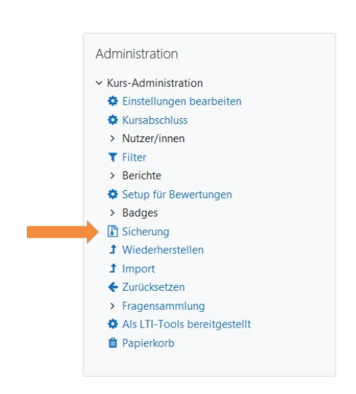</a>
  <figcaption style="text-align:center;font-size:14px;">Abbildung: Screenshot moodle Sicherungsfunktion</figcaption>
</figure>

<figure style="align:middle;">
  <a href="images/moodle_Sicherung_Einstellungen1.svg" target="_blank">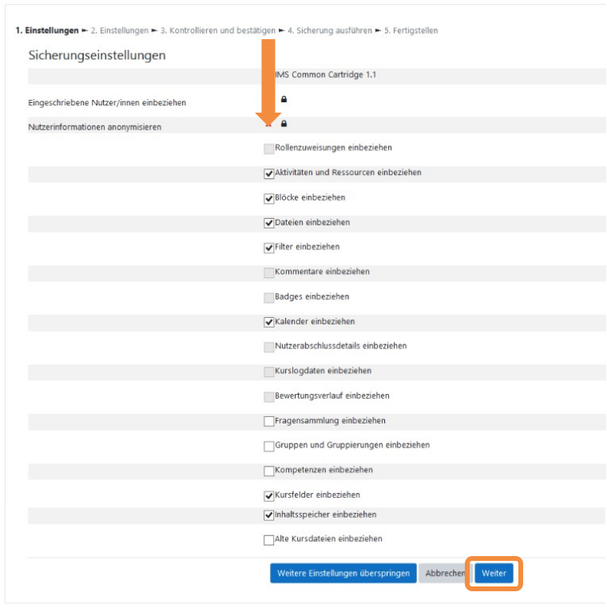</a>
  <figcaption style="text-align:center;font-size:14px;">Abbildung: Screenshot moodle Sicherungsdialog 1</figcaption>
</figure>

<figure style="align:middle;">
  <a href="images/moodle_Sicherung_Einstellungen2.svg" target="_blank">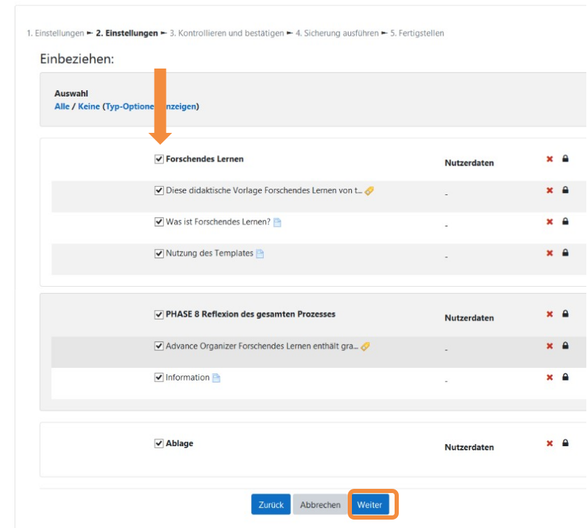</a></a>
  <figcaption style="text-align:center;font-size:14px;">Abbildung: Screenshot moodle Sicherungsdialog 2</figcaption>
</figure>

<figure style="align:middle;">
  <a href="images/moodle_Sicherung_Kontrollieren3.svg" target="_blank">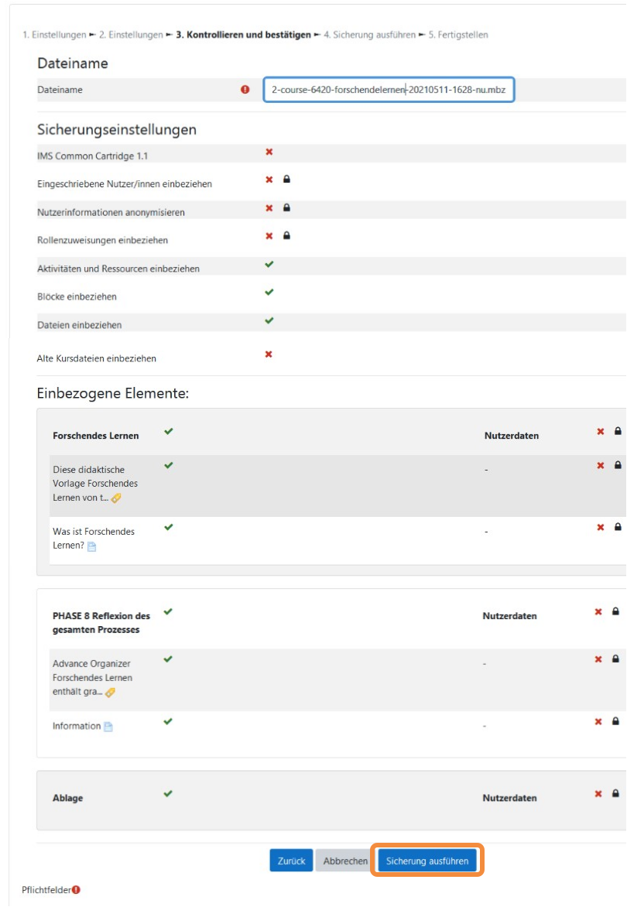</a>
  <figcaption style="text-align:center;font-size:14px;">Abbildung: Screenshot moodle Sicherungsdialog 3</figcaption>
</figure>

<figure style="align:middle;">
  <a href="images/moodle_Sicherung_Fertigstellen5.svg" target="_blank">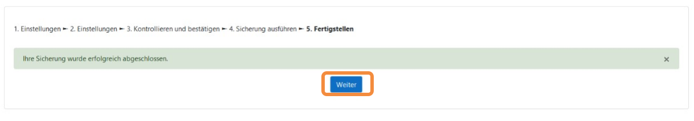</a>
  <figcaption style="text-align:center;font-size:14px;">Abbildung: Screenshot moodle Sicherungsdialog 4</figcaption>
</figure>

<figure style="align:middle;">
  <a href="images/moodle_Sicherung_Datei6.svg" target="_blank">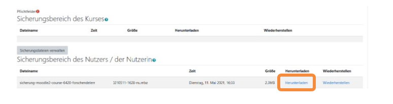</a>
  <figcaption style="text-align:center;font-size:14px;">Abbildung: Screenshot moodle mbz-Datei herunterladen</figcaption>
</figure>

---
<h2>Importieren von moodle-Elementen in die eigene moodle-Umgebung</h2>
Das Importieren von Kursen in die eigene moodle-Umgebung erfolgt durch die Wiederherstellungsfunktion. So können moodle- OER-Kurse aus twillo, die lokal als mbz Exportdateien vorliegen, komplett oder nur teilweise in einen eigenen moodle-Kurs in der eigenen moodle-Umgebung importiert werden. Zu beachten beim Import der mbz-Exportdatei (OER-Kurse) ist, dass die Moodle-Versionen der erzeugten Datei kompatibel mit der eigenen Moodle-Version ist und verwendete Funktionen, die nicht standardmäßig in Moodle enthalten sind, in der eigenen Instanz vorhanden sind, übernommen werden können (z.B. Anwendungen BigBlueButton, Formeleditoren, H5P Plugin etc.)
   
Um Exportdateien in Ihre eigene Moodle-Umgebung zu integrieren, müssen Sie entweder einen Kurs einrichten (oder von Ihrem Administrator einrichten lassen) oder einen bestehenden Kurs wählen, in dem Sie Elemente einfügen wollen.

Klicken im Bereich Administration auf <b>Wiederherstellen</b>.

<figure style="align:middle;">
  <a href="images/moodle_import.svg" target="_blank">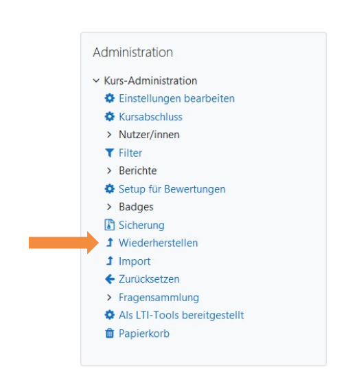</a>
  <figcaption style="text-align:center;font-size:14px;">Abbildung: Screenshot moodle Wiederherstellen</figcaption>
</figure>

Wählen Sie den entsprechenden Kurs aus, in der der OER- Kurs importiert werden soll. Fahren Sie mit <b>weiter</b> fort.
  
<figure style="align:middle;">
  <a href="images/moodle_import2.svg" target="_blank">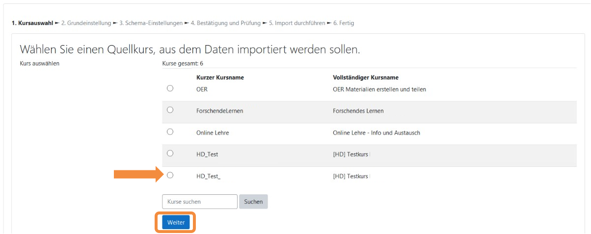</a>
  <figcaption style="text-align:center;font-size:14px;">Abbildung: Screenshot moodle Kursbereich wählen</figcaption>
</figure>

Wählen Sie im oberen Bereich <b>Sicherungsdatei importieren</b> im Upload-Feld <b>Datei wählen</b>. 
  
<figure style="align:middle;">
  <a href="images/moodle_import3.svg" target="_blank">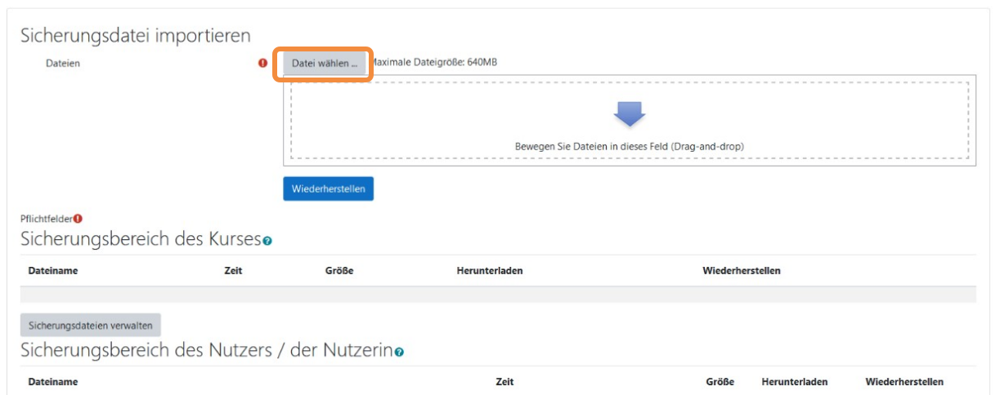</a>
  <figcaption style="text-align:center;font-size:14px;">Abbildung: Screenshot moodle Datei-upload</figcaption>
</figure>

Fügen Sie die lokal gespeicherte mbz-Datei ein oder ziehen Sie die Datei per Drag & Drop in das Feld hinein.

<figure style="align:middle;">
  <a href="images/moodle_import4.svg" target="_blank">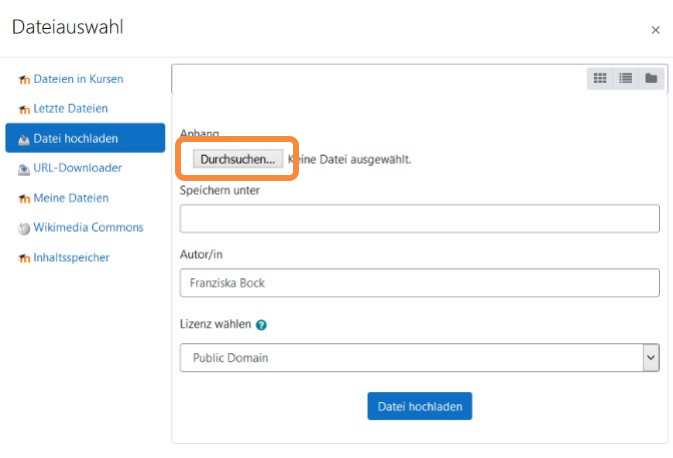</a>
  <figcaption style="text-align:center;font-size:14px;">Abbildung: Screenshot moodle Upload-Dialog aufrufen</figcaption>
</figure>

Beim Upload können Sie die Metadaten des OER- Kurses einfügen (Titel der OER, Autor:in und CC Lizenz). Bestätigen Sie den Vorgang mit <b>Datei hochladen</b>.

<figure style="align:middle;">
  <a href="images/moodle_import5.svg" target="_blank">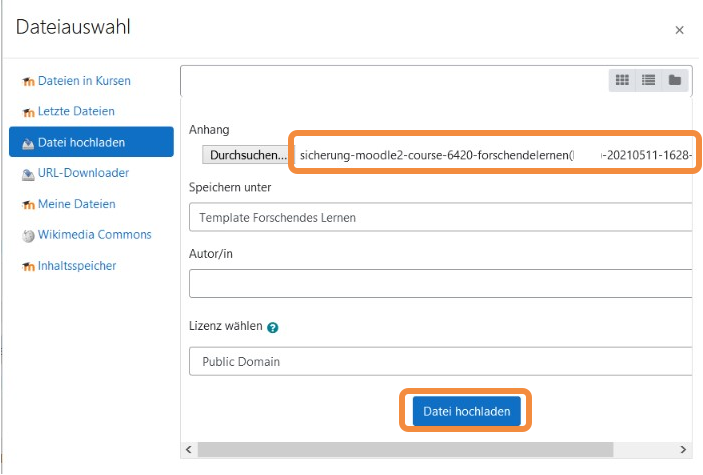</a>
  <figcaption style="text-align:center;font-size:14px;">Abbildung: Screenshot moodle Datei beschreiben und hochladen</figcaption>
</figure>

Nun werden Sie durch den Wiederherstellungsprozess geführt und durchlaufen einige Schritte, um die ausgewählte Datei im gewünschten Moodle - Kursraum zu importieren.

<figure style="align:middle;">
  <a href="images/moodle_import6.svg" target="_blank">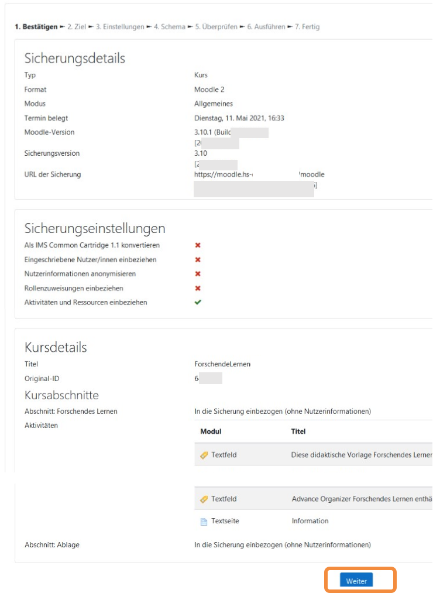</a>
  <figcaption style="text-align:center;font-size:14px;">Abbildung: Screenshot moodle Übersicht über den OER Kurs</figcaption>
</figure>

<ul>
  <li>Sie erhalten eine Übersicht zu den <b>Sicherungsdetails</b> (Einstellungen und Elemente des zu importierenden OER-Kurses). Fahren Sie mit <b>weiter</b> fort.
</li>
  <li>Nun legen Sie den Zielort der Wiederherstellungsdatei fest (In diesem Kurs herstellen) und bestätigen den Vorgang mit <b>weiter</b>.
</li>
  <li>Im Schritt <b>Einstellungen</b> können Sie Einstellungen und Funktionen, die importiert werden sollen auswählen. Dann bestätigen Sie erneut mit <b>weiter</b>.
</li>
  <li><b>Im Schritt Schema können einzelne Blöcke und Inhalte des Kurses zur Übernahme ausgewählt werden. In der Voreinstellung sind alle Elemente aktiviert. Klicken Sie auf weiter um fortzufahren.
</b></li>
  <li>Im Schritt <b>Überprüfen</b> erhalten Sie noch einmal eine Übersicht über Einstellungen, Elemente und Inhalte der zu importierenden Datei. Klicken Sie auf <b>Wiederherstellung ausführen</b>, um den Import abzuschließen.
</li>
</ul>

<figure style="align:middle;">
  <a href="images/moodle_import10.svg" target="_blank">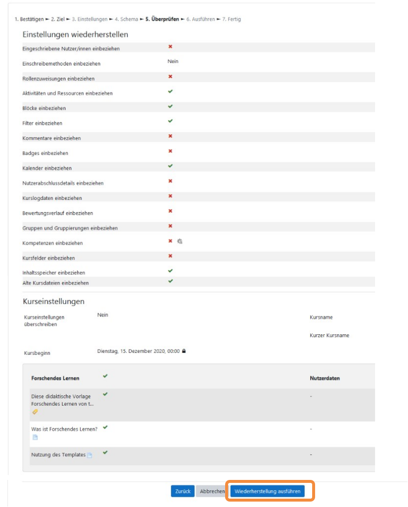</a>
  <figcaption style="text-align:center;font-size:14px;">Abbildung: Screenshot moodle Wiederherstellung ausführen</figcaption>
</figure>

In einem letzten Schritt gelangen Sie dann zum Kurs.

<figure style="align:middle;">
  <a href="images/moodle_import11.svg" target="_blank">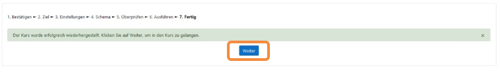</a>
  <figcaption style="text-align:center;font-size:14px;">Abbildung: Screenshot moodle Kursansicht</figcaption>
</figure>
