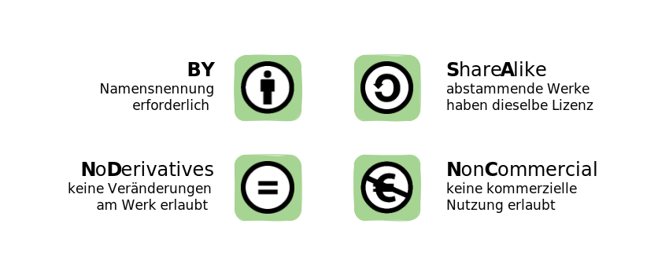
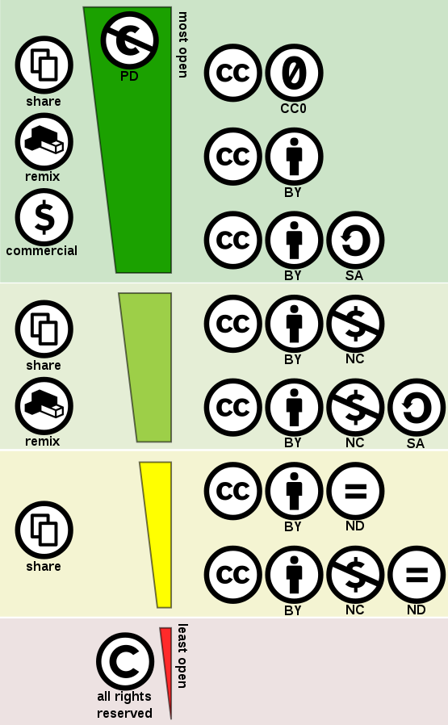

<h1 style="color:#8b0000">Schritt 1: OER erkennen</h1>
<link rel="stylesheet" href="https://cdnjs.cloudflare.com/ajax/libs/font-awesome/4.7.0/css/font-awesome.min.css">

<h2>Woran erkenne ich ob ein Material auch OER ist?</h2>

  
<i class="fa fa-info-circle" style="color:blue"></i>  <b>Info!</b>
      
    Im ersten Schritt festigen Sie Ihr Wissen zu einem grundlegenden Merkmal von OER: Der offenen Lizenzierung. Der Fokus liegt hierbei auf den einzelnen Modulen des Creative Commons Lizenzsystems. Darüber hinaus werden die Grundlagen des Urheberrechts kurz für Sie zusammengefasst. Ziel der Einheit ist es, Sie dazu zu befähigen, OER von geschlossenen Bildungsmaterialien abzugrenzen.
     
     
    <b>Workload: 1-2 Stunden</b>
  

In der Definition der UNESCO heißt es:

"Open Educational Resources (OER) are teaching, learning and research materials in any medium – digital or otherwise – that reside in the public domain or have been released under an open license that permits no-cost access, use, adaptation and redistribution by others with no or limited restrictions. OER form part of ‘Open Solutions’, alongside Free and Open Source software (FOSS), Open Access (OA), Open Data (OD) and crowdsourcing platforms" (<a href="https://en.unesco.org/themes/building-knowledge-societies/oer">UNESCO 2019</a>).

Die folgenden wesentlichen Aspekte können in dieser Definition hervorgehoben werden: OER sind <b>Bildungsmaterialien</b> sowie <b>Forschungsdaten</b> (in jedweder Form und jedwedem Medium) , die sich für den Einsatz im Lehr-Lernkontext eignen und kostenlos zugänglich sind. Nicht nur der <b>Einsatz</b> von OER im Lehr- oder Lernkontext ist erlaubt, sondern auch die <b>Bearbeitung und Anpassung der Materialien</b>. Auch eine <b>Veröffentlichung</b> der daraus neu entstandenen Versionen ist möglich.  Warum dies möglich ist, ergibt sich aus einer <b>offenen Lizenzierung</b>. Bildungsmaterialien, die mit einer offenen Lizenz ausgezeichnet oder als gemeinfrei gekennzeichnet sind, lassen diese Formen der Nutzung zu.

<table id="invisible">
  <tr>
    <td valign="middle" text-align="left" width="30%">
      <figure style="float:left;align:middle;">
        
        <figcaption style="text-align:center;font-size:14px;">Abbildung: Offene Lizenz</figcaption>
      </figure></td>
    <td valign="middle" text-align="left" width="70%">
      Durch eine offene Lizenz werden Dritten explizit <b>Nutzungsrechte</b> an Materialien eingeräumt. <b>Damit stellt die offene Lizenz das zentrale Merkmal von OER dar.</b> Die Entscheidung darüber, welche Verwendung eines Werks erlaubt werden soll, liegt allein bei der:dem Urheber:in:
      
    <ul style="list-style-type:none">
      <li><i class="fa fa-check-circle" style="color:green"></i> bewahren, sprich lokal oder cloudbasiert speichern</li>
      <li><i class="fa fa-check-circle" style="color:green"></i> teilen</li>
      <li><i class="fa fa-check-circle" style="color:green"></i> in der eigene Lehre nutzen</li>
      <li><i class="fa fa-check-circle" style="color:green"></i> mit eigenen Inhalten kombinieren oder mehrere Werke miteinander kombinieren</li>
      <li><i class="fa fa-check-circle" style="color:green"></i> bearbeiten</li>
      <li><i class="fa fa-check-circle" style="color:green"></i> angepasste Inhalte/Werke wiederveröffentlichen</li>
      <li><i class="fa fa-check-circle" style="color:green"></i> im kommerziellen Bereichen nutzen</li>
    </ul></td>
  </tr>
</table>

Im Bildungskontext wird insbesondere das <b>Creative Commons-Lizenzsystem</b> verwendet, da Urheber:innen durch kleinteilige Lizenzbausteine (sog. <b>Lizenzmodule</b>) differenziert entscheiden können, welche Rechte sie Dritten an Ihrem Bildungsmaterial einräumen möchten und unter welchen Bedingungen und/oder mit welchen Einschränkungen das entsprechende Werk genutzt werden darf.

<figure>
  
  <figcaption style="text-align:center;font-size:14px;">Abbildung: CC-Lizenzmodule</figcaption>
</figure>

Die Lizenzierung wird dadurch vereinfacht, dass eine Vielzahl vorformulierter Lizenzen (mit bestimmten Modulkombinationen) gewählt werden können, die sich erheblich voneinander unterscheiden. So können Urheber:innen mit ihrer Wahl einer CC-Lizenz die Nutzung ihrer Inhalte entweder relativ stark einschränken oder umfassend ermöglichen. Die u.s Liste gibt einen Überblick über gängige CC-Lizenzen.

   <button class="accordion"> <a aria-describedby="Link zur CC Zero Lizenz" href="https://creativecommons.org/publicdomain/zero/1.0/deed.de" target="_blank">zur Lizenz</a></button>
   

     
<b>CC 0 = Ohne Bedingungen</b> Es bestehen keine Restriktionen im Hinblick auf die Verwendung, Veränderung und Verbreitung des Inhalts/Werks. Kopien und bearbeitete Versionen können auch kommerziell genutzt werden. Zwar sind keine Urheberangaben nötig, aus Wertschätzung wird die urhebende Person meist trotzdem genannt.
     

   

   <button class="accordion"> <a aria-describedby="Link zur CC BY Lizenz" href="https://creativecommons.org/licenses/by/4.0/deed.de" target="_blank">zur Lizenz</a></button>
   

     
<b>CC BY = Namensnennung</b> Der Name der urhebenden Person muss genannt werden. Kopien und bearbeitete Versionen des Inhalts/Werks können auch kommerziell genutzt werden.

   

   <button class="accordion"> <a aria-describedby="Link zur CC BY SA Lizenz" href="https://creativecommons.org/licenses/by-sa/4.0/deed.de" target="_blank">zur Lizenz</a></button>
   

     
<b>CC BY SA = Namensnennung und Weitergabe unter gleichen Bedingungen</b> Neben der korrekten Namensnennung der urhebenden Person ist es erforderlich, alle bearbeiteten Versionen des Inhalts/Werks unter derselben Lizenz zu veröffentlichen. Dies stellt sicher, dass die Inhalte auch weiterhin frei zugänglich bleiben.

   

   <button class="accordion"> <a aria-describedby="Link zur CC BY NC Lizenz" href="https://creativecommons.org/licenses/by-nc/4.0/deed.de" target="_blank">zur Lizenz</a></button>
   

     
<b>CC BY NC = Namensnennung und nicht kommerziell</b> Der Name der urhebenden Person muss genannt werden. Kopien und bearbeitete Versionen des Inhalts/Werks dürfen nicht kommerziell genutzt werden.

   

   <button class="accordion"> <a aria-describedby="Link zur CC BY ND Lizenz" href="https://creativecommons.org/licenses/by-nd/4.0/deed.de" target="_blank">zur Lizenz</a></button>
   

     
<b>CC BY ND = Namensnennung und keine Bearbeitung</b> Diese Lizenz erlaubt Dritten die Weiterverbreitung des Inhalts/Werkes, kommerziell wie nicht-kommerziell, solange dies ohne Veränderungen und vollständig geschieht. Zudem muss die urhebende Person genannt werden.

   

   <button class="accordion"> <a aria-describedby="Link zur CC BY NC SA Lizenz" href="https://creativecommons.org/licenses/by-nc-nd/4.0/deed.de" target="_blank">zur Lizenz</a></button>
   

      
<b>CC BY NC SA = Namensnennung, nicht kommerziell und Weitergabe unter gleichen Bedingungen</b> Neben der korrekten Namensnennung der urhebenden Person ist es erforderlich, alle bearbeiteten Versionen e unter derselben Lizenz zu veröffentlichen. Kopien und bearbeitete Versionen dürfen nicht kommerziell genutzt werden.

   

   <button class="accordion"> <a aria-describedby="Link zur CC BY NC ND Lizenz" href="https://creativecommons.org/licenses/by-nc-nd/4.0/deed.de" target="_blank">zur Lizenz</a></button>
   

     
<b>CC BY NC ND = Namensnennung, nicht kommerziell und keine Bearbeitung</b> Diese Lizenz erlaubt Dritten die Weiterverbreitung des Inhalts/Werkes solange dies ohne Veränderungen und vollständig geschieht. Zudem muss die urhebende Person genannt werden. Kopien und bearbeitete Versionen dürfen nicht kommerziell genutzt werden.

   

Liste <i>Bedingungen von Creative Commons-Lizenzen</i> von twillo, lizenziert unter <a aria-describedby="Link zur Quelle (CreativeCommons Seite)" href="https://creativecommons.org/licenses/by/4.0/deed.de" target="_blank">CC BY (4.0)</a> basierend auf "<a aria-describedby="Link zur Quelle (Twillo)" href="https://www.oernds.de/oer/legal.html" target="_blank">Creative Commons (CC) Lizenzen</a>" von twillo, lizenziert unter <a aria-describedby="Link zur Quelle (CreativeCommons Seite)" href="https://creativecommons.org/licenses/by/4.0/deed.de" target="_blank">CC BY (4.0)</a>.

  
<i class="fa fa-exclamation-triangle" style="color:black"></i> <b>Wichtig!</b>
      
    Da OER nur dann umfänglich in der Hochschullehre etabliert werden können, wenn sie ohne weitreichende Restriktionen, kostenfrei verwendet, verändert und weiterverbreitet werden können, ist die Wahl einer besonders offenen CC-Lizenz bei ihrer Erstellung sinnvoll. Dem pädagogischen – nicht dem rechtlichen – Sinn & Zweck von offenen Bildungsmaterialien entsprechen somit die Lizenzen CC 0, CC BY, CC BY SA weil sie die Bearbeitung und Nutzung zu jeglichen Zwecken ermöglichen (<a aria-describedby="Link zur Twillo Seite: Rechtliches OER nutzen, teilen & erstellen" href="https://www.twillo.de/oer/web/rechtliches/">vgl. twillo 2021</a>) und damit dem OER-Gedanken im vollem Umfang entsprechen.
  

 
<h3>Gegenüberstellung: Die wichtigsten Unterschiede zwischen <i>urheberrechtlich</i> geschützten und <i>CC-lizenzierten</i> Materialien</h3>

<table id="normal">
  <tr>
    <th><b>Regularien des Urheberrechts</b></th>
    <th><b>Möglichkeiten offener Lizenzierung (am Beispiel Creative Commons)</b></th>
  </tr>
  <tr>
    <td valign="top">Das Urheberrecht ist ein Monopolrecht mit Erlaubnisvorbehalt. Das heißt, Urheber:innen besitzen in der Regel alle Rechte an von ihnen erstellten Inhalten, so dass nur sie diese wirtschaftlich verwerten und verbreiten dürfen. Grundsätzlich ist damit jede Verwendung eines urheberrechtlich geschützten Inhalts zustimmungs- und oftmals auch vergütungspflichtig (Ausnahmen hiervon stellen sogenannte „Schrankenregelungen“ dar: Zitatrecht, § 51 UrhG, Unterricht und Lehre § 60a UrhG).
        
      Die Schrankenbestimmung für Unterricht und Lehre in § 60a UrhG sieht Erleichterungen für Nutzungen eines Lernmaterials in der Hochschule bis zu einem bestimmten Umfang vor (15 % bei Druckwerken; 5 Min bei Videos und Musik).  Nach dem Gesetzestext darf die Nutzung erfolgen:
       
      <ol>
        <li>für Lehrende und Teilnehmer der jeweiligen Veranstaltung,</li>
        <li>für Lehrende und Prüfer:innen an derselben Bildungseinrichtung sowie</li>
        <li>für Dritte, soweit dies der Präsentation des Unterrichts oder von Unterrichts- oder Lernergebnissen an der Bildungseinrichtung dient.</li>
      </ol>
      Damit ist der Kreis der begünstigten Personen zwar relativ weit. Eine Nutzung durch Dritte ist aber erst möglich, wenn das konkret in Rede stehende Werk bereits für den Unterricht an der Bildungseinrichtung verwendet worden ist. Ferner können nur Personen mit einem institutionellen Bezug zu einer Bildungseinrichtung von der Schranke des § 60a UrhG Gebrauch machen.
    </td>
    <td valign="top">OER sind offen lizenziert und ermöglichen somit ihre freie, aber dennoch regulierte Verwendung mit verschiedenen Nutzungsgraden. Auf dem Portal twillo wird für eine offene Lizenzierung das standardisierte <b>Creative Commons - Lizenzsystem</b> empfohlen (vgl. u. a. <a aria-describedby="" href="https://www.unesco.de/sites/default/files/2018-01/DUK_Leitfaden_OER_in_der_Hochschulbildung_2015_barrierefrei-1.pdf">DUK 2015</a>, <a aria-describedby="" href="https://www.twillo.de/oer/legal.html">OER Portal Niedersachsen 2021</a>).
        
      Offene Lizenzen wurden entwickelt, um die Rechte von Urheber:innen zu schützen und gleichzeitig Dritten die (Weiter-)Verwendung und zum Teil sogar Anpassung und Änderung ihrer Inhalte und Materialien zu ermöglichen. Die Wahl einer bestimmten offenen Lizenz (und damit verbunden bestimmte Möglichkeiten der Nachnutzung ihrer Inhalte) liegt hierbei bei den Urheber:innen selbst. Auf diese Weise werden die Einschränkungen des Urheberrechts überwunden; Urheber:innen bleiben aber gleichzeitig als solche anerkannt. Dies ist im Bereich von Wissenschaft und Forschung von besonderer Relevanz.
        
      Die Nutzung von OER erfolgt also nicht im „rechtsfreien Raum“. Sie basiert auf rechtsgültigen Verträgen, die allerdings den Vorteil haben, dass sie nicht im Rahmen einer individuellen Transaktion (Vertragsverhandlung, Vertragsschluss), sondern „automatisch“ zustande kommen. Wird gegen die OER-Nutzungsvereinbarung verstoßen, sind Urheber:innen  rechtliche Möglichkeiten eröffnet, dagegen vorzugehen.
        
      Die folgende Abbildung verdeutlicht die Offenheit von Materialien absteigend von der Lizenz CC 0 bis zum klassischen Urheberrechtsschutz (all rights reserved).  Auf der linken Seite wird dargestellt, welche Nachnutzungsmöglichkeiten die farbig hinterlegten Lizenzen bieten. Der dunkelgrüne Bereich stellt Lizenzen dar, die das Teilen und Verändern von Materialien für nicht-kommerzielle <b>und</b> kommerzielle Zwecke erlauben. Materialien unter CC0, CC BY und CC BY SA lassen sich somit den "freien kulturellen Werken" zuordnen.
        
      Die Lizenzen des hellgrünen Bereichs erlauben ebenfalls das Teilen und Verändern, schließen jedoch die kommerzielle Nutzung aus.  Materialien unter den Lizenzen CC BY NC und CC BY NC SA gehören zum sog. "fair use" Konzept.
        
      Die Lizenzen des gelben Bereichs ermöglichen keine Veränderung am Material. Lediglich das Teilen, Weitergeben ist hier erlaubt.
       
      <figure>
        
        <figcaption style="text-align:center;font-size:14px;">Abbildung: <a aria-describedby="Link zur Quelle der Abbildung 5" href="https://commons.wikimedia.org/wiki/File:Creative_commons_license_spectrum.svg">Creative Commons License Spectrum</a> von Shaddim, lizenziert unter <a aria-describedby="Link zur Quelle (CreativeCommons Seite)" href="https://creativecommons.org/licenses/by/4.0/deed.de" target="_blank">CC BY (4.0)</a></figcaption>
      </figure>
    </td>
  </tr>
</table>

 
<b>Weitere Informationen zur Vertiefung</b>
<ul>
  <li>Alle oben genannten Informationen können Sie im Bereich <a aria-describedby="" href="https://www.twillo.de/oer/legal.html">Rechtliches</a> auf twillo nachlesen.</li>
  <li>CC-Lizenzen auf einen Blick finden Sie z.B. in folgendem Handzettel der Martin-Luther-Universität-Wittenberg: <a ahref="https://blog.llz.uni-halle.de/files/2018/11/Flyer_CC-CheatSheet_web.pdf">https://blog.llz.uni-halle.de/files/2018/11/Flyer_CC-CheatSheet_web.pdf</a>.</li>
  <li>Die wichtigsten Aspekte zum Thema Urheberrecht und offene Lizenzierung von Materialien finden Sie in folgendem Video von Hirsch (2020)</li>
</ul>

<figure>
  <iframe width="560" height="315" src="https://www.youtube-nocookie.com/embed/E955up7vtCk" frameborder="0" allow="accelerometer; autoplay; clipboard-write; encrypted-media; gyroscope; picture-in-picture" allowfullscreen name="Urheberrecht von und für Nicht-Jurist:innen"></iframe>
  <figcaption style="text-align:center;font-size:14px;">Video 1: <a aria-describedby="Link zum Video (YouTube)" href="https://www.youtube.com/watch?v=E955up7vtCk&ab_channel=NeleHirsch">Urheberrecht für Nicht-Jurist:innen</a> von Nele Hirsch, lizenziert unter <a aria-describedby="Link zur Seite (Creative Commons)" href="https://creativecommons.org/publicdomain/zero/1.0/">CC 0 (1.0)</a></figcaption>
</figure>

---

<h2>Alles klar? Überprüfen Sie Ihr Wissen zu OER und offenen Lizenzen mit folgendem Quiz</h2>
 

  <h1 class="quiz">Quiz zu OER und offenen Lizenzen</h1>
  

    

      
Welche Organisation prägte den Begriff "OER" erstmalig?*

      

        <label>
          Lösung: 
          <input type="text" id="test" name="question1">
        </label>
      

      
UNESCO

      
Auf dem UNESCO <i>Forum zu OpenCourseWare für die Hochschulbildung in Entwicklungsländern</i> im Jahr 2002 wurde der Begriff Open Educational Resources erstmalig geprägt (vgl. <a aria-described-by="Link zur Unesco Seite" href="https://unesdoc.unesco.org/ark:/48223/pf0000128515">UNESCO 2002</a>) Die UNESCO griff die Forderungen der aufkommenden OER-Bewegung auch 2012 in ihrer Pariser Erklärung wieder auf. 

    

    

      
Wählen Sie die CC-Lizenzen mit den richtigen Bedeutungen aus

      

        <label title="A">
          <input type="checkbox" name="question2" value="A">
          CC BY ND  =  Namensnennung, Weitergabe unter gleichen Bedingungen
        </label>
        <label title="B">
          <input type="checkbox" name="question2" value="B">
          CC BY SA  =  keine Bearbeitung, Namensnennung
        </label>
        <label title="C">
          <input type="checkbox" name="question2" value="C">
          CC BY NC  =  nicht-kommerziell, Namensnennung
        </label>
        <label title="D">
          <input type="checkbox" name="question2" value="D">
          CC BY  =  Namensnennung
        </label>
      

      
C,D

      
CC BY ND  =  keine Bearbeitung, Namensnennung CC BY SA  =  Namensnennung, Weitergabe unter gleichen Bedingungen

    

    

      
Wie lässt sich OER definieren?*

      

        <label title="A">
          <input type="radio" name="question3" value="A">
          Bildungsmaterialien in jedwedem Medium, die unter einer offenen Lizenz veröffentlicht wurden und ohne weitreichende Restriktionen genutzt und weiterverbreitet werden können.
        </label>
        <label title="B">
          <input type="radio" name="question3" value="B">
          Bildungsmaterialien, in digitalen Medien, die nicht urhebrrechtlich geschützt sind und und ohne weitreichende Restriktionen genutzt und weiterverbreitet werden können.
        </label>
      

      
A

      
"Open Educational Resources (OER) sind Bildungsmaterialien jeglicher Art und in jedem Medium, die unter einer offenen Lizenz stehen. Eine solche Lizenz ermöglicht den kostenlosen Zugang sowie die kostenlose Nutzung, Bearbeitung und Weiterverbreitung durch Andere ohne oder mit geringfügigen Einschränkungen. Dabei bestimmen die Urhebenden selbst, welche Nutzungsrechte sie einräumen und welche Rechte sie sich vorbehalten" (<a aria-describedby="Link zur OER Seite der deutschen Unesco-Kpmmission" href="https://www.unesco.de/bildung/open-educational-resources">Deutsche UNESCO-Kommision o.J.</a>)

    

    

      
Welches Merkmal gilt als eindeutiges Indiz für OER?

      

        <label title="A">
          <input type="radio" name="question4" value="A">
          digitales Format
        </label>
        <label title="B">
          <input type="radio" name="question4" value="B">
          offene Lizenzierung
        </label>
        <label title="C">
          <input type="radio" name="question4" value="C">
          kostenpflichtige Nutzung
        </label>
      

      
B

      
Ein zentrales Merkmal, das OER von urheberrechtlich geschützten Materialien unterscheidet, ist die offene Lizenz. Weitere (etwas unspezifischere) Merkmale sind ein offenes Dateiformat, die automatische Auffindbarkeit und die didaktische Kontextualisierung, die den einfacheren Umgang mit OER betonen (OER nutzen und bearbeiten, OER effizient auffinden, Einschätzbarkeit der Passung im eigenen Lehr-Lernkontext). In den folgenden Schritten dieser Lernreise werden Sie die genannten Merkmale noch etwas genauer kennenlernen.

    

    

      
Welche Lizenzen gelten als OER-Standard?*

      

        <label>
          Lösung: 
          <input type="text" name="question5">
        </label>
      

      
Creative Commons Lizenzen

      
Creative Commons-Lizenzen eignen sich für den Bildungskontext besonders gut, da die Urheber:innen durch unterschiedliche Lizenzmodule differenziert entscheiden können, welche Rechte sie Dritten an ihrem Bildungsmaterial einräumen möchten.

    

    

      
Was bedeutet bei Creative-Commons-Lizenzen das Kürzel "BY"?*

      

        <label title="A">
          <input type="radio" name="question6" value="A">
          Die:Der ursprüngliche Urheber:in muss bei Nutzung angegeben werden.
        </label>
        <label title="B">
          <input type="radio" name="question6" value="B">
          Das Material darf nur vollständig und unverändert genutzt werden.
        </label>
      

      
A

      
Das Modul <b>BY</b> bedeutet, dass die:der Urheber:in des Werkes angegeben werden muss. Der Zusatz wird im Deutschen mit "Namensnennung" bezeichnet. Das Modul <b>ND</b> (engl. No Derivatives, dt. keine Veränderung) gibt an, dass das Material nur vollständig und unverändert genutzt werden darf.

    

    

      
Was muss bei der Nutzung eines Bilds beachtet werden, welches unter der Creative-Commons-Lizenz "CC BY SA" steht?*

      

        <label title="A">
          <input type="checkbox" name="question7" value="A">
          Urheber:innen müssen angeben werden
        </label>
        <label title="B">
          <input type="checkbox" name="question7" value="B">
          Bei einer Veränderung und anschließenden Wiederveröffentlichung des Bildes, muss es unter die gleiche Lizenz gestellt werden, wie das Original
        </label>
        <label title="C">
          <input type="checkbox" name="question7" value="C">
          Die Lizenz muss angegeben und der Lizenztext verlinkt werden
        </label>
      

      
A,B,C

      
<b>BY</b> steht für die Namensnennung der Urheber:innen, <b>SA</b> (Share Alike) verlangt eine Weitergabe abgeleiteter Werke unter der gleicher Lizenz. Die Lizenz muss bei bei allen CC-Lizenzierten Werken angegeben und ein Link zum Lizenztext gesetzt werden.

    

    

      
Verzichtet die:der Urheber:in durch eine offene Lizenz auf alle Rechte an ihrem:seinem Werk?*

      

        <label title="A">
          <input type="radio" name="question8" value="A">
          Ja, ein Vorbehalt von Rechten ist nicht möglich
        </label>
        <label title="B">
          <input type="radio" name="question8" value="B">
          Nur bei der Wahl der Lizenz CC 0
        </label>
      

      
B

      
Der:Die Urheber:in kann sich auch bei der Wahl einer offenen Lizenz bestimmte Rechte an ihrem:seinem Werk vorbehalten. Durch eine offene Lizenz werden lediglich Nutzungsrechte vergeben. Das Urheberrecht ist in seinem Kern (Urheberpersöhnlichkeitsrecht) unverzichtbar. Wählt die:der Urheber:in jedoch die Lizenz CC 0 (keine Rechte vorbehalten), verzichtet er:sie bewusst auf ihre:seine Rechte an dem Werk. (das deutsche Urheberrecht kennt keine Public Domain)

    

    

      
Welche Vorteile haben offene Lernmaterialien gegenüber restriktiv geschützten?*

      

        <label title="A">
          <input type="checkbox" name="question9" value="A">
          Sie können nachgenutzt werden
        </label>
        <label title="B">
          <input type="checkbox" name="question9" value="B">
          Sie können kostenlos genutzt werden (= kein Entgelt für die EInräumung von Nutzungsrechten)
        </label>
        <label title="C">
          <input type="checkbox" name="question9" value="C">
          Auf Quellenangaben kann verzichtet werden
        </label>
      

      
A,B

      
Als offen gelten Bildungsinhalte, wenn sie kostenlos genutzt werden können und unter einer Lizenz stehen, die die Weiterverwendung ermöglicht.

    

  

  

  

    <button class="quiz" id="previous">Vorherige Frage</button>
    <button class="quiz" id="submit">Ergebnis anzeigen</button>
    <button class="quiz" id="next">Nächste Frage</button>
  

  

