<h1 style="color:#000080">Schritt 2: OER finden und nutzen</h1>
<link rel="stylesheet" href="https://cdnjs.cloudflare.com/ajax/libs/font-awesome/4.7.0/css/font-awesome.min.css">

  
<i class="fa fa-info-circle" style="color:blue"></i>  <b>Info!</b>
      
    Im zweiten Schritt erhalten Sie einen Überlick über bestehende Möglichkeiten, um gezielt nach OER zu suchen. In diesem Zuge lernen Sie die wichtigsten Suchmaschinen, Portale und Repositorien für OER kennen. Zudem erhalten Sie Informationen über die Einbindung von CC-lizenzierten Inhalten in Ihre eigenen Werke und erfahren was dabei zu beachten ist. Ziel der Einheit ist es, Ihnen mehr Sicherheit bei der Nachnutzung bestehender OER zu geben.
      
    <b>Workload: 45 Minuten</b>
  

# Fundorte und Suchstrategien

Für das Auffinden von OER im Internet können zwei zentrale Hinweise in Bezug auf den <b>Fundort</b> sowie der <b>Suchstrategie</b> gegeben werden. 

<b>Suche über spezielle OER-Portale und -Plattformen:</b> Es bestehen einige Infrastrukturen, die explizit für das Bereitstellen von offen lizenzierten Lehr- und Lernmaterialien konzipiert sind - wie z.B. twillo. Die Bestrebung des Ausbaus solcher sog. OER-Repositorien wird aktuell auf bildungspolitischer Ebene fokussiert und erhält Eingang in die Hochschullehre.

<b>Verwendung von gängigen Suchmaschienen und allgemeinen Plattformen:</b> Auch Plattformen ohne spezifischen OER-Fokus führen Materialien mit offenen Lizenzen. Diese bieten zwar nicht ausschließlich Lehr- oder Lernmaterialien an, dennoch haben sie sich in den letzten Jahren - sicherlich auch aufgrund fehlender OER-Infrastrukturen - als Veröffentlichungsorte für Bildungsmaterialien etabliert.

Neben dem Kriterium des Fundortes kann, wie in der Wissenschaftspraxis auch, z.B. in der Datenbankrecherche, systematisch nach offen lizenzierten Materialien gesucht werden. Dies gilt sowohl für die Nutzung gängiger Suchmaschinen, als auch für die Suche in Repositorien. Folgende Suchstrategien lassen sich für eine zielgerichtete Suche nach OER anwenden:

<ul style="list-style-type:none">
  <li>
    <i class="fa fa-check-circle" style="color:green"></i> Verwendung von Schlagworten: Denken Sie auch an die Suchtechnik des <b>Trunkierens</b>; eher wenige Stichwörter, dafür aber Wortteile statt ganzer Wörter (Beispiel: Systemtheorie → system*theor*, Paternalismus → paternalis*)
  </li> 
  <li>
    <i class="fa fa-check-circle" style="color:green"></i> Nutzung von <b>Suchoperatoren</b>, die aus Datenbanken und dem Bibliothekswesen bekannt sind: UND/AND/+; oder NICHT/NOT/- sowie ODER/OR
  </li> 
  <li>
    <i class="fa fa-check-circle" style="color:green"></i> Verwendung der <b>CC-Filter</b> in Suchmaschinen oder Portalen
  </li> 
  <li>
    <i class="fa fa-check-circle" style="color:green"></i> Eingabe des Suchbegriffs + <b>Creative Commons</b> oder speziell der <b>Lizenz</b> (CC 0, CC BY etc.)
  </li> 
  <li>
    <i class="fa fa-check-circle" style="color:green"></i> Nutzung von <b>englischen</b> Begriffen
  </li> 
  <li>
    <i class="fa fa-check-circle" style="color:green"></i> Verwendung <b>spezifischer Filteroptionen</b> in OER-Repositorien; z.B. die erweiterte Suche (Lizenz, Quelle, Institution, Autor:in, Materialart, Fach- und Sachgebiet, etc.)
  </li>
</ul>

Im Folgenden sind einige Plattformen sowie ihre Filteroptionen im Hinblick auf eine zielgerichtete OER-Suche aufgeführt

<b>OER-Portale und -Suchmaschinen (Repositorien und Referatorien)</b>

  <button class="accordion">twillo</button>
  

    

      Twillo ist ein OER-Repositorium für offene Bildungsmaterialien für den Hochschulkontext. Das Portal richtet sich an Hochschullehrende aller Fachbereiche.
      <a aria-describedby="Link zum twillo-Portal" href="http://www.twillo.de/" target="_blank">www.twillo.de</a>
      <figure style="align:middle;">
        
        <figcaption style="text-align:center;font-size:14px;">Abbildung: Screenshot der twillo Suchumgebung</figcaption>
      </figure>
    

  

  <button class="accordion">OERSI</button>
  

    

      OERSI steht für OER Search Index und ist eine Suchmaschine für offene Bildungsmaterialien, die OER Materialien aus verschiedensten Plattformen und Repositorien auffindbar
macht. Die Suchmaschine befindet sich aktuell noch in der Beta-Phase.
      <a aria-describedby="Link zum oersi" href="http://oersi.de/" target="_blank">www.oersi.de</a>
      <figure style="align:middle;">
        <a href="images/oersi.svg" target="_blank">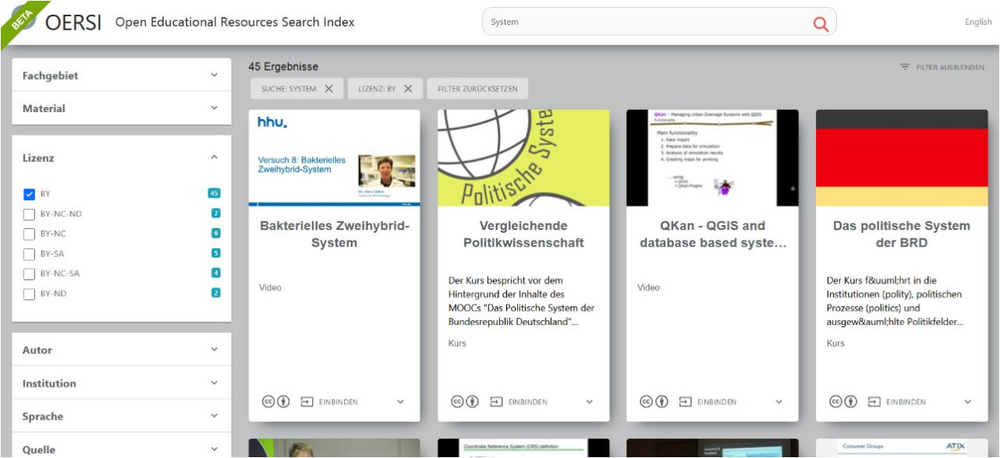</a>
        <figcaption style="text-align:center;font-size:14px;">Abbildung: Screenshot der OERSI Suchumgebung </figcaption>
      </figure>
    

  

  <button class="accordion">X5GON</button>
  

    

      Bei X5GON handelt es sich um eine Plattform, die OER aus verschiedensten Quellen und Repositorien auffindbar macht.
      <a aria-describedby="Link zur X5GON Plattform" href="http://discovery.x5gon.org/" target="_blank">discovery.x5gon.org</a>
      <figure style="align:middle;">
        <a href="images/x5gon.svg" target="_blank">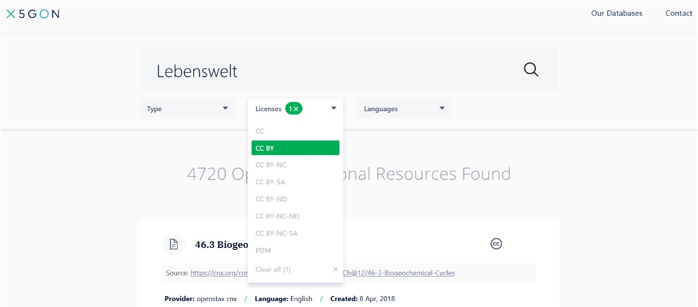</a>
        <figcaption style="text-align:center;font-size:14px;">Abbildung: Screenshot der X5GON Suchumgebung</figcaption>
      </figure>
    

  

  <button class="accordion">OERhörnchen</button>
  

    

      OERhörnchen ist eine Suchmaschine für OER Materialien, die gezielt offene Lehr-/Lernmaterialien von ausgewählten Bildungsprojekten auffindbar macht.
      <a aria-describedby="Link zur OERhörnchen Suchmaschine" href="http://oerhoernchen.de/" target="_blank">www.oerhoernchen.de</a>
      <figure style="align:middle;">
        <a href="images/oerhoernchen.svg" target="_blank">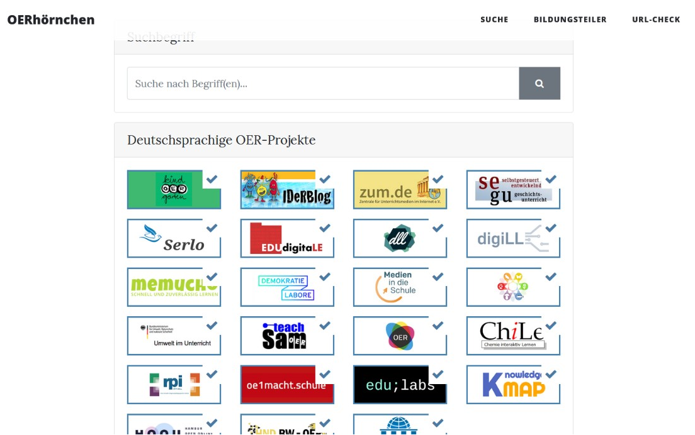</a>
        <figcaption style="text-align:center;font-size:14px;">Abbildung: Screenshot der OERhörnchen Suchumgebung</figcaption>
      </figure>
    

  

  <button class="accordion">CCsearch</button>
  

    

      CCsearch ist eine Suchmaschine für Materialien, die mit Creative Commons Lizenzen ausgezeichnet sind.
     <a aria-describedby="Link zur CCsearch Suchmaschine" href="http://ccsearch.creativecommons.org/" target="_blank">ccsearch.creativecommons.org</a>
      <figure style="align:middle;">
        <a href="images/ccsearch_oer_suche.svg" target="_blank">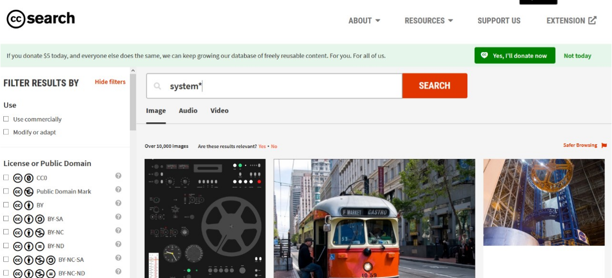</a>
        <figcaption style="text-align:center;font-size:14px;">Abbildung: Screenshot der CCsearch Suchumgebung</figcaption>
      </figure>
    

  

  <button class="accordion">Wikimedia Commons</button>
  

    

      Wikimedia Commons ist eine Plattform, auf der offene lizenzierte Inhalte zur Nutzung bereit stehen.
      <a aria-describedby="Link zur Wikimedia Commons Plattform" href="http://commons.wikimedia.org/" target="_blank">commons.wikimedia.org</a>
      <figure style="align:middle;">
        <a href="images/commonswikimedia.svg" target="_blank">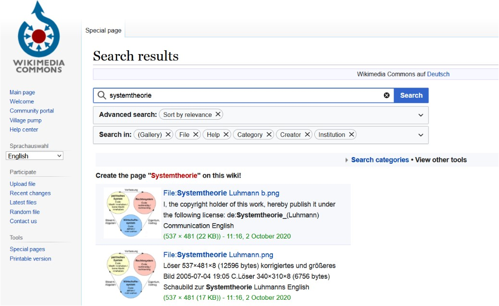</a>
        <figcaption style="text-align:center;font-size:14px;">Abbildung: Screenshot der Wikimedia Commons Suchumgebung</figcaption>
      </figure>
    

  

  <button class="accordion">SlideWiki</button>
  

    

      SlideWiki ist eine Open-Source-Plattform auf der Vorträge und Präsentationen unter einer offenen Lizenz bereitgestellt werden.
      <a aria-describedby="Link zu Slidewiki" href="https://slidewiki.org/" target="_blank">https://slidewiki.org/</a>
      <figure style="align:middle;">
        <a href="images/slidewiki.svg" target="_blank">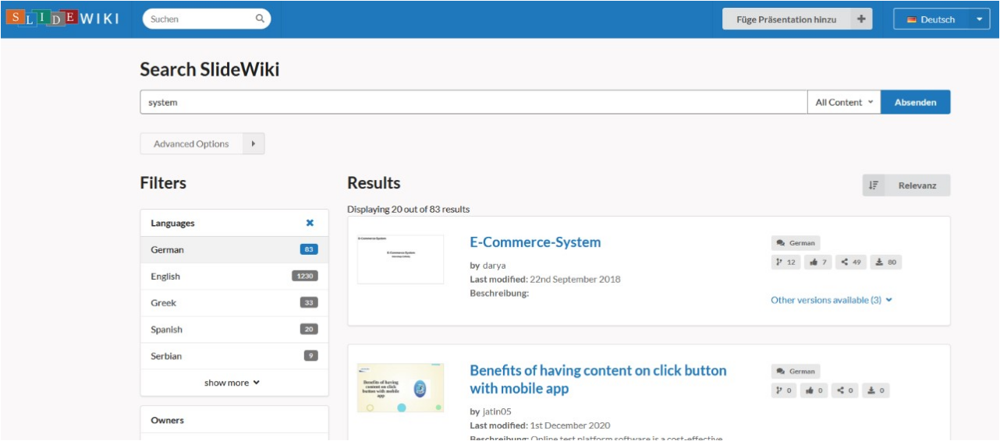</a>
        <figcaption style="text-align:center;font-size:14px;">Abbildung: Screenshot der SlideWiki Suchumgebung</figcaption>
      </figure>
    

  

<b>Allgemeine Suchmaschinen und Plattformen</b>

  <button class="accordion">Suchmaschinen</button>
  

    

      <h4>duckduckgo</h4> Duckduckgo ist eine Suchmaschine und stellt eine Alternative zu google dar. Geben Sie Ihren Suchbegriff ein und starten Sie die Suche. Lediglich bei Videos kann der Suchfilter Creative Commons angewendet werden.
      <figure style="align:middle;">
        
        <figcaption style="text-align:center;font-size:14px;">Abbildung: Screenshot der duckduckgo Suchumgebung</figcaption>
      </figure>
       
      <h4>Google</h4> Geben Sie Ihren Suchbegriff ein und starten Sie die Suche. Wählen Sie anschließend unter "Einstellungen", die "erweiterte Suche" aus (s. Abb. 14). Es öffnet sich ein neues Fenster. Hier können Sie die Ergebnisse Ihrer Suche im Bereich "Nutzungsrechte" entlang der von Ihnen gewünschten Lizenzierung eingrenzen (s. Abb. 15). 
      <figure style="align:middle;">
        <a href="images/google_oer_suche1.svg" target="_blank">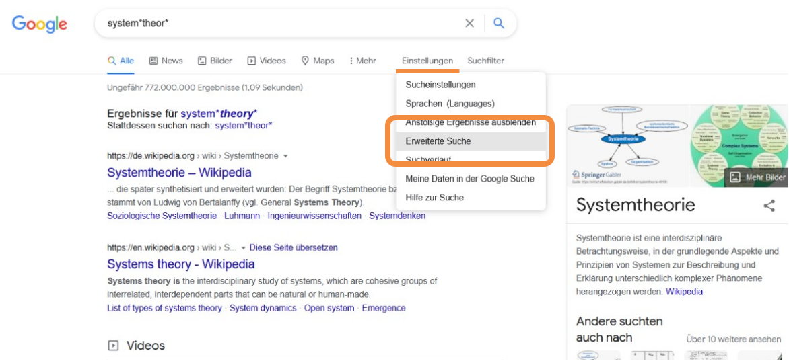</a>
        <figcaption style="text-align:center;font-size:14px;">Abbildung: Screenshot der Google Suchumgebung</figcaption>
      </figure>
      <figure style="align:middle;">
        <a href="images/google_oer_suche2.svg" target="_blank">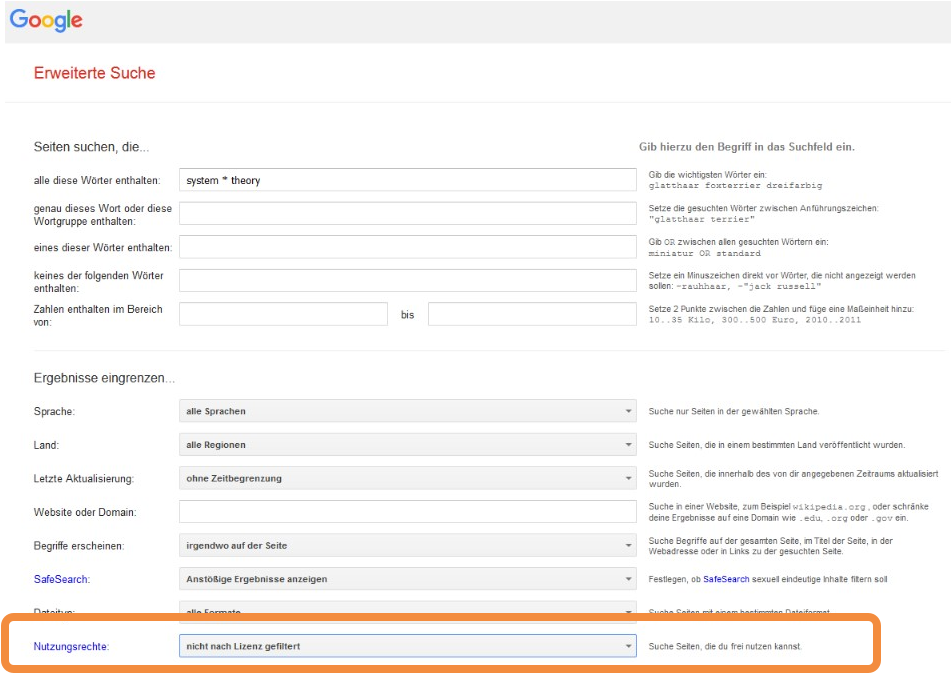</a>
        <figcaption style="text-align:center;font-size:14px;">Abbildung: Screenshot der Google-Suchfilter</figcaption>
      </figure>
    

  

  <button class="accordion">Videoportale</button>
  

    

      <h4>AV-Portal</h4> Im AV-Portal der Technischen Informationsibliothek (TIB) Hannover finden Sie eine Vielzahl wissenschaftlicher Filme. Zu allen Fachbereichen sind sowohl Vorträge, als auch Erklär- und Lernvideos vertreten. Es besteht auch die Möglichkeit, eigene wissenschaftliche Filme über das Portal zu veröffentlichen. Die zielgerichtete Suche nach OER- Materialien im AV- Portal erfolgt zunächst über die Eingabe des Begriffes in der Suchleiste (z.B. Begriff Paternalismus).
      <figure style="align:middle;">
        <a href="images/AV_Portal_OER_Suche_screenshot1.svg" target="_blank">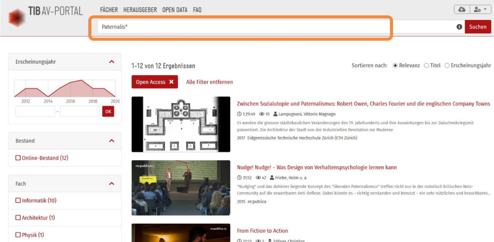</a>
        <figcaption style="text-align:center;font-size:14px;">Abbildung: Screenshot der AV-Portal Suchumgebung</figcaption>
      </figure>
      In einem weiteren Schritt können die Ergebnistreffer durch verschiedene Filteroptionen im linken Seitenmenü eingegrenzt werden. Für die Suche nach OER Materialien, muss im Bereich "Wiederverwendung" der Filter "Open-Access" aktiviert werden.
      <figure style="align:middle;">
        <a href="images/AV_Portal_OER_Suche_screenshot2.svg" target="_blank">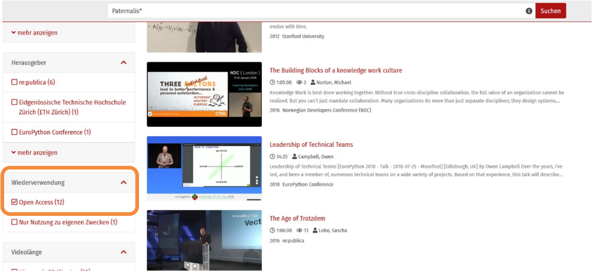</a>
        <figcaption style="text-align:center;font-size:14px;">Abbildung: Screenshot der AV-Portal Filteroptionen</figcaption>
      </figure>
      Angaben dazu, um welche Lizenz es sich konkret bei einem Video handelt, finden Sie nach einer Anwahl des gewünschten Videos in den Metadaten.
      <figure style="align:middle;">
        <a href="images/AV_Portal_OER_Suche_screenshot3.svg" target="_blank">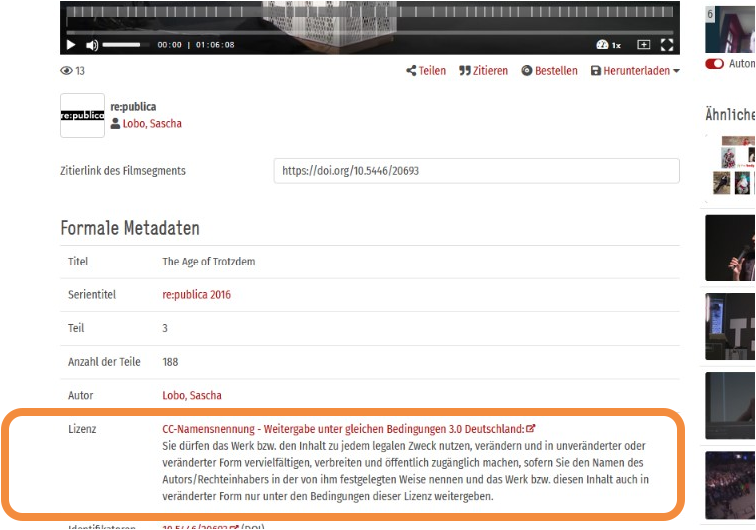</a>
        <figcaption style="text-align:center;font-size:14px;">Abbildung: Screenshot der AV-Portal Lizenzangaben</figcaption>
      </figure>
       
      <h4>Vimeo</h4> Die zielgerichtete Suche nach OER-Materialien auf der Videoplattform Vimeo erfolgt zunächst über die Eingabe des Begriffes in der Suchleiste (z.B. Begriff Systemtheor*). In einem weiteren Schritt können die Ergebnistreffer durch verschiedene Filteroptionenim linken Seitenmenü eingegrenzt werden.
      <figure style="align:middle;">
        <a href="images/vimeo_oer_suche_screenshot1.svg" target="_blank">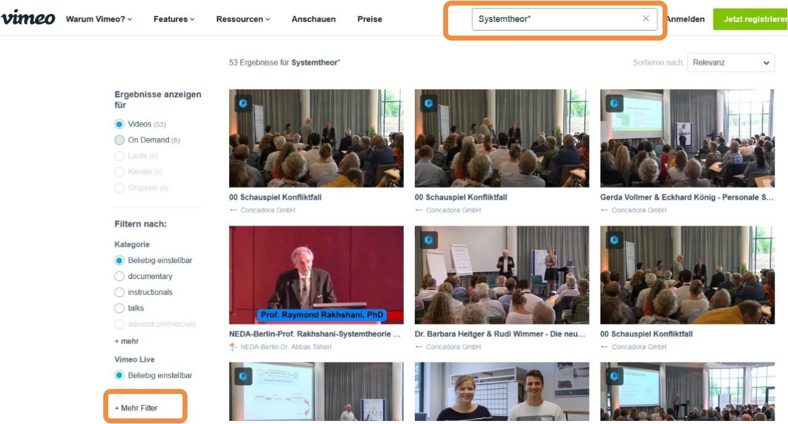</a>
        <figcaption style="text-align:center;font-size:14px;">Abbildung: Screenshot der Vimeo Suchumgebung</figcaption>
      </figure>
      Für die Suche nach OER Materialien klicken Sie auf "mehr", um weitere Filteroptionen anwählen zu können. Dort finden Sie den Filter "Lizenz" mit verschiedenen Lizenzoptionen.
  Bereits durch die ausgegraute Lizenzen wird sichtbar, dass keine Videoressource zu dem Suchbegriff vorhanden ist, die unter CC BY lizenziert ist.
      <figure style="align:middle;">
        <a href="images/vimeo_oer_suche_screenshot2.svg" target="_blank">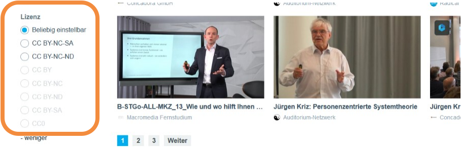</a>
        <figcaption style="text-align:center;font-size:14px;">Abbildung: Screenshot der Vimeo Lizenz-Filteroptionen</figcaption>
      </figure>
      Um die Lizenzangaben eines ausgewählten Videos zu überpüfen, klicken Sie unterhalb der Videoanzeige auf den Button "mehr".
      <figure style="align:middle;">
        <a href="images/vimeo_oer_suche_screenshot3.svg" target="_blank">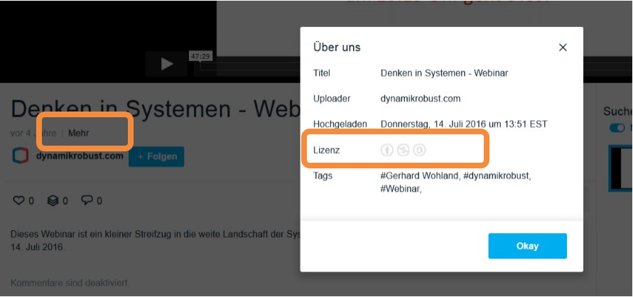</a>
        <figcaption style="text-align:center;font-size:14px;">Abbildung: Screenshot der Vimeo Lizenz-Information</figcaption>
      </figure>
      <h4>Youtube</h4> Geben Sie den Suchbegriff ein und starten Sie die Suche. Wählen Sie anschließend die Option "Filter" und schränken Sie die Ergebnisse im Bereich "Eigenschaften" durch die Wahl der Option "Creative Commons" ein.
      <figure style="align:middle;">
        <a href="images/youtube_oer_suche.svg" target="_blank">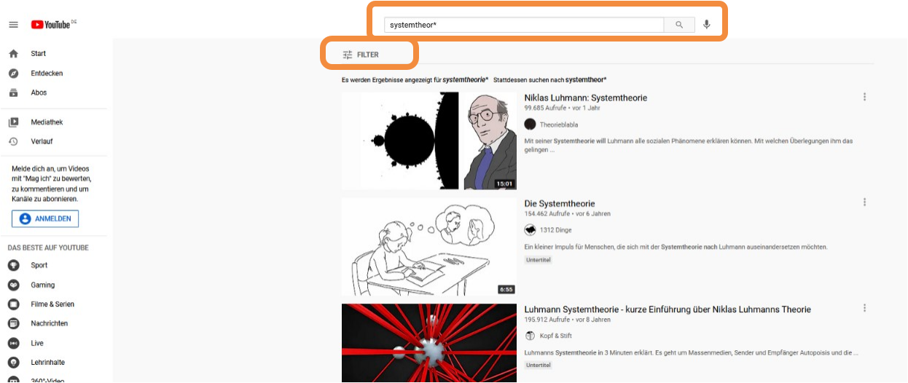</a>
        <figcaption style="text-align:center;font-size:14px;">Abbildung: Screenshot der YouTube Suchumgebung</figcaption>
      </figure>
      <figure style="align:middle;">
        <a href="images/youtube_oer_suche2.svg" target="_blank">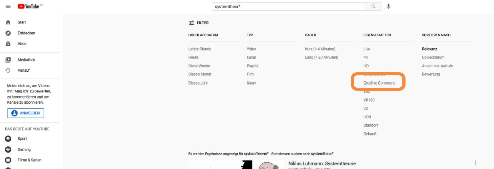</a>
        <figcaption style="text-align:center;font-size:14px;">Abbildung: Screenshot der Youtube Lizenz-Filteroptionen</figcaption>
      </figure>
    

  

  <button class="accordion">Bilderportale</button>
  

    

      <h4>Pixabay</h4> 
      Pixabay ist eine bekannte Bilder-Plattform mit frei verfügbaren Bildern und Videos. Sofern nicht anders angegeben stehen alle Bilder unter der plattformeigenen <b>Pixabay Lizenz</b>. Diese Lizenz steht in keiner Verbindung mit dem CC-Lizenzsystem. Möchten Sie Pixabay Bilder verwenden, lesen Sie bitte genau nach, ob die von Ihnen geplante Nutzung erlaubt ist. 
      

        
<i class="fa fa-exclamation-triangle" style="color:black"></i> <b>Wichtig!</b>
          Eine Weiterlizenzierung von Pixabay Inhalten ist aufgrund der Pixabay Lizenz problematisch. Wird ein Pixabay Inhalt in ein OER eingebunden, muss der Pixabay Inhalt als Fremdmaterial (mit Pixabay Lizenz) kenntlich gemacht werden. Mehr dazu erfahren Sie unten im Bereich Korrekte Verwendung von OER. 
          Nutzen Sie die Pixabay Suche, werden in einer Leiste oberhalb der Ergebnisse Bilder von iStock angezeigt. Diese sind kostenpflichtig und fallen nicht unter offene Ressourcen.
        

      

      <figure style="align:middle;">
        <a href="images/pixabay_suche_pixabay_license.svg" target="_blank">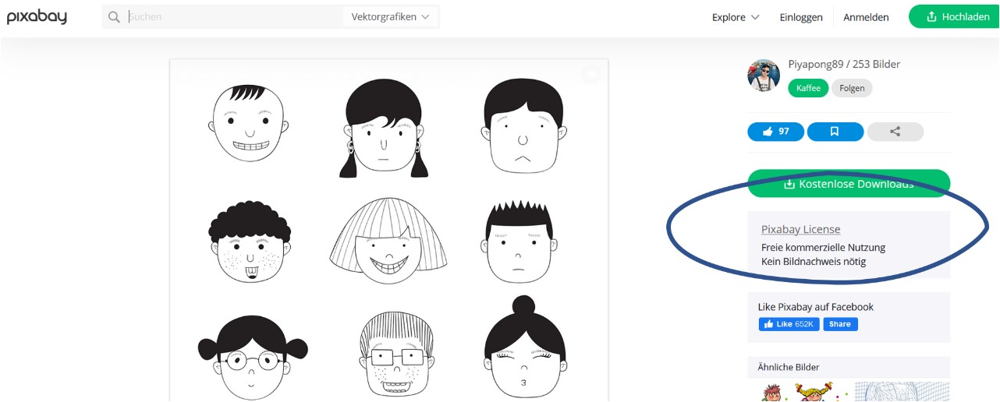</a>
        <figcaption style="text-align:center;font-size:14px;">Abbildung: Screenshot der Pixabay Suchumgebung</figcaption>
      </figure>
      <h4>Flickr</h4> 
      Bei Flickr handelt es sich um ein Bilderportal, auf dem mitunter auch offen lizenzierte Bildmaterialien zur Verfügung gestellt werden. Nachdem Sie Ihren Suchbegriff eingegeben und Ihre Suche gestartet haben, können Sie den Filter "Beliebige Lizenz" nutzen, um CC-lizenzierte Bilder zu finden.
      <a aria-describedby="Link zum Flickr Portal" href="https://www.flickr.com/" target="_blank">https://www.flickr.com/</a>
      <figure style="align:middle;">
        <a href="images/flickr_OER_suche.svg" target="_blank">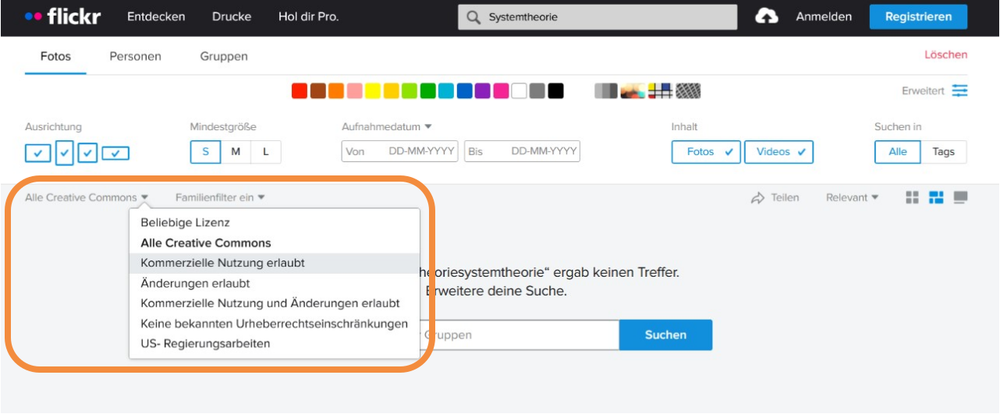</a>
        <figcaption style="text-align:center;font-size:14px;">Abbildung: Screenshot der Flickr Lizenz-Filteroptionen</figcaption>
      </figure>
    

  

 

  
<i class="fa fa-exclamation-triangle" style="color:black"></i> <b>Wichtig!</b>
      
    Unabhängig davon, ob Sie ein OER-Referatorium/-Repositorium oder eine allgemeine Plattform/Suchmaschine nutzen, um Material für Ihre Lehre zu finden, überprüfen Sie in jedem Fall ob die Lizenz des Materiales die von Ihnen geplante Nutzung wirklich erlaubt.
  

<h2 id="korrekteVerwendung">Korrekte Verwendung von OER</h2>

Haben Sie interessante CC-lizenzierte Materialien gefunden, stellt sich die Frage, was Sie bei der Nachnutzung dieser beachten müssen. Der erste Blick sollte hier auf die Lizenz des Materiales gerichtet werden.

<b>Prüfen Sie gründlich, ob die Lizenz die von Ihnen geplante Nutzung des Materiales erlaubt.</b> Folgender Lizenzcheck (s. Abb. 14) soll Ihnen einfach und schnell helfen. Gehen Sie das Diagramm anhand der Leitfragen  durch. Finden Sie die Lizenz des Materiales, das Sie gern nutzen möchten, in der Liste am Ende des Diagramms, steht Ihrer Planung nichts im Wege.

<figure style="align:middle;">
  <a href="images/Lizenzcheck.svg" target="_blank">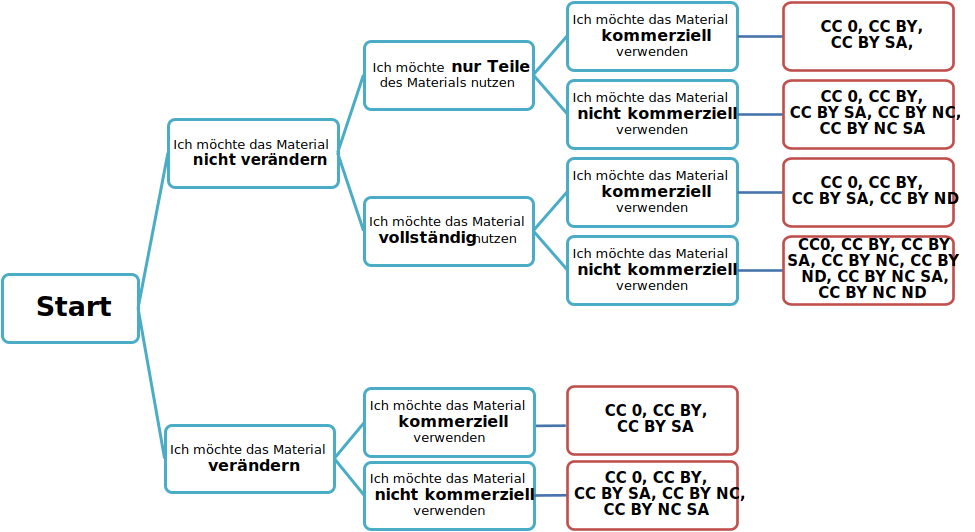</a>
  <figcaption style="text-align:center;font-size:14px;">Abbildung: Lizenzcheck für die Nachnutzung fremder OER</figcaption>
</figure>

<b>Bei der Einbindung von CC-lizenzierten Materialien in Ihre eigenen Werke, müssen Sie kenntlich machen, dass es sich um fremde Inhalte handelt.</b> Analog zur klassischen Zitation im wissenschaftlichen Arbeiten gibt es bei der Nachnutzung von OER bestimmte Vorgaben. In der sogenannten "TULLU-Regel" werden diese für Sie zusammengefasst.  Das folgende Video erklärt Ihnen die Regel in aller Kürze:

<figure>
  <iframe width="560" height="315" src="https://www.youtube.com/embed/aBM9zpuRh1I" title="YouTube video player" frameborder="0" allow="accelerometer; autoplay; clipboard-write; encrypted-media; gyroscope; picture-in-picture" allowfullscreen name="Wie nutzt man OER"></iframe>
  <figcaption style="text-align:center;font-size:14px;">Video 2: <a aria-describedby="Link zum Video (YouTube)" href="https://www.youtube.com/watch?v=aBM9zpuRh1I">Wie nutzt man OER</a> von OERinForm, lizenziert unter <a aria-describedby="Link zur Seite (Creative Commons)" href="https://creativecommons.org/licenses/by-sa/4.0/legalcode">CC BY SA (4.0)</a></figcaption>
</figure>

Die Grundlagen zum Nachlesen:

<table id="invisible">
  <tr>
    <td valign="middle" text-align="middle" width="15%">
      <b>T</b>
    </td>
    <td valign="middle" text-align="left" width="85%">
      Geben Sie den TITEL des Werks an, sofern dieser angegeben ist.
       
      <i class="fa fa-info-circle" style="color:black"></i> In der Version 4.0 der CC-Lizenzen ist der Titel eine optionale (jedoch empfohlene) Angabe.
    </td>
  </tr>
  <tr>
    <td valign="middle" text-align="middle" width="15%">
      <b>U</b>
    </td>
    <td valign="middle" text-align="left" width="85%">
      Nennen Sie den/die <b>URHEBER:IN(NEN)</b>/Rechteinhaber:in(nen). Auch Gruppen, Organisationen oder Institutionen können hier genannt werden. Orientieren Sie sich bei der Angabe daran, wie der:die Urheber:in(nen) in dem Material bezeichnet ist/sind.
    </td>
  </tr>
  <tr>
    <td valign="middle" text-align="middle" width="10%">
      <b>L</b>
    </td>
    <td valign="middle" text-align="left" width="90%">
      Machen Sie eine Angabe zu der <b>LIZENZ</b> und der <b>LIZENZVERSION</b>. Übernehmen Sie diese Angaben genauso, wie an dem Material, das Sie nutzen, angegeben. Hierzu zählt ggf. auch die Angabe, ob es ich um eine an die Gesetzgebung eines Landes angepasste Version der Lizenz handelt.
       
      <i class="fa fa-info-circle" style="color:black"></i> CC-Lizenztexte durchlaufen stetig Revisionsprozesse und werden sukzessive aktualisiert. Aus diesem Grund bestehen unterschiedlichen <b>Lizenzversionen</b> (2.0, 3.0 bzw. 4.0). Durch die Angabe der Lizenzversion machen Sie deutlich, auf welchen Stand des Lizenztextes Sie sich genau beziehen.
    </td>
  </tr>
  <tr>
    <td valign="middle" text-align="middle" width="10%">
      <b>L</b>
    </td>
    <td valign="middle" text-align="left" width="90%">
      Setzen Sie einen <b>LINK</b> zu dem Lizenztext. Sollte eine Verlinkung nicht möglich sein, muss der Link ausgeschrieben werden.
    </td>
  </tr>
  <tr>
    <td valign="middle" text-align="middle" width="10%">
      <b>U</b>
    </td>
    <td valign="middle" text-align="left" width="90%">
      Machen Sie eine Angabe zu dem <b>URSPRUNGSORT</b>, d.h. verlinken Sie z.B. die Internetseite, auf der Sie das Material gefunden haben. Ein solcher Hinweis ermöglicht es Nachnutzer:innen z.B. den Kontext des Originalwerks nachzuvollziehen.
    </td>
  </tr>
  <tr>
    <td valign="middle" text-align="middle" width="10%">
      <b>+B</b>
    </td>
    <td valign="middle" text-align="left" width="90%">
      Haben Sie eine <b>BEARBEITUNG</b> an dem Material vorgenommen, muss dies ebenfalls kenntlich gemacht werden.
    </td>
  </tr>
</table>

Tabelle TULLU+B von twillo, basierend auf  <a aria-describedby="Link zur OER Infoseite, Tullu-Regel" href="https://open-educational-resources.de/oer-tullu-regel/">OER leichtgemacht mit der TULLU-Regel</a> von Jöran Muuß-Merholz und Sonja Borski  für <a aria-describedby="Link zur OER Infoseite" href="http://www.open-educational-resources.de/">OERinfo – Informationsstelle OER</a>, lizenziert unter <a aria-describedby="Link zur Creative Commons Seite" href="http://creativecommons.org/licenses/by/4.0/">CC BY (4.0)</a>.

<b>Ausnahmen und Sonderfälle</b>

  <button class="accordion">Wissenswertes zu der Lizenz <b>CC 0</b></button>
  

    

      Möchten Sie Material nutzen, dass CC 0 freigegeben ist, <b>müssen</b> Sie bei der Nachnutzung <b>nicht</b> darauf hinweisen, dass es sich um Fremdmaterial handelt. Im Sinne der <b>guten wissenschaftlichen Praxis sollten</b> Sie den:die Urheber:(in)nen jedoch nennen.
    

  

  <button class="accordion">Die Besonderheiten des Lizenzmoduls <b>SA</b></button>
  

    

      Das Lizenzmodul <b>SA</b> (Share Alike) verweist auf die Weitergabe unter gleichen Bedingungen. Doch was bedeutet das für die Nutzung von SA-lizenzierten Inhalten in einem eigenen Werk? Hier kommt es darauf an, ob Sie den SA-lizenzierten Inhalt lediglich <b>einbinden</b> oder ihn <b>verändern</b> möchten. Binden Sie ihn (vollständig und unverändert) ein, reicht es aus, den Inhalt als fremdes Material - entlang der TULLU-Regel - kenntlich zu machen. Bearbeiten oder verändern Sie hingegen einen SA-lizenzierten Inhalt, erstellen Sie dadurch quasi ein neues Werk. Dieses neue Werk muss dann unter die gleiche Lizenz gestellt werden, wie das Ausgangsmaterial.
        
      <i class="fa fa-exclamation-triangle" style="color:black"></i> <b>Aber Achtung</b>: Bereits das Entfernen von bestimmten Elementen gilt als Veränderung eines Inhalts. Nutzen Sie z.B. eine SA-lizenzierte Grafik und entfernen nur eine Beschriftung oder ein Icon, muss Ihre Bearbeitung kenntlich gemacht werden und die veränderte Grafik unter die gleiche Lizenz gesetzt werden, wie die ursprüngliche Grafik.
    

  

  <button class="accordion">Die Besonderheiten des Lizenzmoduls <b>ND</b></button>
  

    

      Bei Materialien, die unter einer Lizenz stehen, die das Modul <b>ND</b> (No Derivatives) enthält, ist es Ihnen erlaubt das Werk zu kopieren und weiterzugeben, solange dies <b>vollständig und unverändert</b> geschieht. Sie dürfen ein ND-lizenzierten Text also z.B. ausdrucken oder herunterladen und in Gänze zur Lektüre an eine Lerngruppe weitergeben. Jegliche Veränderung des Werks (auch eine Übersetzung) ist unzulässig.
        
      <b><i class="fa fa-exclamation-triangle" style="color:black"></i> Aber Achtung</b>: Bereits das Entfernen von bestimmten Elementen gilt als Veränderung eines Inhalts.
    

  

  <button class="accordion">Besonderheiten des Lizenzmoduls <b>NC</b></button>
  

    

      Materialien, die unter einer Lizenz stehen, die das Modul <b>NC</b> (Non-Commercial) enthalten dürfen nicht kommerziell genutzt werden. Wichtig ist, dass sich diese Angabe <b>nicht auf die:den Nutzer:in</b>, sondern auf den <b>Zweck der Nutzung</b> bezieht.
        
      Werden Sie z.B. im Rahmen eines Lehrauftrags an einer staatlichen Hochschule dafür bezahlt, eine Lehrveranstaltung für Studierende eines bestimmten Studiengangs durchzuführen, dürfen Sie NC lizenziertes Material in diesem Kontext nutzen. Diese Lehrveranstaltung ist kein kommerzieller Zweck. Sind Sie hingegen Lehrperson in einem zahlungspflichtigen Kontexten (z.B. kostenpflichtige Studiengänge, Trainings oder Weiterbildungsangebote), dürfen Sie NC lizenzierte Materialien nicht nutzen. Möchten Sie einen NC lizenzierten Text z.B. in ein Buch integrieren und es anschließend verkaufen, ist dies nicht erlaubt. Auch ein Werbeflyer für eine private Hochschule oder ein Unternehmen darf keine NC-lizenzierten Materialien enthalten.
    

  

## Alles klar? Überprüfen Sie Ihr Wissen zur Kenntlichmachung von OER in eigenen Werken anhand der folgenden kleinen Übung:

Starten Sie das Quiz und schauen Sie sich die Bilder genau an. Wo wurde das Werk korrekt nach der TULLU-Regel zitiert, wo haben sich Fehler eingeschlichen?

<iframe src="https://wordwall.net/embed/e6f68854c1574b36bcb959a6aed1b082?themeId=1&templateId=5" width="500" height="380" frameborder="0" allowfullscreen></iframe>

  <button class="accordion"><b>Erläuterungen zu den Lösungen</b></button>
  

    <figure style="align:middle;">
      
      <figcaption style="text-align:center;font-size:14px;">Abbildung: Fehlerhafter Lizenzhinweis nach der TULLU-Regel</figcaption>
    </figure>
    

      <b>Fehlerhaft!</b>
        
      In diesem Lizenzhinweis fehlt eine Angabe der <b>Lizenzversion</b>. Außerdem wurde weder ein <b>Link zu dem Lizenztext</b>, noch ein <b>Link zum Ursprungsort</b> der Grafik hinterlegt.
    

    
 
    <figure style="align:middle;">
      
      <figcaption style="text-align:center;font-size:14px;">Abbildung: Korrekter Lizenzhinweis nach der TULLU-Regel</figcaption>
    </figure>
    

      <b>Korrekt!</b>
        
      In diesem Beispiel wurde der Lizenzhinweis korrekt gesetzt. Der <b>Titel</b> der Grafik und der <b>Urheber/Rechteinhaber</b> wurden angegeben. Ein Hinweis auf die <b>Lizenz</b> und die <b>Lizenzversion</b> wurden angegeben und <b>Links zum Lizenztext</b> sowie <b>Ursprungsort</b> gesetzt.
        
      <i class="fa fa-exclamation-triangle" style="color:black"></i> <b>Wichtig!</b> Da es sich in diesem Beispiel um die <b>Version 4.0 der CC BY Lizenz</b> handelt, bei der die <b>Angabe eines Titels optional</b> ist, wäre folgende Angabe ebenfalls möglich:
        
      <b><a aria-describedby="Link zu Twillo" href="http://www.twillo.de/">Grafik</a> von twillo, lizenziert unter <a aria-describedby="Link zur Creative Commons Seite" href="https://creativecommons.org/licenses/by/4.0/legalcode">CC BY (4.0)</a></b>
    

    
 
    <figure style="align:middle;">
      
      <figcaption style="text-align:center;font-size:14px;">Abbildung: Fehlerhafter Lizenzhinweis nach der TULLU-Regel</figcaption>
    </figure>
    

      <b>Fehlerhaft!</b>
        
      In diesem Lizenzhinweis fehlt eine Angabe, um welche <b>Lizenz und Lizenzversion</b> es sich genau handelt. Außerdem fehlt ein <b>Link zu dem Lizenztext</b>.
    

  

 

  
<i class="fa fa-info-circle" style="color:blue"></i>  <b>Info!</b>
      
    Die Anwendungsfälle bei der Nachnutzung von OER sind oftmals sehr individuell. Sollten Sie sich unsicher sein, zögern Sie nicht, die:den Urheber:in anzusprechen oder schreiben Sie eine Mail an <a href= "support.twillo@tib.eu">support.twillo@tib.eu</a>. Die Welt der OER steht für ein kollaboratives Miteinander - wir helfen Ihnen gern.  
     Kennen Sie schon unseren twillo-thursday? Im Rahmen dieser offenen (digitalen) Sprechstunde stehen wir Ihnen immer donnerstags von 11.45-12.30 Uhr mit Rat und Tat zur Seite.  
    Sie finden uns <a aria-describedby="Link zum Big Blue Button Raum für die Sprechstunde" href="https://big.elan-ev.de/b/nor-eye-xhz-6us">hier</a>. Hop in, hop off - eine Anmeldung ist nicht nötig!
  

