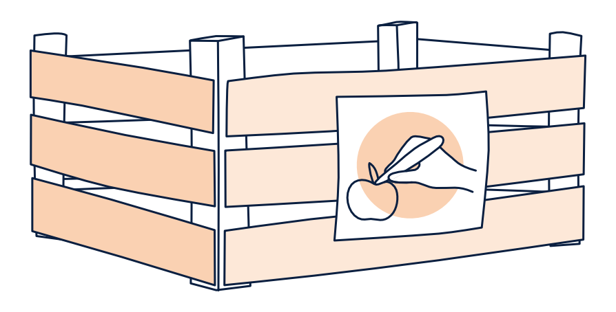
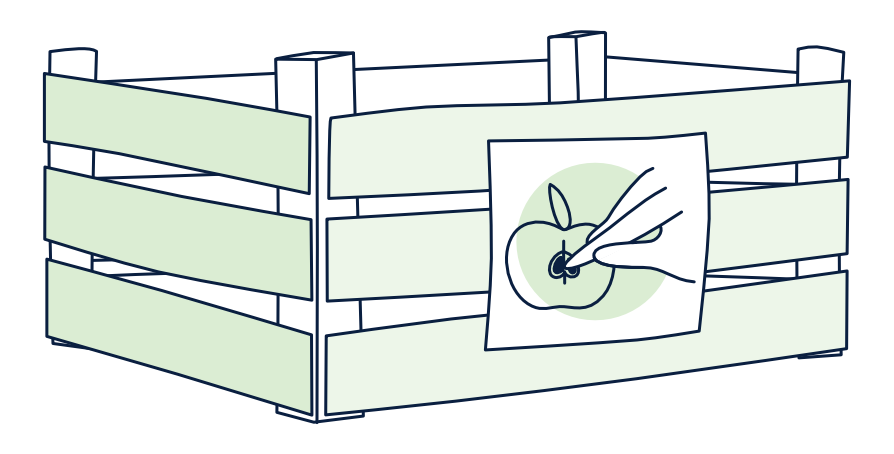
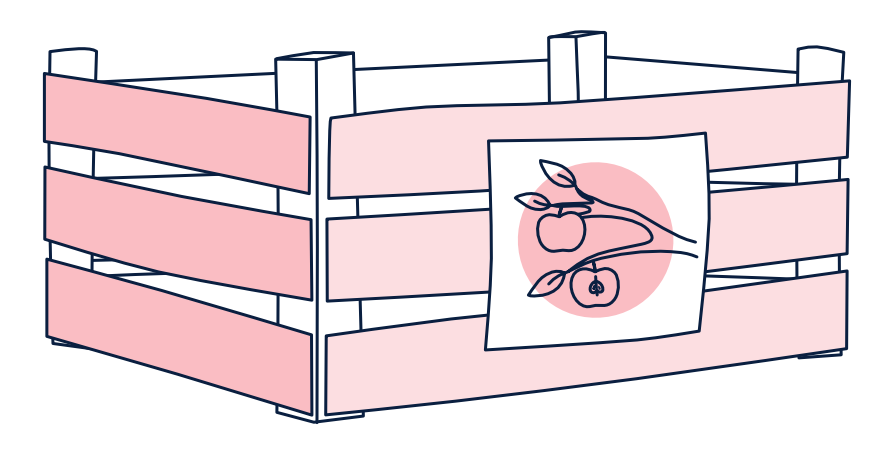
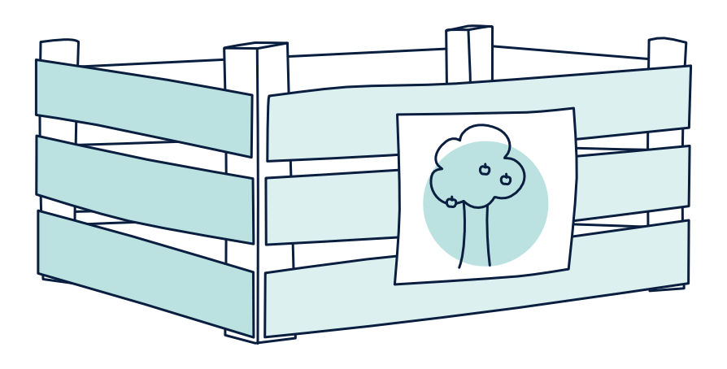
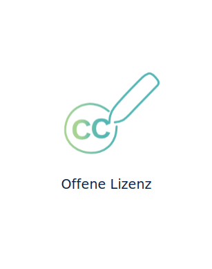
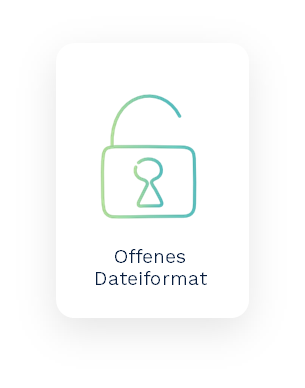

<h1 style="color:#228b22">Schritt 3: Material aufbereiten</h1>
<link rel="stylesheet" href="https://cdnjs.cloudflare.com/ajax/libs/font-awesome/4.7.0/css/font-awesome.min.css">
<link href="/your-path-to-fontawesome/css/all.css" rel="stylesheet">

  
<i class="fa fa-info-circle" style="color:blue"></i>  <b>Info!</b>
      
    Im dritten Schritt werden Sie dabei unterstützt, Materialien, die für Präsenzveranstaltungen entwickelt wurden, didaktisch für ein digitales Setting umzugestalten. Gleichzeitig geht es um die Überführung Ihres Materials in die Form von OER. Einen besonderen Schwerpunkt bilden Fragen der Lizenzierung eigener Materialien mit und ohne die Einbindung von Inhalten Dritter. Ziel dieser Einheit ist es, Ihnen die Aufbereitung eigener Materialien in Form von OER Schritt für Schritt näherzubringen.
  

<h2>1. Didaktische Planung und Strukturierung</h2>

Bei der Erstellung komplexer Lektionen oder Kurse kann ein vorab erstellter Fahrplan behilflich sein. Überlegen Sie sich zunächst, um welche Granularität es sich bei Ihrem OER-Projekt handelt. Skizzieren Sie, was Sie konkret planen und welche Inhalte und Materialien dafür erstellt oder (neu-)aufbereitet werden müssen.
 
<table id="invisible">
  <tr>
    <td valign="middle" text-align="left" width="60%">
      <figure style="float:left;align:middle;">
        
      </figure>
    </td>
    <td valign="left" text-align="left" width="40%">
      Kleinteiliges Lehrmaterial: Erklärvideo, Text, Audio
    </td>
  </tr>
  <tr>
    <td valign="middle" text-align="left" width="60%">
      <figure style="float:left;align:middle;">
        
      </figure>
    </td>
    <td valign="left" text-align="left" width="40%">
      Aufgabenorientierte Materialien: Erklärvideo + Aufgaben, Text + Arbeitsauftrag, Audio + Quiz
    </td>
  </tr>
  <tr>
    <td valign="middle" text-align="left" width="60%">
      <figure style="float:left;align:middle;">
        
      </figure>
    </td>
    <td valign="left" text-align="left" width="40%">
      Lektionen: thematisch geschlossene Einheiten
    </td>
  </tr>
  <tr>
    <td valign="middle" text-align="left" width="60%">
      <figure style="float:left;align:middle;">
        
      </figure>
    </td>
    <td valign="left" text-align="left" width="40%">
      Kurse: Gesamtszenarien
    </td>
  </tr>
</table>

  <button style="background-color:#d1d8e1;color:#0A1F40;font-size:inherit;padding:18px;width:100%;text-align:left;border:none;outline:none;"><b>How To</b></button>
  <button class="accordion">1. Entwickeln Sie einen Fahrplan für Ihr OER-Projekt</button>
  

    

      Ob einen Kurs, eine Lektion, Aufgaben oder kleinteilige Lehrmaterialien; planen Sie, welche Inhalte von den Teilnehmenden wann und wie erlernt werden sollen.
        
      Legen Sie zunächst die Themen der unterschiedlichen Sitzungen/Lerneinheiten fest und formulieren Sie Lernziele. Welche Aspekte machen das Kernwissen aus? Welcher Teil eignet sich um in das Thema einzuführen und welche Inhalte sind für Vertiefungen oder als Exkurse zu behandeln?
        
      Überlegen Sie anschließend, wie die einzelnen Sitzungen/Einheiten jeweils gestaltet sein sollen:
      <ul style="list-style-type:disc">
        <li>Welche Formen von <b>Virtualität</b> werden in einzelnen Phasen gewählt (Präsenzveranstaltung, virtuelle Veranstaltung, e-Learning)?</li>
        <li>Bestehen unterschiedliche Grade der <b>Synchronizität</b> in den jeweiligen Phasen (synchrone Webinare, asynchrone Selbstlernphasen)?</li>
        <li>Welche <b>Methoden</b> (Diskussion, Think-Pair-Share, Gruppenpuzzle) sollen zum Einsatz kommen? Wie kann eine <b>Lernüberprüfung/Ergebnissicherung</b> gestaltet sein?</li>
        <li>In welchen <b>Sozialformen</b> finden die einzelnen Szenarien statt (Plenum, Gruppe, Einzelarbeit)?</li>
        <li>Welche <b>Materialien</b> (Video, Präsentation, Podcast, Arbeitsblatt, Skipt) und/oder <b>Medien</b> sollen in den einzelnen Szenarien zum Einsatz kommen?</li>
      </ul>
       
      

        
<i class="fa fa-lightbulb-o fa-lg"></i>  <b>Hinweis:</b> 
          Das Rad muss bei der Gestaltung eines Lehr-Lernsettings nicht immer neu erfunden werden. Vieles ist bereits erprobt und hat sich in der Lehre bewährt, greifen Sie darauf zurück. Recherchieren Sie, ob bereits offene Materialien von anderen Lehrenden vorliegen. Nutzen Sie die Suchstrategien aus Schritt 2 und planen Sie bereits erprobte Formate, Materialarten und Aufgabenstellungen in Ihr OER-Projekt ein.
        

      

       
      Ordnen Sie Ihre Überlegungen in tabellarischer Form. Als Beispiel können Sie die folgende Tabelle hinzuziehen:
        
      <table>
        <tr>
          <th valign="middle" text-align="center">
            Sitzung/Einheit
          </th>
          <th valign="middle" text-align="center">
            Thema/Inhalt
          </th>
          <th valign="middle" text-align="center">
            Lernziel
          </th>
          <th valign="middle" text-align="center">
            Virtualität
          </th>
          <th valign="middle" text-align="center">
            Methode
          </th>
          <th valign="middle" text-align="center">
            Lernüberprüfung/Ergebnissicherung
          </th>
          <th valign="middle" text-align="center">
            Material
          </th>
        </tr>
        <tr>
          <td>
            Kick-Off
          </td>
          <td valign="top">
            <ul>
              <li>Definition von OER</li>
            </ul>
          </td>
          <td valign="top">
            TN lernen die grundlegenden Merkmale von OER
          </td>
          <td valign="top">
            Webinar
          </td>
          <td valign="top">
            <ul>
              <li>Brainstorming</li>
              <li>Karikatur-Analyse (in Kleingruppen)
            </ul>
          </td>
          <td valign="top">
            <ul>
              <li>Ergebnisdiskussion im Plenum<li>
            </ul>
          </td>
          <td valign="top">
            <ul>
              <li>Präsentation</li>
              <li>Skript</li>
              <li>Arbeitsblatt Karikatur-Analyse</li>
            </ul>
          </td>
        </tr>
        <tr>
          <td>
            OER erkennen
          </td>
          <td valign="top">
            <ul>
              <li>offene Lizenzierung</li>
              <li>Grundlagen des Urheberrechts</li>
            </ul>
          </td>
          <td valign="top">
            TN können OER eindeutig von geschlossenen Bildungsmaterialien abgrenzen
          </td>
          <td valign="top">
            asynchrone Selbstlerneinheit
          </td>
          <td valign="top">
            ...
          </td>
          <td valign="top">
            ...
          </td>
          <td valign="top">
            ...
          </td>
        </tr>
      </table>
       
      

        
<i class="fa fa-lightbulb-o fa-lg"></i>  <b>Hinweis:</b> 
          Für digitale Lehr-Lernsettings gilt es insbesondere zu überlgenen, <b>welche</b> Inhalte und Materialien <b>wie</b> digitalisiert werden und in einen Kurses/eine Lektion als kleinteilige Lehrmaterialien (z.B. Präsentation, Lehrvideo oder Audio) oder aufgabenorientierte Materialien (Arbeitsaufträge, Quizze, etc.) eingebunden werden können.
        

      

       
      Interessante Beispiele und Ideen für digitale Szenarien finden Sie z.B. in folgenden Quellen:
       
      <ul style="list-style-type:disc">
        <li>Hochschuldidaktik der Ruhr-Universität Bochum (o.J.): <a aria-describedby="Link zur Quelle" href="https://dbs-lin.ruhr-uni-bochum.de/lehreladen/e-learning-technik-in-der-lehre/" target="_blank">E-Learning</a></li>
        <li>Universität Hamburg (2021): <a aria-describedby="Link zur Quelle" href="https://www.uni-hamburg.de/elearning/methoden.html" target="_blank">E-Learning Methoden </a></li>
        <li>Hoffmann, Sarah G/Kiehne, Björn (2016): <a aria-describedby="Link zur Quelle" href="http://Ideen für die HochschullehreEin Methodenreader" target="_blank">Ideen für die Hochschullehre - Ein Methodenreader</a></li>
      </ul>
    

  

  <button class="accordion">2. Visualisieren Sie nun Ihr (Gesamt-)Szenario und erstellen Sie eine Übersicht für die Zielgruppe (z. B. Advance Organizer)</button>
  

    

      In diesem Foliensatz finden Sie eine Vorlage für Kurs- und Lektionsformate mit konkreten Beispielen.
        
      

        <a aria-describedby="Vorlage Fahrplan Advance Organizer - PowerPoint Download" href="documents/Vorlage Fahrplan Advance Organizer.pptx">Vorlage Fahrplan Advance Organizer</a>
      

    

  

<h2>2. Transfer in OER</h2>

Unter Berücksichtigung des erstellten Fahrplans werden nun die einzelnen Materialien und interaktiven Inhalte (z.B. Vorbereitung eines webbasierten Whiteboard, Foruminhalte etc.) entlang der Merkmale von OER erstellt bzw. aufbereitet. Hierfür sollten Sie drei wesentliche Aspekte beachten: Die erstellten Bildungsmaterialien, die Sie unter eine offene Lizenz stellen möchten, müssen
<ul>
  <li>frei von urheberrechtlichen Ansprüchen sein,</li>
  <li>für Außenstehende durch eine korrekte Lizenzierung als OER erkennbar sein,</li>
  <li>für eine optimale Nachnutzung in einem möglichst offenen Dateiformat vorliegen.</li>
</ul>
 

  
<i class="fa fa-lightbulb-o fa-lg"></i>  <b>Hinweis:</b> Für die Überführung von Materialien in OER finden Sie hier zwei Unterstützungstools:
     
    <ol>
      <li>Bei der Planung von <b>kleinteiligen Lehrmaterialien</b> kann die <a aria-describedby="OER PLanungshilfe" href="https://tibhannover.gitlab.io/oer/oer-wizard/html/wizard-modal.html">OER-Planungshilfe</a> verwendet werden. Ein Instrument, das Ihnen in wenigen Schritten einen Leitfaden generiert.</li>
      <li>Bei der Erstellung von Kursen bzw. Einheiten können Sie die Vorlage <a aria-describedby="Link zur Vorlage" href="https://sansch.files.wordpress.com/2017/06/mooc-canvas.jpg">MOOC-Canvas</a> von Sandra Schön und Martin Ebner (lizenziert unter <a aria-describedby="Link zur Lizenz" href="https://creativecommons.org/licenses/by/4.0/legalcode">CC BY 4.0</a>) zu Rate ziehen</li>
    </ol>
  

<table id="invisible">
  <tr>
    <td width="20%">
      <figure>
        
        <figcaption style="text-align:center;font-size:14px;">Abb. 34: Offene Lizenz</figcaption>
      </figure>
    </td>
    <td text-align="left" width="80%">
      <h5>Merkmal: Offene Lizenz</h5>
      OER sind freie Bildungsmaterialien, die mit einer offenen Lizenz versehen sind, die Dritten explizit Nutzungsrechte einräumt. Gerade das Lizenzsystem Creative Commons bietet im Bildungskontext viele Vorteile, da die Urheber:innen durch entsprechende Lizenzbausteine differenziert entscheiden können, welche Rechte sie Dritten an ihrem Bildungsmaterial einräumen möchten.
        
      Die Nutzung von OER erfolgt also nicht im „rechtsfreien Raum“. Sie basiert auf rechtsgültigen Verträgen, die allerdings den Vorteil haben, dass sie nicht im Rahmen einer individuellen Transaktion (Vertragsverhandlung, Vertragsschluss), sondern „automatisch“ zustande kommen. Wird gegen die OER-Nutzungsvereinbarung verstoßen, sind die üblichen rechtlichen Möglichkeiten eröffnet, dagegen vorzugehen.
    </td>
  </tr>
  <tr>
    <td width="20%">
      <figure>
        
        <figcaption style="text-align:center;font-size:14px;">Abb. 35: Offenes Dateiformat</figcaption>
      </figure>
    </td>
    <td text-align="left" width="80%">
      <h5>Merkmal Offenes Dateiformat</h5>
      <b>Die Bereitstellung des Materiales in einem möglichst offenen Dateiformat:</b>
        
      Neben dem Merkmal der offenen Lizenzierung, gibt es noch ein weiteres Merkmal, das hier als unspezifisch bezeichnet wird und somit grundlegend für eine einfache Handhabung im Sinne einer OER-Practices von Bedeutung ist. Unspezifisch meint hier, dass der Aspekt offenes Dateiformat nicht zwangsläufig erfüllt sein muss, um als OER zu gelten, es erleichtert jedoch mögliche Bearbeitungen und geringfügige Anpassungen an den Materialien.
        
      Haben Sie sich für eine Lizenz entschieden, die eine Bearbeitung durch andere nicht erlaubt (ND), kann das Merkmal des offenen Dateiformats vernachlässigt werden.
    </td>
  </tr>
</table>
 

  <button style="background-color:#d1d8e1;color:#0A1F40;font-size:inherit;padding:18px;width:100%;text-align:left;border:none;outline:none;"><b>How To</b></button>
  <button class="accordion">1. Eigenes Bildungsmaterial auf Fremdanteile prüfen</button>
  

    

      Gehen Sie Ihre Materialien gründlich durch. Prüfen Sie, welche Inhalte Ihres Materials nicht von Ihnen selbst stammen.
       
      <ul>
        <li><b>Sie haben urheberrechtlich geschütztes Material verwendet?</b> 
          Ist das Material im Rahmen der Zitationsreglungen eingebunden (und korrekt zitiert), kann es im Material verbleiben. Andernfalls müssen Sie die geschützten Inhalte entfernen oder ersetzen.</li>
        <li><b>Sie haben CC-lizenziertes Material verwendet?</b> 
          Prüfen Sie die Nutzungsbedingungen und machen Sie es als fremder Inhalt kenntlich (Lizenzhinweise einfügen nach TULLU)</li>
        <li><b>Es sind Fremdmaterial aus Software enthalten?</b> 
          Wenn Sie verwenden Designelemente oder Templates von Softwareanwendungen/Diensten verwenden, müssen Sie in den Nutzungsbedingungen prüfen, ob Sie die mit der Anwendung erstellten Materialien unter eine CC-Lizenz stellen dürfen</li>
      </ul>
       
      

        

          <i class="fa fa-lightbulb-o fa-lg"></i> <b>Hinweis:</b> 
          Bei der Erstellung von Materialien mit Softwareanwendungen und Diensten ist im Hinblick auf OER besondere Aufmerksamkeit geboten: Werden Elemente (z.B. Designs, Grafiken, Animationen) aus der Software/dem Dienst in einem damit erstellten Werk sichtbar, muss geprüft werden, ob das Werk unter einer CC-Lizenz gestellt werden darf. Oftmals sind die genannten Elemente Eigentum der Software-Anbieter:innen oder deren Lizenzgeber:innen und somit urheber- oder markenrechtlich geschützt. Das heißt, dass ausschließlich die jeweiligen Rechteinhaber:innen - nicht aber die Endnutzer:innen - über eine Weiterlizenzierung entscheden dürfen.
        

      

       
      Als Beispiel möchten wir die Animationssoftware Powtoon heranziehen: Erstellen Sie beispielsweise ein Video mit der Software und verwenden Grafiken oder Animationen, die Ihnen über den Dienst bereitgestellt werden, so dürfen Sie Ihr Video nach dem Export nicht unter eine CC-Lizenz stellen. Die Grafiken und Animationen bleiben Eigentum des Anbieters - Ihnen ist nur die Nutzung, nicht aber die Weiterlizenzierung erlaubt.
        
      Generel sollten Sie bei dem Einsatz von webbasierten Anwendungen darauf achten, dass auch die Zielgruppe für die Sie Inhalte erstellen (Quizze, Abstimmungen, Whiteboards, etc.) keine Registrierungen vornehmen müssen, um auf die Inhalte zugreifen zu können. Prüfen Sie vorab die Konditionen: Sind Registrierungen verpflichtend? Fallen Kosten an?
        
      Nähere Informationen entnehmen Sie bitte den AGB der von Ihnen favorisierten Anwendung oder Dienste. Sind Sie sich bzgl. bestimmter Software unsicher, wenden Sie sich gern an <a aria-describedby="Twillo Kontakt E-Mail Adresse" href="mailto:support.oer-nds@tin.eu">support.oer-nds@tib.eu</a> - wir beraten Sie gern.
    

  

  <button class="accordion">2. Material lizenzieren</button>
  

    

      Überlegen Sie, welche Lizenz zu Ihrem Werk passt. Bringen Sie einen Lizenzhinweis an Ihrem Material an. Beachten Sie dabei die Regeln zur korrekten Lizenzierung eigener Materialien. Der Lizenzhinweis <b>muss</b> mindestens eine Information zu der gewählten <b>Lizenz</b> und der <b>Lizenzversion</b> enthalten. Sollten Inhalte in Ihrem Material enthalten sein, die unter einer anderen Lizenz stehen, weisen Sie unbedingt darauf hin.
        
      Ein ausführlicher Lizenzhinweis (mit <b>Lizenzicon</b>, <b>Urheber:innenangabe</b> und <b>Verlinkung des Lizenztexts</b>) erleichtert Dritten die Nachnutzung Ihrer Materialien und schafft Sicherheit. An folgendem Beispiel für einen ausführlichen Lizenzhinweis können Sie sich bei der Lizenzierung Ihrer eigenen Materialien orientieren.
        
      <table id="invisible">
        <tr>
          <td width="12%">
            
          </td>
          <td valign="middle" text-align="left" width="88%">
            Dieser digitale Leitfaden vom OER-Portal twillo ist - sofern nicht anders an einzelnen Inhalten angegeben - lizenziert unter <a aria-describedby="Link zur Lizenz" href="https://creativecommons.org/licenses/by/4.0/deed.de">CC BY 4.0</a> 
          </td>
        </tr>
      </table>
    

  

  <button class="accordion">3. Ein offenes Dateiformat wählen</button>
  

    

      Überführen Sie Ihre Materialien zum Schluss in offene Dateiformate. Für Einzelmaterialien, die unter eine Lizenz gestellt werden, die eine Bearbeitung zulassen, sollten editierbare Dateiformate (odt, docx, pptx, etc.) gewählt werden. Um mögliche Kompatibilitätsprobleme oder Layoutfehlern entgegen zu wirken, können zusätzlich geschlossene Dateiformate (z.B. PDF) zur Verfügung gestellt werden.
        
      Für die Erstellung von komplexeren Materialien im Lektions- oder Kursformat können  Systeme wie Gitlab, Github oder LiaScript verwendet werden. Hier legen Sie Projekte quelloffen an und gestalten Ihre Lektionen und Kurse webbasiert. Über eine html-Seite können sie öffentlich zugänglich gemacht werden und stehen damit zur Nachnutzung zur Verfügung.
    

  

<h2>FAQ zu möglichen Stolpersteinen bei der Aufbereitung von OER</h2>

  <button class="accordion">Muss ich immer eine Lizenz angeben?</button>
  

    

      Bildungsmaterialien mit einer offen Lizenz stellen ein eindeutiges Indiz für OER dar. Erst durch den Lizenzhinweis können andere Nutzer:innen einschätzen, ob und wie sie die jeweiligen Materialien nutzen dürfen.
    

  

  <button class="accordion">Muss ich wirklich jedes einzelne Material mit einer CC-Lizenz versehen, obwohl mein gesamter Kurs unter einer CC Lizenz steht?</button>
  

    

      Gerade wenn komplexere Bildungsmaterialien (etwa Kurse oder thematisch geschlossene Einheiten) zur Verfügung gestellt werden, ist es sinnvoll die einzelnen Inhalte und Medienobjekte jeweils für sich mit einer Lizenz zu versehen. Dies erleichtert anderen Nutzer:innen den Umgang mit Ihrem Material z.B. wenn nur Teile des Kurses verwenden werden.
    

  

  <button class="accordion">Kann ich fremde Inhalte oder Materialien von der Lizenz, die ich ausgewählt habe, ausnehmen?</button>
  

    

      Ein Gesamtwerk (Handreichung, html-Seite, Video) kann unter eine CC-Lizenz gestellt werden und alle darin CC-lizenzierten Materialien und Inhalte, die nicht von Ihnen stammen, können mit einem Textbaustein ausgeschlossen werden. Dieser Textbaustein könnte wie folgt formuliert werden:
       
      <ul>
        <li>Alle Inhalte dieser Webseite stehen - sofern nicht an einzelnen Materialien und Inhalten vermerkt - unter der Lizenz (Ihre gewählte Lizenz angeben).</li>
        <li>Diese Handreichung steht unter der Lizenz (...). Ausgenommen von der Lizenz sind die verwendeten Logos sowie alle anders gekennzeichneten Elemente.</li>
        <li>Dieser Leitfaden steht unter der Lizenz (...). Ausgenommen von der Lizenz sind die Screenshots und Personenbilder.</li>
      </ul>
    

  

  <button class="accordion">Welche Angaben muss ich beim Lizenzhinweis angeben?</button>
  

    

      Das kommt darauf an, ob es sich um eigene oder fremde Materialien handelt und um <b>welche konkrete Lizenz</b> es geht. Unter Umständen spielt auch die <b>Lizenzversion</b> eine Rolle.
        
      <i class="fa fa-lightbulb-o fa-lg"></i> <b>Was ist was?</b>
        
      <b>Lizenztext:</b> 
      Der Lizenztext macht deutlich, welche Nutzungsbedingungen beim jeweiligen Material gelten und welcher Nutzungsgrad bei der Verwendung zulässig ist.
        
      <b>Lizenzversion:</b> 
      Die unterschiedlichen Versionen (2.0 bzw. 3.0 bzw. 4.0) zeigen die durchlaufenen Revisionsprozesse der CC-Lizenzmodule an.
        
      <b>Lizenzicon:</b> 
      Das Lizenzicon schafft einen Wiedererkennungswert. Auf der Webseite von Creative Commons werden alle gängigen Lizenzicons für Sie bereitgestellt. 
       
      <table id="normal">
        <tr>
          <th width="60%">
            Für Ersteller:innen eines Materials gilt:
          </th>
          <th width="40%">
            Für Nutzer:innen eines fremden Materials gilt:
          </th>
        </tr>
        <tr>
          <td width="60%">
            Bei den eigenen Bildungsmaterials muss in jedem Fall die Lizenz und die Lizenzversion
            angebracht werden. Wenn die Lizenz mit dem Modul <i>Namensnennung</i> gewählt wurde, sollte zusätzlich der eigene Name (und zwar so wie er bei einer Nachnutzung mitgeführt werden soll) angegeben werden (Diese Angaben unterstützen bei der Nachnutzung Ihres Materials).
             
            <ul>
              <li>Lizenz</li>
              <li>Lizenzversion</li>
              <li>BY <i class="fa fa-long-arrow-right"></i> Name, der angeführt werden soll</li>
            </ul>
          </td>
          <td width="40%">
            Wenn Sie Materialien oder Inhalte von anderen Personen nachnutzen, halten Sie sich an die TULLU+V-Regel
             
            <ul>
              <li><b>T</b>itel bei der Lizenzversion 3.0</li>
              <li><b>U</b>rheber:in (Bei Lizenzen mit dem Modul BY)</li>
              <li><b>L</b>izenz und Lizenzversion</li>
              <li><b>L</b>ink zum Lizenztext</li>
              <li><b>U</b>rsprungsort (Link zum Original oder URL der Ursprungsquelle)</li>
              <li><b>V</b>eränderung (sofern gemacht)</li>
            </ul>
          </td>
        </tr>
      </table>
    

  

  <button class="accordion">Was tue ich, wenn ich ein Material verwende, bei dem die Lizenzversion im Lizenzhinweis nicht vorhanden ist?</button>
  

    

      Zu dieser Frage gibt es noch keine Rechtsprechung. Deshalb erfolgt hier die Beantwortung nach allgemeinen Regeln zur Auslegung von Verträgen.
        
      Hat der:die Lizenzgeber:in vergessen, die Lizenzversion anzugeben, ist die Lizenz nicht etwa unwirksam. Sie muss vielmehr ausgelegt werden. Die Bereitstellung eines Werks unter einer Lizenz ist ein Angebot zum Abschluss eines Lizenzvertrags. Ein Angebot ist eine Willenserklärung. Willenserklärungen werden nach §§ 133, 157 BGB aus der Sicht eines objektiven Empfängers ausgelegt. Entscheidend ist, wie der Empfänger (=Lizenznehmer:in) die Erklärung unter Berücksichtigung objektiver Umstände und der Verkehrssitte verstehen darf.
        
      <b>Lizenztext</b>
      <ul>
        <li>Setzt der:die Lizenzgeber:in einen Link zum Lizenztext, dann geht klar aus diesem Link hervor, welche Lizenzversion gemeint ist.</li>
      </ul>
       
      <b>Jahr der Lizenzierung</b> 
      <ul>
        <li>Fehlt ein solcher Link, kann man objektive Umstände zur Auslegung heranziehen. Dabei könnte man <b>auf das Jahr der Lizenzierung abstellen</b>. Bei älteren Lizenzierungen liegt es nah, dass die alte Version 3.0 oder älter gemeint ist - je nachdem, welche Version in welchem Jahr galt. Bei neueren Lizenzierungen ist vermutlich die neue Version gewollt.</li>
        <li>Es ist zu empfehlen bei der:dem <b>Lizenzgeber:in nachzufragen</b>.</li>
      </ul>
       
      <u><b>Fall 1:</b></u> A erstellt eine Grafik und vergisst die Lizenzversion anzugeben. B übernimmt die Grafik. Was folgt rechtlich?
        
      In diesem Fall wäre es seitens des Lizenzgebers (A) treuwidrig, den Lizenznehmer (B) in Anspruch zu nehmen (§ 242 BGB), denn er hat selbst keine Angabe zur Lizenzversion gemacht. Dem Lizenznehmer entstehen also durch die Säumnis des Lizenzgebers keine rechtlichen Nachteile.
         
      <u><b>Fall 2:</b></u> A erstellt eine Grafik und gibt die Lizenzversion an. B übernimmt die Grafik und vergisst die Lizenzversion anzugeben. Was folgt rechtlich?
        
      In diesem Fall kommt der Lizenznehmer (B) seinen Pflichten aus dem Lizenzvertrag nur dann nach, wenn er einen Link zum Lizenztext setzt. Aus dem Lizenztext ist ersichtlich, welche Version gemeint ist.  Hat er dagegen keinen Link zum Lizenztext gesetzt, hat er dadurch seine Pflichten aus dem Lizenzvertrag verletzt. Er hat - nach der neuen Lizenzversion (4.0) - 30 Tage ab Kenntnis des Verstoßes Zeit, seinen Verstoß zu beheben. Nach Ablauf dieser Zeit entfällt die Lizenz automatisch. Entfernt der Lizenznehmer das - nunmehr geschlossen (alle Rechte vorbehalten) geschütztes - Werk dann nicht umgehend aus dem Internet, kann er vom Lizenzgeber abgemahnt und auf Unterlassung verklagt werden. 
    

  

  <button class="accordion">Wie gehe ich mit Zitaten aus urheberrechtlich geschützten Materialien um?</button>
  

    

      Das Rad wird auch im OER-Kontext nicht neu erfunden. Deshalb ist es legitim auf Aussagen und Erkenntnisse anderer innerhalb der Bildungsmaterialien zurückzugreifen und diese durch Zitate einzubinden, sofern eine deutliche Auseinandersetzung mit dem zitierten Inhalt erfolgt. Hierbei sollten - wie in der gängigen Wissenschaftspraxis auch - auf Regeln beim Referenzieren beachtet werden.
        
      <b>Umgang mit Zitaten</b>
       
      Aussagen oder Bezugnahmen auf andere Quellen sind erlaubt, wenn sie zweckgemäß zum Einsatz kommen (keine Dekorationszwecke). Wenn die Zitatschranke des § 51 UrhG greift, müssen Sie keinen Hinweis zum copyright geschützten Material in den Lizenztext aufnehmen. Das Zitatrecht stellt eine gesetzliche Lizenz dar, die vertraglichen Lizenzen (z.B. CC-Lizenzen) vorgeht. Analog zur wissenschaftlichen Praxis müssen folgende Kriterien vorliegen:
       
      <ul>
        <li>der Zitatzweck liegt vor (inhaltlicher Zusammenhang)</li>
        <li>der Umfang des Zitats ist durch den Zweck gerechtfertigt (Umfang des zitierten Werks ist nicht unangemessen groß)</li>
        <li>die Quelle ist angegeben, § 63 UrhG (mind. Name des Urhebers und die Fundstelle)</li>
        <li>das fremde Werk/die fremden Werkteile wurden nicht verändert, § 62 UrhG (Kürzungen bei umfangreichen Werken, kleinere Änderungen der Satzstruktur sind erlaubt, müssen aber kenntlich gemacht werden!)</li>
      </ul>
    

  

  <button class="accordion">Was ist unter offene Dateiformate zu verstehen?</button>
  

    

      Wenn offene Bildungsmaterialen in offenen Dateiformaten bereitgestellt werden, lassen sie sich niedrigschwellig bearbeiten. Beispielsweise kann dies bedeuten, dass bei Textdokumenten das Format DOCX dem Format PDF vorzuziehen ist (Editierbarkeit), während das Format ODT Vorteile gegenüber dem Format DOC besitzt (Offener Standard). Möglich ist es auch, Bildungsmaterialien in mehreren Dateiformaten bereitzustellen. Dies bietet sich auch an, wenn Kompatibilitätsprobleme zu befürchten sind. So etwa kann ein Arbeitsblatt im ODT-Format bereitgestellt werden, um die Editierbarkeit zu gewährleisten und zusätzlich im PDF Format, um das Layout auch in verschiedenen Systemen oder Anwendungen zu erhalten.
    

  

  <button class="accordion">Ich stelle ein Lehrvideo zur Verfügung. Was gilt hier als offenes Dateiformat?</button>
  

    

      Wählen Sie einfach eins der gängigen Videoformate aus. MP4-Dateien lassen sich z.B. gut auf kostenlosen Playern abspielen und können in vielen Videobearbeitungsprogrammen verändern. Auch die seperate Bearbeitung der Video und Audiospur ist möglich.
    

  

  <button class="accordion">In meinem Material befinden sich Design-Elemente einer (kostenpflichtigen) Software. Darf ich das Material nun unter eine CC-Lizenz stellen?</button>
  

    

      Elemente (Grafiken, Sounds, Animationen, Designs etc.) aus Software und Diensten sind in der Regel Eigentum der Anbieter:innen und/oder deren Lizenzgeber:innen. Sie sind von daher ggf. urheberrechtlich geschützt. Die Anbieter:innen gewähren ihren Nutzer:innen lediglich bestimmte Nutzungsrechte, die sich je nach (gebuchtem) Tarif unterscheiden. Eine CC-Lizenzierung von Werken, die Elemente der Dienste enthalten, ist oftmals nicht zulässig. Informationen erhalten Sie in der Regel in den Nutzungsbedingungen der jeweiligen Dienste oder Anwendungen. Wenden Sie sich im Zweifelsfalls an den Support der Anbieter:innen oder schreiben Sie uns <a aria-describedby="Twillo Kontakt E-Mail Adresse" href="mailto:support.oer-nds@tin.eu">support.oer-nds@tib.eu</a>.
    

  

