<h2>LiaScript Workflow mit Atom</h2>
<link rel="stylesheet" href="https://cdnjs.cloudflare.com/ajax/libs/font-awesome/4.7.0/css/font-awesome.min.css">

  <button class="accordion">1. Getting Started: Installation</button>
  

    

      Um Ihnen den Umgang mit LiaScript so leicht wie möglich zu machen, empfehlen wir Ihnen den Texteditor <b>Atom</b> in Verbindung mit einem LiaScript Plugin zu nutzen. Auf diese Weise können Sie Ihre Kursstruktur auf dem Desktop erstellen, eine Vorschau ansehen und den Kurs erst dann öffentlich zugänglich machen, wenn Sie damit zufrieden sind.
       
      <h6>Atom installieren:</h6>
      Besuchen Sie die Seite <a aria-describedby="Link zum Atom-Download" href="https://atom.io/" target="_blank">https://atom.io/</a>, laden Sie Atom herunter und führen Sie die Installation aus. 
       
      <h6>LiaScript Plugin installieren:</h6>
      Öffnen Sie Atom und wählen Sie in der Menüleiste oben unter <b>File</b> den Reiter <b>Settings</b>.
        
      <figure style="align:middle;">
        <a href="images/file_settings.svg" target="_blank">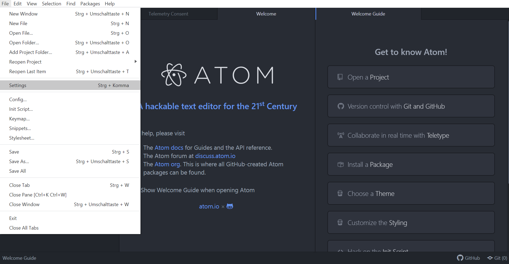</a>
        <figcaption style="text-align:center;font-size:14px;">Abbildung: Screenshot der Atom Einstellungen</figcaption>
      </figure>
       
      In dem folgenden Fenster wählen Sie die Option <b>+Install</b> aus und geben Sie <b>liascript-preview</b> in das Suchfeld ein. Erscheint das Plugin in den Suchergebnissen, so starten Sie die Installation mit einem Klick auf den Button <b>install</b>.
        
      <figure style="align:middle;">
        <a href="images/install_plugin.svg" target="_blank">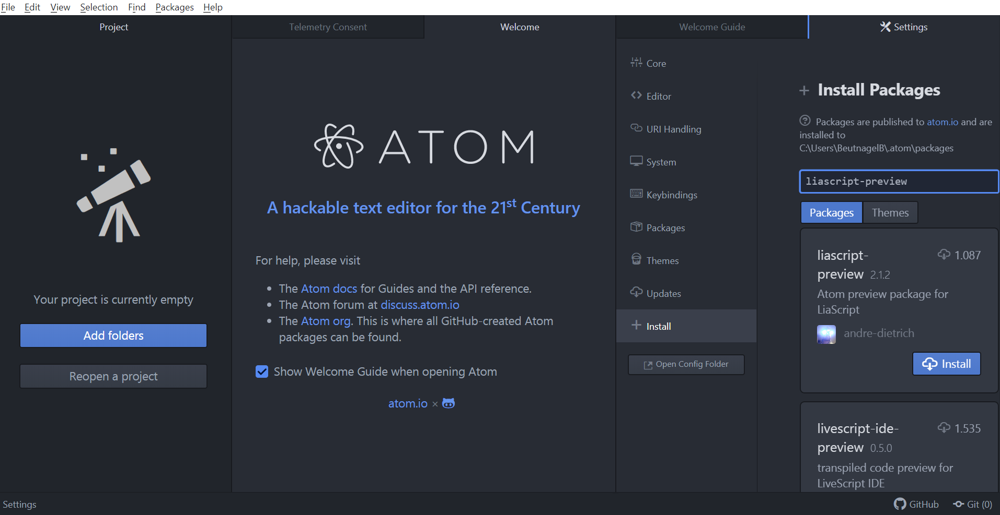</a>
        <figcaption style="text-align:center;font-size:14px;">Abbildung: Screenshot der Installation des LiaScript-Plugins in Atom</figcaption>
      </figure>
    

  

  <button class="accordion">2. Lernmodul (Kursdokument) anlegen</button>
  

    

      Um ein neues Lernmodul anzulegen, öffnen Sie den Reiter <b>File</b> und wählen Sie <b>New file</b> aus <b>oder</b> drücken Sie die Tastenkombination Strg und N. Auf der rechten Seite der Atom Umgebung öffnet sich nun ein Eingabefeld.  Hier geben Sie eine Überschrift zu Ihrem Lernmodul ein. <b>Wichtig:</b> Da in der Anwendung mit Markdown gearbeitet werden muss, vergessen Sie bitte nicht einen Hashtag vor Ihre Überschrift zu setzen. Beispiel: <b># Mein LiaScript Kurs</b>. Speichern Sie das Dokument anschließend unter <b>File</b> und <b>Save</b> oder durch die Tastenkombination <b>Strg und S</b>. Es öffnet sich ein Fenster mit dem Sie einen Dateinamen bestimmen und einen Speicherort für das Dokument auswählen können.
      <figure style="align:middle;">
        <a href="images/new_file.svg" target="_blank">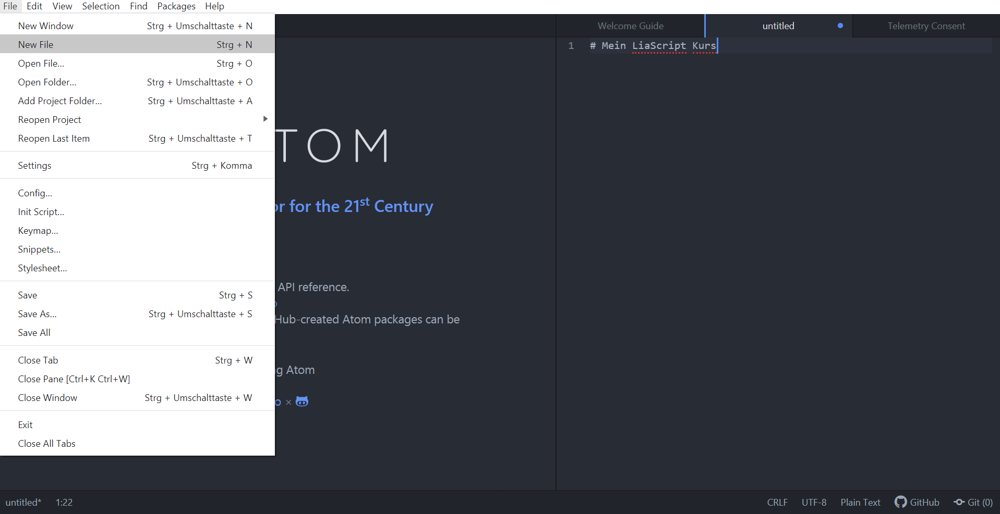</a>
        <figcaption style="text-align:center;font-size:14px;">Abbildung: Screenshot Erstellung eines Dokuments in Atom</figcaption>
      </figure>
       
      Aktivieren Sie nun das LiaScript Plugin. Wählen Sie unter <b>Packages</b> im Kopfmenü den Reiter <b>liascript-preview</b> und dann <b>Toggle</b>. Rechts neben dem Eingabefeld erscheint nun eine Vorschau Ihres Kurses. Bei jedem Speichern (<b>File</b> und <b>Save</b> im Kopfmenü oder Tastenkombination Strg und S) aktualisiert sich die Vorschau automatisch. Um die Ansicht zu vergrößern, können Sie die <b>Welcome-Registerkarte</b> schließen.
      <figure style="align:middle;">
        <a href="images/toggle_preview.svg" target="_blank">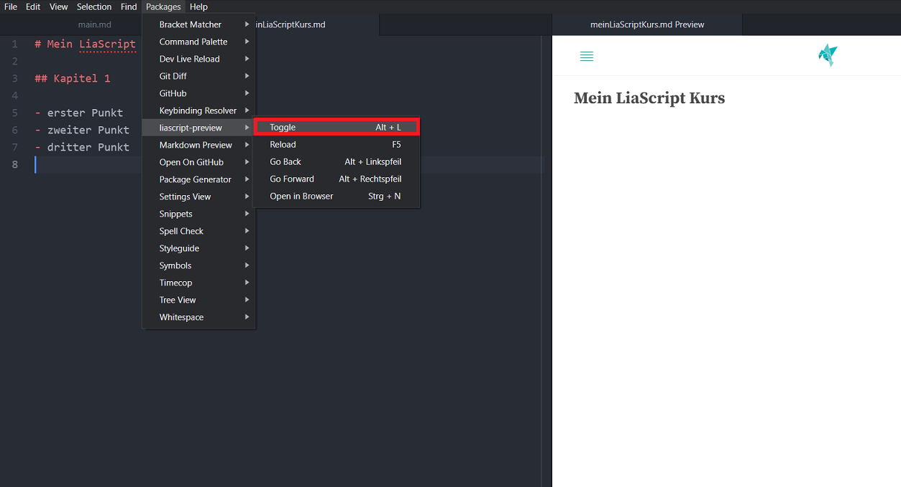</a>
        <figcaption style="text-align:center;font-size:14px;">Abbildung: Screenshot LiaScript Vorschau in Atom</figcaption>
      </figure>
    

  

  <button class="accordion">3. Kurs strukturieren, Inhalte einfügen</button>
  

    

      Ist Ihr Lernmodul/Kursdokument angelegt, können Sie beginnen, Inhalte und Materialien einzufügen. Hierfür müssen Sie auf <b>Markdown</b> zurückgreifen. Sie haben noch keine Erfahrungen mit der Auszeichnungssprache gesammelt? Keine Sorge! "Auszeichnungssprache" klingt schlimmer als es ist, Sie müssen hier <b>keine</b> Programmiersprache o.Ä. erlernen. Im folgenden führen wir Sie durch die Gestaltung Ihres Kurses mit Markdown - Sie werden sehen, es ist nicht schwer.
        
      <h6>Anlegen von Kapiteln:</h6>
      Zur Strukturierung Ihres Kurses in Kapitel und Unterkapitel legen Sie Überschriften und Unterüberschriften an. In Markdown wird eine Hauptüberschrift mit einem Hashtag, eine Überschrift zweiter Ordnung mit zwei Hashtags usw. gekennzeichnet. Hier ein kleines Beispiel, wie man Überschriften hinzufügt:
      <figure style="align:middle;">
        <a href="images/lia_beispiel_unterueberschrift.svg" target="_blank">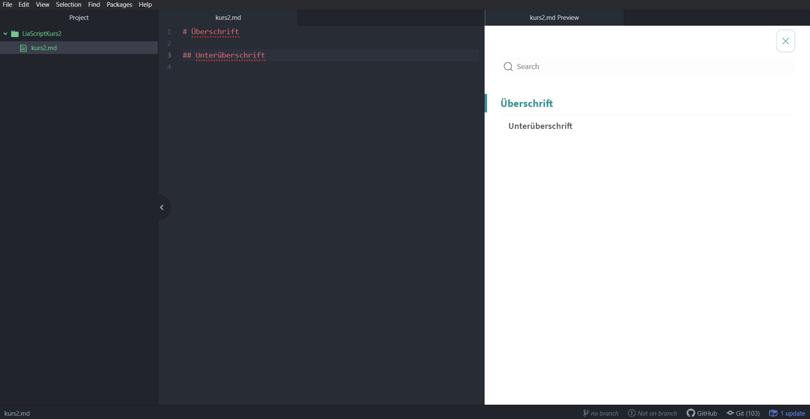</a>
        <figcaption style="text-align:center;font-size:14px;">Abbildung: Anlage von Kapiteln und Unterkapiteln für Ihren LiaScript Kurs</figcaption>
      </figure>
       
      <h6>Hinzufügen und Formatieren von Texten:</h6>
      Schreiben Sie Texte und Anweisungen einfach direkt unter die Überschrift, unter der Sie sie platzieren möchten. Die Formatierung von Texten können Sie durch Markdown-Syntax im Prinzip des Copy und Paste vornehmen. LiaScript sorgt automatisch für ein ansprechendes Layout. Speichern Sie Ihre Eingabe, so können Sie das Aussehen Ihrer Eingabe in der LiaScript Vorschau überprüfen.
        
      Hier ein paar einfache Beispiele zur Formatierung von Texten:
      <ul style="list-style-type:disc">
        <li>Sie möchten ein Wort fett setzen? Zeichnen Sie es wie folgt aus **Beispiel** oder __Beispiel__</li>
        <li>Sie möchten ein Wort kursiv setzen? Zeichnen Sie es wie folgt aus: *Beispiel* oder _Beispiel_</li>
        <li>Sie möchten einen Link einfügen? Zeichnen Sie ihn wie folgt aus: [Linktext](Link)</li>
        <li>Sie möchten eine Liste einfügen? Zeichnen Sie die Aufzählung wie folgt aus:</li>
      </ul>    
      <figure style="align:middle;">
        <a href="images/lia_beispiel_liste.svg" target="_blank">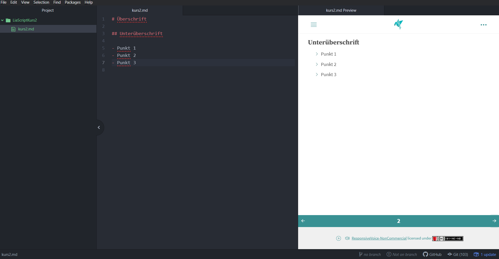</a>
        <figcaption style="text-align:center;font-size:14px;">Abbildung: Screenshot Anlegen einer Liste in Markdown</figcaption>
      </figure>
      

        

          <i class="fa fa-lightbulb-o fa-lg"></i> <b>Hinweis:</b> Einen Überblick über die wichtigste Markdown-Syntax zum Kopieren und Einfügen finden Sie hier:
          <ul style="list-style-type:disc">
            <li><a aria-describedby="Link zum Markdown Cheat Sheet" href="https://github.com/adam-p/markdown-here/wiki/Markdown-Cheatsheet">Markdown Cheatcheat</a> von Adam Pritchard, lizenziert unter <a aria-describedby="Link zur Quelle" href="https://creativecommons.org/licenses/by/3.0/legalcode">CC BY (3.0, unported)</a></li>
            <li><a aria-describedby="Link zum Markdown Guide" href="https://www.markdownguide.org/">Markdown Guide</a> von Matt Cone, lizenziert unter <a aria-describedby="Link zur Quelle" href="https://creativecommons.org/licenses/by-sa/4.0/">CC BY-SA 4.0</a></li>
          </ul>
        

      

       
      <h6>Hinzufügen weiterer Elemente:</h6>
      LiaScript ist insbesondere dafür geeignet, interaktive Lernobjekte in Ihre Kursstruktur zu integrieren. <b>Kopieren Sie die Syntax, die Sie dafür benötigen aus dem digitalen <a aria-describedby="Link zu LiaScript Handbuch" href="https://liascript.github.io/course/?https://raw.githubusercontent.com/liaScript/docs/master/README.md#1">LiaScript Handbuch</a> von André Dietrich, Sebastian Zug, Karl Fessel und Steve Rehm</b>. Das Handbuch ist explizit dafür vorgesehen, Ihnen bei der Integration von Elementen in LiaScript zu helfen.
        
      Hier ein Beispiel, in dem eine Quizfrage (mit Hinweisen + Erklärung) nach Vorgabe des Handbuchs erstellt werden kann.
      <figure style="align:middle;">
        <a href="images/lia_beispiel_quiz.svg" target="_blank">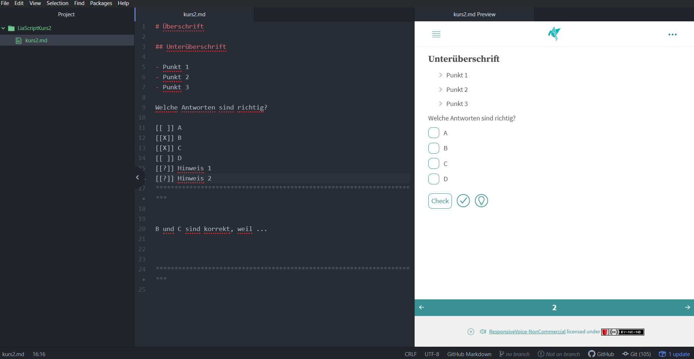</a>
        <figcaption style="text-align:center;font-size:14px;">Abbildung: Screenshot Erstellung eines Quiz mit LiaScript</figcaption>
      </figure>
      

        

          <i class="fa fa-lightbulb-o fa-lg"></i> <b>Hinweis:</b> Neben interaktiven Lernobjekten wie Quizfragen bietet LiaScript noch viele weitere Features an, um Ihren Kurs individuell zu gestalten. In dem sich ständig erweiternden <a aria-describedby="Link zu LiaScript Handbuch" href="https://liascript.github.io/course/?https://raw.githubusercontent.com/liaScript/docs/master/README.md#1">LiaScript Handbuch</a> finden Sie alle zur Verfügung stehenden Features mit Erklärungen, wie Sie diese in Ihren Kurs integrieren können.
        

      

    

  

  <button class="accordion">4. Verbindung zu GitHub herstellen</button>
  

    

      Bisher ist Ihr Kurs nur lokal gespeichert, liegt also auf Ihrem Computer. Um Ihren LiaScript Kurs nun auch im Internet öffentlich bereitzustellen zu können, empfehlen wir Ihnen die Plattform <b>GitHub</b>. Hier können Sie Ihren erstellten Kurs <b>kostenfrei</b> ablegen, um anschließend mit LiaScript einen Link zu Ihrem Kurs zu generieren.
             
      <h6>GitHub Anmeldung</h6>
      Zuallererst müssen Sie sich dafür einen GitHub Account erstellen. Besuchen Sie hierfür die Seite www.github.com und klicken Sie oben rechts auf <b>Sign Up</b>.
        
      In dem folgenden Fenster tragen Sie einen <b>Usernamen</b>, ihre <b>E-Mail</b> und ein <b>Passwort</b> ein. Mit einem Klick auf den Button <b>Create Account</b> erstellen Sie sich Ihren eigenen Account.
        
      Zum Abschluss müssen Sie nun lediglich noch Ihre E-Mail-Adresse <b>verifizieren</b>. Dafür erhalten Sie eine E-Mail von GitHub mit dem Betreff <b>[GitHub] Please verify your email address</b>. Dort klicken Sie auf den Button <b>Verify email address</b>. Nun werden Sie auf eine Seite geführt, die die Verifizierung Ihres Accounts bestätigt.
      <figure style="align:middle;">
        
        <figcaption style="text-align:center;font-size:14px;">Abbildung: Screenshot GitHub Verified Email Address</figcaption>
      </figure>
           
      <h6>Verknüpfung von GitHub mit Atom</h6>
      Atom stellt ein Bindeglied zwischen LiaScript und GitHub dar. Mit einer Verbindung von Atom mit GitHub wird Ihnen die Möglichkeit gegeben, Inhalte durch Atom in Ihren Kurs  einzubinden und über GitHub zu veröffentlichen. D.h. durch das LiaScript Plugin und die Verbindung mit GitHub wird Atom zu einem Werkzeug, mit dem Sie einerseits Ihren Kurs  gestalten können während Sie eine Vorschau erhalten und andererseits auch eine Veröffentlichung im Internet vornehmen können.
        
      Öffnen Sie Atom. Das Git-Package ist hier vorinstalliert, sodass es einfach direkt über die Reiter <b>packages → GitHub → Toggle GitHub</b> ausgewählt werden kann. Wählen Sie zunächst <b>Toggle GitHub</b> aus.
      <figure style="align:middle;">
        <a href="images/screenshotToggleGitHub.svg" target="_blank">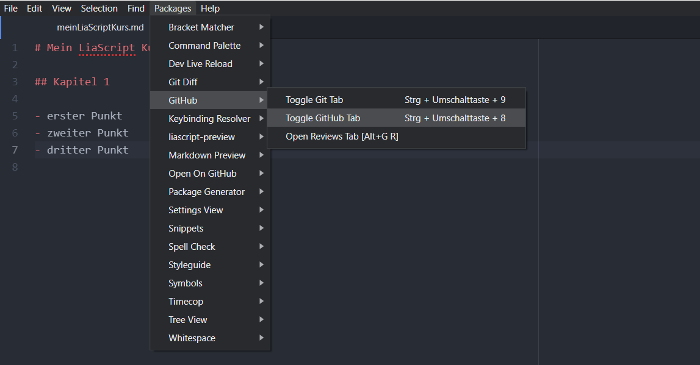</a>
        <figcaption style="text-align:center;font-size:14px;">Abbildung: Screenshot der Verknüpfung von GitHub</figcaption>
      </figure>
       
      Nun öffnet sich der Reiter <b>GitHub</b>. Klicken Sie auf den angezeigten Link, um ein <b>Token</b> (also quasi einen Authentifizierungscode) zu generieren, welches Ihren GitHub Account mit Atom verknüpft. Geben Sie das Token in das dafür vorgesehene Feld ein.
      <figure style="align:middle;">
        <a href="images/connectToGitHub.svg" target="_blank">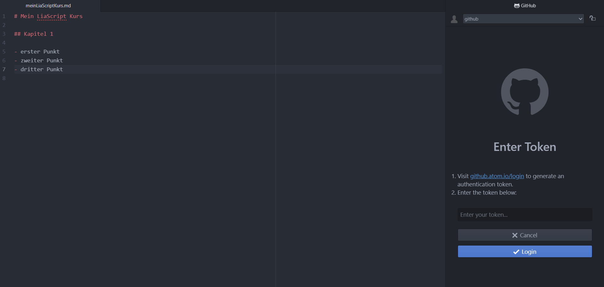</a>
        <figcaption style="text-align:center;font-size:14px;">Abbildung: Screenshot Generierung eines Tokens</figcaption>
      </figure>
      <figure style="align:middle;">
        <a href="images/atom_auth.svg" target="_blank">Abbildung: Screenshot Authorisieren von GitHub in Atom" title=">Abbildung: Screenshot Authorisieren von GitHub in Atom"/></a>
        <figcaption style="text-align:center;font-size:14px;">Abbildung: Screenshot Authorisieren von GitHub in Atom</figcaption>
      </figure>
      <figure style="align:middle;">
        <a href="images/generateToken.svg" target="_blank">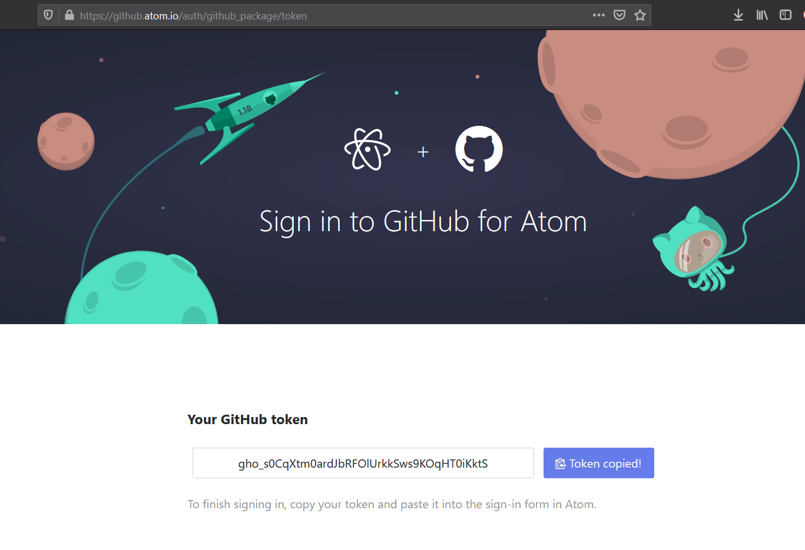</a>
        <figcaption style="text-align:center;font-size:14px;">Abbildung: Screenshot Eingabe des GitHub-Token</figcaption>
      </figure>
    

  

  <button class="accordion">5. Ablageort für Ihren Kurs im Internet anlegen</button>
  

    

      In dem Reiter <b>GitHub</b> in Atom können Sie nun durch Klicken auf <b>initialize and publish on GitHub</b> ein neues Repository für Ihren Kurs anlegen. Ein Repository ist der Ablageort für ihre Kursdateien auf Git im Internet.
      <figure style="align:middle;">
        <a href="images/createRepository.svg" target="_blank">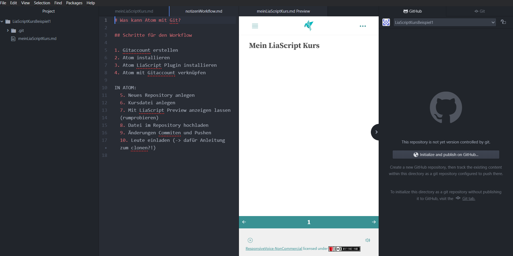</a>
        <figcaption style="text-align:center;font-size:14px;">Abbildung: Repository anlegen</figcaption>
      </figure>
      Nach dem Anlegen des Repositorys müssen über Atom noch zwei kleine Schritte getätigt werden (<b>commit</b> und <b>push</b>), um auch Ihre Kursdatei erfolgreich im Repository abzulegen.
        
      Was hat es mit diesen Schritten auf sich? Wenn Sie in Atom an Ihrem Kurs arbeiten und die Änderungen <b>speichern</b>, ändern Sie nur das Kursdokument, das lokal auf Ihrem Computer abgelegt ist. Mit <b>commit</b> informieren Sie quasi den Dienst GitHub über die Änderungen und weisen an, dass auch Git die Änderungen übernehmen soll. Mit <b>push</b> setzen Sie die Änderungen dann öffentlich.
        
      Um die Schritte <b>commit</b> und <b>push</b> das erste Mal auszuführen, wechseln Sie in Atom zunächst in den Reiter <b>Git</b> (direkt neben dem Reiter GitHub).
         
      Hier müssten Sie, wie in Abb. 45 erkennbar, Ihre Kursdatei unter dem Reiter <b>Unstaged Changes</b> sehen. Klicken Sie nun zuerst auf den Button <b>Stage All</b>, den Sie an der rechten Seite finden.
      <figure style="align:middle;">
        <a href="images/atom_git_stage.svg" target="_blank">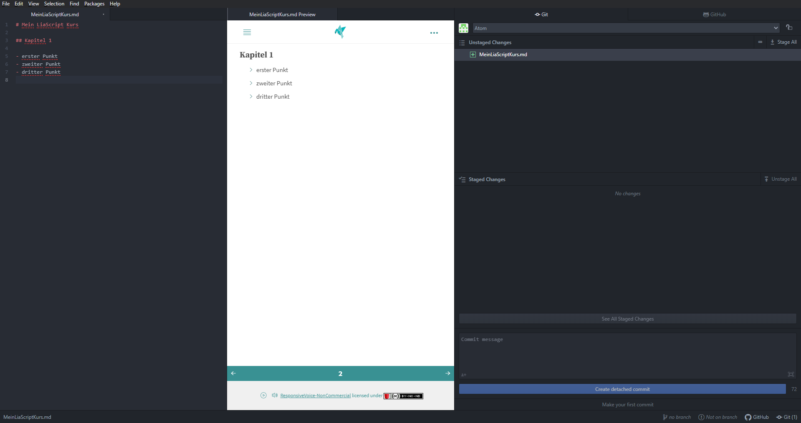</a>
        <figcaption style="text-align:center;font-size:14px;">Abbildung: Screenshot Ablage der Kursdatei unter Unstaged Changes</figcaption>
      </figure>
      Nach der Wahl des Buttons <b>Stage All</b> wechselt Ihre Datei weiter unten in den Bereich <b>Staged Changes</b> (vgl. Abb. 46). Schreiben Sie als Nächstes einen <b>kleinen Kommentar</b> ins untere Textfeld, mit dem Sie den Commit beschreiben (z.B. Neuerungen, Veränderungen, Korrekturen). Klicken Sie anschließend auf <b>Create detached commit</b> (bzw. <b>Commit to branch</b>), um den Commit fertig zu stellen.
      <figure style="align:middle;">
        <a href="images/atom_git_stage2.svg" target="_blank">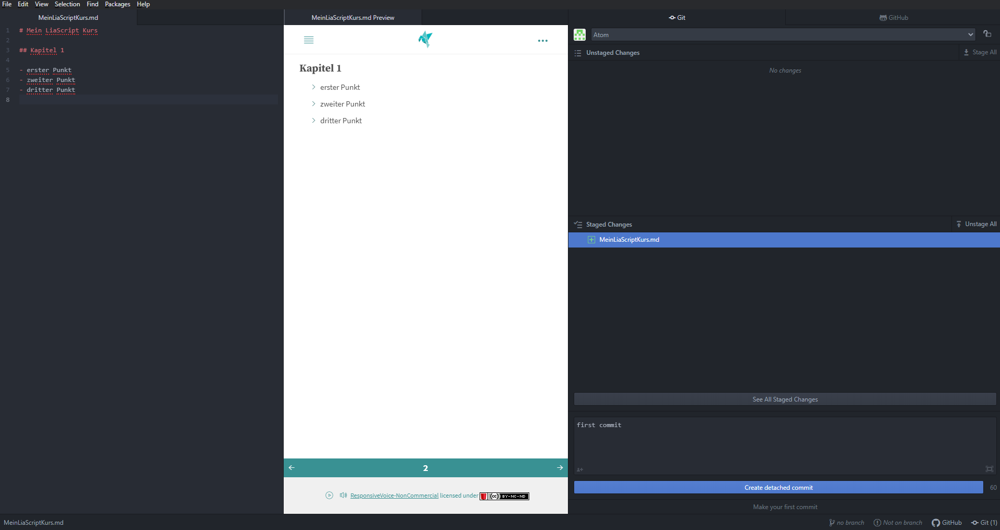</a>
        <figcaption style="text-align:center;font-size:14px;">Abbildung: Screenshot Anzeige der Kursdatei unter Staged Changes</figcaption>
      </figure>
        Nun können Sie unten in der Fußleiste auf <b>Push</b> klicken, um all Ihre Änderungen mit Ihrem Repository zu synchronisieren - ergo, sie im Netz sichtbar zu machen.
      <figure style="align:middle;">
        <a href="images/atom_git_push.svg" target="_blank">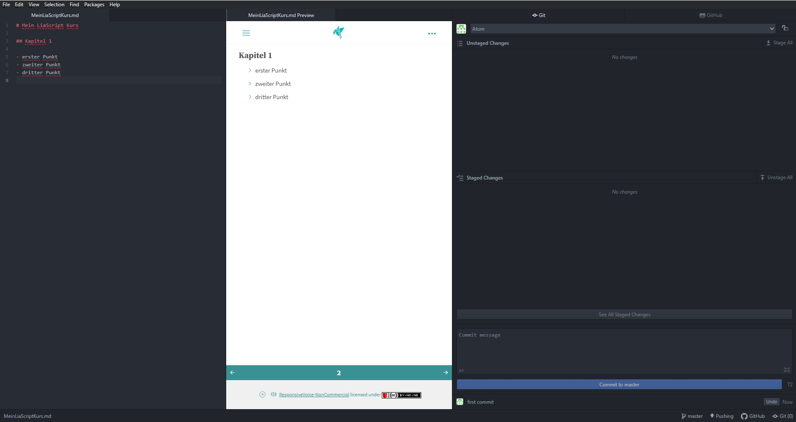</a>
        <figcaption style="text-align:center;font-size:14px;">Abbildung: Screenshot Pushen der Änderungen</figcaption>
      </figure>
    Überprüfen Sie, ob alles geklappt hat, indem Sie im Browser Ihr GitHub Profil aufrufen und dort Ihren Kurs auswählen. Hier sollte Ihr Repository nun wie folgt aussehen.
      <figure style="align:middle;">
        
        <figcaption style="text-align:center;font-size:14px;">Abbildung: Screenshot Anzeige Ihres Repositories auf GitHub</figcaption>
      </figure>
    

  

  <button class="accordion">6. Kursinhalte ändern oder weiterbearbeiten</button>
  

    

      Das schwierigste haben Sie geschafft! Wenn Sie Ihren Kurs nun weiter bearbeiten, aktualisieren oder generell verändern wollen, können Sie dies bequem in Atom tun. Wenn Sie Ihren Kurs in Atom öffnen, klicken Sie bitte jedes Mal bevor sie etwas ändern auf <b>fetch</b> (rechts unten in der Ecke). Hierdurch wird sichergestellt, dass Sie immer mit der neuesten Version Ihres Kurses weiterarbeiten.
      <figure style="align:middle;">
        <a href="images/atom_fetch.svg" target="_blank">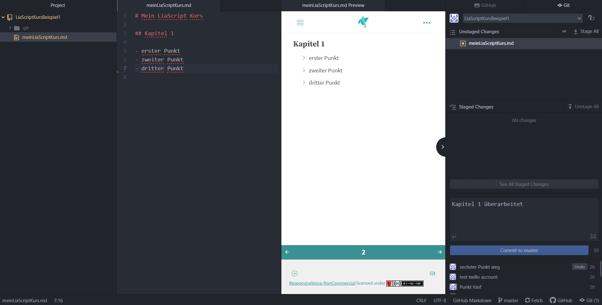</a>
        <figcaption style="text-align:center;font-size:14px;">Abbildung: Screenshot Funktion Fetch</figcaption>
      </figure>
      Haben Sie eine Änderung vorgenommen und gespeichert, wird Ihnen diese zunächst in der LiaScript-Vorschau angezeigt. Sind Sie zufrieden mit dem Ergebnis und möchten die Änderung in den Kurs übernehmen, müssen Sie erneut die Schritte <b>commit</b> und <b>push</b> ausführen. Gehen Sie hierbei wie folgt vor:
        
      1. <b>Fetch</b> anklicken: Um Komplikationen mit verschiedenen Versionen zu vermeiden, sollten Sie dies an dieser Stelle immer noch einmal tun.
        
      2. Die Änderung sollte im Reiter <b>Git</b> nun bereits im Bereich <b>Unstaged Changes</b> angezeigt werden. Überführen Sie alle Änderungen in den Bereich <b>Staged changes</b>, indem Sie <b>Stage all</b> anklicken.
      <figure style="align:middle;">
        <a href="images/atom_stage3.svg" target="_blank">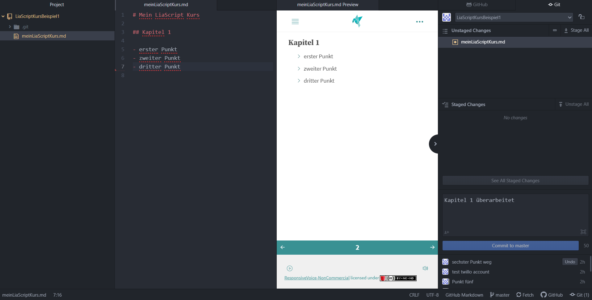</a>
        <figcaption style="text-align:center;font-size:14px;">Abbildung: Screenshot Unstaged Changes in Staged Changes überführen</figcaption>
      </figure>
      3. Schreiben Sie erneut einen kleinen Kommentar in das Eingabefeld, durch den Sie beschreiben, welche Äderungen Sie vorgenommen haben. Auf diese Weise behalten Sie Überblick über die Versionshistorie.
      <figure style="align:middle;">
        <a href="images/atom_commit.svg" target="_blank">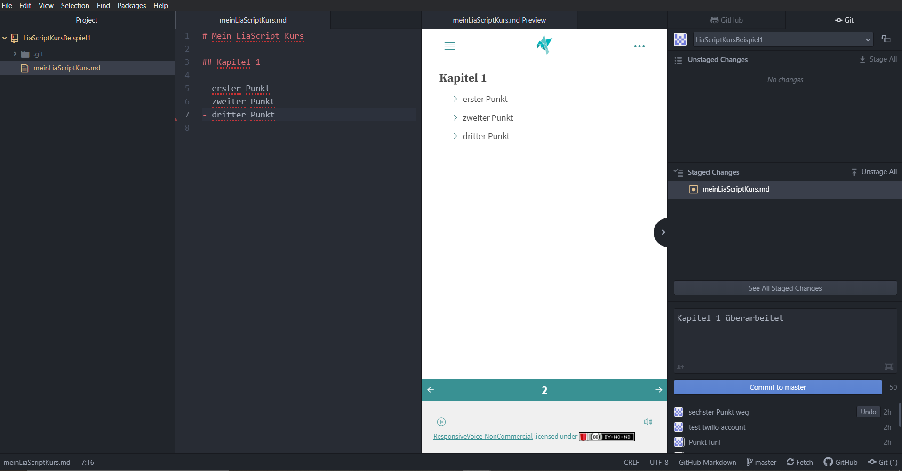</a>
        <figcaption style="text-align:center;font-size:14px;">Abbildung: Screenshot beispielhafter Kommentar</figcaption>
      </figure>
      4. Klicken Sie auf <b>Commit</b> und dann auf <b>Push</b>.
      <figure style="align:middle;">
        
        <figcaption style="text-align:center;font-size:14px;">Abbildung: Screenshot der Reiter Commit und Push</figcaption>
      </figure>
      

        <b>Hurra! Ihre Änderungen wurden in Ihr Repository übernommen!</b>
      

    

  

  <button class="accordion">7. Link erstellen, um Kurs mit Lernenden zu teilen</button>
  

    

      Um eine URL für den Kurs mit LiaScript zu erstellen, die Sie dann mit Lernenden oder Kolleg:innen teilen können, wird der <b>Link zu Ihrem Repository</b> benötigt. Gehen Sie in Ihrem Browser auf Ihr Profil in GitHub. Wählen Sie dort Ihren Kurs aus und klicken Sie anschließend mit einem Rechtsklick auf die <b>.md</b> Datei Ihres Kurses. Hier können Sie die Option <b>Adresse des Links kopieren</b> auswählen.
      <figure style="align:middle;">
        
        <figcaption style="text-align:center;font-size:14px;">Abbildung: Screenshot Kopieren des des Repository-Links</figcaption>
      </figure>
      Besuchen Sie anschließend die LiaScript-Website: <a aria-describedby="Link zur LiaScript Seite" href="https://liascript.github.io/">https://liascript.github.io/</a>.
        
      Hier fügen Sie den kopierten Link in das Eingabefeld ein und klicken zum Abschluss auf <b>Load Course</b>. Der Kurs wird nun von LiaScript erstellt und die Kursseite sollte sich in Kürze automatisch öffnen. <b>Unter der obigen URL ist der Kurs nun jederzeit aufrufbar</b>.
      <figure style="align:middle;">
        
        <figcaption style="text-align:center;font-size:14px;">Abbildung: Screenshot LiaScript Startseite</figcaption>
      </figure>
      

        <b>Herzlichen Glückwunsch! Sie haben Ihren ersten eigenen Kurs erfolgreich mit LiaScript erstellt.</b>
      

        
      

        

          <i class="fa fa-lightbulb-o fa-lg"></i> <b>Hinweis</b>: LiaScript hat es Ihnen angetan? Das folgende Video gibt Ihnen umfassende, weiterführende Informationen rund um die Funktionen des Dienstes
        

      

      <figure>
        <iframe width="560" height="315" src="https://www.youtube.com/embed/-JyKxvAkAP0" title="YouTube video player" frameborder="0" allow="accelerometer; autoplay; clipboard-write; encrypted-media; gyroscope; picture-in-picture" allowfullscreen name="Workshop LiaScript (deutsch)"></iframe>
        <figcaption style="text-align:center;font-size:14px;">Video : <a aria-describedby="Link zum Video über LiaScript (YouTube)" href="https://youtu.be/-JyKxvAkAP0">Workshop LiaScrip</a> von Sebastian Zug und André Dietrich</figcaption>
      </figure>
    

  

  <button class="accordion">8. Gemeinsam an einem Kurs arbeiten</button>
  

    

      Sie möchten Ihren LiaScript Kurs nicht allein, sondern zusammen mit anderen Personen bearbeiten? Kein Problem. Zwar lässt sich das Einladen weiterer Mitarbeiterinnen nicht in Atom erledigen, über GitHub ist dies aber einfach möglich. Der Dienst ist hervorragend für die Zusammenarbeit mehrerer Personen an einem Projekt geeignet.
    

    

      
<i class="fa fa-exclamation-triangle" style="color:black"></i> <b>Wichtig!</b>
          
        Damit Sie anderen Personen Zugriff auf Ihren Kurs ermöglichen können, müssen diese bei GitHub angemeldet sein. Alle Informationen zum Einrichten eines GitHub Accounts finden Sie unter Punkt 4 "Verbindung zu GitHub herstellen".
          
        <b>Beachten Sie außerdem bei der Arbeit mit mehreren Personen an einem Git-Projekt unbedingt die Hinweise im Infokasten am Ende dieses Schrittes!</b>
      

    

    

      <b>8.1 Wie Sie andere Personen zur Mitarbeit einladen</b>

Geben Sie Ihren Mitarbeiter:innen zunächst Zugriff auf das GitHub Repository, in dem sich Ihre Kursdatei befindet. Loggen Sie sich hierfür über einen Browser bei GitHub (https://github.com/) ein. Wählen Sie das Repository aus, zu dem sie Kolleg:innen einladen möchten und gehen Sie auf den Reiter <b>Settings</b>.
    

      
      <figure style="align:middle;">
        
        <figcaption style="text-align:center;font-size:14px;">Abbildung: Screenshot Repository Settings in GitHub</figcaption>
      </figure>
       
      Wechseln Sie hier nun in den Abschnitt <b>Manage access</b>.
        
      <figure style="align:middle;">
        <a href="images/atom_add_contributors2.svg" target="_blank">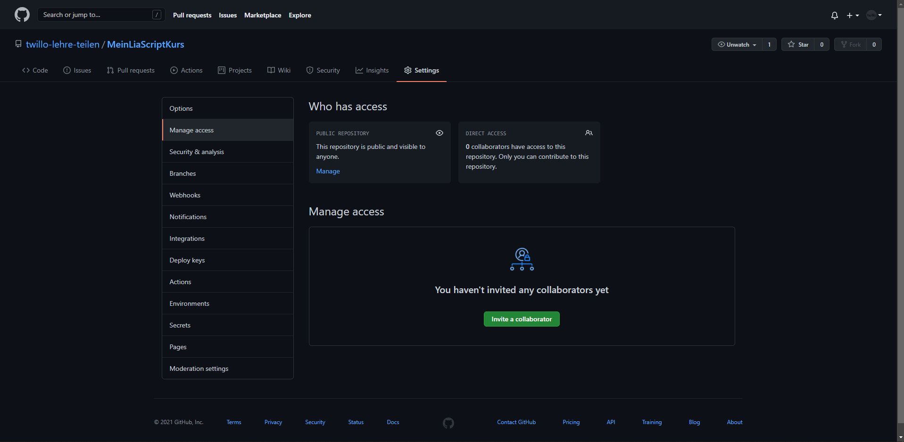</a>
        <figcaption style="text-align:center;font-size:14px;">Abbildung: Screenshot Zugriff verwalten in GitHub</figcaption>
      </figure>
       
      

        Dort angekommen können Sie mit einem Klick auf den Button <b>Invite a collaborator</b> eine:n Mitarbeiter:in hinzufügen.
      

      <figure style="align:middle;">
        <a href="images/git_add_contributors3.svg" target="_blank">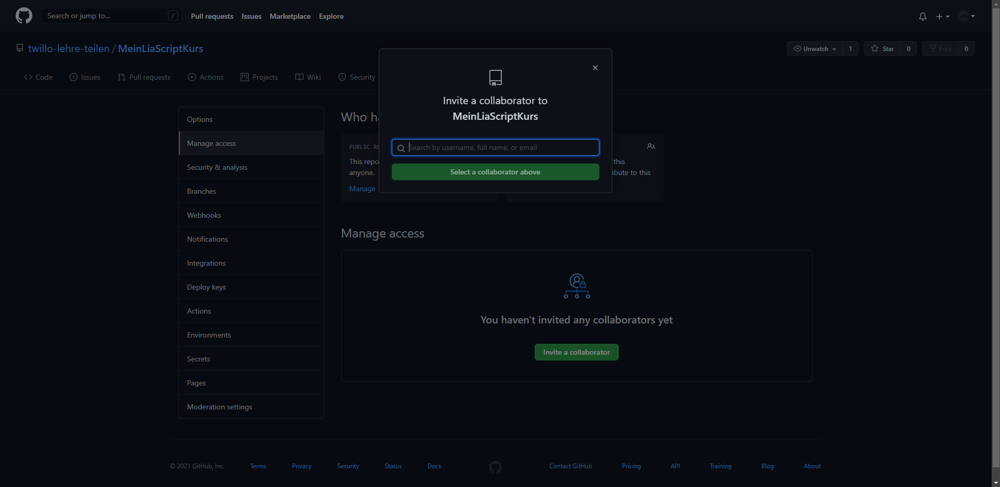</a>
        <figcaption style="text-align:center;font-size:14px;">Abbildung: Screenshot Mitarbeiter:innen zu einem auf GitHub Repository einladen</figcaption>
      </figure>
       
      

        Sie haben hierbei die Möglichkeit Ihre Mitarbeitenden via GitHub Usernamen, echten Namen oder E-Mail Addresse zu finden.
      

      <figure style="align:middle;">
        
        <figcaption style="text-align:center;font-size:14px;">Abbildung: Screenshot Mitarbeiter:innen finden</figcaption>
      </figure>
       
      

        Wählen Sie die:den gewünschte:n Mitarbeitende:n aus und klicken Sie anschließend auf <b>Add <Username> to this repository</b>. Selbstverständlich können Sie auch mehr als nur eine Person zur Mitarbeit an Ihrem Repository einladen.
      

      <figure style="align:middle;">
        <a href="images/git_add_contributors5.svg" target="_blank">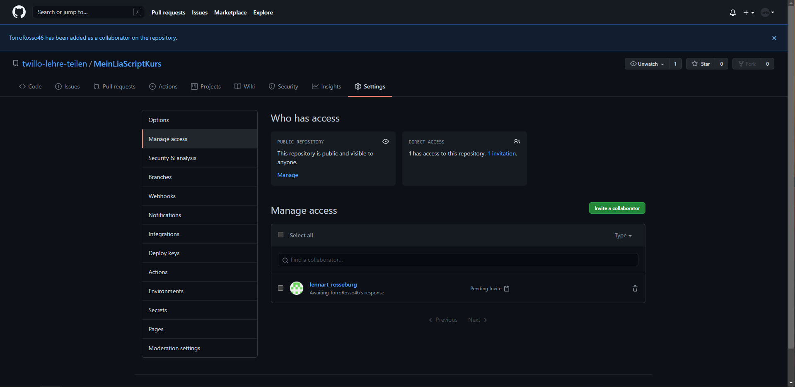</a>
        <figcaption style="text-align:center;font-size:14px;">Abbildung: Screenshot Mitarbeiter:innen hinzufügen</figcaption>
      </figure>
       
      

        Hurra! Sie haben Ihre:n Mitarbeiter:in erfolgreich zu Ihrem Repository hinzugefügt.
          <b>8.2 Wie Sie vorgehen, wenn Sie zur Mitarbeit an einem Repository eingelanden wurden</b>
          Wurde der Zugang zu einem Repository für Sie als Mitarbeiter:in freigeschaltet, erhalten Sie automatisch eine Einladung per Mail. Warten Sie nicht zu lange, damit die Einladung zu bestätigen. Der Einladungslink in der E-Mail ist nur für einen Zeitraum von 7 Tagen gültig.
      

      <figure style="align:middle;">
        
        <figcaption style="text-align:center;font-size:14px;">Abbildung: Screenshot Einladung zu einem GitHub Repository</figcaption>
      </figure>
      

        Über den Button <b>View invitation</b> werden Sie zu GitHub weitergeleitet. Dort können Sie nach dem Login auf den Button <b>Accept invitation</b> klicken, um die Einladung anzunehmen. Anschließend sind Sie als <b>Collaborator</b> in das Repository eingetragen, d.h. sie können direkt im GitHub Repository Inhalte erstellen und verändern.
          
        Um nun auch über Atom an der für Sie freigegebenen Kursdatei arbeiten zu können, müssen Sie den Kurs auf Ihrem Rechner lokal <b>klonen</b>. Dafür gehen Sie in GitHub auf das Repository, an dem Sie mitarbeiten wollen. Anschließend und kopieren Sie den Link, der Ihnen angezeigt wird wenn Sie auf den grünen <b>Code</b>-Button klicken. Wichtig hierbei ist, dass oben <b>HTTPS</b> ausgewählt ist. Dies entspricht auch der automatischen Voreinstellung.
      

      <figure style="align:middle;">
        <a href="images/copy_repo_link.svg" target="_blank">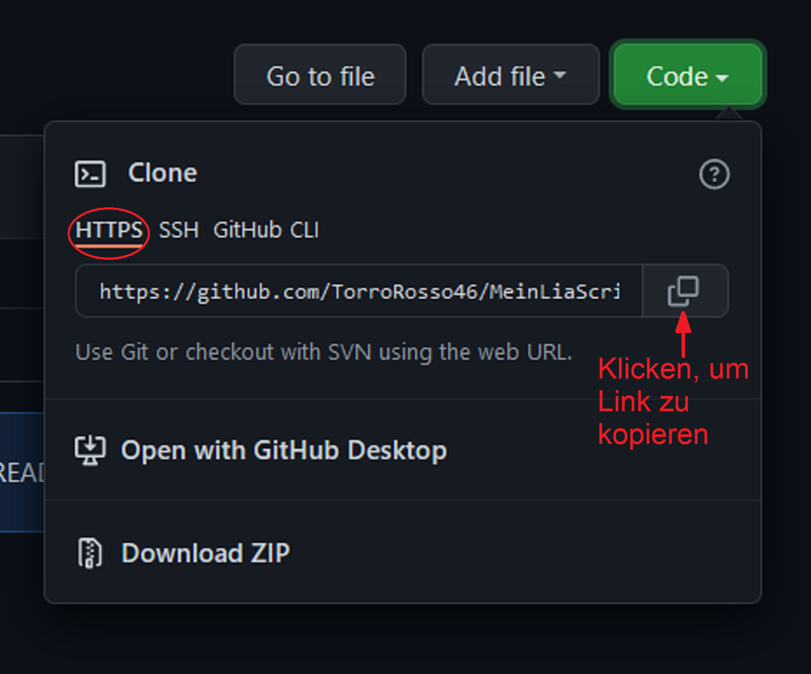</a>
        <figcaption style="text-align:center;font-size:14px;">Abbildung: Screenshot Kopieren eines Repository Links in GitHub</figcaption>
      </figure>
      

        Öffnen Sie nun Atom und klicken unten rechts auf das Feld <b>GitHub (1)</b>. Wählen Sie in dem sich daraufhin öffnenden Reiter die Option <b>Clone an existing GitHub Repository (2)</b> aus und fügen Sie den kopierten Link unter <b>Clone from (3)</b> ein. In dem Feld darunter, <b>To directory (4)</b>, können Sie den Pfad zu dem Ort auf Ihrem PC angeben, an dem das Repository gespeichert werden soll. Für das Repository wird dabei automatisch ein eigener Ordner angelegt, der alle zugehörigen Dateien enthält. Um den Klonvorgang abzuschließen, klicken Sie auf <b>Clone (5)</b>.
      

      <figure style="align:middle;">
        <a href="images/open_repo_in_atom.svg" target="_blank">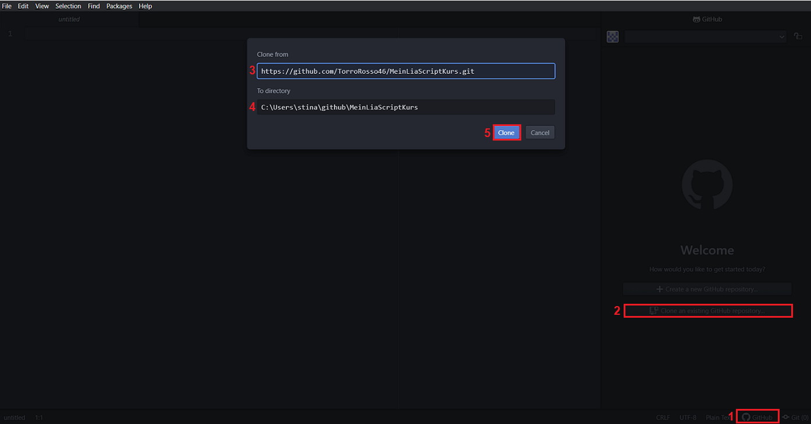</a>
        <figcaption style="text-align:center;font-size:14px;">Abbildung: Screenshot GitHub Repository mit Atom verknüpfen</figcaption>
      </figure>
      

        Sie können nun unter <b>file → open file...</b> die Kursdatei (Endung .md) auswählen und daran arbeiten. Wie das funktioniert ist unter Punkt 3 "Kurs strukturieren, Inhalte einfügen" dieses Workflows beschrieben.
  
        
Viel Spaß beim Erstellen vielfältiger Lehrmaterialien mit LiaScript!

      

      

      
<i class="fa fa-info-circle" style="color:blue"></i>  <b>Wichtige Hinweise zum gemeinsamen Arbeiten in Git:</b>
        <ul>
          <li>Damit Sie immer an der aktuellsten Fassung Ihres Kurses arbeiten, müssen Sie vor Beginn der Arbeit an dem Kursdokument unbedingt den Button fetch klicken</li>
          <figure style="align:middle;">
          <a href="images/fetch_button.svg" target="_blank">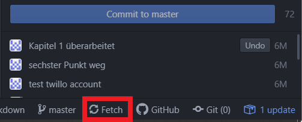</a>
        <figcaption style="text-align:center;font-size:14px;">Abbildung: fetch-Button</figcaption>
      </figure>
          <li>Pushen Sie lieber öfter kleine Änderungen, anstatt einmalig einer großen</li>
          <li>Um Versionskollisionen zu vermeiden, klicken Sie unbedingt auch einmal den Button fetch bevor Sie etwas pushen!</li>
        </ul>
      

      

  

