<h2>LiaScript Workflow mit Visual Studio Code</h2>
<link rel="stylesheet" href="https://cdnjs.cloudflare.com/ajax/libs/font-awesome/4.7.0/css/font-awesome.min.css">

  <button class="accordion">1. Getting Started: Installation</button>
  

    

      Um Ihnen den Umgang mit LiaScript so leicht wie möglich zu machen, empfehlen wir Ihnen den Texteditor <b>Visual Studio Code</b> in Verbindung mit einem LiaScript Plugin zu nutzen. Auf diese Weise können Sie Ihre Kursstruktur auf dem Desktop erstellen, eine Vorschau ansehen und den Kurs erst dann öffentlich zugänglich machen, wenn Sie damit zufrieden sind.
       
      <h6>Visual Studio Code installieren:</h6>
      Besuchen Sie die Seite <a aria-describedby="Link zum Visual Studio Code-Download" href="https://code.visualstudio.com/" target="_blank">https://code.visualstudio.com/</a>, laden Sie Visual Studio Code herunter und führen Sie die Installation aus. 
       
      <h6>LiaScript Plugin installieren:</h6>
      Öffnen Sie Visual Studio Code und wählen Sie in der Sidebar links den Reiter <b>Extensions</b> aus.
        
      <figure style="align:middle;">
        
        <figcaption style="text-align:center;font-size:14px;">Abbildung: Screenshot des Visual Studio Code Extension Reiter</figcaption>
      </figure>
       
      In dem geöffneten Reiter ist oben ein Suchfeld zu sehen, geben Sie dort <b>liascript</b> ein. In den Suchergebnissen sollten nun alle LiaScript Plugins erscheinen, darunter <b>LiaScript-Preview</b>, <b>LiaScript-Preview-Web</b> und <b>LiaScript-Snippets</b> <i>(Stand 02.11.2022)</i>. Starten Sie deren Installation mit einem Klick auf den Button <b>Install</b>. Wir empfehlen Ihnen alle LiaScript Plugins zu installieren, damit Ihnen der Umgang mit LiaScript so leicht wie möglich fällt.
        
      <figure style="align:middle;">
        <a href="images/vsc_lia_install.svg" target="_blank">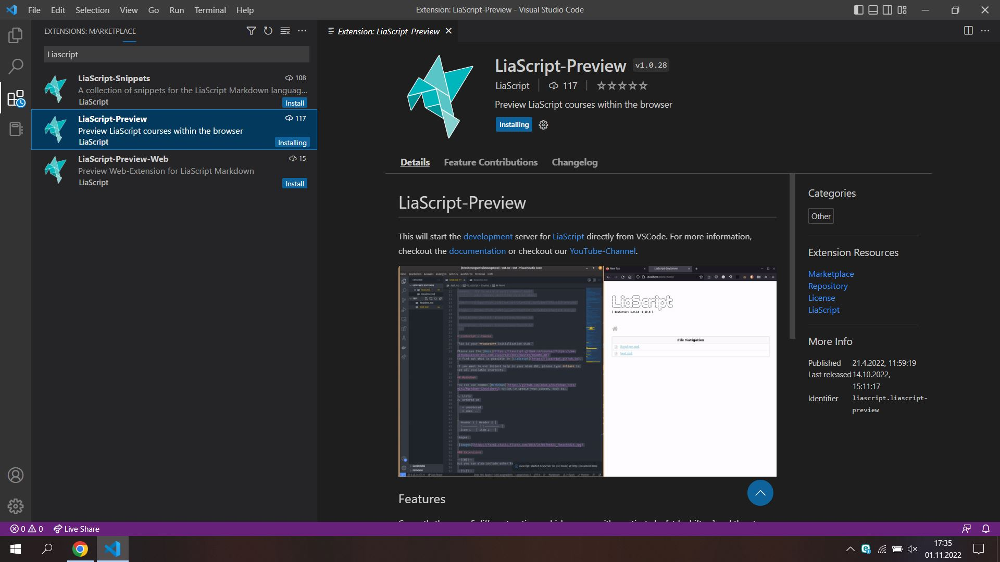</a>
        <figcaption style="text-align:center;font-size:14px;">Abbildung: Screenshot der Installation des LiaScript-Plugins in Visual Studio Code</figcaption>
      </figure>
    

  

  <button class="accordion">2. Lernmodul (Kursdokument) anlegen</button>
  

    

      Um ein neues Lernmodul anzulegen, öffnen Sie oben in der Menüleiste den Reiter <b>File</b> und wählen Sie <b>New file</b> aus <b>oder</b> drücken Sie die Tastenkombination <b>CTRL</b>, <b>ALT</b>, <b>Windows</b> und <b>N</b>.
      <figure style="align:middle;">
        <a href="images/vsc_newfile.svg" target="_blank">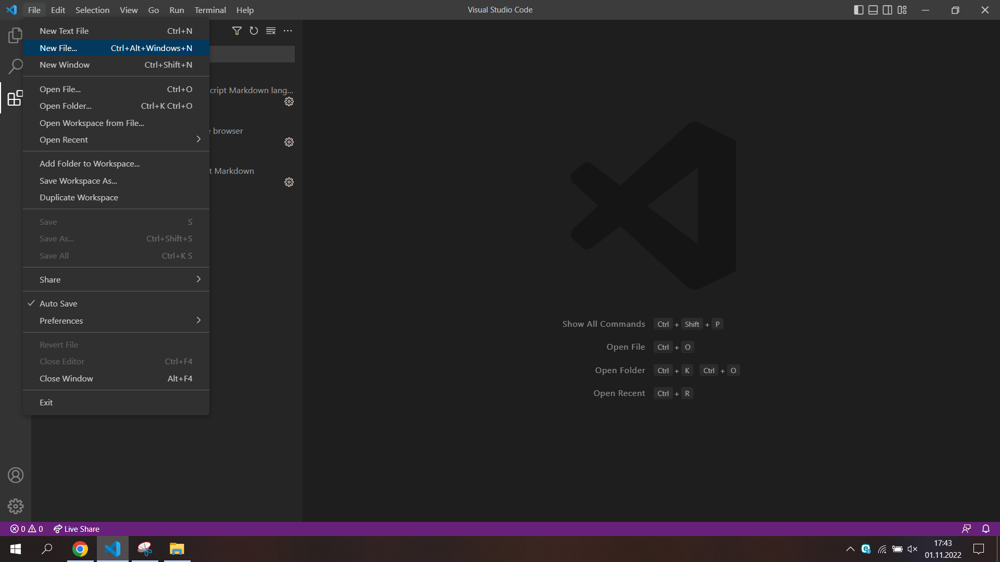</a>
        <figcaption style="text-align:center;font-size:14px;">Abbildung: Screenshot Erstellung eines Dokuments in Visual Studio Code (1)</figcaption>
      </figure>
      In der mitte der Seite der Visual Studio Code Umgebung öffnet sich nun ein Eingabefeld. Hier geben Sie einen Dateinamen zu Ihrem Lernmodul ein. Daraufhin öffnet sich ein Fenster in dem Sie den Speicherort Ihres Lernmoduls festlegen.
      <figure style="align:middle;">
        
        <figcaption style="text-align:center;font-size:14px;">Abbildung: Screenshot Erstellung eines Dokuments in Visual Studio Code (2)</figcaption>
      </figure>
      <b>Wichtig:</b> Beim auswählen des Speicherorts ist zu beachten, dass sich die Datei in einem neuen und leeren Ordner befinden muss. Erstellen Sie hierfür einfach einen neuen Ordner und legen Sie die Datei darin ab. Außerdem ist zu beachten, dass die Datei als Markdown-Datei abgespeichert wird. Hängen Sie hierfür die Endung <b>.md</b> an Ihren Dateinamen an. Nach dem speichern schließt sich wieder das Fenster und die leere Datei wird im Editor geöffnet.
      <figure style="align:middle;">
        <a href="images/vsc_create_projectfolder.svg" target="_blank">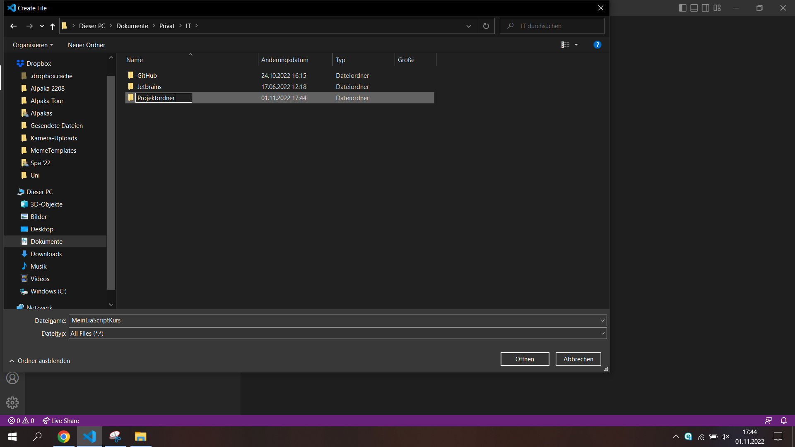</a>
        <figcaption style="text-align:center;font-size:14px;">Abbildung: Screenshot Erstellung eines Projektordners in Visual Studio Code</figcaption>
      </figure>
      <figure style="align:middle;">
        <a href="images/vsc_newfile_md.svg" target="_blank">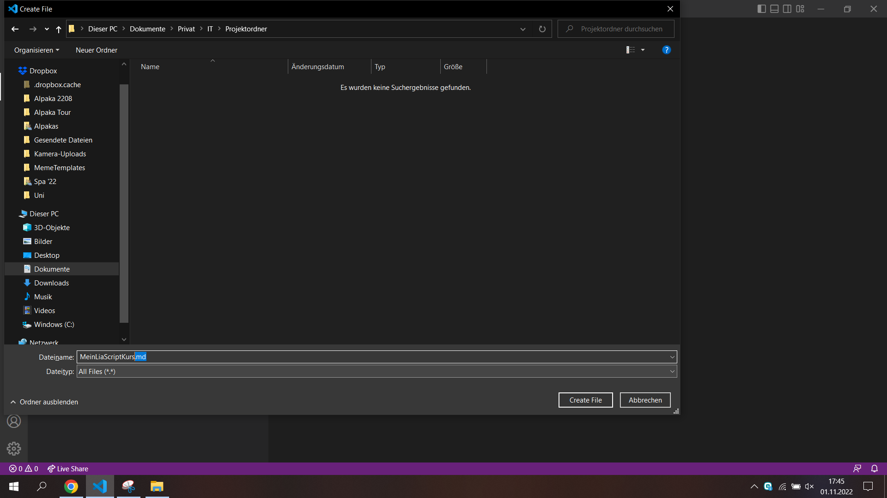</a>
        <figcaption style="text-align:center;font-size:14px;">Abbildung: Screenshot Erstellung eines Dokuments in Visual Studio Code (3)</figcaption>
      </figure>
       
      Wechseln Sie jetzt in der Sidebar auf der linken Seite in den Reiter <b>Explorer</b>. Klicken Sie dann in dem Reiter auf <b>Open Folder</b> und wählen Sie in dem sich daraufhin öffnenden Fenster den gerade erstellten neuen Projektordner aus.
      <figure style="align:middle;">
        <a href="images/vsc_explorer.svg" target="_blank">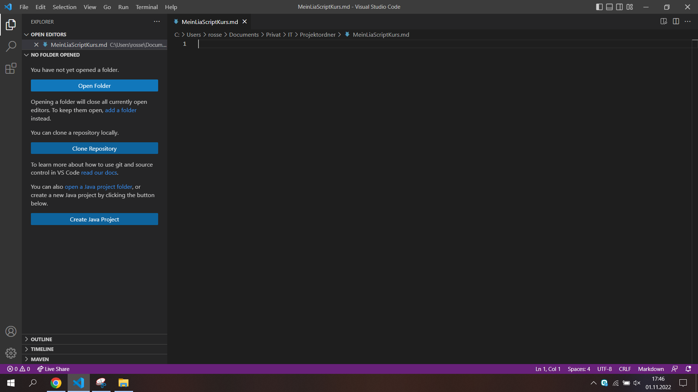</a>
        <figcaption style="text-align:center;font-size:14px;">Abbildung: Screenshot Explorer in Visual Studio Code</figcaption>
      </figure>
      <figure style="align:middle;">
        <a href="images/vsc_select_projectfolder.svg" target="_blank">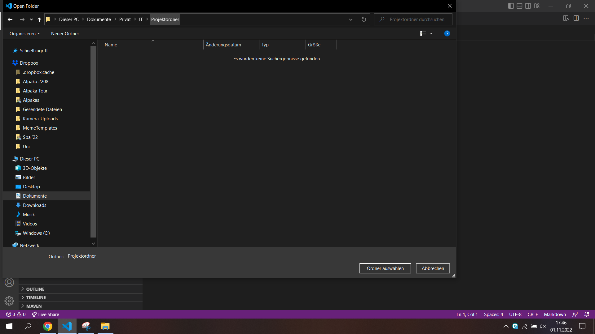</a>
        <figcaption style="text-align:center;font-size:14px;">Abbildung: Screenshot Projektordner auswählen</figcaption>
      </figure>
      <figure style="align:middle;">
        <a href="images/vsc_explorer2.svg" target="_blank">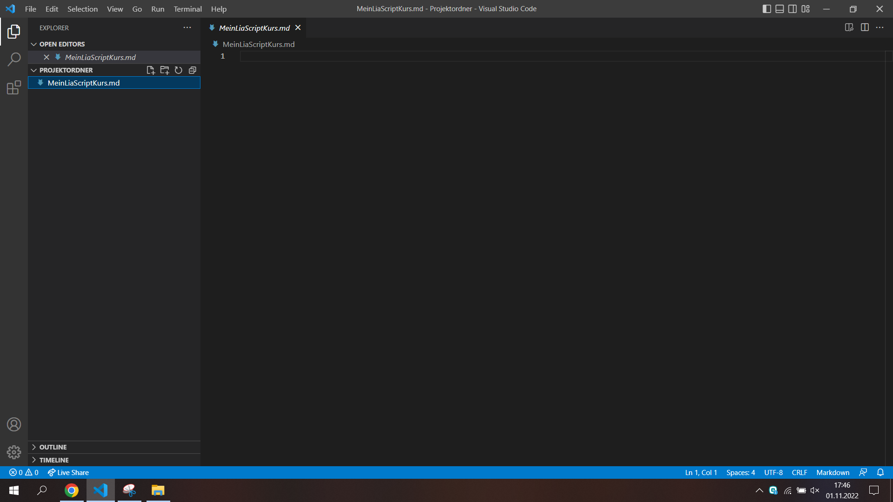</a>
        <figcaption style="text-align:center;font-size:14px;">Abbildung: Screenshot Explorer in Visual Studio Code mit geöffnetem Projekt</figcaption>
      </figure>
       
      Aktivieren Sie nun das LiaScript Plugin. Drücken Sie die Tastenkombination <b>STRG</b>, <b>SHIFT</b> und <b>P</b>, um die Kommandozeile von Visual Studio Code zu öffnen.
      Geben Sie in dieser Kommandozeile <b>liascript</b> ein. Es werden Ihnen daraufhin alle möglichen Befehle der installierten LiaScript Plugins angezeigt. Wählen Sie davon den Befehl <b>LiaScript: Preview your course in live mode (start DevServer)</b> aus. Es öffnet sich nun innerhalb Ihres Browsers ein neues Fenster in dem eine Vorschau Ihres Lernmoduls erscheint. Nach jedem Speichern (<b>File</b> und <b>Save</b> im Kopfmenü oder die Tastenkombination <b>STRG</b> und <b>S</b>) kann mit neu laden des Browserfensters (<b>F5</b>) die aktualisierte Vorschau angeschaut werden.
      <figure style="align:middle;">
        <a href="images/vsc_commandpalette2.svg" target="_blank">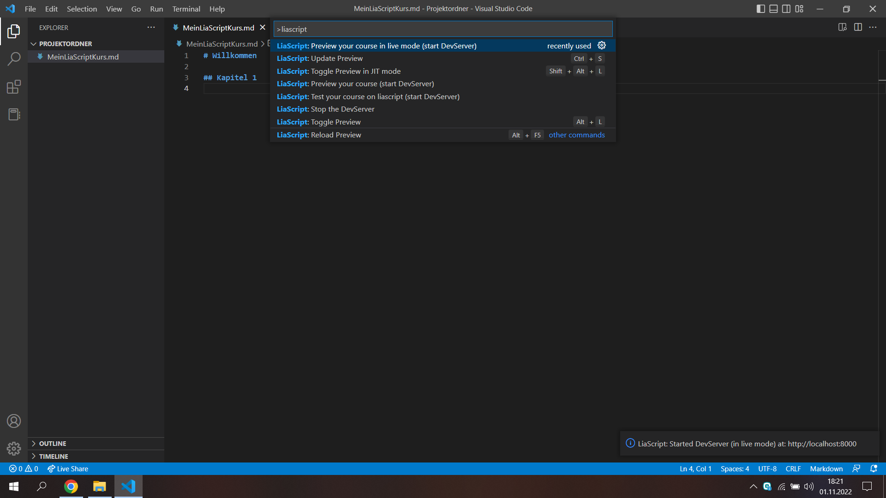</a>
        <figcaption style="text-align:center;font-size:14px;">Abbildung: Screenshot Kommandozeile in Visual Studio Code</figcaption>
      </figure>
       
      Allerdings befindet sich aktuell noch kein Inhalt in Ihrem Lernmodul. Fügen Sie zunächst eine Überschrift Ihrem Lernmodul hinzu. <b>Wichtig:</b> Da in der Anwendung mit Markdown gearbeitet werden muss, vergessen Sie bitte nicht einen Hashtag vor Ihre Überschrift zu setzen. Beispiel: <b># Mein LiaScript Kurs</b>. Speichern Sie das Dokument anschließend und laden Sie das Browserfenster neu, um Ihre neuen Inhalte zu begutachten.
      <figure style="align:middle;">
        <a href="images/vsc_liapreview.svg" target="_blank">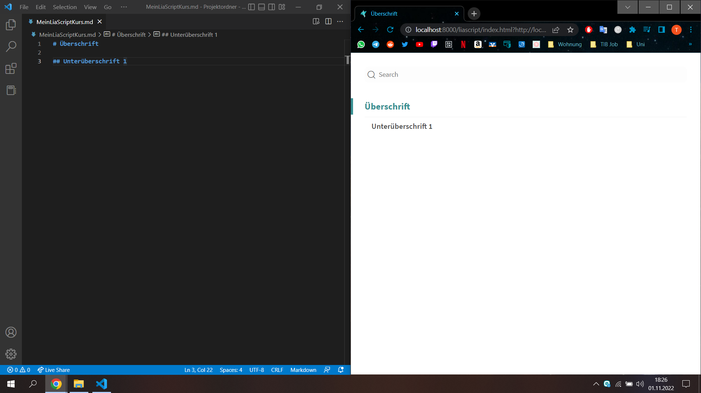</a>
        <figcaption style="text-align:center;font-size:14px;">Abbildung: Screenshot LiaPreview PlugIn in Visual Studio Code</figcaption>
      </figure>
    

  

  <button class="accordion">3. Kurs strukturieren, Inhalte einfügen</button>
  

    

      Ist Ihr Lernmodul/Kursdokument angelegt, können Sie beginnen, Inhalte und Materialien einzufügen. Hierfür müssen Sie auf <b>Markdown</b> zurückgreifen. Sie haben noch keine Erfahrungen mit der Auszeichnungssprache gesammelt? Keine Sorge! "Auszeichnungssprache" klingt schlimmer als es ist, Sie müssen hier <b>keine</b> Programmiersprache o.Ä. erlernen. Im folgenden führen wir Sie durch die Gestaltung Ihres Kurses mit Markdown - Sie werden sehen, es ist nicht schwer.
        
      <h6>Anlegen von Kapiteln:</h6>
      Zur Strukturierung Ihres Kurses in Kapitel und Unterkapitel legen Sie Überschriften und Unterüberschriften an. In Markdown wird eine Hauptüberschrift mit einem Hashtag, eine Überschrift zweiter Ordnung mit zwei Hashtags usw. gekennzeichnet. Hier ein kleines Beispiel, wie man Überschriften hinzufügt:
      
      <figure style="align:middle;">
        <a href="images/vsc_liapreview_update.svg" target="_blank">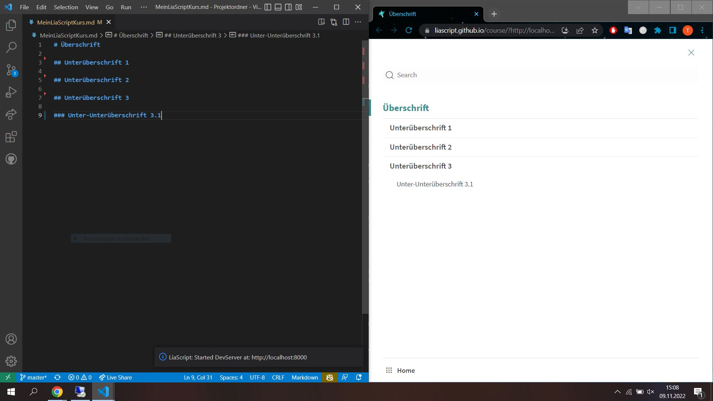</a>
        <figcaption style="text-align:center;font-size:14px;">Abbildung: Screenshot LiaPreview PlugIn in Visual Studio Code</figcaption>
      </figure>
       
      <h6>Hinzufügen und Formatieren von Texten:</h6>
      Schreiben Sie Texte und Anweisungen einfach direkt unter die Überschrift, unter der Sie sie platzieren möchten. Die Formatierung von Texten können Sie durch Markdown-Syntax im Prinzip des Copy und Paste vornehmen. LiaScript sorgt automatisch für ein ansprechendes Layout. Speichern Sie Ihre Eingabe, so können Sie das Aussehen Ihrer Eingabe in der LiaScript Vorschau überprüfen.
        
      Hier ein paar einfache Beispiele zur Formatierung von Texten:
      <ul style="list-style-type:disc">
        <li>Sie möchten ein Wort fett setzen? Zeichnen Sie es wie folgt aus **Beispiel** oder __Beispiel__</li>
        <li>Sie möchten ein Wort kursiv setzen? Zeichnen Sie es wie folgt aus: *Beispiel* oder _Beispiel_</li>
        <li>Sie möchten einen Link einfügen? Zeichnen Sie ihn wie folgt aus: [Linktext](Link)</li>
        <li>Sie möchten eine Liste einfügen? Zeichnen Sie die Aufzählung wie folgt aus:</li>
      </ul>    
      <figure style="align:middle;">
        <a href="images/vsc_liapreview_list.svg" target="_blank">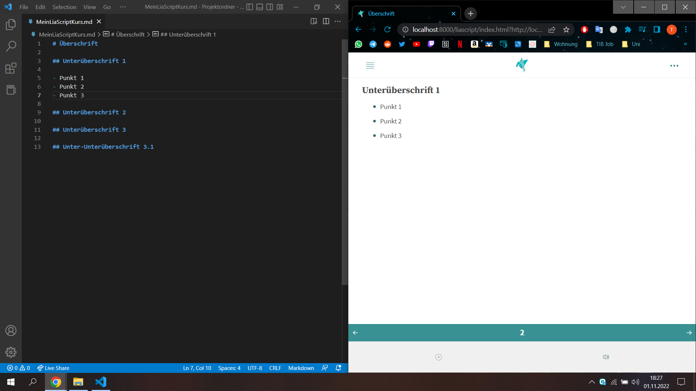</a>
        <figcaption style="text-align:center;font-size:14px;">Abbildung: Screenshot Anlegen einer Liste in Markdown</figcaption>
      </figure>
      

        

          <i class="fa fa-lightbulb-o fa-lg"></i> <b>Hinweis:</b> Einen Überblick über die wichtigste Markdown-Syntax zum Kopieren und Einfügen finden Sie hier:
          <ul style="list-style-type:disc">
            <li><a aria-describedby="Link zum Markdown Cheat Sheet" href="https://github.com/adam-p/markdown-here/wiki/Markdown-Cheatsheet">Markdown Cheatcheat</a> von Adam Pritchard, lizenziert unter <a aria-describedby="Link zur Quelle" href="https://creativecommons.org/licenses/by/3.0/legalcode">CC BY (3.0, unported)</a></li>
            <li><a aria-describedby="Link zum Markdown Guide" href="https://www.markdownguide.org/">Markdown Guide</a> von Matt Cone, lizenziert unter <a aria-describedby="Link zur Quelle" href="https://creativecommons.org/licenses/by-sa/4.0/">CC BY-SA 4.0</a></li>
          </ul>
        

      

       
      <h6>Hinzufügen weiterer Elemente:</h6>
      LiaScript ist insbesondere dafür geeignet, interaktive Lernobjekte in Ihre Kursstruktur zu integrieren. <b>Kopieren Sie die Syntax, die Sie dafür benötigen aus dem digitalen <a aria-describedby="Link zu LiaScript Handbuch" href="https://liascript.github.io/course/?https://raw.githubusercontent.com/liaScript/docs/master/README.md#1">LiaScript Handbuch</a> von André Dietrich, Sebastian Zug, Karl Fessel und Steve Rehm</b>. Das Handbuch ist explizit dafür vorgesehen, Ihnen bei der Integration von Elementen in LiaScript zu helfen.
        
      Hier ein Beispiel, in dem eine Quizfrage (mit Hinweisen + Erklärung) nach Vorgabe des Handbuchs erstellt werden kann.
      <figure style="align:middle;">
        <a href="images/vsc_liapreview_quiz_hints3.svg" target="_blank">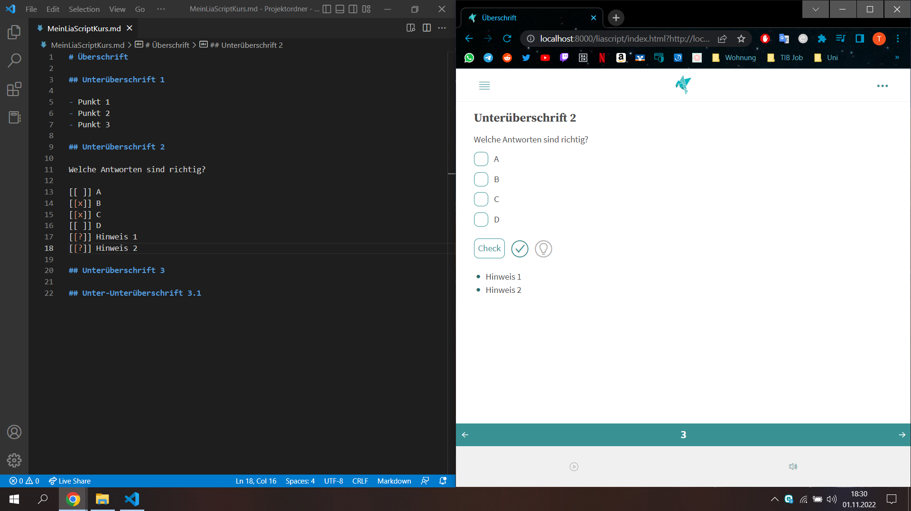</a>
        <figcaption style="text-align:center;font-size:14px;">Abbildung: Screenshot Erstellung eines Quiz mit LiaScript</figcaption>
      </figure>
      <figure style="align:middle;">
        <a href="images/vsc_liapreview_quiz_solution.svg" target="_blank">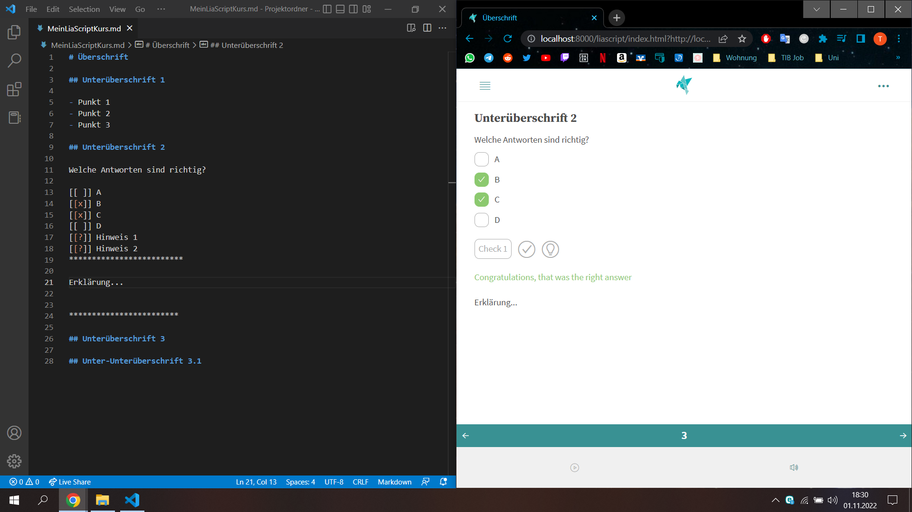</a>
        <figcaption style="text-align:center;font-size:14px;">Abbildung: Screenshot Erstellung eines Quiz mit LiaScript</figcaption>
      </figure>
      

        

          <i class="fa fa-lightbulb-o fa-lg"></i> <b>Hinweis:</b> Neben interaktiven Lernobjekten wie Quizfragen bietet LiaScript noch viele weitere Features an, um Ihren Kurs individuell zu gestalten. In dem sich ständig erweiternden <a aria-describedby="Link zu LiaScript Handbuch" href="https://liascript.github.io/course/?https://raw.githubusercontent.com/liaScript/docs/master/README.md#1">LiaScript Handbuch</a> finden Sie alle zur Verfügung stehenden Features mit Erklärungen, wie Sie diese in Ihren Kurs integrieren können.
        

      

    

  

  <button class="accordion">4. Verbindung zu GitHub herstellen</button>
  

    

      Bisher ist Ihr Kurs nur lokal gespeichert, liegt also auf Ihrem Computer. Um Ihren LiaScript Kurs nun auch im Internet öffentlich bereitzustellen zu können, empfehlen wir Ihnen die Plattform <b>GitHub</b>. Hier können Sie Ihren erstellten Kurs <b>kostenfrei</b> ablegen, um anschließend mit LiaScript einen Link zu Ihrem Kurs zu generieren.
         
      <h6>GitHub Anmeldung</h6>
      Zuallererst müssen Sie sich dafür einen GitHub Account erstellen. Besuchen Sie hierfür die Seite www.github.com und klicken Sie oben rechts auf <b>Sign Up</b>.
        
      In dem folgenden Fenster tragen Sie einen <b>Usernamen</b>, ihre <b>E-Mail</b> und ein <b>Passwort</b> ein. Mit einem Klick auf den Button <b>Create Account</b> erstellen Sie sich Ihren eigenen Account.
        
      Zum Abschluss müssen Sie nun lediglich noch Ihre E-Mail-Adresse <b>verifizieren</b>. Dafür erhalten Sie eine E-Mail von GitHub mit dem Betreff <b>[GitHub] Please verify your email address</b>. Dort klicken Sie auf den Button <b>Verify email address</b>. Nun werden Sie auf eine Seite geführt, die die Verifizierung Ihres Accounts bestätigt.
      <figure style="align:middle;">
        
        <figcaption style="text-align:center;font-size:14px;">Abbildung: Screenshot GitHub Verified Email Address</figcaption>
      </figure>
           
      <h6>Verknüpfung von GitHub mit Visual Studio Code</h6>
      Visual Studio Code stellt ein Bindeglied zwischen LiaScript und GitHub dar. Mit einer Verbindung von Visual Studio Code mit GitHub wird Ihnen die Möglichkeit gegeben, Inhalte durch Visual Studio Code in Ihren Kurs einzubinden und über GitHub zu veröffentlichen. D.h. durch das LiaScript Plugin und die Verbindung mit GitHub wird Visual Studio Code zu einem Werkzeug, mit dem Sie einerseits Ihren Kurs gestalten können während Sie eine Vorschau erhalten und andererseits auch eine Veröffentlichung im Internet vornehmen können.
        
      Öffnen Sie Visual Studio Code, um als  Nächstes die Erweiterung <b>GitHub Pull Requests and Issues</b> zu installieren. Diese finden Sie unter dem Reiter <b>Extensions</b>, wenn Sie nach dem Begriff <b>GitHub</b> suchen. Ist dies erledigt, kann die Erweiterung über die Sidebar aufgerufen werden. 
      <figure style="align:middle;">
        <a href="images/vsc_gh_extension.svg" target="_blank">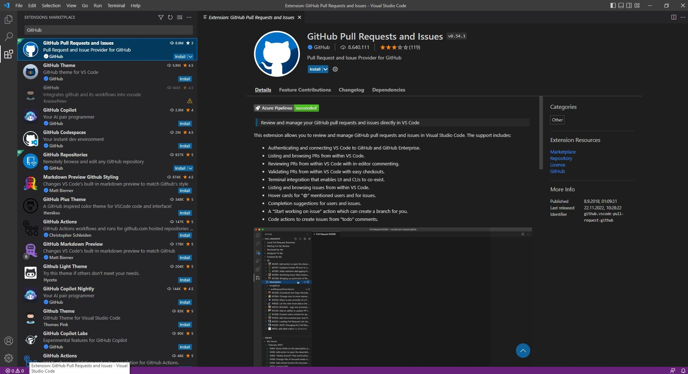</a>
        <figcaption style="text-align:center;font-size:14px;">Abbildung: Screenshot GitHub Extension</figcaption>
      </figure>
       
      Bevor wir die GitHub Erweiterung allerdings verwenden können, müssen Sie sich noch mit Ihrem eigenem GitHub Account in Visual Studio Code anmelden und den Zugriff von Visual Studio Code auf Ihren GitHub Account authorisieren. Erledigen Sie dafür die beiden folgenden Schritte:
      <ol>
        <li>
          Wählen Sie unter dem Reiter <b>Accounts</b> die Option <b>Turn on Edit Sessions..</b> (<i>ODER</i>: <b>Sign in with GitHub</b>) und in der sich daraufhin öffnenden Kommandozeile <b>Sign in with GitHub</b> aus. Nun werden Sie zu GitHub weitergeleitet um sich dort mit Ihrem GitHub Account anzumelden und Visual Studio Code zu authorisieren.
          <figure style="align:middle;">
            <a href="images/vsc_gh_sign1.svg" target="_blank">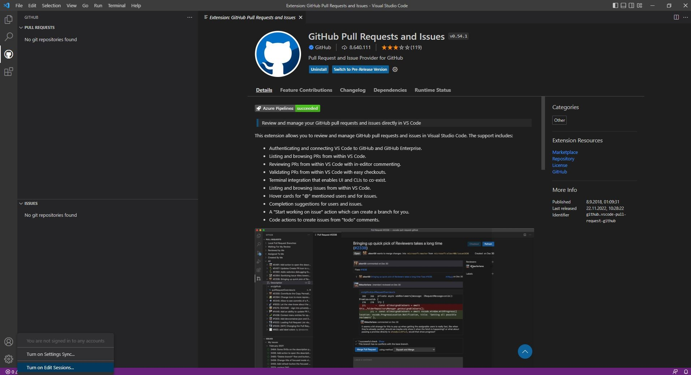</a>
            <figcaption style="text-align:center;font-size:14px;">Abbildung: Screenshot Turn on Edit Sessions</figcaption>
          </figure>
          <figure style="align:middle;">
            <a href="images/vsc_gh_select.svg" target="_blank">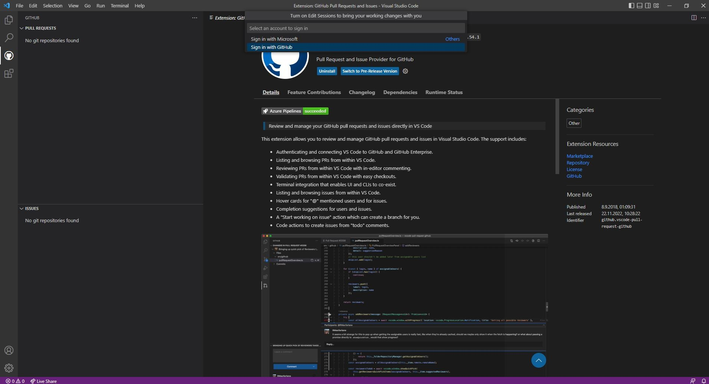</a>
            <figcaption style="text-align:center;font-size:14px;">Abbildung: Screenshot Sign in with GitHub</figcaption>
          </figure>
          <figure style="align:middle;">
            <a href="images/vsc_gh_auth1.svg" target="_blank">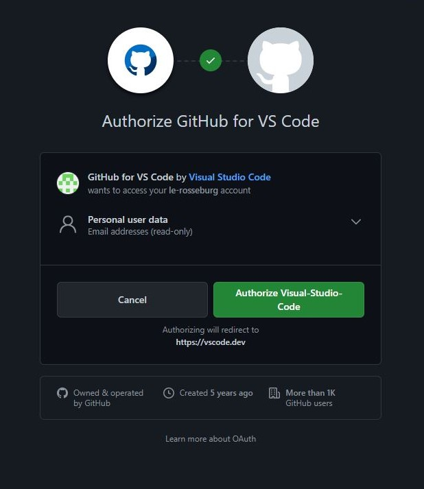</a>
            <figcaption style="text-align:center;font-size:14px;">Abbildung: Screenshot Verknüpfung mit GitHub</figcaption>
          </figure>
        </li>
        <li>
          Als Zweites müssen Sie der gerade heruntergeladenen GitHub Erweiterung (<b>GitHub Pull Requests and Issues</b>) noch zusätzliche Berechtigungen auf GitHub erlauben. Dafür wählen Sie unter dem Reiter <b>Accounts</b> die Option <b>Sign in with GitHub to use GitHub Pull Requests and Issues</b> aus, woraufhin Sie erneut zu GitHub weitergeleitet werden, um die zusätzlichen Berechtigungen zu authorisieren.
          <figure style="align:middle;">
            <a href="images/vsc_gh_sign2.svg" target="_blank">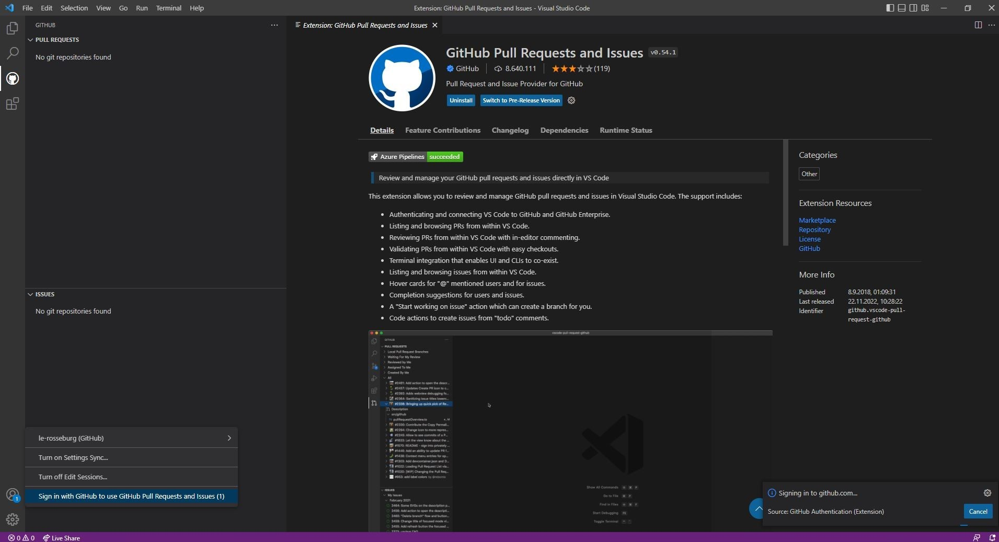</a>
            <figcaption style="text-align:center;font-size:14px;">Abbildung: Screenshot Sign in with GitHub to use GitHub Pull Requests and Issues</figcaption>
          </figure>
          <figure style="align:middle;">
            <a href="images/vsc_gh_auth2.svg" target="_blank">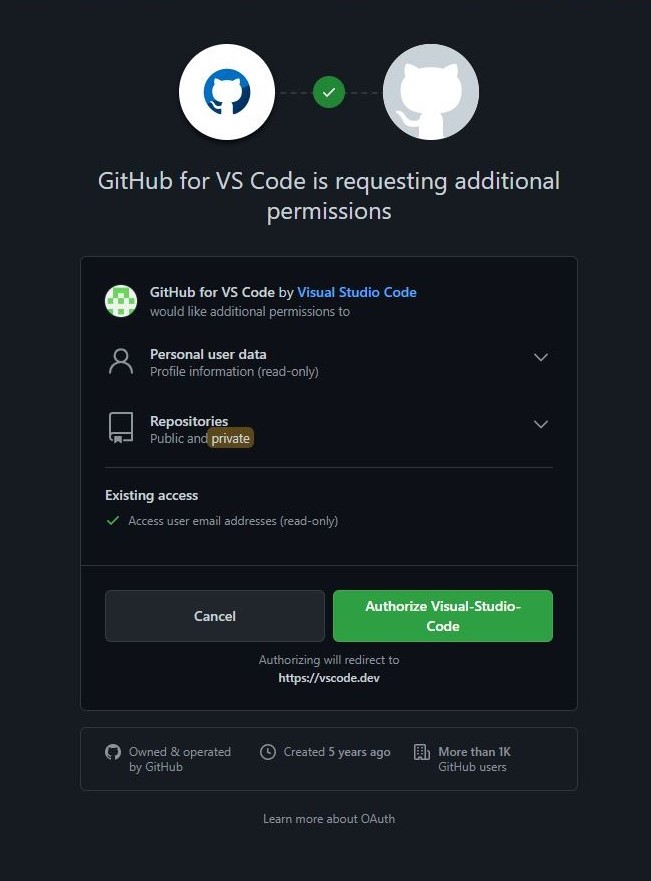</a>
            <figcaption style="text-align:center;font-size:14px;">Abbildung: Screenshot Verknüpfung mit GitHub 2</figcaption>
          </figure>
        </li>
      </ol>
    

  

  <button class="accordion">5. Ablageort für Ihren Kurs im Internet anlegen</button>
  

    

      In dem Reiter <b>Source Control</b> in Visual Studio Code können Sie nun durch Klicken auf <b>Initialize Repository</b> ein neues Repository auf GitHub für Ihren Kurs anlegen. Ein Repository ist der Ablageort für ihre Kursdateien auf Git im Internet.
      <figure style="align:middle;">
        
        <figcaption style="text-align:center;font-size:14px;">Abbildung: Repository anlegen</figcaption>
      </figure>
      Nach dem Anlegen des Repositorys müssen über Visual Studio Code noch zwei kleine Schritte getätigt werden (<b>commit</b> und <b>sync changes (push)</b>), um auch Ihre Kursdatei erfolgreich im Repository abzulegen.
        
      Was hat es mit diesen Schritten auf sich? Wenn Sie in Visual Studio Code an Ihrem Kurs arbeiten und die Änderungen <b>speichern</b>, ändern Sie nur das Kursdokument, das lokal auf Ihrem Computer abgelegt ist. Mit <b>commit</b> informieren Sie quasi den Dienst GitHub über die Änderungen und weisen an, dass auch Git die Änderungen übernehmen soll. Mit <b>sync changes</b> setzen Sie die Änderungen dann öffentlich.
        
      Um die Schritte <b>commit</b> und <b>sync changes</b> das erste Mal auszuführen, bleiben Sie in Visual Studio Code im Reiter <b>Source Control</b>.
        
      Hier müssten Sie, wie in folgender Abbildung erkennbar, Ihre Kursdatei unter dem Abschnitt <b>(Unstaged) Changes</b> sehen. Klicken Sie nun zuerst auf den Button <b>Stage All Changes</b>, den Sie an der rechten Seite des Reiters, auf höhe des Abschnittes <b>Changes</b> finden. Der Button hat die Form eines Pluszeichen.
      <figure style="align:middle;">
        
        <figcaption style="text-align:center;font-size:14px;">Abbildung: Screenshot Ablage der Kursdatei unter Unstaged Changes</figcaption>
      </figure>
      Nach der Wahl des Buttons <b>Stage All Changes</b> wechselt Ihre Datei weiter nach oben in den Bereich <b>Staged Changes</b>. Schreiben Sie als Nächstes noch einen <b>kleinen Kommentar</b> ins obere Textfeld, mit dem Sie den Commit beschreiben (z.B. Neuerungen, Veränderungen, Korrekturen). Klicken Sie anschließend auf <b>Commit</b>, um den Commit fertig zu stellen.
      <figure style="align:middle;">
        <a href="images/vsc_sc_staged.svg" target="_blank">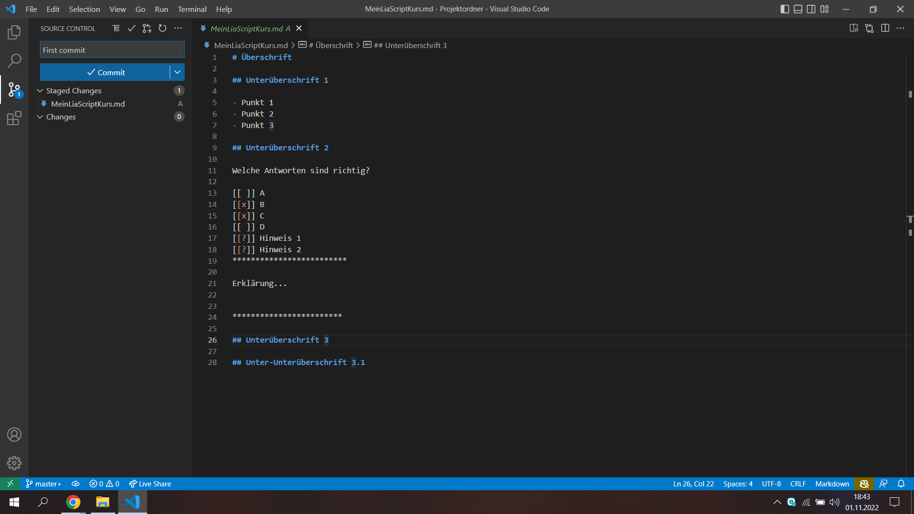</a>
        <figcaption style="text-align:center;font-size:14px;">Abbildung: Screenshot Anzeige der Kursdatei unter Staged Changes mit Commit Kommentar</figcaption>
      </figure>
      Nun sollte sich an selber Stelle der Button <b>Publish Branch</b> befinden. Klicken Sie ihn, um all Ihre Änderungen mit Ihrem Repository zu synchronisieren - ergo, sie im Netz sichtbar zu machen.
      <figure style="align:middle;">
        <a href="images/vsc_sc_commited.svg" target="_blank">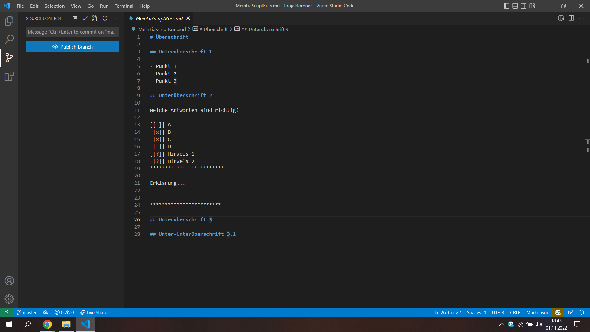</a>
        <figcaption style="text-align:center;font-size:14px;">Abbildung: Screenshot Pushen der Änderungen</figcaption>
      </figure>
      Da dieser Commit allerdings der allererste Commit ist und das Repository aktuell auch noch nur lokal existiert öffnet sich ein kleines Eingabefenster. In diesem soll der Name und die Sichtbarkeit (<b>public</b> oder <b>private</b>) des Repositorys festgelegt werden. <b>Wichtig:</b> Bei der Sichtbarkeit müssen Sie <b>public</b> auswählen, damit der Kurs über LiaScript veröffentlicht werden kann.
      <figure style="align:middle;">
        <a href="images/vsc_sc_publish.svg" target="_blank">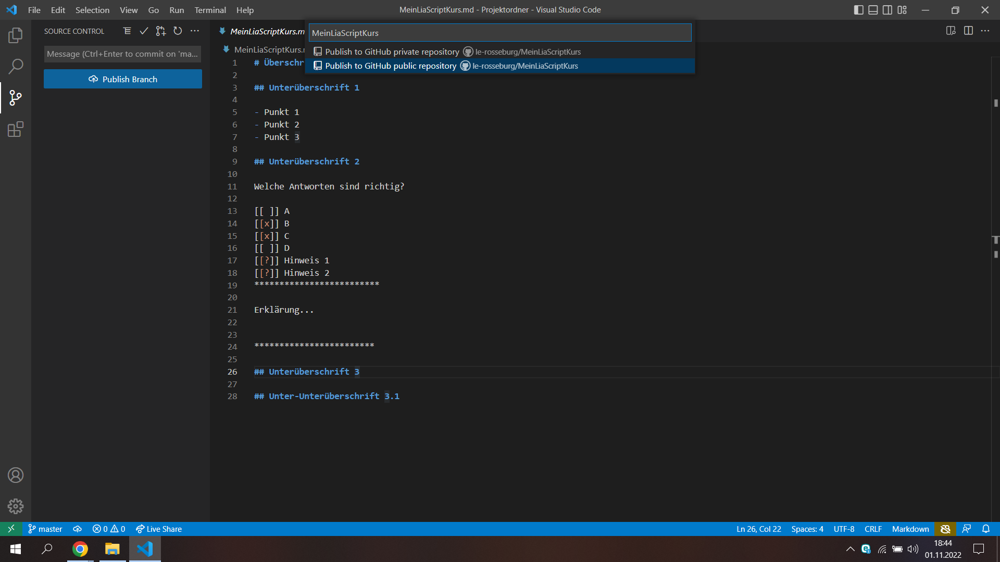</a>
        <figcaption style="text-align:center;font-size:14px;">Abbildung: Screenshot Repository veröffentlichen</figcaption>
      </figure>
      Überprüfen Sie, ob alles geklappt hat, indem Sie im Browser Ihr GitHub Profil aufrufen und dort Ihren Kurs auswählen. Hier sollte Ihr Repository nun wie folgt aussehen.
      <figure style="align:middle;">
        <a href="images/vsc_gh_repo.svg" target="_blank">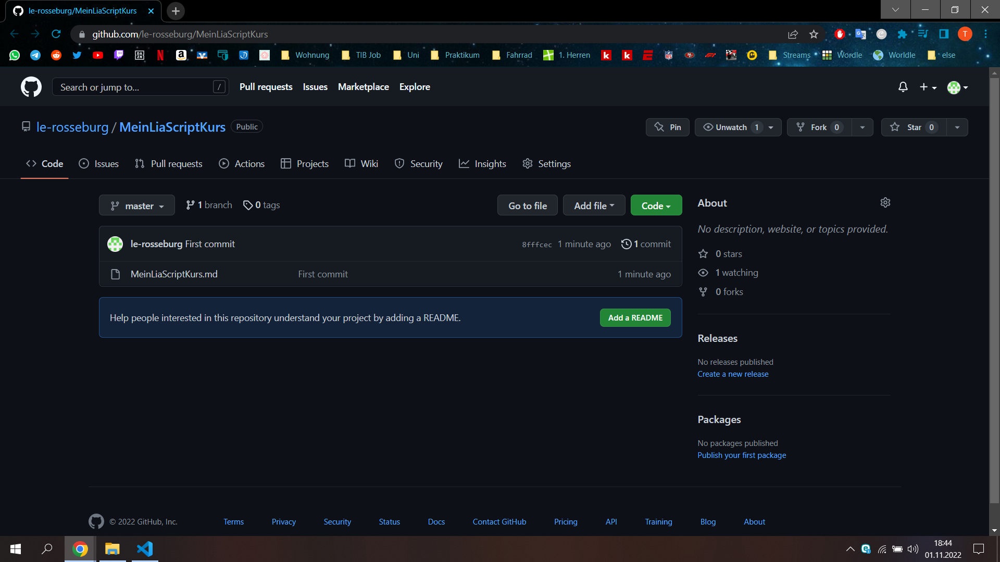</a>
        <figcaption style="text-align:center;font-size:14px;">Abbildung: Screenshot Anzeige Ihres Repositories auf GitHub</figcaption>
      </figure>
    

  

  <button class="accordion">6. Kursinhalte ändern oder weiterbearbeiten</button>
  

    

      Das schwierigste haben Sie geschafft! Wenn Sie Ihren Kurs nun weiter bearbeiten, aktualisieren oder generell verändern wollen, können Sie dies bequem in Visual Studio Code tun. Wenn Sie Ihren Kurs in Visual Studio Code öffnen, klicken Sie bitte jedes Mal bevor sie etwas ändern auf <b>Fetch</b>. Diesen Button finden Sie im ausgeklappten <b>Source Control</b> Reiter oben rechts, versteckt hinter den drei kleinen Punkten. Hierdurch wird sichergestellt, dass Sie immer mit der neuesten Version Ihres Kurses weiterarbeiten. 
      <figure style="align:middle;">
        <a href="images/vsc_clone_fetch.svg" target="_blank">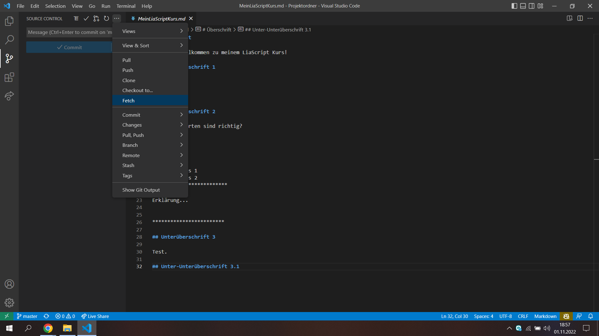</a>
        <figcaption style="text-align:center;font-size:14px;">Abbildung: Screenshot Fetch Button</figcaption>
      </figure>
      Ist nämlich Ihre lokale Version nicht mehr auf dem aktuellsten Stand, dann verändert sich nach dem Klicken von <b>Fetch</b> der <b>Commit</b>-Button. An selber Stelle ist dann <b>Sync Changes</b> zu lesen. Dies bedeutet, dass die lokale Version Ihres Kurses nicht mehr die aktuellste ist und es eine neuere Version online auf GitHub gibt. Der Grund dafür könnte zum Beispiel sein, dass ein Arbeitskollege Veränderungen am Kurs vorgenommen hat oder man selbst auf einem anderen Gerät weitergearbeitet hatte. Mit einem Klick auf <b>Sync Changes</b> können jedenfalls dann die neuesten Änderungen heruntergeladen und in die lokale Version integriert werden. Dies sollte auch auf jeden Fall gemacht werden, da es ansonsten zu <b>Konflikten</b> kommen kann beim Hochladen der neuesten Version.
      <figure style="align:middle;">
        <a href="images/vsc_clone_sync.svg" target="_blank">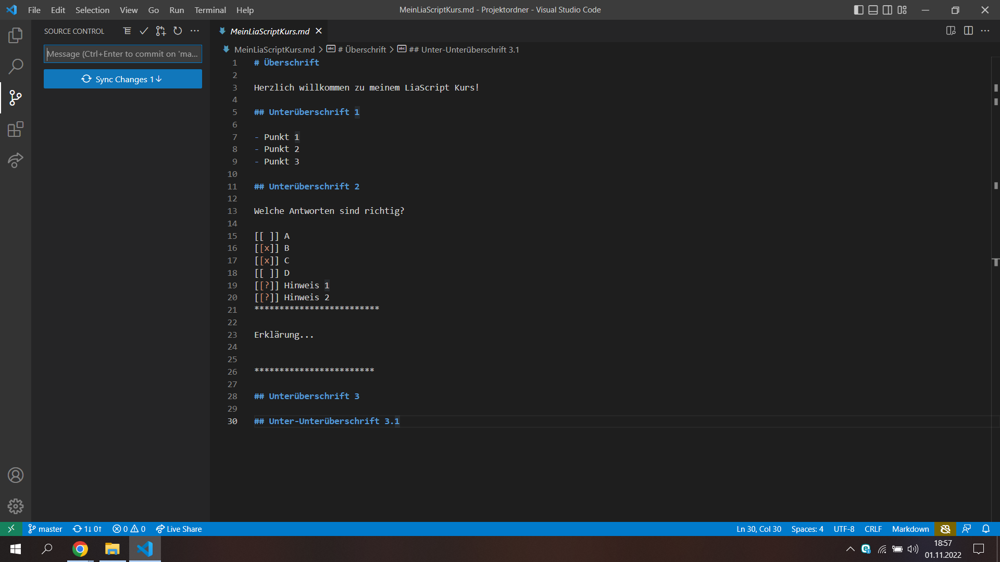</a>
        <figcaption style="text-align:center;font-size:14px;">Abbildung: Screenshot Sync Changes Button</figcaption>
      </figure>
      Haben Sie eine Änderung vorgenommen und gespeichert, wird Ihnen diese zunächst in der LiaScript-Vorschau angezeigt. Sind Sie zufrieden mit dem Ergebnis und möchten die Änderung in den Kurs übernehmen, müssen Sie erneut die Schritte <b>commit</b> und <b>sync changes</b> ausführen. Gehen Sie hierbei wie folgt vor:
        
      1. <b>Fetch</b> anklicken: Um Komplikationen mit verschiedenen Versionen zu vermeiden, sollten Sie dies an dieser Stelle immer noch einmal tun.
        
      2. Die Änderung sollte im Reiter <b>Source Control</b> nun bereits im Bereich <b>Changes</b> angezeigt werden. Überführen Sie alle Änderungen in den Bereich <b>Staged changes</b>, indem Sie <b>Stage All Changes</b> anklicken.
      3. Schreiben Sie erneut einen kleinen Kommentar in das Eingabefeld, durch den Sie beschreiben, welche Änderungen Sie vorgenommen haben. Auf diese Weise behalten Sie Überblick über die Versionshistorie.
      <figure style="align:middle;">
        <a href="images/vsc_newcommit.svg" target="_blank">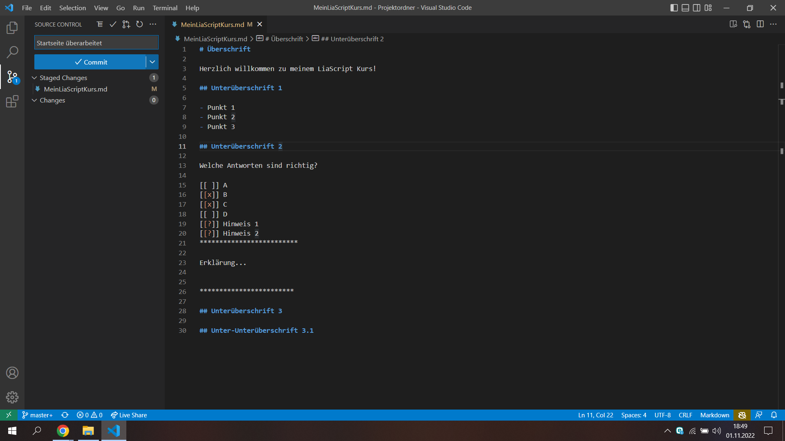</a>
        <figcaption style="text-align:center;font-size:14px;">Abbildung: Screenshot Neuer Commit</figcaption>
      </figure>
      4. Klicken Sie auf <b>Commit</b> und dann auf <b>Sync Changes</b>.
       
      

        <b>Hurra! Ihre Änderungen wurden in Ihr Repository übernommen!</b>
      

    

  

  <button class="accordion">7. Link erstellen, um Kurs mit Lernenden zu teilen</button>
  

    

      Um eine URL für den Kurs mit LiaScript zu erstellen, die Sie dann mit Lernenden oder Kolleg:innen teilen können, wird der <b>Link zu Ihrem Repository</b> benötigt. Gehen Sie in Ihrem Browser auf Ihr Profil in GitHub. Wählen Sie dort Ihren Kurs aus und klicken Sie anschließend mit einem Rechtsklick auf die <b>.md</b> Datei Ihres Kurses. Hier können Sie die Option <b>Adresse des Links kopieren</b> auswählen.
      <figure style="align:middle;">
        <a href="images/vsc_gh_copy_link.svg" target="_blank">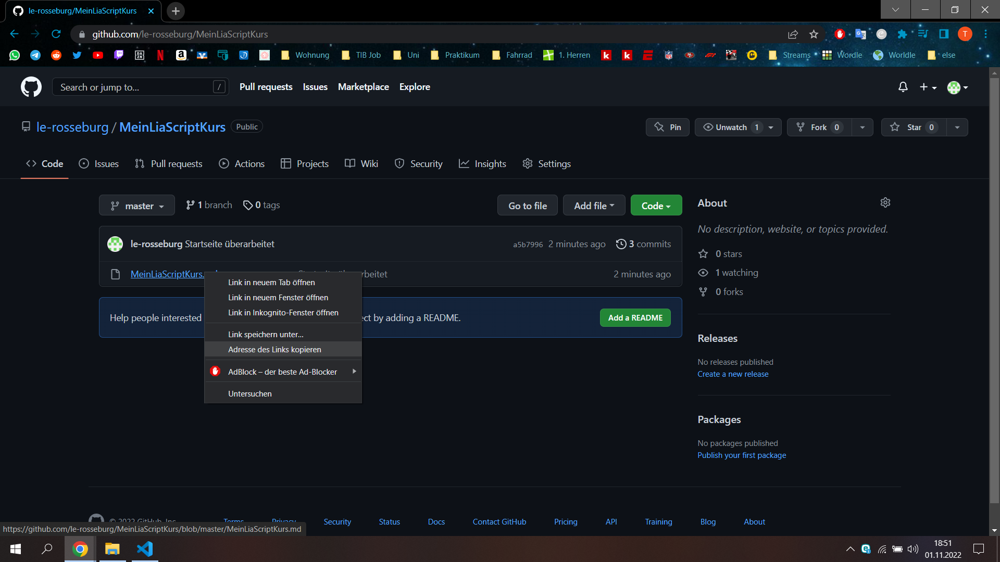</a>
        <figcaption style="text-align:center;font-size:14px;">Abbildung: Screenshot Kopieren des des Repository-Links</figcaption>
      </figure>
      Besuchen Sie anschließend die LiaScript-Website: <a aria-describedby="Link zur LiaScript Seite" href="https://liascript.github.io/">https://liascript.github.io/</a>.
        
      Hier fügen Sie den kopierten Link in das Eingabefeld ein und klicken zum Abschluss auf <b>Load Course</b>. Der Kurs wird nun von LiaScript erstellt und die Kursseite sollte sich in Kürze automatisch öffnen. <b>Unter der obigen URL ist der Kurs nun jederzeit aufrufbar</b>.
      <figure style="align:middle;">
        
        <figcaption style="text-align:center;font-size:14px;">Abbildung: Screenshot LiaScript Startseite</figcaption>
      </figure>
      

        <b>Herzlichen Glückwunsch! Sie haben Ihren ersten eigenen Kurs erfolgreich mit LiaScript erstellt.</b>
      

        
      

        

          <i class="fa fa-lightbulb-o fa-lg"></i> <b>Hinweis</b>: LiaScript hat es Ihnen angetan? Das folgende Video gibt Ihnen umfassende, weiterführende Informationen rund um die Funktionen des Dienstes
        

      

      <figure>
        <iframe width="560" height="315" src="https://www.youtube.com/embed/-JyKxvAkAP0" title="YouTube video player" frameborder="0" allow="accelerometer; autoplay; clipboard-write; encrypted-media; gyroscope; picture-in-picture" allowfullscreen name="Workshop LiaScript (deutsch)"></iframe>
        <figcaption style="text-align:center;font-size:14px;">Video : <a aria-describedby="Link zum Video über LiaScript (YouTube)" href="https://youtu.be/-JyKxvAkAP0">Workshop LiaScrip</a> von Sebastian Zug und André Dietrich</figcaption>
      </figure>
    

  

  <button class="accordion">8. Gemeinsam an einem Kurs arbeiten</button>
  

    

      Sie möchten Ihren LiaScript Kurs nicht allein, sondern zusammen mit anderen Personen bearbeiten? Kein Problem. Zwar lässt sich das Einladen weiterer Mitarbeiter:innen nicht in Visual Studio Code erledigen, über GitHub ist dies aber einfach möglich. Der Dienst ist hervorragend für die Zusammenarbeit mehrerer Personen an einem Projekt geeignet.
    

    

      
<i class="fa fa-exclamation-triangle" style="color:black"></i> <b>Wichtig!</b>
          
        Damit Sie anderen Personen Zugriff auf Ihren Kurs ermöglichen können, müssen diese bei GitHub angemeldet sein. Alle Informationen zum Einrichten eines GitHub Accounts finden Sie unter Punkt 4 "Verbindung zu GitHub herstellen".
          
        <b>Beachten Sie außerdem bei der Arbeit mit mehreren Personen an einem Git-Projekt unbedingt die Hinweise im Infokasten am Ende dieses Schrittes!</b>
      

    

    

      <b>8.1 Wie Sie andere Personen zur Mitarbeit einladen</b>
       
      Geben Sie Ihren Mitarbeiter:innen zunächst Zugriff auf das GitHub Repository, in dem sich Ihre Kursdatei befindet. Loggen Sie sich hierfür über einen Browser bei GitHub (<a aria-describedby="Link zur GitHub Homepage" href="https://github.com/">https://github.com/</a>) ein. Wählen Sie das Repository aus, zu dem sie Kolleg:innen einladen möchten und gehen Sie auf den Reiter <b>Settings</b>.
    

      
      <figure style="align:middle;">
        
        <figcaption style="text-align:center;font-size:14px;">Abbildung: Screenshot Repository Settings in GitHub</figcaption>
      </figure>
       
      Wechseln Sie hier nun in den Abschnitt <b>Manage access</b>.
        
      <figure style="align:middle;">
        
        <figcaption style="text-align:center;font-size:14px;">Abbildung: Screenshot Zugriff verwalten in GitHub</figcaption>
      </figure>
       
      

        Dort angekommen können Sie mit einem Klick auf den Button <b>Invite a collaborator</b> eine:n Mitarbeiter:in hinzufügen.
      

      <figure style="align:middle;">
        
        <figcaption style="text-align:center;font-size:14px;">Abbildung: Screenshot Mitarbeiter:innen zu einem auf GitHub Repository einladen</figcaption>
      </figure>
      

        Sie haben hierbei die Möglichkeit Ihre Mitarbeitenden via GitHub Usernamen, echten Namen oder E-Mail Addresse zu finden.
      

      <figure style="align:middle;">
        
        <figcaption style="text-align:center;font-size:14px;">Abbildung: Screenshot Mitarbeiter:innen finden</figcaption>
      </figure>
      

        Wählen Sie die:den gewünschte:n Mitarbeitende:n aus und klicken Sie anschließend auf <b>Add <Username> to this repository</b>. Selbstverständlich können Sie auch mehr als nur eine Person zur Mitarbeit an Ihrem Repository einladen.
      

      <figure style="align:middle;">
        
        <figcaption style="text-align:center;font-size:14px;">Abbildung: Screenshot Mitarbeiter:innen hinzufügen</figcaption>
      </figure>
       
      

        

          <b>Hurra! Sie haben Ihre:n Mitarbeiter:in erfolgreich zu Ihrem Repository hinzugefügt.</b>
        

          
        <b>8.2 Wie Sie vorgehen, wenn Sie zur Mitarbeit an einem Repository eingeladen wurden</b>
         
        Wurde der Zugang zu einem Repository für Sie als Mitarbeiter:in freigeschaltet, erhalten Sie automatisch eine Einladung per Mail. Warten Sie nicht zu lange, damit die Einladung zu bestätigen. Der Einladungslink in der E-Mail ist nur für einen Zeitraum von 7 Tagen gültig.
      

      <figure style="align:middle;">
        
        <figcaption style="text-align:center;font-size:14px;">Abbildung: Screenshot Einladung zu einem GitHub Repository</figcaption>
      </figure>
      

        Über den Button <b>View invitation</b> werden Sie zu GitHub weitergeleitet. Dort können Sie nach dem Login auf den Button <b>Accept invitation</b> klicken, um die Einladung anzunehmen. Anschließend sind Sie als <b>Collaborator</b> in das Repository eingetragen, d.h. sie können direkt im GitHub Repository Inhalte erstellen und verändern.
          
        Um nun auch über Visual Studio Code an der für Sie freigegebenen Kursdatei arbeiten zu können, müssen Sie den Kurs auf Ihrem Rechner lokal <b>klonen</b>. Dafür gehen Sie in GitHub auf das Repository, an dem Sie mitarbeiten wollen, und kopieren den Link, der Ihnen angezeigt wird wenn Sie auf den grünen <b>Code</b>-Button klicken. Wichtig hierbei ist, dass oben <b>HTTPS</b> ausgewählt ist. Dies entspricht auch der automatischen Voreinstellung.
      

      <figure style="align:middle;">
        
        <figcaption style="text-align:center;font-size:14px;">Abbildung: Screenshot Kopieren eines Repository Links in GitHub</figcaption>
      </figure>
      

        Öffnen Sie nun in Visual Studio Code die Kommandozeile (<b>STRG + SHIFT + P</b>) und geben sie <b>git clone</b> ein. Der Befehl <b>Git: Clone</b> sollte nun zu sehen sein. Wählen Sie ihn aus öffnet sich ein weiteres Eingabefeld, in dem Sie den HTTPS-Link einfügen und das klonen mit Enter bestätigen können. Als Nächstes legen Sie noch den lokalen Speicherort des zu klonenden Repository fest, bevor das herunterladen beginnt.
      

      <figure style="align:middle;">
        <a href="images/vsc_clone_command.svg" target="_blank">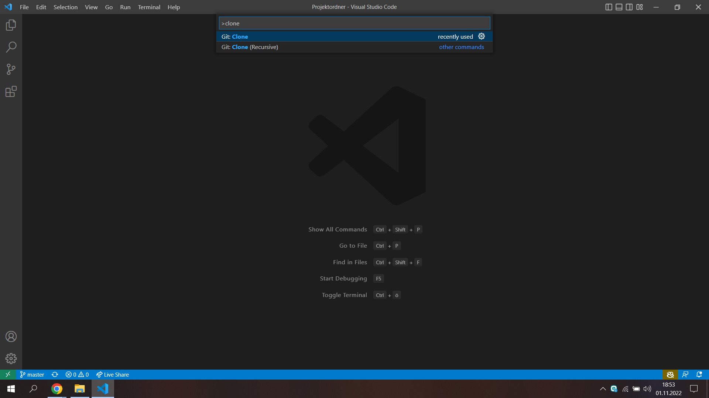</a>
        <figcaption style="text-align:center;font-size:14px;">Abbildung: Screenshot Visual Studio Code Kommandozeile</figcaption>
      </figure>
      

        Sie können nun unter <b>File → Open File...</b> die Kursdatei (Endung .md) auswählen und daran arbeiten. Wie das funktioniert ist unter Punkt 3 "Kurs strukturieren, Inhalte einfügen" dieses Workflows beschrieben.
          
        <b>8.3 Visual Studio Code Erweiterung: Live Share</b>
         
        Visual Studio Code bietet auch noch die Möglichkeit an mit Arbeitskollegen gleichzeitig im selben Dokument zu arbeiten, sodass alle Änderungen in Echtzeit beim Kollegen aktualisiert und übernommen werden. Möglich ist dies mithilfe der Erweiterung <b>Live Share</b>. Vorstellen kann man sich das wie beim kollaborativen open-source Editor HedgeDoc oder dem neuen LiaScript LiveEditor <a aria-describedby="Link zu LiaEdit" href="https://liascript.github.io/LiveEditor/examples.html" target="_blank">LiaEdit</a>.
         
      	Möchten Sie mehr darüber erfahren, dann empfehlen wir Ihnen im Reiter <b>Extensions</b> nach dem PlugIn <b>Live Share</b> zu suchen und sich die Beschreibung und Anleitung dazu durch zu lesen.  
          
        

          <b>Viel Spaß beim Erstellen vielfältiger Lehrmaterialien mit LiaScript!</b>
        

      

      

      
<i class="fa fa-info-circle" style="color:blue"></i>  
        <b>Wichtige Hinweise zum gemeinsamen Arbeiten in Git:</b>
        <ul>
          <li>Damit Sie immer an der aktuellsten Fassung Ihres Kurses arbeiten, müssen Sie vor Beginn der Arbeit an dem Kursdokument unbedingt den Button <b>Fetch</b> klicken</li>
          <li>Pushen/Syncen Sie lieber öfter kleine Änderungen, anstatt einmalig einer großen</li>
          <li>Um Versionskollisionen zu vermeiden, klicken Sie unbedingt auch einmal den Button Fetch bevor Sie etwas pushen!</li>
        </ul>
      

      

  

