<h2>LiaScript Workflow mit LiaEdit</h2>
<link rel="stylesheet" href="https://cdnjs.cloudflare.com/ajax/libs/font-awesome/4.7.0/css/font-awesome.min.css">

  <button class="accordion">1. Getting Started: Installation</button>
  

    

      Der <b>LiaScript LiveEditor</b>, der auch <b>LiaEdit</b> genannt wird, ist ein kostenloser webbasierter und kollaborativer online Editor von LiaScript. Mit diesem Editor ist es möglich LiaScript Kurse <i>(Markdown-Dateien)</i> direkt im Browser zu erstellen und zu veröffentlichen, ohne etwas herunterladen und installieren zu müssen. Einzig allein ein eigener GitHub Account wird benötigt, um die Kurse später zu veröffentlichen. Genaueres gibt es dazu noch später.
        
  	  Dadurch, dass LiaEdit im jedem beliebigen Browser benutzt werden kann, brauchen wir auch nichts zu installieren. Wir müssen lediglich die Website des Editors aufrufen um loszulegen. Den LiaScript LiveEditor "LiaEdit" finden Sie unter folgendem Link: <a href="https://liascript.github.io/LiveEditor/" target="_blank">https://liascript.github.io/LiveEditor/</a>.
    

  

  <button class="accordion">2. Lernmodul (Kursdokument) anlegen</button>
  

    

      Wenn Sie dem obigen Link aus <i>Schritt 1</i> zum Editor gefolgt sind, dann sollte Ihr Browserfenster nun in etwa so aussehen:
      <figure style="align:middle;">
        <a href="images/le_home.svg" target="_blank">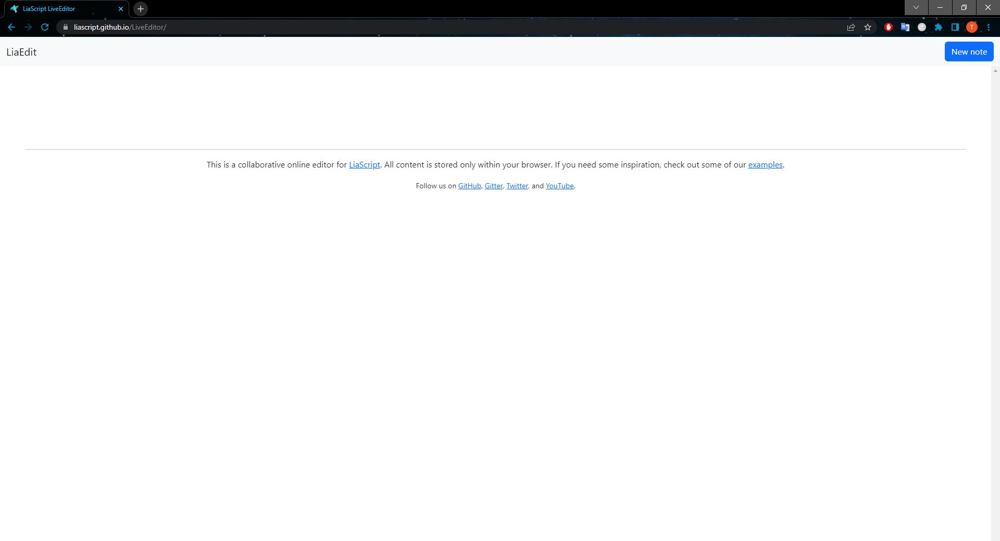</a>
        <figcaption style="text-align:center;font-size:14px;">Abbildung: Screenshot LiaEdit Startseite</figcaption>
      </figure>
       
      Um ein neues Kursdokument anzulegen, benötigt es nicht viel. Mit nur einem einzigen Klick auf den Button "<b>New note</b>", welcher oben rechts zu finden ist, lässt sich eine neue Markdown Datei erstellen. Betätigt man den Button, so wird man direkt weitergeleitet zur Editor-Ansicht, in der die neu erstellte Markdown Datei geöffnet ist.
      <figure style="align:middle;">
        <a href="images/le_node.svg" target="_blank">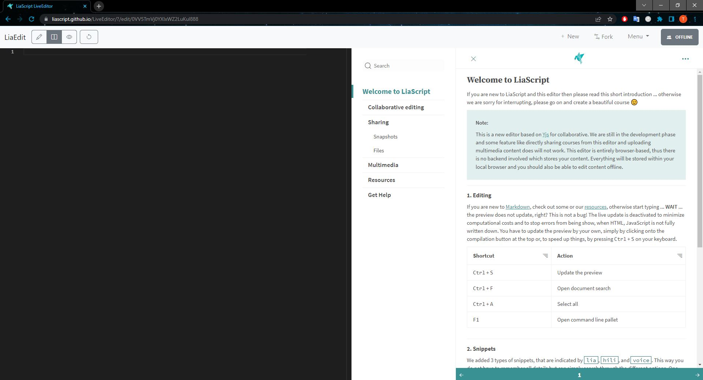</a>
        <figcaption style="text-align:center;font-size:14px;">Abbildung: Screenshot LiaEdit Editor</figcaption>
      </figure>
       
      In der Editor-Ansicht sehen Sie auf der linken Seite den eigentlichen Editor und auf der rechten Seite die automatisch davon erzeugte LiaScript Vorschau. Diese Ansicht kann mithilfe der drei Buttons oben links nach eigenen vorlieben angepasst werden. Die drei Optionen (von links nach rechts) sind: 
      <ul>
        <li>Nur der Editor</li>
        <li>Kombination aus Editor und Vorschau (s.o.)</li>
        <li>Nur die LiaScript Vorschau</li>
      </ul>
    

  

  <button class="accordion">3. Kurs strukturieren, Inhalte einfügen</button>
  

    

      Ist Ihr Lernmodul/Kursdokument angelegt, können Sie beginnen, Inhalte und Materialien einzufügen. Hierfür müssen Sie auf <b>Markdown</b> zurückgreifen. Sie haben noch keine Erfahrungen mit der Auszeichnungssprache gesammelt? Keine Sorge! "Auszeichnungssprache" klingt schlimmer als es ist, Sie müssen hier <b>keine</b> Programmiersprache o.Ä. erlernen. Im folgenden führen wir Sie durch die Gestaltung Ihres Kurses mit Markdown - Sie werden sehen, es ist nicht schwer.
        
      <h6>Anlegen von Kapiteln:</h6>
      Zur Strukturierung Ihres Kurses in Kapitel und Unterkapitel legen Sie Überschriften und Unterüberschriften an. In Markdown wird eine Hauptüberschrift mit einem Hashtag, eine Überschrift zweiter Ordnung mit zwei Hashtags usw. gekennzeichnet. Hier ein kleines Beispiel, wie man Überschriften hinzufügt:
       
      <figure style="align:middle;">
        
        <figcaption style="text-align:center;font-size:14px;">Abbildung: Screenshot LiaEdit Download Markdown-Datei</figcaption>
      </figure>
       
       
      <h6>Hinzufügen und Formatieren von Texten:</h6>
      Schreiben Sie Texte und Anweisungen einfach direkt unter die Überschrift, unter der Sie sie platzieren möchten. Die Formatierung von Texten können Sie durch Markdown-Syntax im Prinzip des Copy und Paste vornehmen. LiaScript sorgt automatisch für ein ansprechendes Layout. Speichern Sie Ihre Eingabe, so können Sie das Aussehen Ihrer Eingabe in der LiaScript Vorschau überprüfen.
        
      Hier ein paar einfache Beispiele zur Formatierung von Texten:
      <ul style="list-style-type:disc">
        <li>Sie möchten ein Wort fett setzen? Zeichnen Sie es wie folgt aus **Beispiel** oder __Beispiel__</li>
        <li>Sie möchten ein Wort kursiv setzen? Zeichnen Sie es wie folgt aus: *Beispiel* oder _Beispiel_</li>
        <li>Sie möchten einen Link einfügen? Zeichnen Sie ihn wie folgt aus: [Linktext](Link)</li>
        <li>Sie möchten eine Liste einfügen? Zeichnen Sie die Aufzählung wie folgt aus:</li>
      </ul>    
      <figure style="align:middle;">
        <a href="images/le_liste.svg" target="_blank">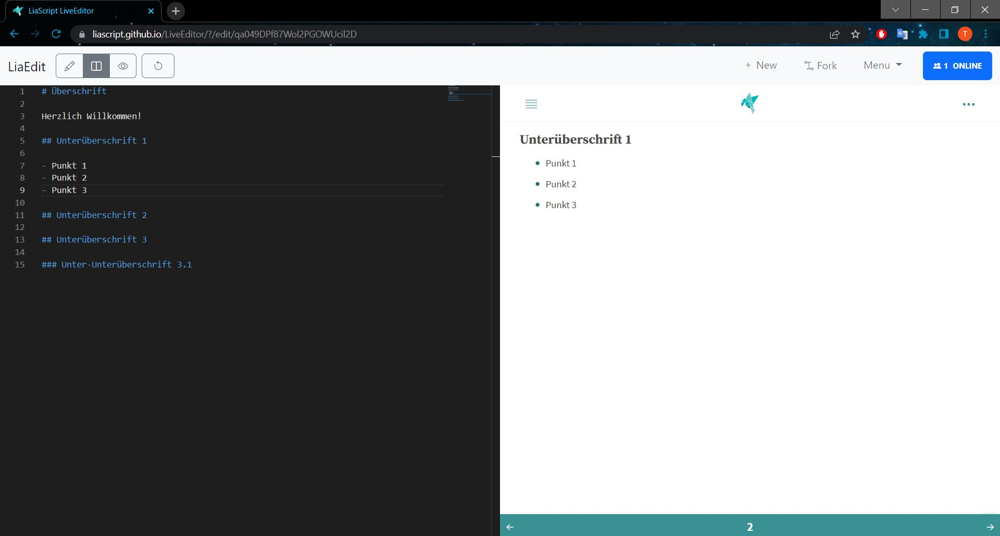</a>
        <figcaption style="text-align:center;font-size:14px;">Abbildung: Screenshot Anlegen einer Liste in Markdown</figcaption>
      </figure>
      

        

          <i class="fa fa-lightbulb-o fa-lg"></i> <b>Hinweis:</b> Einen Überblick über die wichtigste Markdown-Syntax zum Kopieren und Einfügen finden Sie hier:
          <ul style="list-style-type:disc">
            <li><a aria-describedby="Link zum Markdown Cheat Sheet" href="https://github.com/adam-p/markdown-here/wiki/Markdown-Cheatsheet">Markdown Cheatcheat</a> von Adam Pritchard, lizenziert unter <a aria-describedby="Link zur Quelle" href="https://creativecommons.org/licenses/by/3.0/legalcode">CC BY (3.0, unported)</a></li>
            <li><a aria-describedby="Link zum Markdown Guide" href="https://www.markdownguide.org/">Markdown Guide</a> von Matt Cone, lizenziert unter <a aria-describedby="Link zur Quelle" href="https://creativecommons.org/licenses/by-sa/4.0/">CC BY-SA 4.0</a></li>
          </ul>
        

      

       
      <h6>Hinzufügen weiterer Elemente:</h6>
      LiaScript ist insbesondere dafür geeignet, interaktive Lernobjekte in Ihre Kursstruktur zu integrieren. <b>Kopieren Sie die Syntax, die Sie dafür benötigen aus dem digitalen <a aria-describedby="Link zu LiaScript Handbuch" href="https://liascript.github.io/course/?https://raw.githubusercontent.com/liaScript/docs/master/README.md#1">LiaScript Handbuch</a> von André Dietrich, Sebastian Zug, Karl Fessel und Steve Rehm</b>. Das Handbuch ist explizit dafür vorgesehen, Ihnen bei der Integration von Elementen in LiaScript zu helfen.
        
      Hier ein Beispiel, in dem eine Quizfrage (mit Hinweisen + Erklärung) nach Vorgabe des Handbuchs erstellt werden kann.
      <figure style="align:middle;">
        <a href="images/le_quiz.svg" target="_blank">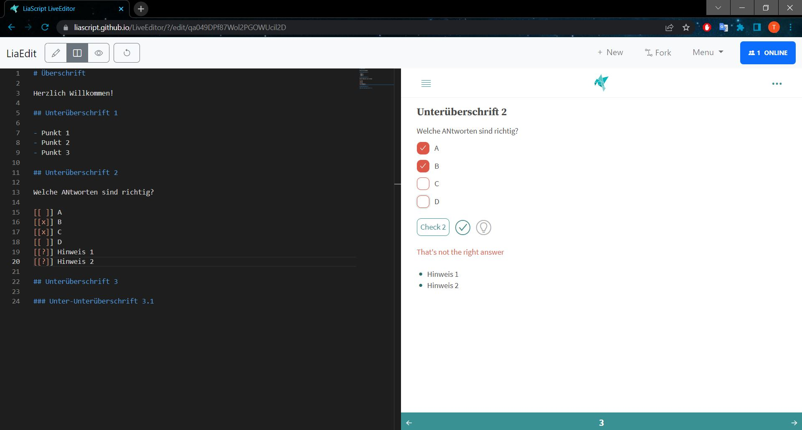</a>
        <figcaption style="text-align:center;font-size:14px;">Abbildung: Screenshot Erstellung eines Quiz mit LiaScript</figcaption>
      </figure>
      <figure style="align:middle;">
        <a href="images/le_quiz_solution.svg" target="_blank">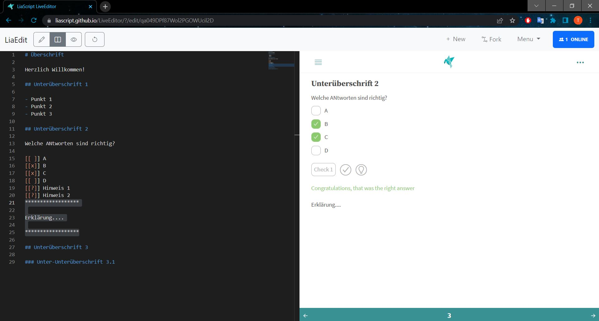</a>
        <figcaption style="text-align:center;font-size:14px;">Abbildung: Screenshot Erstellung eines Quiz mit LiaScript mit Lösungserklärung</figcaption>
      </figure>
      

        

          <i class="fa fa-lightbulb-o fa-lg"></i> <b>Hinweis:</b> Neben interaktiven Lernobjekten wie Quizfragen bietet LiaScript noch viele weitere Features an, um Ihren Kurs individuell zu gestalten. In dem sich ständig erweiternden <a aria-describedby="Link zu LiaScript Handbuch" href="https://liascript.github.io/course/?https://raw.githubusercontent.com/liaScript/docs/master/README.md#1">LiaScript Handbuch</a> finden Sie alle zur Verfügung stehenden Features mit Erklärungen, wie Sie diese in Ihren Kurs integrieren können.
        

      

    

  

  <button class="accordion">4. Kurs online ablegen</button>
  

    

      Damit aus Ihrem Dokument ein LiaScript Kurs generiert, veröffentlicht und geteilt werden kann, muss das Kursdokument <i>(Markdown-datei)</i> irgendwo <b>öffentlich</b> im Internet abgelegt sein. Dies kann auf vielen verschiedenen Plattformen passieren. Der LiaScript LiveEditor benutzt zum Veröffentlichen der Liascript Kurse die Plattform <b>GitHub</b>. Das heißt, um alle Funktionen von LiaEdit vollständig nutzen zu können benötigt man einen <b>kostenfreien</b> GitHub Account. Falls Sie den Editor nur zum Erstellen der Markdown-Datei nutzen möchten und Ihren Kurs woanders veröffentlichen wollen, dann brauchen Sie sich auch keinen GitHub Account zu erstellen. Mehr dazu weiter unten in der Infobox. 
       
      <h6>GitHub Anmeldung</h6>
      Besuchen Sie für die Anmeldung die Seite <a href="www.github.com" target="_blank">www.github.com</a> und klicken Sie oben rechts auf <b>Sign Up</b>.
        
      In dem folgenden Fenster tragen Sie einen <b>Usernamen</b>, ihre <b>E-Mail</b> und ein <b>Passwort</b> ein. Mit einem Klick auf den Button <b>Create Account</b> erstellen Sie sich Ihren eigenen Account.
        
      Zum Abschluss müssen Sie nun lediglich noch Ihre E-Mail-Adresse <b>verifizieren</b>. Dafür erhalten Sie eine E-Mail von GitHub mit dem Betreff <b>[GitHub] Please verify your email address</b>. Dort klicken Sie auf den Button <b>Verify email address</b>. Nun werden Sie auf eine Seite geführt, die die Verifizierung Ihres Accounts bestätigt.
      <figure style="align:middle;">
        
        <figcaption style="text-align:center;font-size:14px;">Abbildung: Screenshot GitHub Verified Email Address</figcaption>
      </figure>
           
      Haben Sie sich einen GitHub Account erstellt, so können wir mit öffentlichen Ablegen des Kurses weitermachen. Der LiaScript LiveEditor verwendet zum Ablegen und Veröffentlichen die GitHub Funktion <b>GitHub Gist</b>.
        
      

        

          <i class="fa fa-lightbulb-o fa-lg"></i> <b>GitHub Gist</b> ist eine Subdomäne von GitHub auf der <b>Gists</b> erstellt werden können. Mit Gists können schnell und einfach kleine Code Schnipsel oder Texte online gespeichert werden, welche alleine kein umfassendes Repository rechtfertigen. Sie sind eine hervorragende, leichtgewichtige Option, wenn Sie nur schnell etwas Code oder Text austauschen wollen. Die Besonderheit an GitHub Gist ist die, dass du zusätzlich die für GitHub typische Git Versionsverwaltung hast.
        

      

       
      

        
<i class="fa fa-exclamation-triangle" style="color:black"></i>  <b>Achtung!</b>
            
          Nur beim <b>erstmaligen</b> Exportieren des Kursdokuments zu GitHub Gist wird automatisch ein LiaScript Kurs aus dem <b>RAW-File</b> generiert. Späteres erneutes Exportieren, was hier mit speichern zu vergleichen ist, aktualisiert lediglich den Gist, aber leider nicht den daraus generierten Kurs. Dies liegt daran, dass mit einer Aktualisierung des Gist der GitHub RAW-File nicht mit aktualisiert wird, sondern ein komplett neuer RAW-File erstellt wird. Dadurch ändert sich auch die Internetadresse des GitHub RAW-Files, wodurch der LiaScript Kurs die Änderungen nicht mitbekommt.
            
          Das hat nun schlussendlich die Folge, dass man <b>bei späteren Änderungen</b> am Kursdokument <b>selbstständig</b> den Kurs mithilfe des neuen GitHub RAW-Files <b>neu generieren</b> muss. Das ist zwar kein großer Aufwand, jedoch sollte einem bewusst sein, dass sich dadurch zwangsläufig auch die Internetadresse des LiaScript Kurses verändert. Falls man diesen zusätzlichen Schritt vermeiden möchte, exportieren Sie Ihren Kurs erst zum Abschluss nach dem vollständigen eintragen aller Inhalte.
            
          Mehr dazu weiter unten im Punkt 5: Kursinhalte ändern oder weiterbearbeiten.
        

      

      Um den eigenen Kurs nun bei GitHub Gist öffentlich abzulegen, wählen Sie zunächst oben rechts das <b>Menü</b> aus und anschließend in dem sich öffnenden Reiter die Option <b>Export to... GitHub Gists</b>. 
      <figure style="align:middle;">
        <a href="images/le_gh_gist.svg" target="_blank">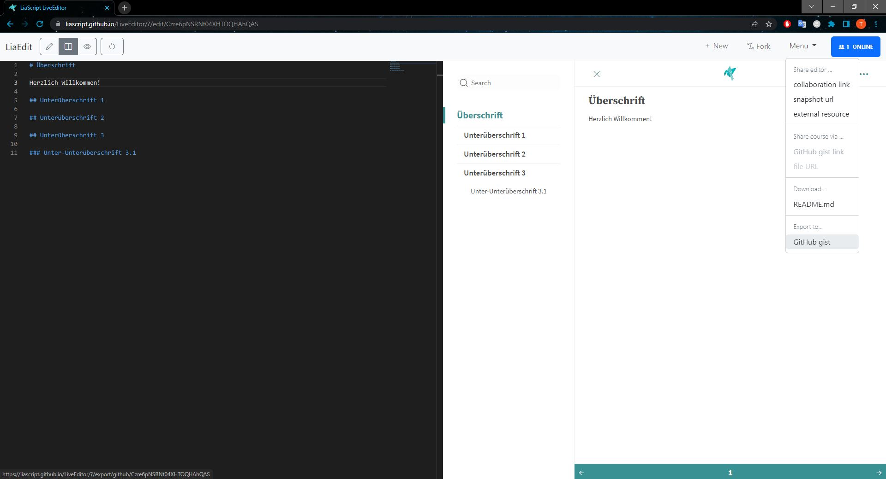</a>
        <figcaption style="text-align:center;font-size:14px;">Abbildung: Screenshot LiaEdit GitHub Gist</figcaption>
      </figure>
       
      Daraufhin öffnet sich automatisch ein neuer Browsertab der Sie zu Ihrem gerade neu erstellten Gist führt in dem sich Ihr Kursdokument befindet. Falls Sie diesen Schritt zum ersten mal mit LiaEdit ausführen, erwartet Sie noch ein kleiner Zwischenschritt. Und zwar werden Sie dann zunächst einmal noch von GitHub aufgefordert den Zugriff vom LiaScript LiveEditor zu authorisieren.
      <figure style="align:middle;">
        
        <figcaption style="text-align:center;font-size:14px;">Abbildung: Screenshot LiaEdit GitHub Gist authorization</figcaption>
      </figure>
      <figure style="align:middle;">
        <a href="images/le_gh_gist2.svg" target="_blank">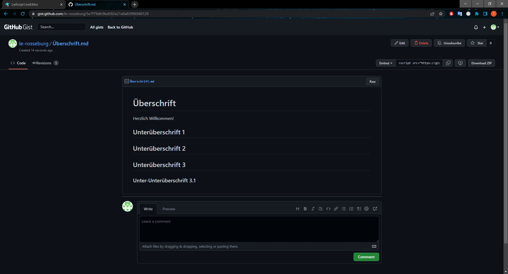</a>
        <figcaption style="text-align:center;font-size:14px;">Abbildung: Screenshot  GitHub Gist </figcaption>
      </figure>
       
      

        

          <i class="fa fa-lightbulb-o fa-lg"></i> <b>Hinweis:</b> Falls Sie GitHub nicht als Ablageort verwenden möchten, jedoch ungern auf den LiaScript LiveEditor verzichten möchten, dann müssen Sie das auch nicht, denn LiaEdit bietet neben GitHub Gists auch die Option an, dass Kursdokument herunterzuladen. So können Sie dann selber entscheiden was Sie mit Ihrem Dokument machen. Wählen Sie hierfür im <b>Menü</b> die Option <b>Download... README.md</b> aus.
          <figure style="align:middle;">
            
            <figcaption style="text-align:center;font-size:14px;">Abbildung: Screenshot LiaEdit Download Markdown-Datei</figcaption>
          </figure>
        

      

    

  

  <button class="accordion">5. Kurs veröffentlichen und teilen</button>
  

    

      Um Ihren Kurs zu veröffentlichen und um eine URL zu erzeugen, die Sie dann mit Lernenden oder Kolleg:innen teilen können, muss durch die Hilfe des LiaScript LiveEditors nicht mehr viel getan werden. Mit dem Exportieren des Kursdokuments zu GitHub Gist in Schritt 4 wurde gleichzeitig ein LiaScript Kurs aus dem Dokument generiert und eine neue Option im Menü von LiaEdit freigeschaltet. Die neue Option lautet <b>Share course via... GitHub gist link</b>. 
      <figure style="align:middle;">
        <a href="images/le_gh_gist_link.svg" target="_blank">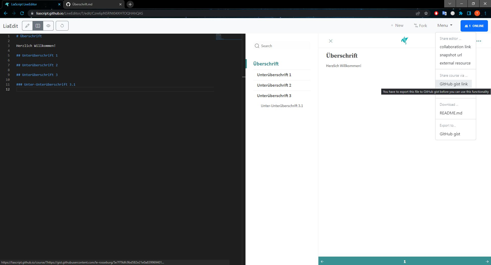</a>
        <figcaption style="text-align:center;font-size:14px;">Abbildung: Screenshot LiaEdit GitHub Gist published link</figcaption>
      </figure>
       
      Wählt man diese Option aus, so wird man zu dem bereits generierten LiaScript Kurs weitergeleitet. <b>Unter der obigen URL ist der Kurs nun jederzeit aufrufbar</b>.
      <figure style="align:middle;">
        <a href="images/le_published.svg" target="_blank">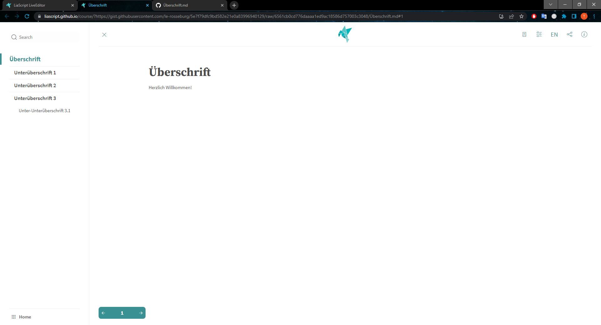</a>
        <figcaption style="text-align:center;font-size:14px;">Abbildung: Screenshot published course</figcaption>
      </figure>
       
      

        <b>Herzlichen Glückwunsch! Sie haben Ihren ersten eigenen Kurs erfolgreich mit LiaScript erstellt.</b>
      

        
      

        

          <i class="fa fa-lightbulb-o fa-lg"></i> <b>Hinweis</b>: LiaScript hat es Ihnen angetan? Das folgende Video gibt Ihnen umfassende, weiterführende Informationen rund um die Funktionen des Dienstes
        

      

    

  

  <button class="accordion">6. Kursinhalte ändern oder weiterbearbeiten</button>
  

    

      Wenn Sie Ihren Kurs nun weiter <b>bearbeiten</b>, <b>aktualisieren</b> oder generell <b>verändern</b> wollen, können Sie dies direkt im LiaScript LiveEditor tun. Das Bearbeiten des Kurses ist mit LiaEdit allerdings nicht ganz so leicht als im Vergleich mit anderen Editoren (z.B. Visual Studio Code. Denn das Weiterbearbeiten des Kursinhalts bringt leider unerwünschte zusätzliche Hürden mit sich.
        
      Wie schon zuvor erwähnt (Warnbox in Punkt 4) hat späteres bearbeiten des Kursdokuments die Folge, dass der LiaScript Kurs <b>neu generiert</b> werden muss, wodurch sich leider auch die Internetadresse (URL) des endgültigen Kurses ändert. Der "alte" Kurs bleibt zwar bestehen, jedoch werden dort die Neuerungen nicht übernommen. Bei Veränderungen müsste der Kurs dann also an alle Lernenden und Lehrenden neu geteilt werden.
        
      Neben diesem Punkt müssen zusätzliche Schritte absolviert werden um den Kurs zu bearbeiten, falls die entsprechende <i>note</i> bei LiaEdit gelöscht wurde. Ist dies der Fall, dann muss das Kursdokument von GitHub Gist neu importiert werden. Wie das alles geht zeigen wir ihnen nun.
        
      <h5>Schritt 1: Das Kursdokument öffnen</h5>
      Wenn Sie <a href="https://liascript.github.io/LiveEditor/" target="_blank">LiaEdit</a> in Ihrem Browser öffnen, dann sollte Sie eine <b>Übersichtsseite</b> erwarten, welche all ihre bisherigen <i><b>notes</b></i> (Kursdokumente) zeigt. Im folgenden Bild ist solch eine Übersichtsseite zu sehen. In diesem Beispiel wurde bislang nur eine <i>note</i> mit LiaEdit erstellt. Hier ist auch gut zu erkennen, ob die <i>note</i> schon veröffentlicht und nach GitHub Gist exportiert wurde. Und zwar wird im Falle eines Exports der GitHub Gist Link in der Übersicht mit angezeigt.
        
      

        

          <i class="fa fa-lightbulb-o fa-lg"></i> <b>Hinweis:</b> Sollten Sie Probleme haben innerhalb des LiaScript LiveEditors die Übersichtsseite zu finden (z.B. wenn Sie eine <i>note</i> geöffnet haben und Sie sich im Editor befinden), dann kann ich Sie beruhigen, denn die Übersichtsseite ist <b>immer</b> über den <b>LiaEdit Schriftzug</b>, oben links in der Ecke der Seite, zu erreichen.
        

      

      Haben Sie Ihr Kursdokument auf der Übersichtsseite gefunden, dann können Sie auf den blauen <b>Edit</b> Button klicken, um zum Editor zu gelangen und mit dem Bearbeiten des Kurses zu beginnen.
      <figure style="align:middle;">
        <a href="images/le_home2.svg" target="_blank">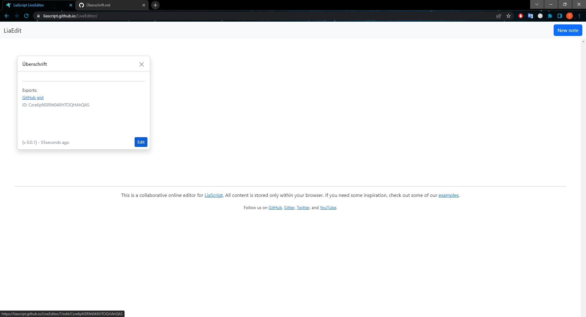</a>
        <figcaption style="text-align:center;font-size:14px;">Abbildung: Screenshot LiaEdit Startseite 2</figcaption>
      </figure>
       
      

        
<i class="fa fa-exclamation-triangle" style="color:black"></i> <b>Achtung!</b>
            
          Es ist zu empfehlen die <i>notes</i> von der Übersichtsseite <b>nicht zu löschen</b>. Gleiches gilt für die <b>Browser Cookies</b> von LiaScript, da mit dem Löschen der Cookies auch alle <i>notes</i> im Editor gelöscht werden.
            
          Das Löschen der <b>schon veröffentlichten <i>notes</i></b> sorgt zwar <b>nicht</b> dafür, dass der dazugehörige Gist inklusive Veröffentlichung gelöscht wird, jedoch erschwert das Löschen der <i>notes</i> das anschließende weiterarbeiten an den Dateien.
            
          Ist die <i>note</i> einmal gelöscht, so verschwindet auch die Verknüpfung vom Gist zur <i>note</i>. Der Kurs kann zwar nun mithilfe des GitHub Gist links bei LiaEdit neu importiert werden. Anschließend vorgenommene Änderungen werden aber nun nicht mehr automatisch mit dem GitHub Gist synchronisiert. Es wird stattdessen ein komplett neuer GitHub Gist erstellt.
      

       
      <h6>Sonderfall: Gelöschte LiaEdit <i>note</i></h6>
      Wurde die LiaEdit <i>note</i> gelöscht muss das Kursdokument erstmal neu importiert werden. Öffnen Sie dafür eine neue oder bereits bestehende LiaEdit note und wählen Sie anschließend im <b>Menü</b> die Option <b>Share editor... external resource</b> aus. Daraufhin öffnet sich in der Mitte des Bildschirms ein kleineres Fenster in dem sich ein Eingabefeld befindet. In diesem soll der Link (die URL) zum zu importierenden Dokument eingetragen werden.
      <figure style="align:middle;">
        <a href="images/le_external.svg" target="_blank">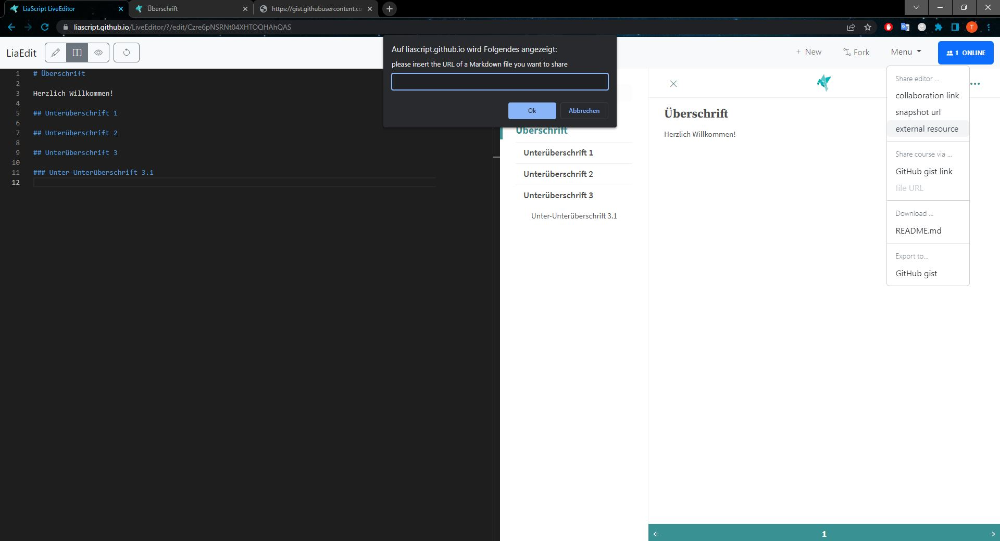</a>
        <figcaption style="text-align:center;font-size:14px;">Abbildung: Screenshot LiaEdit load external source</figcaption>
      </figure>
       
      Die URL Ihres Kursdokuments finden Sie beim zugehörigem GitHub Gist. Wechseln Sie also zu GitHub und wählen Sie im Menü (oben rechts hinter Ihrem Profilbild) die Option <b>Your gists</b> aus. Bei Ihren Gists angekommen wählen Sie das richtige aus und klicken Sie auf der folgenden Seite den Button <b>RAW</b> aus. Dieser ist oben rechts beim Kursdokument zu finden und leitet Sie zur RAW Ansicht des Dokumentes weiter. 
      <figure style="align:middle;">
        <a href="images/le_gh_gists.svg" target="_blank">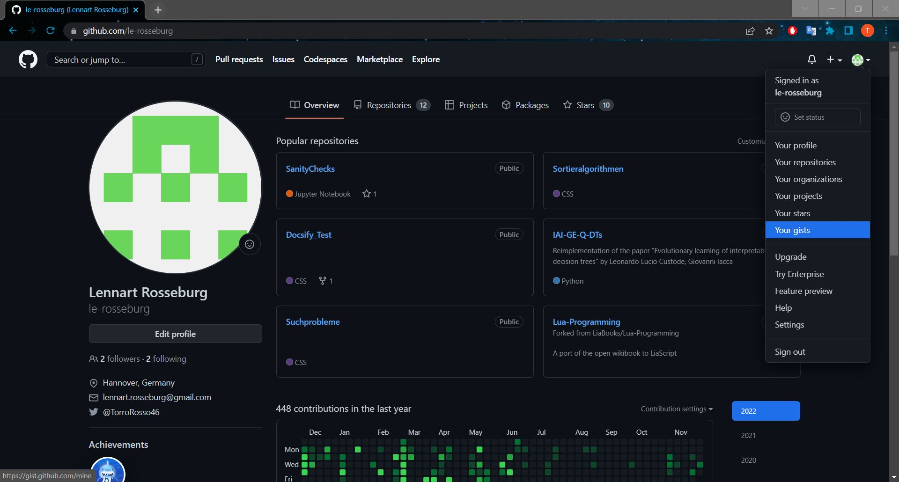</a>
        <figcaption style="text-align:center;font-size:14px;">Abbildung: Screenshot GitHub Your Gists</figcaption>
      </figure>
      <figure style="align:middle;">
        <a href="images/le_gh_raw.svg" target="_blank">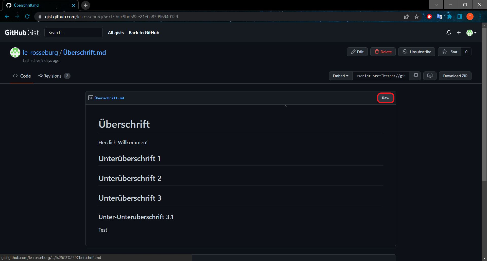</a>
        <figcaption style="text-align:center;font-size:14px;">Abbildung: Screenshot GitHub RAW Button</figcaption>
      </figure>
      <figure style="align:middle;">
        <a href="images/le_gh_raw_view.svg" target="_blank">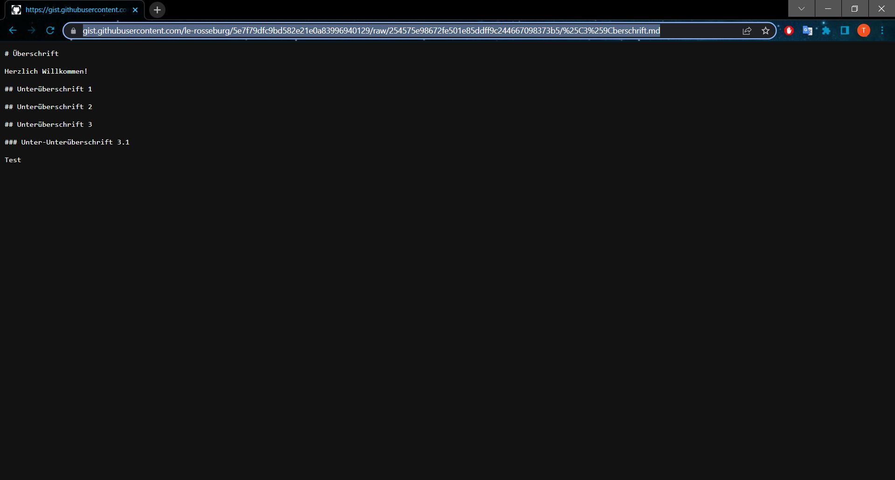</a>
        <figcaption style="text-align:center;font-size:14px;">Abbildung: Screenshot GitHub RAW File</figcaption>
      </figure>
       
      Kopieren Sie nun den Link oben aus der Adressleiste heraus und fügen Sie ihn bei LiaEdit in das bereits erwähnte Eingabefeld ein. Nachdem Sie den Link bestätigt haben sollte folgendes Fenster erscheinen. Wählen Sie in diesem Fenster den blau markierten Link aus, um zu einer neuen <i>note</i> mit Ihren nun importierten Kursinhalten zu gelangen.
      <figure style="align:middle;">
        <a href="images/le_external2.svg" target="_blank">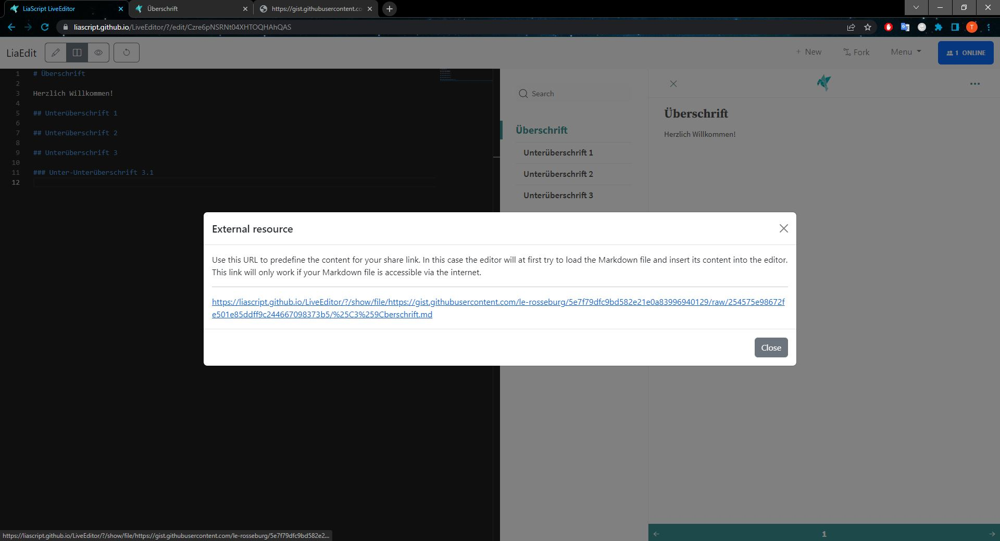</a>
        <figcaption style="text-align:center;font-size:14px;">Abbildung: Screenshot LiaEdit load external source 2</figcaption>
      </figure>
       
      Dort angekommen können Sie aber noch nicht sofort loslegen. Ein Schritt fehlt noch. Sie müssen die LiaEdit <i>note</i> zunächst noch kopieren (Fork). Dafür müssen Sie den Button <b>Fork</b>, welcher oben rechts zu finden ist, auswählen. Ein Hinweistext unten rechts macht Sie auch auf selbiges aufmerksam. 
      <figure style="align:middle;">
        <a href="images/le_fork_info.svg" target="_blank">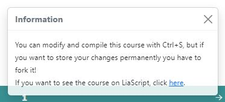</a>
        <figcaption style="text-align:center;font-size:14px;">Abbildung: Screenshot LiaEdit Fork information</figcaption>
      </figure>
       
      <figure style="align:middle;">
        <a href="images/le_fork.svg" target="_blank">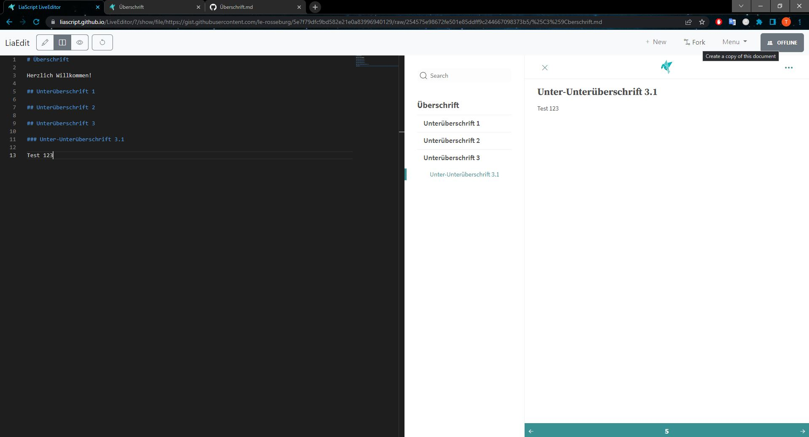</a>
        <figcaption style="text-align:center;font-size:14px;">Abbildung: Screenshot LiaEdit Fork the external source</figcaption>
      </figure>
       
      <h5>Schritt 2: Kursinhalte bearbeiten</h5>
      Haben Sie dies getan können Sie mit dem bearbeiten endlich anfangen. Von hier an funktioniert alles so wie bei einer neu erstellten <i>note</i>. Wenn Sie diese <i>note</i> nun wieder erneut exportieren, dann würde eine neue Gist auf GitHub erstellt werden. Dies ist im folgenden Bild nochmals dargestellt. <b>Oben</b> die neue Gist mit dem <b>importierten</b> Kursdokument und <b>unten</b> die Gist welche aus dem <b>originalen</b> Dokument erstellt wurde.
      <figure style="align:middle;">
        <a href="images/le_fork2.svg" target="_blank">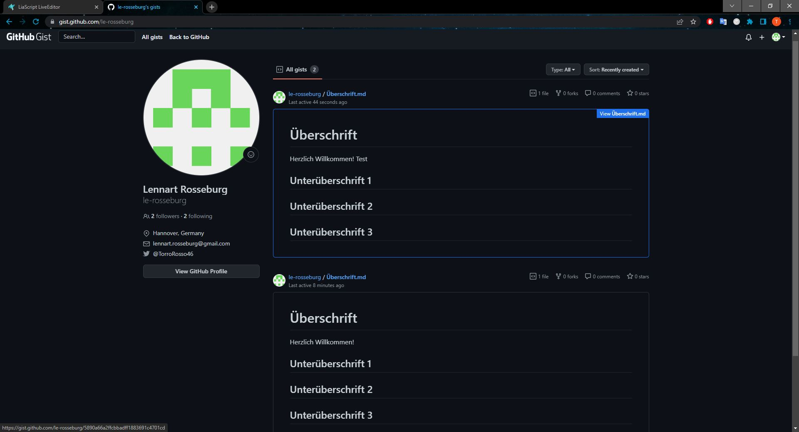</a>
        <figcaption style="text-align:center;font-size:14px;">Abbildung: Screenshot GitHub Gist comparison original and forked</figcaption>
      </figure>
       
    

  

  <button class="accordion">7. Gemeinsam an einem Kurs arbeiten</button>
  

    

      Möchten Sie gemeinsam mit Arbeitskollegen am Kurs arbeiten, dann ist dies auch mit dem LiaScript LiveEditor ganz einfach möglich. Die im Menü zu findende Option <b>Share course... collaboration link</b> ermöglicht es einem gleichzeitig, in <b>Echtzeit</b> aktualisiert, mit Arbeitskollegen am Dokument zu arbeiten. Der Besitzer, oder auch Host genannt, des Dokuments muss dafür auch nicht online sein. Arbeitskollegen können also gleichzeitig oder alleine (<b>synchron oder asynchron</b>) am Dokument weiterarbeiten. Dafür muss lediglich der Link geteilt werden, den man in dem sich öffnenden Fenster erhält, wenn man die oben genannte Menüoption auswählt.
      <figure style="align:middle;">
        <a href="images/le_collab1.svg" target="_blank">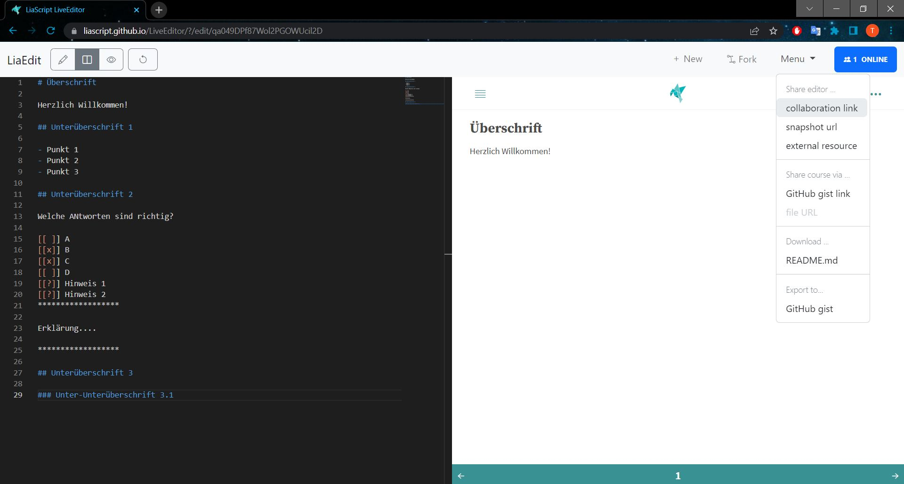</a>
        <figcaption style="text-align:center;font-size:14px;">Abbildung: Screenshot collaboration option</figcaption>
      </figure>
      <figure style="align:middle;">
        <a href="images/le_collab2.svg" target="_blank">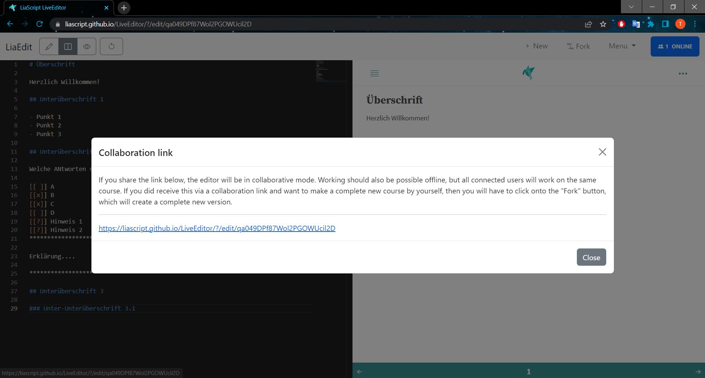</a>
        <figcaption style="text-align:center;font-size:14px;">Abbildung: Screenshot collaboration link</figcaption>
      </figure>
    

  

 

  <button class="accordion" style="background-color: #54B6B5;">F.A.Q.</button>
  

    

      <table>
        <tr style="background-color: #F0F2F6;">
          <td style="background-color: #D1D8E1; border: 1px solid #0A1F40;">LiaScript LiveEditor <b>aka</b> LiaEdit</td>
          <td style="border: 1px solid #0A1F40;">
            LiaEdit ist ein <b>kostenloser webbasierter</b> und <b>kollaborativer online Editor</b> von LiaScript. Mit diesem Editor ist es möglich LiaScript Kurse <b>direkt im Browser</b> zu erstellen und zu veröffentlichen, <b>ohne</b> etwas herunterladen und installieren zu müssen. Einzig allein ein eigener GitHub Account wird benötigt, um die Kurse zu veröffentlichen. 
          </td>
        </tr>
        <tr style="background-color: #F0F2F6;">
          <td style="background-color: #D1D8E1; border: 1px solid #0A1F40;">Vorteile</td>
          <td style="border: 1px solid #0A1F40;">
            <ul>
              <li><b>Kostenloser</b> Editor</li>
              <li>Der Editor muss <b>nicht</b> installiert werden</li>
              <li>Alles findet innerhalb des Browsers statt</li>
              <li>Kollaboratives arbeiten in <b>Echtzeit</b> möglich</li>
              <li>Direkte LiaScript Vorschau innerhalb des Editors</li>
              <li>Per Knopfdruck online ablegen und veröffentlichen</li>
              <li>Kursdatei (Markdown) kann heruntergeladen werden</li>
              <li>LiaScript PlugIns automatisch installiert (liascript-preview, liascript-snippets)
            </ul>
          </td>
        </tr>
        <tr style="background-color: #F0F2F6;">
          <td style="background-color: #D1D8E1; border: 1px solid #0A1F40;">Nachteile</td>
          <td style="border: 1px solid #0A1F40;">
            <ul>
              <li>Kursdatei wird <b>nur</b> innerhalb des eigenen Browsers gespeichert (Cookies)</li>
              <li>Eigene Medien können nur über Umwege eingefügt werden</li>
              <li>Bearbeiten des Inhalts nach Veröffentlichung ist sehr <b>kompliziert</b></li>
              <li>Bei Veränderungen am Kurs <b>verändert</b> sich auch die öffentliche <b>URL</b> unter dem der Kurs aufgerufen werden kann</li>
              <li>Keine Git Versionsverwaltung innerhalb des Editors möglich</li>
            </ul>
          </td>
        </tr>
        <tr style="background-color: #F0F2F6;">
          <td style="background-color: #D1D8E1; border: 1px solid #0A1F40;">GitHub Gist</td>
          <td style="border: 1px solid #0A1F40;">
            GitHub Gist ist <b>eine Subdomäne von GitHub</b> auf der <b>Gists</b> erstellt werden können. Mit Gists können schnell und einfach kleine Code Schnipsel oder Texte online gespeichert werden, welche alleine kein umfassendes Repository rechtfertigen. Sie sind eine hervorragende, leichtgewichtige Option, wenn Sie nur schnell etwas Code oder Text austauschen wollen. Die Besonderheit an GitHub Gist ist die, dass du zusätzlich die für GitHub typische Git Versionsverwaltung hast.
              
            In unserem Anwendungsfall <b>zweckentfremden</b> wir GitHub Gist wieder nur als <b>Ablageort</b>.
          </td>
        </tr>
        <tr style="background-color: #F0F2F6;">
          <td style="background-color: #D1D8E1; border: 1px solid #0A1F40;">Eigene Medien einbetten</td>
          <td style="border: 1px solid #0A1F40;">
            Online Medien können ohne Probleme im LiaScript LiveEditor wie gewohnt eingebettet werden. Bei eigenen lokalen Medien ist dies leider nicht so leicht möglich. Bevor eigene Medien (Bilder, Videos, Audios) eingefügt werden können müssen sie irgendwo online, z.B. in einem Git Repository, abgelegt bzw. hochgeladen werden.
          </td>
        </tr>
        <tr style="background-color: #F0F2F6;">
          <td style="background-color: #D1D8E1; border: 1px solid #0A1F40;">Kollaboratives arbeiten</td>
          <td style="border: 1px solid #0A1F40;">
            Kollaboratives arbeiten ist mit dem LiaScript LiveEditor sehr gut möglich. Arbeitskolleg:innen können ganz einfach <b>via Link</b> dazu eingeladen werden, um an der Kursdatei mit zu arbeiten. Das tolle an LiaEdit ist, dass Veränderungen in <b>Echtzeit</b>, d.h. sofort, an alle Kolleg:innen weitergegeben werden. Dadurch kann sehr gut vermieden werden, dass Inhalte doppelt erstellt werden. 
          </td>
        </tr>
      </table>
    

  

