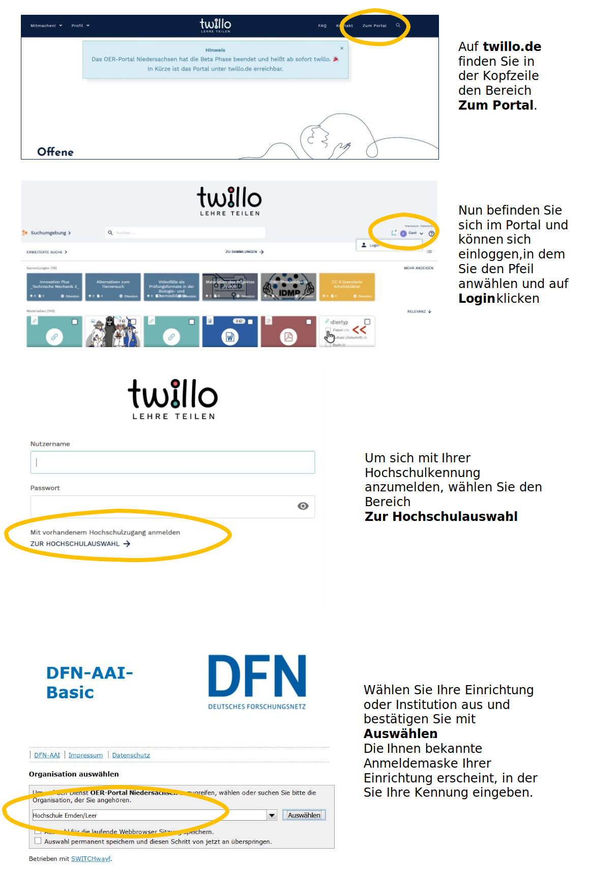
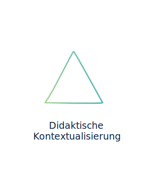
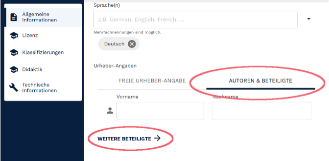
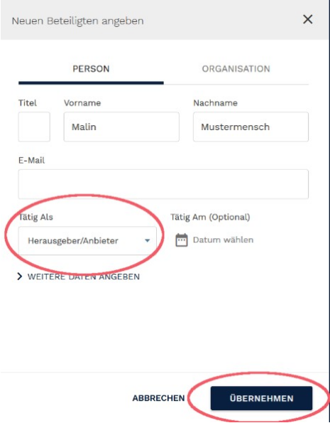
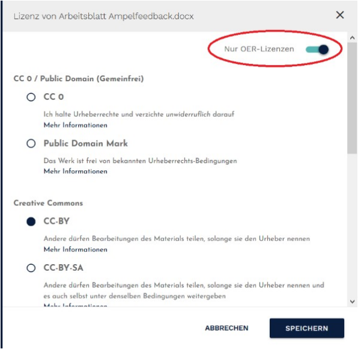
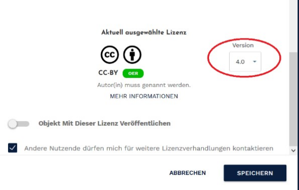
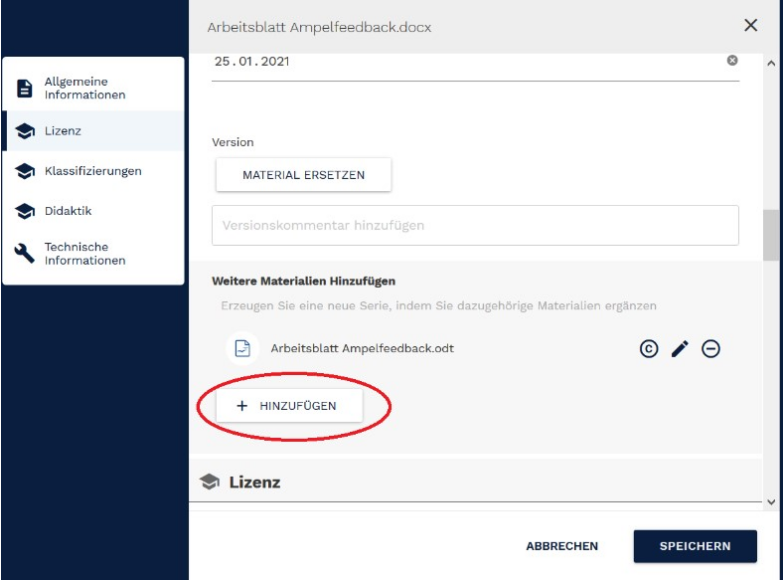
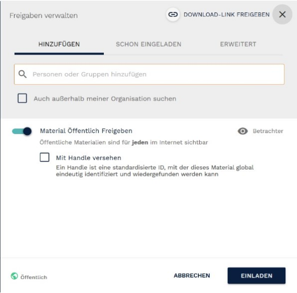

<h1 style="color:#ff8c00">Schritt 5: OER teilen</h1>
<link rel="stylesheet" href="https://cdnjs.cloudflare.com/ajax/libs/font-awesome/4.7.0/css/font-awesome.min.css">

  
<i class="fa fa-info-circle" style="color:blue"></i>  <b>Info!</b>
      
    Im fünften Schritt wird Ihnen der Workflow des OER-Portals <b>twillo</b> nähergebracht. Zudem wird Ihnen gezeigt, wie die Strukturen des Portals Sie bei der Beschreibung und Kontextualisierung Ihres Materials unterstützen können. Ziel der Einheit ist es, dass Sie einen Überblick über das Portal gewinnen und sämtliche Funktionen von twillo kennenlernen.
     
     
    <b>Workload: 1-2 Stunden</b>
  

<h2 style="color:#ff8c00">Portal twillo - digitale Infrastruktur für OER</h2>

Um die Etablierung von OER in der Hochschullehre zu stärken, wurde im Rahmen des Verbundprojektes <a aria-describedby="Infos zum Twillo Portal" href="https://projects.tib.eu/oernds/projekt/" target="_blank">"OER-Portal Niedersachsen"</a> (gefördert durch das Nds. Ministerium für Wissenschaft und Kultur) das Online-Portal <a aria-describedby="Zum Twillo Portal" href="http://www.oernds.de/" target="_blank">twillo</a> entwickelt. Twillo bietet Lehrenden eine Infrastruktur für den Austausch von freien Bildungsmaterialien und umfasst darüber hinaus vielfältige Angebote, um Lehrende bei der eigenen Erstellung und Zusammenstellung hochwertiger Lehr- und Lernmaterialien zu unterstützen. Auf diese Weise sollen Kompetenzen für den Umgang mit OER weiterentwickelt und Unsicherheiten abgebaut werden.
 
Folgende Funktionen des Portals sind hervorzuheben:

<ul style="list-style-type:disc">
  <li><b>Individueller Workspace:</b> Langfristige Ablage von Materialien (z.B. über Stellenwechsel hinaus)</li>
   
  <li><b>Upload und Verlinkung:</b> Bereitstellung von OER direkt im Portal oder über die Originalseite</li>
   
  <li><b>Serien- und Sammlungsfunktion:</b> Zusammenstellung unterschiedlicher OER zu bestimmten Themenbereichen und/oder für spezifische Lehr-Lernkontexte</li>
   
  <li><b>Suchfunktion:</b> Vereinfachte Auffindbarkeit von Materialien</li>
   
  <li><b>Metadaten:</b> Vorkonfigurierte Felder (inkl. Erklärungen) zur Lizenzierung und Beschreibung von OER</li>
   
  <li><b>Support:</b> Beratung in technischen, rechtlichen und didaktischen Fragen rund um OER und twillo</li>
   
  <li><b>Vernetzung:</b> Kollaborationsstrukturen für die Zusammenarbeit mit Kolleg:innen der gleichen oder einer anderen Institution</li>
</ul>

Der Workflow auf twillo umfasst vier Schritte:

  <button class="accordion">1. Registrierung/Login</button>
  

    
Rufen Sie den Link <a aria-describedby="Link zur Seite des deutschen Forschungsnetzes" href="https://www.twillo.de/" target="_blank">www.twillo.de</a> auf und wählen Sie über den Reiter <b>Zum Portal</b> im Kopfmenü auf den Bereich <b>Einloggen</b> aus. Alternativ klicken Sie hier, um direkt auf die Anmeldemaske von twillo zu gelangen.
        
      Angehörigen von Hochschulen, die <a aria-describedby="Zum Twillo Portal" href="https://www.dfn.de/dienstleistungen/dfnaai/" target="_blank">DFN-AAI</a> nutzen, ist ein direkter Einstieg in das OER-Portal möglich. Klicken Sie unterhalb der Anmeldemaske auf die Option <b>Zur Hochschulauswahl</b>. Wählen Sie in der folgenden Liste Ihre Einrichtung/Institution aus und geben Sie in der Ihnen vertrauten Anmeldungsmaske die Kennung Ihres Hochschulaccounts ein.
        
      Die folgende Abbildung veranschaulicht den Prozess der Anmeldung per DFN:
       
      <figure>
        
        <figcaption style="text-align:center;font-size:14px;">Abbildung: Twillo-Zugang über DFN</figcaption>
      </figure>
        
      

        
<i class="fa fa-exclamation-triangle" style="color:black"></i> <b>Wichtig!</b>
            
          Sollte Ihnen die Anmeldung über die Hochschulauswahl nicht möglich sein, können Sie sich auch manuell einen Account einrichten lassen. Senden Sie hierfür eine formlose Nachricht mit Ihrem vollständigen Namen, Ihrer E-Mailadresse, Ihrem beruflichen Funktionskontext und Ihrer Institution an <a href= "support.twillo@tib.eu">support.twillo@tib.eu</a>. Sie erhalten anschließend zeitnah eine Mail mit Ihren Zugangsdaten.
        

      

      Nach der ersten Anmeldung im Portal werden Sie in Ihrem <b>Workspace</b> weitergeleitet. Dieser ist als Ordnerstruktur angelegt und bietet Ihnen die Möglichkeit, Ihre eigenen OER zu organisieren. Der Workspace ist Ihr persönlicher Bereich, andere Nutzer:innen haben keinen Zugriff.
        
      Um von Ihrem Workspace in die Suchumgebung oder den Bereich Sammlungen zu wechseln, öffnen Sie die <b>Bereichsauswahl</b> indem Sie auf den Reiter <b>Workspace</b> oben links klicken.
    

  

  <button class="accordion">2. Upload/Verlinkung</button>
  

    
Um Material auf twillo bereitzustellen, wählen Sie in Ihrem Workspace die Schaltfläche <b>+NEU</b> aus. Klicken Sie auf <b>Neues Material</b> und laden Sie Ihr Material per Drag and Drop hoch oder verlinken Sie es durch die Eingabe einer URL. Verlinkungen sind nur dann möglich, wenn das Material bereits auf anderen Plattformen (z.B. YouTube, AV-Portal, SlideWiki, GitHub/GitLab etc.) veröffentlicht ist.
        
      Sobald Sie den Vorgang mit <b>OK</b> bestätigt haben, befindet sich das Material in Ihrem <b>Workspace</b>. Zunächst ist es nur für Sie allein sichtbar. Eine Freigabe für andere Nutzer:innen oder die Öffentlichkeit muss gesondert erfolgen (vgl. Punkt 4 - Freigabe).
    

  

  <button class="accordion">3. Beschreibung und Kontextualisierung </button>
  

    
Im folgenden Schritt geht es darum, die hochgeladenen/verlinkten Bildungsmaterialien durch die Eingabe von Metadaten zu beschreiben. Dies hat zwei Gründe: Erstens werden die Materialien eine umfassende Beschreibung einfach auffindbar (nicht nur auf twillo, sondern auch bei der Nutzung von Suchmaschinen), zweitens wird anderen Lehrende die Nachnutzung vereinfacht, da sie durch eine gute Beschreibung schnell einschätzen können, inwiefern sich das Material für das eigene Lehr-Lernsetting eignet. Automatische Auffindbarkeit und didaktische Kontextualisierung stellen somit zwei wichtige Merkmale dar, die die Qualität von OER im Hinblick auf deren Struktur beeinflussen.

      <table id="invisible" style="background-color:#FAFAFC">
        <tr>
          <td valign="middle" text-align="left" width="30%">
            <figure style="float:left;align:middle;">
              
              <figcaption style="text-align:center;font-size:14px;">Abbildung: Automatische Auffindbarkeit</figcaption>
            </figure></td>
          <td valign="middle" text-align="left" width="70%">
            Offene Bildungsmaterialien sollten möglichst einfach und mit wenig Rechercheaufwand gefunden werden und deshalb möglichst gut beschrieben sein. Hierfür sind prägnante Titel, Beschreibungen und Schlagworte, die Lizenzauszeichnung sowie die Namen der Autor:innen relevante Angaben. Diese Informationen werden auch Metadaten genannt und sorgen für die Möglichkeit der standardisierten, maschinellen Suche innerhalb von Portalen. 
          </td>
        </tr>
        <tr>
          <td valign="middle" text-align="left" width="30%">
            <figure style="float:left;align:middle;">
              
              <figcaption style="text-align:center;font-size:14px;">Abbildung: Didaktische Kontextualisierung</figcaption>
            </figure></td>
          <td valign="middle" text-align="left" width="70%">
            Materialien, die für den Bildungskontext erstellt werden, sind für spezifische Zielgruppen und Lehrkontexte konzipiert. Diese Informationen sind häufig nur implizit in den Bildungsmaterialien enthalten, sind aber wichtig für eine erste Einschätzung des Materiales von Seiten der Lehrenden, die sie nachnutzen möchten. Das Explizieren von Kontextinformationen für den Lehreinsatz erleichtert die Einschätzung der Passung der Bildungsmaterialien für den jeweiligen Lehrkontext. Damit erhalten Hochschullehrende einen Überblick über den didaktischen Gehalt der Bildungsmaterialien und können davon ausgehend die Verwendung in den eigenen Lehrkontext planen. 
          </td>
        </tr>
      </table>
      Twillo unterstützt Sie bei der Beschreibung des Materiales durch standardisierte Eingabefelder. Nachdem Sie - wie unter Punkt 2 beschrieben - neues Material hochgeladen oder verlinkt haben, öffnet sich der Metadatendialog automatisch. Auch können Sie ihn jederzeit aufrufen, indem Sie Ihr Material öffnen und im Menü oben rechts das Feld <b>Infos bearbeiten</b> auswählen. 
      <figure>
          
          <figcaption style="text-align:center;font-size:14px;">Abbildung: Screenshot des twillo Metadatendialogs</figcaption>
      </figure>
      Die Metadaten-Eingabemaske des Portals gliedert sich in die Bereiche Allgemeine Infomationen, Lizenz, Klassifizierungen, Didaktik und technische Informationen. Zwar sind nur wenige Angaben verpflichtend, wir empfehlen Ihnen allerdings, den Dialog von oben bis unten durchzugehen und möglichst viele Angaben zu machen. Dies vereinfacht anderen Personen das Finden und Nutzen Ihres Materials. Metadaten, die eines besonderen Augenmerks bedürfen, werden im folgenden genauer beschrieben.
        
      <b>Angabe von Urheber:innen und Beteiligten Personen</b>
        
      Im Abschnitt <b>allgemeine Informationen</b> geben Sie u.a. die Urheber:innen des Materiales an. Bitte wählen Sie hierfür den Reiter <b>Autoren & Beteiligte</b> aus und geben Sie den Vor- und Nachnamen der Autorin/des Autors ein. Sie haben auch die Möglichkeit <b>mehr als eine Person, eine Organisation/Institution/Gruppe als Urheber:innen</b> einzutragen oder <b>weitere an der Entwicklung des Materiales beteiligte Personen</b> (z.B. Herausgeber:innen, Grafiker:innen) sichtbar zu machen. Klicken Sie hierfür auf den Reiter <b>weitere Beteiligte</b> unterhalb des Eingabefelds.
      <figure>
          
          <figcaption style="text-align:center;font-size:14px;">Abbildung: Screenshot Urheber:innenangaben twillo </figcaption>
      </figure>
       
      Wählen Sie im Bereich <b>Beteiligte am Objekt</b> nun den Button <b>Hinzufügen</b>. Es öffnet sich eine neue Eingabemaske, in der Sie alle beteiligten Personen - und/oder Organisation - sowie deren Rolle benennen können. Tragen Sie einen Namen in die Eingabemaske ein und wählen Sie anschließend über das Dropdownmenü im Bereich <b>Tätig als</b> eine passende Funktion an. Speichern Sie Ihre Eingabe mit <b>Übernehmen</b>. Um weitere Beteiligte hinzuzufügen wiederholen Sie die vorangegangenen Schritte.
       
      <figure>
          
          <figcaption style="text-align:center;font-size:14px;">Abbildung: Screenshot Urheber:innenangaben twillo </figcaption>
      </figure>
      <b>Lizenzangaben</b>
        
      Die Angabe einer Lizenz stellt ein verpflichtendes Metadatum für die Veröffentlichung von Materialien auf twillo dar. <b>Das Portal arbeitet ausschließlich mit dem Creative Commons-Lizenzsystem. Die Bereitstellung anders lizenzierter Materialien ist auf dem Portal nicht vorgesehen</b>. Um eine Lizenz zu wählen, öffnen Sie den Reiter <b>Lizenz verwalten</b>. Im folgenden Fenster haben Sie die Möglichkeit, eine der offensten Lizenzen auszuwählen. Sollte die von Ihnen gewünschte Lizenz nicht dabei sein, bedienen Sie den Schalter <b>Nur OER-Lizenzen</b>, um auch restriktivere CC-Lizenzen wählen zu können.
      <figure>
          
          <figcaption style="text-align:center;font-size:14px;">Abbildung: Screenshot Lizenzangaben auf twillo </figcaption>
      </figure>
      Vergessen Sie nicht, nach der Wahl einer Lizenz auch die <b>Lizenzversion</b> zu bestimmen und Ihre Angabe zu <b>speichern</b>. 
      <figure>
          
          <figcaption style="text-align:center;font-size:14px;">Abbildung: Screenshot Wahl der Lizenzversion auf twillo </figcaption>
      </figure>
        
      <b>Anlegen von Serien (Hinzufügen ergänzender Materialien)</b>
       
      Sie möchten nicht nur eine einzelne Datei/einen einzelnen Link hinterlegen? Hierfür steht Ihnen auf twillo die <b>Serienfunktion</b> zu Verfügung.  Bitte erstellen Sie nur dann eine Serie, wenn Sie zu einem Bildungsmaterial weitere Materialien ergänzen wollen, die untrennbar zusammengehören, z.B.:
      <ul>
        <li>ein anderes Dateiformat des Materiales</li>
        <li>eine Musterlösung zu einem Arbeitsblatt</li>
        <li>eine Aufgabe zu einem Lehrvideo</li>
        <li>eine detaillierte Beschreibung für die Lehrpraxis</li>
      </ul>
      Gehen Sie in den Bereich <b>weitere Materialien</b> und ergänzen Sie Materialien über den Button <b>Hinzufügen</b>. Sofern Sie die Angaben nicht händisch anpassen, werden die bei dem Hauptmaterial hinterlegten Informationen inkl. gewählter Lizenz an das ergänzte Material übernommen.
      <figure>
          
          <figcaption style="text-align:center;font-size:14px;">Abbildung: Screenshot Serie anlegen auf twillo</figcaption>
      </figure>
      <b>Didaktische Angaben</b>
        
      Im Abschnitt <b>Didaktik</b> können Sie Kontextinformationen für Nutzer:innen des Portals angeben - sofern diese Ihnen bekannt sind. Die hier ausgewählten Beschreibungskategorien sind insbesondere bei der zielgerichteten Materialsuche für den eigenen Lehrkontext hilfreich.
      <ul style="list-style-type:disc">
        <li>Geben Sie an, in welchem <b>Veranstaltungsformat</b> Ihr Material erprobt oder für welchen Kontext es konzipiert wurde.</li>
        <li>Geben Sie an, für welche <b>Niveau</b>stufe bzw. Zielgruppe Ihr Material primär entworfen wurde. Diese Angabe schließt eine Verwendung mit anderen Zielgruppen nicht aus.</li>
        <li>Das Metadatum didaktische <b>Funktion</b> zeigt an, worauf und auf welche Lernhandlung das Bildungsmaterial primär zielt:</li>
          <ol style="list-style-type:disc">
            <li>Vermittlung von Lehrinhalten (rezipieren)</li>
            <li>Erarbeitung/Vertiefung von Lehrinhalten (aktiv aneignen)</li>
            <li>Einübung spezifischer Inhalte (routinisieren)</li>
            <li>Herstellung eigener Inhalte/Artefakte (erschaffen)</li>
            <li>Reflexion der (Lern-)Prozesse (beurteilen)</li></li>
          </ol>
      </ul>
    

  

  <button class="accordion">4. Freigabe</button>
  

    

      Erst mit der aktiven Freigabe veröffentlichen Sie Ihr Material auf twillo. Hierfür gibt es zwei Wege.
       
      Entweder Sie aktivieren im Abschnitt <b>Lizenz</b> den Schalter <b>Objekt mit dieser Lizenz veröffentlichen</b>
        
      <b>ODER</b>
        
      Sie gehen über das Kontextmenü zum Punkt <b>Freigeben</b>. Hier können Sie Ihr OER über den Schalter <b>Material öffentlich freigeben</b> veröffentlichen. Auch haben Sie die Möglichkeit, Ihr Material nur mit bestimmten Nutzer:innen des Portals zu teilen. Wählen Sie hierfür mit der Suchfunktion die gewünschten Personen aus und vergeben Sie über das Dropdownmenü eine Rolle. Vergessen Sie nicht, Ihre Freigabe mit dem Button <b>Einladen</b> zu bestätigen. Die Einladung von Personen kann nur erfolgen, wenn die betreffenden Personen einen twillo Account besitzen.
      <figure>
        
        <figcaption style="text-align:center;font-size:14px;">Abbildung: Screenshot Freigabe twillo</figcaption>
      </figure>
      <b>Juhu! Sie haben OER auf twillo veröffentlicht!</b>
    

  

