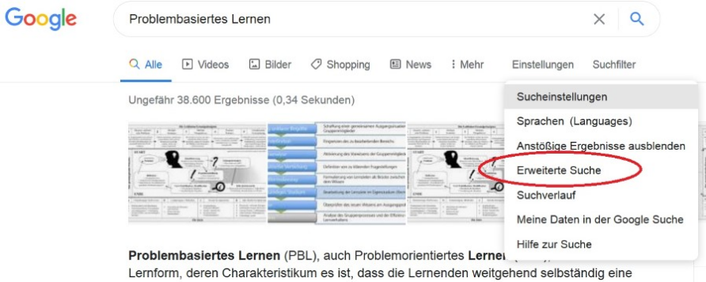
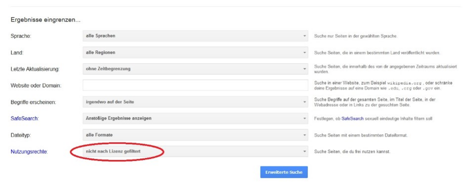
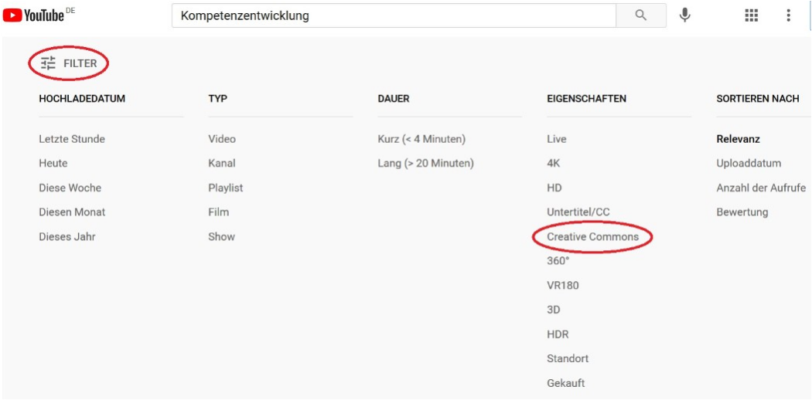
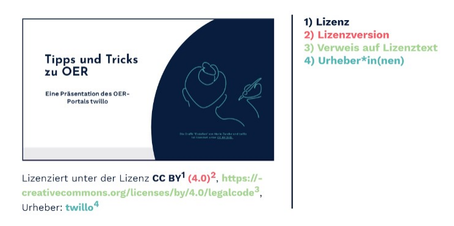
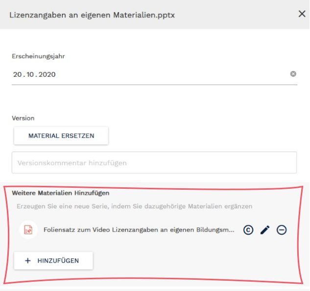
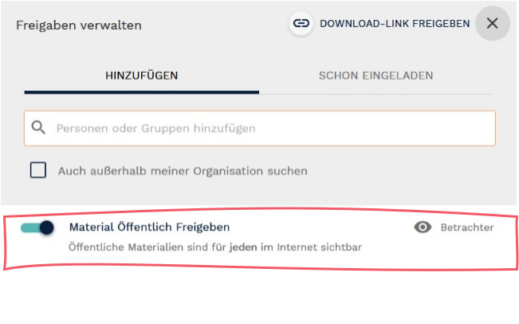

# Aufgabe A

<b>Führen Sie eine Internetrecherche durch und identifizieren Sie hochwertige Lehrmaterialien, die den Merkmalen von OER entsprechen. Veröffentlichen Sie diese anschließend im OER-Portal twillo.

In den folgenden acht Schritten erhalten Sie wichtige Hinweise bei der Aufgabenbearbeitung.

Los geht's!</b>  

<!-- Script fürs Accordion -->

  <button class="accordion">Schritt 1: Material finden</button>
  

   
Recherchieren Sie im Internet nach interessanten Lehr-/Lernmaterialien ihres Faches/ihrer Disziplin, die CC-lizenziert sind. Legen Sie ein besonderes Augenmerk darauf, dass eine kostenfreie Verwendung, Veränderung und Weiterverbreitung des Materials zulässig ist.

   Sie können für Ihre Internetrecherche z.B. Suchmaschinen nutzen, die explizit auf das Auffinden von OER ausgerichtet sind oder Internetseiten wählen, die offen lizenzierte Materialien bereitstellen. Dies sind z.B
  <ul>
    <li> OERSI (<a aria-describedby="Link zur OERSI-Seite" href="http://oersi.de/" target="_blank">oersi.de</a>, derzeit in der Beta-Phase)</li>
    <li> OERhörnchen (<a aria-describedby="Link zur OER-Hörnchen-Seite" href="http://oerhoernchen.de/" target="_blank">oerhoernchen.de</a>)</li>
    <li> CCsearch (<a aria-describedby="Link zur CC-Search-Seite" href="http://ccsearch.creativecommons.org/" target="_blank">ccsearch.creativecommons.org</a>)</li>
    <li> Wikimedia Commons (<a aria-describedby="Link zu Wikimedia Commons" href="http://commons.wikimedia.org/" target="_blank">commons.wikimedia.org</a>)</li>
    <li> X5GON (<a aria-describedby="Link zur X5GON-Seite" href="http://discovery.x5gon.org/" target="_blank">discovery.x5gon.org</a>, derzeit in der Beta-Phase)

  </ul>
  Selbstverständlich können Sie für Ihre Recherche auch die üblichen Suchmaschinen oder Plattformen z.B. (Google und YouTube) nutzen. Um den Prozess zu vereinfachen, richten Sie Ihre Suche gezielt auf eine gewünschte Lizenz aus.

  Google:  Geben Sie Ihren Suchbegriff ein und starten Sie die Suche. Wählen Sie anschließend unter "Einstellungen", die "erweiterte Suche" aus (s. Abb. 9). Es öffnet sich ein neues Fenster. Hier können Sie die Ergebnisse Ihrer Suche im Bereich "Nutzungsrechte" entlang der von Ihnen gewünschten Lizenzierung eingrenzen (s. Abb. 10).
  <figure>
    
    <figcaption style="text-align:center;font-size:14px;">Abb. 10: Screenshot Google-Suche</figcaption>
  </figure>
  <figure>
    
    <figcaption style="text-align:center;font-size:14px;">Abb. 12.: Screenshot Google-Suchfilter</figcaption>
  </figure>
  Youtube: Geben Sie ihren Suchbegriff ein und starten Sie die Suche. Wählen Sie anschließend die Option "Filter" und schränken Sie die Ergebnisse im Bereich "Eigenschaften" durch die Wahl der Option "Creative Commons" ein (S. Screenshot 3).
  <figure>
    
    <figcaption style="text-align:center;font-size:14px;">Abb. 12: Screenshot YouTube-Suchfilter</figcaption>
  </figure>
  

  <button class="accordion">Schritt 2: Urheberrechtliche Aspekte & Lizenzen beachten</button>
  

    
Haben Sie Material gefunden, das Sie gern auf twillo bereitstellen möchten, prüfen Sie, ob dieses den Merkmalen von OER entspricht. Beginnen Sie mit der Lizenz.
    Auf OER sollten Sie einen eindeutigen Lizenzhinweis finden. Dieser sollte direkt am Material platziert oder als begleitende Information gespeichert sein.

    
&#128161; <b>Was ist was?</b> 
       
      <b>Lizenztext:</b> 
      Der Lizenztext macht deutlich, welche Nutzungsbedingungen beim jeweiligen Material gelten und welcher Nutzungsgrad bei der Verwendung zulässig ist.
        
      <b>Lizenzversion:</b> 
      Die unterschiedlichen Versionen (2.0 bzw. 3.0 bzw. 4.0) zeigen die durchlaufenen Revisionsprozesse der CC-Lizenzmodule an.
        
      <b>Lizenzicon:</b> 
      Das Lizenzicon schafft einen Wiedererkennungswert. Auf der Webseite von Creative Commons werden alle gängigen Lizenzicons für Sie bereitgestellt. 
    

    
Ein korrekter CC-Lizenzhinweis <b>muss</b> folgende Punkte enthalten:
      <ul>
        <li>Lizenz und Lizenzversion</li>
        <li>Verweis zum Lizenztext (z. B. Verlinkung oder ausgeschriebener Link)</li>
        <li>Urheber*in(nen)angabe (sofern die Lizenz das Modul <b>BY</b> enthält) </li>
      </ul>

   Die folgende Abbildung zeigt ein Beispiel für einen Lizenzhinweis (CC BY (4.0)), der die verpflichtenden Angaben enthält.
  <figure>
    
    <figcaption style="text-align:center;font-size:14px;">Abb. 13: Pflichtangaben in Lizenzhinweisen</figcaption>
  </figure>
  Optional ist für einen Lizenzhinweis die Angabe folgender Punkte:
  <ul>
    <li><b>Titel und Art des Werks</b> (nur bei Version 4.0, bei Vorgängerversionen wird der Titel mit angeführt)</li>
    <li><b>Lizenzicon</b></li>
    <li><b>Ausnahmeregelungen oder weitere Hinweise</b> (z.B. bzgl. der Nachnutzbarkeit der Materialien)</li>
  </ul>
  Folgende Abbildung zeigt ein Beispiel für einen ausführlichen Lizenzhinweis, der neben den verpflichtenden, auch optionale Angaben enthält.
  <figure>
    
    <figcaption style="text-align:center;font-size:14px;">Abb. 14: Ausführlicher Lizenzhinweis</figcaption>
  </figure>
  

    &#128161; <b>Je offener die Lizenz, desto einfacher ist die Nachnutzung</b> 
     
    Alle Materialien, die CC-lizenziert sind, dürfen Sie grundsätzlich im Portal einstellen. Materialien mit einer möglichst offenen Lizenz (CC 0, CC BY und CC BY SA) sind besonders willkommen, da diese eine einfache Verwendung, Veränderung und Weiterverbreitung ermöglichen und somit der grundsätzlichen Idee von OER entsprechen.
    Materialien, deren CC-Lizenz die Module ND und/oder NC enthalten, sind weniger offen und können in der Nachnutzung Probleme hervorrufen. So kann es z.B. schwierig sein, Material ohne die Erlaubnis zur Anpassung in das individuelle Lehr-Lernsetting zu integrieren. Auch die klare Trennung eines nichtkommerziellen von einem kommerziellen Verwendungskontext kann problematisch sein.
    

  

  

  <button class="accordion">Schritt 3: Dateiformat prüfen</button>
  

   
Wenden Sie sich in diesem Schritt dem Dateiformat zu. Prüfen Sie, ob das Dokument in einem offenen Dateiformat vorliegt, das eine direkte Bearbeitung erlaubt.

  Sollte dies nicht der Fall sein, überführen Sie das gewählte Material in ein offeneres Dateiformat -  <b>sofern es die Lizenz erlaubt</b>. Sollte die Lizenz das Modul <b>ND</b>enthalten, ist jegliche Form der Bearbeitung ausgeschlossen - dies gilt auch für die Konvertierung in ein anderes Format.

  Wenn Sie das Material in ein offenes Format überführen konnten/durften, stellen Sie am besten sowohl die konvertierte Datei (z.B. Word), als auch die Originaldatei (z.B. PDF) in das Portal. Auf diese Weise können Sie z.B. das Layout und Design des Originalwerks zur Veranschaulichung erhalten und gleichzeitig die Beabreitung der Inhalte ermöglichen.

  Wie Sie die das Material auf twillo teilen, erfahren Sie in den nächsten Schritten.

  

  <button class="accordion">Schritt 4: Anmeldung auf twillo</button>
  

   
Um das Material auf twillo einzustellen, melden Sie sich im Portal an.
     <figure>
      
      <figcaption style="text-align:center;font-size:14px;">Abb. 15: Twillo Workflow</figcaption>
     </figure>
     Rufen Sie den Link <a aria-describedby="Link zum OER-Portal" href="https://www.oernds.de/oer/" target="_blank">oer-nds.de</a> auf und gehen Sie über den Punkt Zum   <l>Portal</l> im Kopfmenü auf den Bereich <l>Einloggen</l>. Alternativ klicken Sie <a aria-describedby="Link zu Twillo" href="https://www.oernds.de/edu-sharing/components/login" target="_blank">hier</a>, um direkt auf die Anmeldemaske von twillo zu gelangen.

   Angehörigen von Hochschulen, die <a aria-describedby="Link zu DFN-AAI" href="https://www.dfn.de/dienstleistungen/dfnaai/" target="_blank">DFN-AAI</a> nutzen, ist ein direkter Einstieg ins OER-Portal ohne manuelle Registrierung möglich. Wählen Sie unter Einloggen hierfür die Option Zur Hochschulauswahl. Wählen Sie in der Liste Ihre Einrichtung/Institution und geben Sie in der Ihnen vertrauten Anmeldungsmaske die Kennung Ihres Hochschulaccounts ein. Sie befinden sich nach Anmeldung in Ihrem Workspace, dort werden Ihre eingestellten Bildungsmaterialien abgelegt.

  Das folgende Video veranschaulicht den Prozess der Anmeldung im Portal über DFN:
  <figure>
    <video width="896" height="672" controls>
      <source src="videos/DFN_Zugang.mp4" type="video/mp4">
    </video>
    <figcaption style="text-align:center;font-size:14px;">Video 2: Twillo-Zugang über DFN</figcaption>
  </figure>
  

  

  <button class="accordion">Schritt 5: Material einstellen</button>
  

   
Sie haben auf twillo grundsätzlich die Möglichkeit, Materialien zu verlinken oder hochzuladen. 

  Der Einstellungsprozess wird, nachdem Sie auf die Buttonfläche <b>NEU</b> geklickt haben, durch Dialoge unterstützt. Wählen Sie <b>neues Material</b> aus und laden Sie Ihr Material hoch oder verlinken Sie es. Eine <b>Verlinkung</b> bietet sich immer dann an, wenn das Material, das Sie bereitstellen möchten, bereits online verfügbar ist und auf der Originalseite direkt genutzt werden kann (z.B. ein Selbstlernkurs in LiaScript, ein Lernvideo im TIB AV-Portal oder Youtube).

  Sobald Sie den Vorgang speichern, befindet sich das Material in Ihrem <b>Workspace</b>.

&#128161; Bis zur aktiven Freigabe (Schritt 9) bleibt das Material nur für Sie sichtbar.

  Unabhängig davon, ob Sie Material verlinkt oder hochgeladen haben, folgt im nächsten Schritt die Angabe von Metadaten. Diese dienen zum einen der Beschreibung der Materialien und sorgen zum anderen dafür, dass das Material gefunden werden kann.

  

  <button class="accordion">Schritt 6: Bildungsmaterial auffindbar machen</button>
  

   
Beschreiben Sie das Material möglichst mit den Informationen, die Sie am Material finden.
    <figure>
      
      <figcaption style="text-align:center;font-size:14px;">Abb. 16: Screenshot Navigation twillo </figcaption>
    </figure>
    Im Abschnitt <l>Lizenz</l> übernehmen Sie genau die Lizenz, die das Material aufweist. Geben Sie bei der Urheberangabe im Reiter <l>Autoren und Beteiligte</l> auch die Autor*innen als Urheber*inen an. Sollte es sich um ein gemeinfreies Werk oder CC 0-lizenziertes Werk handeln, können Sie den Namen, sofern bekannt, unter <l>freie Urheberangabe</l> oder <l>Autoren & Beteiligte</l> angeben.
    <figure>
      
      <figcaption style="text-align:center;font-size:14px;">Abb. 17: Screenshot Urheberangabe twillo </figcaption>
    </figure>
    <b>Klassifizierungen</b>

  Die Einordnung der Bildungsmaterialien in einen der fünf <b>Inhaltstypen</b> liefert eine grobe Beschreibung über die Ausrichtung und den Umfang der Materialien, während die Angabe <b>Materialart</b> die (Medien-)Formate der Materialien detaillierter beschreibt. Beide Angaben können die Auffindbarkeit der Bildungsmaterialien erhöhen.
  

  &#128161; Funktionen im Portal
   
  <b>Kleinteilige Lehrmaterialien</b>
  können als einzelne Materialien bereitgestellt werden. Mit der <b>Serienfunktion</b> können entweder weitere Dateiformate oder dazugehörige Materialien (beim Erklärvideo bspw. Storyboard, Tonspur) ergänzt werden.
   
  <b>Aufgabenorientierte Materialien</b>
  zusätzliche Materialien zum Aufgabenelement, etwa Musterlösungen, Best-Practice-Beispiele oder dokumentierte Hilfestellungen, können mit der <b>Serienfunktion</b> ergänzt werden.
  <figure>
    
    <figcaption style="text-align:center;font-size:14px;">Abb. 18: Screenshot Serienfunktion twillo</figcaption>
  </figure>
  

  Geben Sie auch das entsprechende <b>Fach-/ Sachgebiet</b> an und legen Sie <b>Schlagworte</b> fest, um die Auffindbarkeit Ihres Material in der  zielgerichteten Suche zu erhöhen.
  

  

  <button class="accordion">Schritt 7: Bildungsmaterial kontextualisieren</button>
  

    
Im Abschnitt <b>Didaktik</b> können Sie weitere didaktische Kontextinformationen für Nutzer*innen des Portals angeben. Die hier ausgewählten Beschreibungskategorien können insbesondere bei der zielgerichteten Materialsuche für den eigenen Lehrkontext behilflich sein.

  Geben Sie an, in welchem <b>Veranstaltungsformat</b> Ihr Material erprobt oder für welchen Kontext es konzipiert wurde.

  Geben Sie an, für welche <b>Niveau</b>stufe bzw. Zielgruppe Ihr Material primär entworfen wurde. Diese Angabe schließt eine Verwendung mit anderen Zielgruppen nicht aus.

  Dauer: Bei einem Video oder einer Audio kann die tatsächliche Dauer der Datei angegeben werden. Für andere Materialien kann die Bearbeitungsdauerim konkreten Lehrkontext eingetragen werden.

  <b>Funktion</b>:

  Dieses didaktische Metadatum zeigt an, worauf und auf welche Lernhandlung das Bildungsmaterial primär zielt:
  <ul>
    <li>Vermittlung von Lehrinhalten (rezipieren)</li>
    <li>Erarbeitung/Vertiefung von Lehrinhalten (aktiv aneignen)</li>
    <li>Einübung spezifischer Inhalte (routinisieren)</li>
    <li>Herstellung eigener Inhalte/Artefakte (erschaffen)</li>
    <li>Reflexion der (Lern-)Prozesse (beurteilen)</li>
  </ul>
  <b>Erfahrungsbericht</b>: Beschreiben Sie den konkreten Einsatz des Materials. Mögliche Leitfragen für die Freitextangabe könnten sein:
  <ol>
    <li>Setzt das Bildungsmaterial Vorwissen bei Lernenden voraus? z. B. Für diese vertiefende Übung sind Grundkenntnisse der Algebra notwendig.</li>
    <li>Intendiert das Bildungsmaterial ein bestimmtes Lernziel?  z. B. Die Studierenden sollen anhand des Planspiels erlerntes theoretisches Fachwissen spielerisch auf Praxisbeispiele anwenden und damit ihre Fach- und Methodenkompetenzen vertiefen.</li>
    <li>In welchem Lehr- bzw. Lernkontext haben Sie das Material bereits verwendet? z. B. Diese Karikatur habe ich als stillen Impuls in meinem Seminar angewendet um in das Thema einzuführen.</li>
    <li>In welchem Lehr- bzw. Lernkontext könnte das Material noch verwendet werden? z. B. Die Karikatur kann darüber hinaus als ein Beispiel für Impfkritik innerhalb eines Folieninputs verwendet werden.</li>
</ol>

  

  <button class="accordion">Schritt 8: Material freigeben</button>
  

   
Erst mit der Freigabe veröffentlichen Sie das Material auf twillo. Hierfür gibt es zwei Wege. 1. Aktivieren Sie im Abschnitt Lizenz den Schalter <b>Objekt mit dieser Lizenz veröffentlichen</b>.

  Oder Sie gehen über das Kontextmenü zum Punkt <b>Freigeben</b> und aktivieren in der Freigabemaske den Schalter <b>Material öffentlich freigeben</b>. Sie haben in dieser Maske auch die Möglichkeit, das Material zunächst nur für ausgewählte Personen freizugeben.

  Falls Sie unsicher sind, können Sie z.B. alle Teilnehmer\*innen aus dem Workshop einladen und das Material nur mit diesem Kreis teilen.
  <figure>
    
    <figcaption style="text-align:center;font-size:14px;">Abb. 19: Screenshot Freigabe twillo</figcaption>
  </figure>
  

  

---
<!-- old -->

