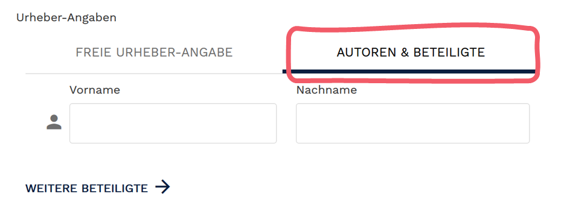

# Finden Sie ein OER im Internet und stellen Sie es ins OER-Portal ein

## Wo finde ich OER?

* Wikimedia Commons (http://commons.wikimedia.org/)
* OERhörnchen (http://oerhoernchen.de/)
* CCsearch (http://ccsearch.creativecommons.org/)
* http://pixabay.com/, http://flickr.com/ und http://unsplash.com/ (Lizenz beachten)
* Google und YouTube (Lizenz beachten)
* BETA: OERSI (http://oersi.de/, deutschlandweiter OER-Index)
* BETA: X5GON (http://discovery.x5gon.org/, europaweiter OER-Index)

## Urheberrechtliche Aspekte und Lizenz

Welche Lizenz liegt vor?

Bei OER-Materialien sollten Sie eindeutig Lizenzhinweise finden. Diese sollten direkt am Material platziert oder als Information gespeichert sein. In der Regel handel es sich um Lizenzmodule von Creative Commons.

Lizenzicons
Materialien, die mit CC lizenziert sind, dürfen Sie ins OER-Portal stellen. Wir empfehlen allerdings möglichst freie Bildungsmaterialien einzustellen:

## Dateiformate

[Platzhalter]

## Optionen im OER-Portal

 <B>Material ins OER-Portal einstellen</B>

Verlinken oder lokal herunterladen & wieder im Portal hochladen

* **Verlinken** Problem wenn Link ungültig wird

* **Hochladen** wenn OER!

## Metadaten

Übernehmen Sie möglichst die Informationen, die Sie am Material auch finden in die Beschreibung.

### Allgemeine Informationen

<B>Lizenz:</B>
Übernehmen Sie genau die Lizenz, die das  Material aufweist. Geben Sie bei der Urheberangabe auch die Autor*innen

<B>Klassifikation:</B> Inhaltstyp & Materialart
 
Inhaltstyp: *Kleinteiliges Lehrmaterial* sind typische Lehrmaterialien wie etwa Abbildungen, Videos, Audio oder Dokumente, die aufbereitete Lehrinhalte beinhalten. Auch Informationsmaterialien wie etwa Handreichungen zählen zu den kleinteiligen Materialien.

<B>Didaktische Informationen:</B>

<B>Technische Informationen:</B>

## Freigabe

[Platzhalter]

## OER: Selbstcheck-Tool

[Platzhalter]

## OER Planungshilfe

[Platzhalter]

