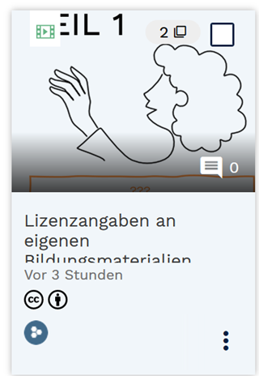

# Wählen Sie ein selbsterstelltes Lehr-/Lernmaterial aus ihrem Materialfundus und stellen Sie es ins OER-Portal ein

## Wo finde ich OER?
[Platzhalter]

## Urheberrechtliche Aspekte & Lizenz

1. Klärung: ausschließlich eigene Materialien oder sind fremde Inhalte integriert?  Ja: hat fremde Materialien: / Nein: →
2. Lizenzwahl: Welches Lizenzmodul von Creative Commons passt zu Ihrem Material? Für welche Lizenz entscheiden Sie sich?   <B>Je offener die Lizenz, desto einfacher ist es in der Nachnutzung.</B>
        a. CC-0 = vollständige Freigabe
        b. CC-BY = Namensnennung erforderlich
        c. CC-SA (share alike) = „viral“ abstammende Werke
                     müssen dieselbe Lizenz haben
        d. CC-ND (no derivatives) = keine Veränderungen
        e. CC-NC (non commercial) = keine kommerzielle Nutzung
3. Positionieren Sie ihren Lizenzhinweis auf Ihrem Bildungsmaterial:
    Video "Lizenzangaben an eigenen Materialien" einbinden/einbetten
   

## Dateiformate
In welchem Dateiformat liegt ihr Material vor? Kann beispielsweise eine PDF möglicherweise auch als odt oder docx umgewandelt werden? Damit ermöglichen Sie es anderen ihr Material herunterzuladen und es direkt lokal zu bearbeiten.

## Optionen im OER-Portal

 <B>Material ins OER-Portal einstellen</B>

hochladen

## Metadaten

Sie sind Expert*in Ihres Materials. Daher können Sie ...

### Allgemeine Informationen

<B>Lizenz:</B>
Geben Sie bei der Urheberangabe ...

<B>Klassifikation:</B> Inhaltstyp & Materialart

Inhaltstyp: *Kleinteiliges Lehrmaterial* sind typische Lehrmaterialien wie etwa Abbildungen, Videos, Audio oder Dokumente, die aufbereitete Lehrinhalte beinhalten. Auch Informationsmaterialien wie etwa Handreichungen zählen zu den kleinteiligen Materialien.

<B>Didaktische Informationen:</B>

<B>Technische Informationen:</B>

## Freigabe

[Platzhalter]

## OER: Selbstcheck-Tool

[Platzhalter]

## OER Planungshilfe

[Platzhalter]
