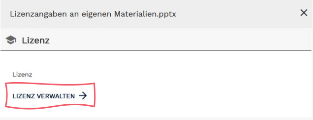

# Aufgabe B

<b>Wählen Sie Lehr-/Lernmaterial aus, das Sie selbst für eine Ihrer Lehrveranstaltungen erstellt haben. Bereiten Sie es ggf. auf, damit es den Merkmalen von OER entspricht und veröffentlichen Sie es anschließend im OER-Portal twillo.

In den folgenden neun Schritten erhalten Sie wichtige Hinweise bei der Aufgabenbearbeitung.

Los geht's!</b>  

<!-- Script fürs Accordion -->

  <button class="accordion">Schritt 1: Material auswählen</button>
  

   
Damit der zeitliche Bearbeitungsrahmen von 30 Minuten eingehalten wird, empfehlen wir solche Materialien aus dem eigenen bewährten Lehrmaterialfundus zu wählen, die vom Umfang her den Inhaltsytypen <b>kleinteiliges Lehrmaterial</b> oder <b>aufgabenorientiertes Lehrmaterial</b> entsprechen.
    
<b>Kleinteilige Lehrmaterialien sind beispielsweise:</b>
<li>ein Foliensatz</li>
<li>ein Skript</li>
<li>ein Schaubild</li>

<b>Aufgabenorientierte Materialien sind beispielsweise:</b>
<li>eine Probeklausur mit Musterlösungen oder Hilfestellungen</li>
<li>ein Arbeitsblatt mit Hilfestellungen</li>
<li>ein Quiz mit Lösungen</li>

> &#x1F4A1; Bei der Bereitstellung von aufgabenorientierten Materialien sollten sowohl die Aufgabe, die Übung, das Arbeitsblatt etc., als auch ergänzende Materialien wie z.B. Hilfestellung, (Muster-)Lösungen, bzw. Lösungswege oder Best-Practice-Beispiele bereitgestellt werden. Dies erleichtert anderen Lehrenden die Nachnutzung und Kontextualisierung der Materialien.
    

  

  <button class="accordion">Schritt 2: Urheberrechtliche Aspekte & Lizenzen beachten</button>
  

   
Nachdem Sie nun eine Wahl getroffen haben, überprüfen Sie, ob sich <b>urheberrechtlich geschützte Inhalte oder Werke im oder am Material</b> befinden. Haben Sie beispielsweise Bilder verwendet, die urheberrechtlich geschützt sind?
  
Beachten Sie:
<li>Die Verwendung von urheberrechtlichgeschützen Materialien im geringfügigen Umfang wie es im § 60 UrhG geregelt ist, ist bei der Veröffentlichung Ihres Materials als OER <b>nicht zulässig</b>. Diese Regelung gilt nur im Rahmen geschützter Lehrräume (z.B. Hörsaal/LMS).</li>
<li><b>Zitate</b> können, wenn Sie als solche gekennzeichnet sind, eingebunden werden. Hier gilt: Aussagen oder Bezugnahmen auf andere Quellen sind erlaubt, wenn sie zweckgemäß zum Einsatz kommen.</li>

> &#x1F4A1; Wenn die Zitatschranke des § 51 UrhG greift müssen Sie keinen Hinweis zum copyright geschützten Material in den Lizenztext aufnehmen. Das Zitatrecht stellt eine gesetzliche Lizenz dar, die vertraglichen Lizenzen (z.B. CC-Lizenzen) vorgeht. Analog zur wissenschaftlichen Praxis müssen folgende Kriterien vorliegen:
> 
> <li>der Zitatzweck liegt vor (inhaltlicher Zusammenhang)</li>
> <li>der Umfang des Zitats ist durch den Zweck gerechtfertigt (Umfang des zitierten Werks ist nicht unangemessen groß)</li>
> <li>die Quelle ist angegeben, § 63 UrhG (mind. Name des Urhebers und die Fundstelle)</li>
> <li>das fremde Werk /die fremden Werkteile wurden nicht verändert, § 62 UrhG (Kürzungen bei umfangreichen Werken, kleinere Änderungen der Satzstruktur sind erlaubt, müssen aber kenntlich gemacht werden!)</li>

> &#9888;&#65039; Enthält Ihr Material urheberrechtlich geschützte Inhalte oder Werke, sollten Sie diese entfernen und ggf. nach Alternativen suchen. Eine Möglichkeit ist, sie durch CC-lizenierte Inhalte zu ersetzen.

> &#9888;&#65039; Enthält Ihr Material CC-lizenzierte Inhalte oder Werke, dann beachten Sie die Lizenzbestimmungen und richten Sie sich nach den Nutzungsbedingungen. Die Lizenzangaben sind dann mitzuführen (s. Kapitel Urherberrecht und offene Lizenzen).

  

  <button class="accordion">Schritt 3: Lizenztext und Lizenzversion wählen</button>
  

   
In diesem Schritt müssen Sie auswählen, welche Creative Commons-Lizenz zum Material passt. Überlegen Sie, welche Nutzungsrechte Sie anderen Personen einräumen möchten. Was ist Ihnen wichtig?
  
> &#x1F4A1; <b>Je offener die Lizenz, desto einfacher ist die Nachnutzung</b>
> 
> Materialien mit einer möglichst offenen Lizenz (CC 0, CC BY und CC BY SA) sind auf twillo besonders willkommen, da diese eine einfache Verwendung, Veränderung und Weiterverbreitung ermöglichen und somit der grundsätzlichen Idee von OER entsprechen.
> 
> Materialien, deren CC-Lizenz die Module ND und/oder NC enthalten, sind weniger offen und können in der Nachnutzung Probleme hervorrufen. So kann es z.B. schwierig sein, Material ohne die Erlaubnis zur Anpassung in das individuelle Lehr-Lernsetting zu integrieren. Auch die klare Trennung eines nichtkommerziellen von einem kommerziellen Verwendungskontext kann problematisch sein.

Beim Teilen von offenen Bildungsmaterialien platzieren Sie einen Lizenzhinweis gut sichtbar auf Ihrem Material. Bei einem Skript können Sie ihn z.B. auf der ersten Seite positionieren, bei einen Foliensatz auf der Titel- oder auf der Abschlussfolie. Beachten Sie bitte folgenden Punkte:

<li><b>Lizenz:</b>
  
Geben Sie die Lizenz und die Version an. Dabei reichen die gängigen Kürzel wie zum Beispiel: unter der Lizenz CC BY 4.0</li>
<li><b>Verweis zum Lizenztext:</b>
  
Bitte bieten Sie einen Verweis zum Text der gewährten Lizenz an! Wenn kein Link möglich ist (z.B. bei gedruckten Materialien oder in Videos) sollte der Link ausgeschrieben zu sehen sein, also zum Beispiel: <a href="https://creativecommons.org/licenses/by/4.0/legalcode">https://creativecommons.org/licenses/by/4.0/legalcode</a></li>
<li>Haben Sie sich für die Attribution <b>BY</b> entschieden, dann geben Sie im Lizenzhinweis auch die Namen aller Urheber*innen bzw. Rechteinhaber*innen an. Auch der Name einer Organisation/Institution ist zulässig (z.B: twillo, CC BY 4.0), sofern diese die Rechte am Werk besitzt.</li>

Die folgende Abbildung zeigt ein Beispiel für einen Lizenzhinweis, der die verpflichtenden Angaben enthält.

<figure>
  
  <figcaption style="text-align:center;font-size:14px;">Abb. 10: Pflichtangaben in Lizenzhinweisen</figcaption>
</figure>

Optional ist für einen Lizenzhinweis die Angabe folgender Punkte:

<li><b>Titel und Art des Werks</b> (nur bei Version 4.0, bei Vorgängerversionen sollten Sie den Titel anführen)</li>
<li><b>Lizenzicon:</b>

Für den Wiedererkennungswert kann das Lizenzicon mitgeführt werden. Auf der Webseite von Creative Commons können Sie das entsprechende Lizenzicon kopieren und es an den Lizenztext  positionieren.</li>
<li><b>Ausnahmeregelungen oder weitere Hinweise</b> (z.B. bzgl. der Nachnutzbarkeit der Materialien)</li>

Folgende Abbildung zeigt ein Beispiel für einen ausführlichen Lizenzhinweis, der neben den verpflichtenden, auch optionale Angaben enthält.

<figure>
  
  <figcaption style="text-align:center;font-size:14px;">Abb. 11: Ausführlicher Lizenzhinweis</figcaption>
</figure>

Das Video Lizenzhinweise am eigenem Material zeigt, worauf bei der Lizenzierung geachtet werden muss.

<figure>
<video width="896" controls>
 <source src="https://www.oernds.de/edu-sharing/components/render/e32a1d83-e9d6-4e7b-b609-178ef867b4e0" type="video/mp4">
 </video>
 <figcaption style="text-align:center;font-size:14px;">Video 1: Lizenzhinweise am eigenem Material</figcaption>
</figure>

In diesen Erklärvideos sehen Sie, wie mit <b>eingebundenen fremden Materialien</b> im eigenem Bildungsmaterial verfahren wird und was Sie beachten müssen, wenn Sie <b>fremde Materialien bearbeiten</b>.

<figure>
<video width="896" controls>
 <source src="videos/Lizenzangaben_bei_eingebundenen_Materialien.mp4" type="video/mp4">
 </video>
 <figcaption style="text-align:center;font-size:14px;">Video 2: Lizenzangaben bei eingebundenen fremden Materialien von twillo, lizenziert unter CC BY (4.0)</figcaption>
</figure>

<figure>
<video width="896" controls>
 <source src="videos/Lizenzangaben_bei_bearbeiteten_Materialien.mp4" type="video/mp4">
 </video>
 <figcaption style="text-align:center;font-size:14px;">Video 3: Lizenzangaben bei bearbeiteten Materialienvon twillo, lizenziert unter <a href="https://creativecommons.org/licenses/by/4.0/deed.de">CC BY (4.0)</a></figcaption>
</figure>

&#9888;&#65039; <b>Nicht immer ist eine freie Lizenzwahl möglich:</b> \
Wenn Sie einzelne Inhalte oder Werke entsprechend der lizenzrechtlichen Vorgaben bearbeitet haben (z.B. Designanpassung oder inhaltliche Ergänzungen), dann kennzeichnen Sie dies im Lizenzhinweis und prüfen, welche Lizenzbedingungen am verwendeten Ursprungswerk gelten! Wenn Sie z.B. auf ein Material aufbauen, dass unter der Lizenz CC BY SA steht, dann müssen Sie das neu entstandene Werk ebenfalls unter dieser Lizenz stellen.
  

  

  <button class="accordion">Schritt 4: Bildungsmaterial im offenen Dateiformat speichern</button>
  

   
In diesem Schritt überprüfen Sie, ob Ihr Material in einem offenen Dateiformat vorliegt. Durch die Verwendung von offenen oder weitverbreiteteten Formaten, ermöglichen Sie es Dritten Ihr Material herunterzuladen und es direkt zu bearbeiten. Überlegen Sie, ob Sie Ihr Material aus besonderen Gründen in mehreren Dateiformaten bereitstellen möchten (Layout, Kompatibilität, etc.)

  

  <button class="accordion">Schritt 5: Anmeldung auf twillo</button>
  

   
Um das Material auf twillo einzustellen, melden Sie sich im Portal an.
     <figure>
      
      <figcaption style="text-align:center;font-size:14px;">Abb. 12: Twillo Workflow</figcaption>
     </figure>
     Rufen Sie den Link <a aria-describedby="Link zum OER-Portal" href="https://www.oernds.de/oer/" target="_blank">oer-nds.de</a> auf und gehen Sie über den Punkt *Zum   Portal* im Kopfmenü auf den Bereich *Einloggen*. Alternativ klicken Sie <a aria-describedby="Link zu Twillo" href="https://www.oernds.de/edu-sharing/components/login" target="_blank">hier</a>, um direkt auf die Anmeldemaske von twillo zu gelangen.

   Angehörigen von Hochschulen, die <a aria-describedby="Link zu DFN-AAI" href="https://www.dfn.de/dienstleistungen/dfnaai/" target="_blank">DFN-AAI</a> nutzen, ist ein direkter Einstieg ins OER-Portal ohne manuelle Registrierung möglich. Wählen Sie unter Einloggen hierfür die Option Zur Hochschulauswahl. Wählen Sie in der Liste Ihre Einrichtung/Institution und geben Sie in der Ihnen vertrauten Anmeldungsmaske die Kennung Ihres Hochschulaccounts ein. Sie befinden sich nach Anmeldung in Ihrem Workspace, dort werden Ihre eingestellten Bildungsmaterialien abgelegt.

  Das folgende Video veranschaulicht den Prozess der Anmeldung im Portal über DFN:
  <figure>
    <video width="896" height="672" controls>
      <source src="videos/DFN_Zugang.mp4" type="video/mp4">
    </video>
    <figcaption style="text-align:center;font-size:14px;">Video 2: Twillo-Zugang über DFN</figcaption>
  </figure>
  

  

  <button class="accordion">Schritt 6: Material einstellen</button>
  

  
Der Einstellungsprozess wird, nachdem Sie auf die Buttonfläche <b>NEU</b> geklickt haben, durch Dialoge unterstützt. Wählen Sie <b>neues Material</b> aus und laden Sie Ihr Material hoch oder verlinken es. Verlinkungen sind dann möglich, wenn Sie das Material bereits auf anderen Plattformen (z.B. YouTube, Wikipedia, GitHub/GitLab etc.) veröffentlicht haben. Wenn Sie den Vorgang gespeichert haben, dann befindet sich das Material in Ihrem <b>Workspace</b>.
  
Sie haben jederzeit die Möglichkeit, Änderungen in den Beschreibungen vorzunehmen, Materialien zu ergänzen oder zu ersetzen. Dies erfolgt über das Kontextmenü (drei Punkte) unter <b>Info bearbeiten</b>.

&#x1F4A1; Bis zur aktiven Freigabe (Schritt 9) bleibt ihr Material nur für Sie sichtbar.

  

  <button class="accordion">Schritt 7: Bildungsmaterial auffindbar machen</button>
  

   
Beschreiben Sie das Material möglichst mit den Informationen, die Sie am Material finden.
    <figure>
      
      <figcaption style="text-align:center;font-size:14px;">Abb. 13: Screenshot Navigation twillo </figcaption>
    </figure>
     Im Abschnitt <b>Lizenz</b> geben Sie die Urheber*innen an. Dort sollte, wenn Sie sich für ein Lizenzmodul mit der Attribution <b>BY</b> entschieden haben, der Reiter <b>Autoren & Beteiligte</b> gewählt werden. Den Reiter Freihe Urheberangabe sollten Sie nur dann anwählen, wenn Sie ihr Material unter der Lizenz CC 0 veröffentlichen möchten.
    <figure>
      
      <figcaption style="text-align:center;font-size:14px;">Abb. 14: Screenshot Urheberangabe twillo </figcaption>
    </figure>
Damit die Lizenz auch maschinell ausgelesen werden kann, muss nun auch hier die Lizenzangabe festgelegt werden. Hierfür öffnen Sie den Bereich Lizenz verwalten und wählen die gewünschte Lizenz mit Lizenzversion.
     <figure>
      
      <figcaption style="text-align:center;font-size:14px;">Abb. 15: Screenshot Lizenzangabe twillo</figcaption>
    </figure>
<b>Klassifizierungen</b> \
Die Einordnung der Bildungsmaterialien in einen der fünf <b>Inhaltstypen</b> liefert eine grobe Beschreibung über die Ausrichtung und den Umfang der Materialien, während die Angabe <b>Materialart</b> die (Medien-)Formate der Materialien detaillierter beschreibt. Beide Angaben können die Auffindbarkeit der Bildungsmaterialien erhöhen.

> &#128161; Funktionen im Portal
>  
>  
> <b>Kleinteilige Lehrmaterialien</b> \
> können als einzelne Materialien bereitgestellt werden. Mit der <b>Serienfunktion</b> können entweder weitere Dateiformate oder dazugehörige Materialien (beim Erklärvideo bspw. Storyboard, Tonspur) ergänzt werden.
>  
>  
> <b>Aufgabenorientierte Materialien</b> \
> zusätzliche Materialien zum Aufgabenelement, etwa Musterlösungen, Best-Practice-Beispiele oder dokumentierte Hilfestellungen, können mit der <b>Serienfunktion</b> ergänzt werden.
> <figure>
>   
>    <figcaption style="text-align:center;font-size:14px;">Abb. 16: Screenshot Serienfunktion twillo</figcaption>
> </figure>

Geben Sie auch das entsprechende <b>Fach-/ Sachgebiet</b> an und legen Sie <b>Schlagworte</b> fest, um die Auffindbarkeit Ihres Material in der  zielgerichteten Suche zu erhöhen.

  

  <button class="accordion">Schritt 8: Bildungsmaterial kontextualisieren</button>
  

  
Im Abschnitt <b>Didaktik</b> können Sie weitere didaktische Kontextinformationen für Nutzer*innen des Portals angeben. Die hier ausgewählten Beschreibungskategorien können insbesondere bei der zielgerichteten Materialsuche für den eigenen Lehrkontext behilflich sein.

  

  <button class="accordion">Schritt 9: Material freigeben</button>
  

   
Bsp..

  

---
<footer style="font-size:14px;">
  Diese Seite von twillo ist, sofern nicht anders an den einzelnen Inhalten ausgewiesen, lizenziert unter der Lizenz CC BY 4.0
</footer>
